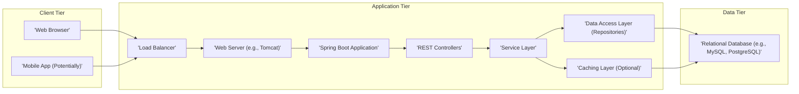
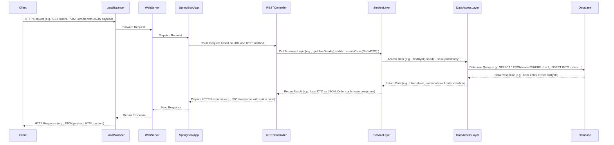

## Project Design Document: Spring Web Application (Improved)

**1. Introduction**

This document provides an enhanced architectural design for the Spring web application project located at [https://github.com/MengTo/Spring](https://github.com/MengTo/Spring). Building upon the initial design, this version offers more granular details regarding component responsibilities, data flow specifics, and potential security implications. This document remains a crucial foundation for subsequent threat modeling activities, facilitating a deeper understanding of potential security vulnerabilities.

**2. Goals**

*   Provide a clear and comprehensive architectural overview of the Spring web application.
*   Identify key components and elaborate on their specific responsibilities and potential security concerns.
*   Describe the data flow within the application with greater detail, including data types and transformations.
*   Outline the technology stack used, including supporting technologies.
*   Establish a robust basis for identifying potential security threats and vulnerabilities, enabling more targeted analysis.

**3. Target Audience**

This document is intended for:

*   Security engineers and architects responsible for conducting threat modeling and security assessments.
*   Development team members involved in the design, development, and maintenance of the project.
*   Operations and infrastructure teams responsible for the deployment, monitoring, and maintenance of the application.

**4. High-Level Architecture**

The application adheres to a standard three-tier architecture, with a focus on clear separation of concerns:

**5. Component Breakdown**

*   **Client Tier:**
    *   **Web Browser:** The primary user interface, interacting with the application via standard HTTP protocols. Security considerations include browser-side vulnerabilities (though primarily the responsibility of the browser vendor) and the application's handling of browser-specific features.
    *   **Mobile App (Potentially):**  If present, interacts with the application's APIs, likely using REST. Security considerations include API security, authentication, and authorization specific to mobile clients.

*   **Application Tier:**
    *   **Load Balancer:** Distributes incoming traffic across multiple application instances, enhancing availability and scalability. Security considerations include protection against DDoS attacks and ensuring secure communication (e.g., TLS termination).
    *   **Web Server (e.g., Tomcat):**  Hosts the Spring Boot application, handling HTTP requests and responses. Security considerations include web server hardening, configuration management, and vulnerability patching.
    *   **Spring Boot Application:** The core of the application, managing business logic, routing, and dependencies. Security considerations span the entire application, including secure coding practices, input validation, and protection against common web application vulnerabilities.
    *   **REST Controllers:** Handle incoming API requests, translating them into service layer calls and returning responses. Security considerations include input validation, authorization checks, and protection against API-specific attacks (e.g., mass assignment).
    *   **Service Layer:** Contains the application's business logic, orchestrating interactions between different components. Security considerations include ensuring business logic enforces security policies and prevents unauthorized data access.
    *   **Data Access Layer (Repositories):** Provides an abstraction layer for database interactions, often using Spring Data JPA. Security considerations include preventing SQL injection vulnerabilities and ensuring proper data access controls.
    *   **Caching Layer (Optional):**  May be used to improve performance by storing frequently accessed data. Security considerations include ensuring the cache does not expose sensitive data inappropriately and that cache invalidation mechanisms are secure.

*   **Data Tier:**
    *   **Relational Database (e.g., MySQL, PostgreSQL):** Stores the application's persistent data. Security considerations include database hardening, access control, encryption at rest, and regular security audits.

**6. Data Flow**

The typical data flow for a user request, including potential data types, is as follows:

**7. Technology Stack**

*   **Programming Language:** Java
*   **Framework:** Spring Boot (including Spring MVC, Spring Data JPA, potentially Spring Security)
*   **Web Server:** Likely an embedded server like Tomcat (default for Spring Boot) or potentially a standalone server like Jetty.
*   **Database:** Likely a relational database such as MySQL, PostgreSQL, or potentially H2 for development/testing. The specific choice impacts database-specific security considerations.
*   **Build Tool:** Maven (indicated by the presence of `pom.xml`).
*   **Data Access:** Spring Data JPA (likely, simplifying database interactions and potentially introducing ORM-related vulnerabilities if not used carefully).
*   **API Format:** REST (using annotations like `@RestController`, `@GetMapping`, `@PostMapping`).
*   **Data Format:** JSON (common for REST APIs, requiring careful handling to prevent injection or manipulation).
*   **Logging Framework:** Likely Logback or Log4j2 (important for security auditing and incident response).
*   **Testing Frameworks:**  Likely JUnit and Mockito (essential for ensuring code quality and security).
*   **Security Libraries (Potentially):** Spring Security (for authentication and authorization), potentially other libraries for specific security needs.

**8. Deployment Architecture (Logical)**

The application is likely deployed in a manner that prioritizes scalability, availability, and security:

*   Multiple instances of the Spring Boot application running within containers (e.g., Docker) or on virtual machines.
*   A load balancer (hardware or software-based) distributing traffic across these instances, potentially with health checks.
*   A dedicated and secured database server or cluster, potentially with replication for high availability.
*   Potential use of a reverse proxy (e.g., Nginx, Apache) in front of the web servers for added security and traffic management.
*   Deployment within a cloud environment (e.g., AWS, Azure, GCP) or on-premise infrastructure, each with its own security considerations.

**9. Security Considerations (Detailed)**

This section expands on potential security concerns, providing more specific examples:

*   **Authentication and Authorization:** How are users identified and granted access to resources?
    *   Potential vulnerabilities: Use of basic authentication over unencrypted connections, weak password hashing algorithms, lack of multi-factor authentication, insecure session management (e.g., predictable session IDs), insufficient role-based access control.
*   **Input Validation:** How is user-provided data validated to prevent malicious input?
    *   Potential vulnerabilities: SQL injection (if using dynamic SQL or not parameterizing queries correctly), cross-site scripting (XSS) through unescaped output, command injection through unsanitized input passed to system commands, XML External Entity (XXE) injection if parsing XML.
*   **Data Protection:** How is sensitive data protected both in transit and at rest?
    *   Potential vulnerabilities: Lack of TLS/SSL encryption for communication, storing sensitive data in plain text in the database, inadequate access controls to data storage, insufficient protection of backups.
*   **Session Management:** How are user sessions securely created, maintained, and invalidated?
    *   Potential vulnerabilities: Session fixation attacks, session hijacking due to insecure cookie handling, predictable session IDs, long session timeouts.
*   **Dependency Management:** Are all project dependencies up-to-date and free from known vulnerabilities?
    *   Potential vulnerabilities: Exploiting known vulnerabilities in outdated libraries (e.g., through CVEs), insecure transitive dependencies.
*   **API Security:** How are the REST APIs secured against unauthorized access and manipulation?
    *   Potential vulnerabilities: Missing authentication or authorization for API endpoints, lack of rate limiting leading to denial-of-service, insecure handling of API keys or tokens, vulnerabilities in API documentation leading to information disclosure.
*   **Database Security:** How is the database environment secured?
    *   Potential vulnerabilities: Weak database credentials, default database configurations, open database ports to the internet, lack of encryption at rest, SQL injection vulnerabilities in the application layer.
*   **Logging and Monitoring:** Are security events and errors adequately logged and monitored?
    *   Potential vulnerabilities: Insufficient logging making incident investigation difficult, logging sensitive information inappropriately, lack of real-time monitoring for suspicious activity.
*   **Error Handling:** How are errors handled and presented to the user?
    *   Potential vulnerabilities: Exposing sensitive information in error messages (e.g., stack traces, internal paths), providing attackers with clues about the system's internals.

**10. Assumptions and Constraints**

*   The project is developed using standard Spring Boot conventions and best practices.
*   A relational database is used for persistent data storage.
*   Client-server communication primarily occurs over HTTP/HTTPS using RESTful APIs.
*   The deployment environment includes a load balancer for distributing traffic.
*   Security best practices are intended to be followed throughout the development lifecycle.

**11. Future Considerations**

*   Implementation of specific authentication and authorization mechanisms (e.g., OAuth 2.0, JWT).
*   Detailed design of security controls for each component and data flow.
*   Specific deployment environment configurations and security hardening measures.
*   Integration with security scanning tools and processes (e.g., SAST, DAST).
*   Implementation of a comprehensive security monitoring and incident response plan.
*   Consideration of container security best practices if using Docker or similar technologies.

This improved design document provides a more detailed and nuanced understanding of the Spring web application's architecture, crucial for effective threat modeling. The expanded component descriptions, data flow details, and comprehensive security considerations offer a stronger foundation for identifying and mitigating potential vulnerabilities.
