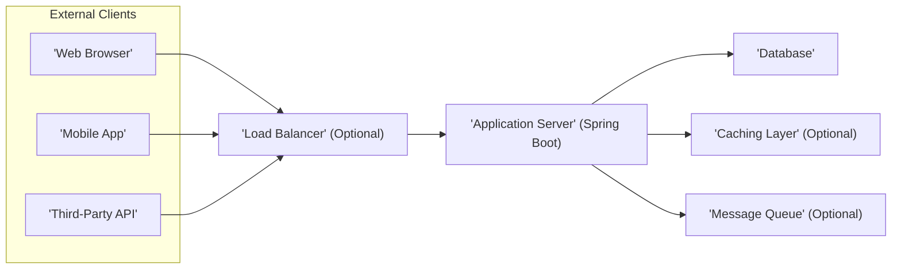
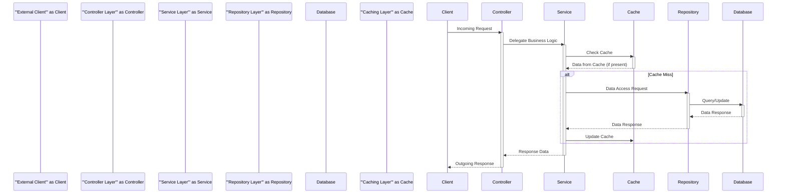

## Project Design Document: Spring Boot Application (Based on github.com/mengto/spring) - Improved

**1. Introduction**

This document provides an enhanced and more detailed architectural design for a Spring Boot-based web application, inferred from the structure and common patterns observed in the repository [https://github.com/mengto/spring](https://github.com/mengto/spring). This iteration aims to provide a more robust foundation for subsequent threat modeling activities by offering a clearer articulation of components, interactions, data flow, and potential security vulnerabilities.

**2. Goals and Objectives**

The primary goals of this design are to:

*   Provide a highly detailed and unambiguous representation of the assumed architecture of the Spring Boot application.
*   Clearly define the responsibilities of each key component within the system.
*   Illustrate the interactions between different parts of the application with greater precision.
*   Map out the data flow within the application, highlighting sensitive data paths.
*   Detail potential deployment scenarios, including security implications for each.
*   Offer a comprehensive overview of security considerations, specifically tailored for effective threat modeling.

**3. High-Level Architecture**

The application is assumed to adhere to a standard layered architecture, typical for Spring Boot applications, facilitating separation of concerns.



*   **External Clients:** Represents various ways users or systems interact with the application.
    *   Web Browser: Users accessing the application through a web interface.
    *   Mobile App: Native or hybrid mobile applications interacting with the application's API.
    *   Third-Party API: External systems integrating with the application's API.
*   **Load Balancer (Optional):** Distributes incoming traffic across multiple instances of the application server for improved performance, resilience, and scalability.
*   **Application Server (Spring Boot):**  Hosts the core application logic, responsible for handling requests, processing data, enforcing business rules, and interacting with data storage and other services.
*   **Database:** Stores the application's persistent data, including user information, application data, and potentially audit logs.
*   **Caching Layer (Optional):**  Improves performance by storing frequently accessed data in memory, reducing the load on the database. Examples include Redis or Memcached.
*   **Message Queue (Optional):** Enables asynchronous communication between different parts of the application or with external systems. Examples include RabbitMQ or Kafka.

**4. Detailed Design**

The Application Server is further decomposed into distinct logical tiers, each with specific responsibilities.

*   **Presentation Tier:**  Handles user interaction and data presentation.
    *   **Controllers:** Receive and process incoming HTTP requests from clients, orchestrating the flow of execution. They are responsible for request validation and response formatting.
    *   **REST API Endpoints:** Define the contract for external communication, specifying request methods, data formats (e.g., JSON), and response structures.
    *   **View Layer (Optional):**  Renders user interfaces (e.g., HTML pages) for web browser clients. This might be less prominent in a purely API-driven application.
    *   **Authentication and Authorization Handlers:** Components responsible for verifying user identities and granting access to specific resources based on their roles and permissions.

*   **Application Tier (Business Logic):** Encapsulates the core business rules and workflows of the application.
    *   **Services:** Implement specific business functionalities, often orchestrating interactions between multiple data access components and potentially external services. They enforce business logic and data integrity.
    *   **Domain Models/Entities:** Represent the core business concepts and data structures of the application. These models are often independent of the underlying data storage mechanism.
    *   **Business Logic Validators:** Components responsible for enforcing business rules and constraints before data is persisted or processed.

*   **Data Access Tier:** Manages the interaction with data storage mechanisms.
    *   **Repositories (Data Access Objects - DAOs):** Provide an abstraction layer over the underlying database, simplifying data access operations. Spring Data JPA is a common implementation.
    *   **Database Entities:** Map directly to database tables, representing the structure of the persistent data.
    *   **Data Mappers:** Components responsible for converting between domain models and database entities, handling potential differences in structure or data types.



**5. Data Flow**

A typical request flow within the application involves these detailed steps:

*   An **External Client** initiates a request (e.g., HTTP request, API call).
*   The request reaches the **Load Balancer** (if present), which distributes it to an available **Application Server** instance.
*   The **Controller Layer** receives the request, performs initial validation (e.g., request format, authentication), and maps it to a specific handler.
*   The **Controller Layer** delegates the core business logic processing to the appropriate **Service Layer** component.
*   The **Service Layer** may first check the **Caching Layer** for the requested data.
    *   If the data is in the cache (cache hit), it's retrieved and returned.
    *   If the data is not in the cache (cache miss), the service proceeds to the data access layer.
*   The **Service Layer** interacts with the **Repository Layer** to retrieve or manipulate data from the **Database**.
*   The **Repository Layer** translates the request into a database query and executes it against the **Database**.
*   The **Database** returns the requested data to the **Repository Layer**.
*   The **Repository Layer** may map the database response to domain models and returns them to the **Service Layer**.
*   The **Service Layer** processes the data, applies business rules, and potentially updates the **Caching Layer** with the retrieved data.
*   The **Service Layer** returns the processed data to the **Controller Layer**.
*   The **Controller Layer** formats the response (e.g., JSON, XML, HTML) and sends it back to the **External Client**.

**6. Security Considerations**

This section provides a more granular breakdown of security considerations relevant for threat modeling:

*   **Authentication and Authorization Vulnerabilities:**
    *   **Broken Authentication:** Weak password policies, lack of multi-factor authentication, credential stuffing attacks.
    *   **Broken Authorization:** Privilege escalation, insecure direct object references (IDOR), missing function-level access control.
    *   **Session Management Flaws:** Session fixation, session hijacking, insecure session IDs.
*   **Injection Attacks:**
    *   **SQL Injection:** Exploiting vulnerabilities in database queries to execute malicious SQL code.
    *   **Cross-Site Scripting (XSS):** Injecting malicious scripts into web pages viewed by other users.
    *   **OS Command Injection:** Executing arbitrary operating system commands through the application.
    *   **LDAP Injection:** Exploiting vulnerabilities in LDAP queries.
*   **Data Security:**
    *   **Insufficient Data Protection:** Sensitive data stored in plaintext, lack of encryption at rest and in transit.
    *   **Exposure of Sensitive Data:**  Accidental disclosure of sensitive information through logs, error messages, or API responses.
*   **API Security Vulnerabilities:**
    *   **Lack of Rate Limiting:** Allowing excessive requests, leading to denial-of-service.
    *   **Mass Assignment:**  Allowing clients to modify unintended object properties.
    *   **Insecure API Keys:**  Compromised or exposed API keys.
    *   **Missing or Improper Input Validation:** Leading to various injection attacks or unexpected behavior.
*   **Dependency and Component Vulnerabilities:**
    *   **Using Components with Known Vulnerabilities:**  Outdated libraries and frameworks with security flaws.
    *   **Supply Chain Attacks:**  Compromised dependencies introduced into the project.
*   **Logging and Monitoring Deficiencies:**
    *   **Insufficient Logging:**  Lack of audit trails for security events.
    *   **Logging Sensitive Information:**  Accidentally logging sensitive data, making it vulnerable.
    *   **Lack of Monitoring and Alerting:**  Failure to detect and respond to security incidents.
*   **Cross-Site Request Forgery (CSRF):**  Tricking authenticated users into performing unintended actions.
*   **Security Misconfiguration:**
    *   Default passwords, open ports, unnecessary services running.
    *   Improperly configured security headers.
*   **Denial of Service (DoS) and Distributed Denial of Service (DDoS):** Overwhelming the application with traffic, making it unavailable.

**7. Deployment Architecture**

The application's deployment architecture significantly impacts its security and scalability.

*   **Cloud-Based Deployment (e.g., AWS, Azure, GCP):**
    *   Leveraging managed services like Elastic Beanstalk, Azure App Service, or Google App Engine simplifies deployment and management but requires careful configuration of security settings.
    *   Containerization with Docker and orchestration using Kubernetes offers scalability and portability but introduces complexities in securing the container environment.
    *   Utilizing cloud-managed databases provides security features but requires proper access control and encryption configuration.

    ```mermaid
    graph LR
        subgraph "Cloud Provider Infrastructure"
            A["'Internet'"]
            B["'Content Delivery Network (CDN)' (Optional)"]
            C["'Web Application Firewall (WAF)'"]
            D["'Load Balancer'"]
            subgraph "Compute Resources"
                E1["'Application Instance 1'"]
                E2["'Application Instance 2'"]
                EN["'Application Instance N'"]
            end
            F["'Database Service'"]
            G["'Caching Service'"]
            H["'Message Queue Service'"]
        end
        A --> B
        B --> C
        C --> D
        D --> E1
        D --> E2
        D --> EN
        E1 --> F
        E2 --> F
        EN --> F
        E1 --> G
        E2 --> G
        EN --> G
        E1 --> H
        E2 --> H
        EN --> H
    ```

*   **Containerized Deployment (Docker, Kubernetes):**
    *   Requires securing the Docker images, container registry, and Kubernetes cluster.
    *   Network policies within Kubernetes are crucial for controlling traffic between containers.
    *   Secret management within Kubernetes is essential for protecting sensitive credentials.

*   **On-Premise Deployment:**
    *   Requires managing the entire infrastructure, including servers, networking, and security.
    *   Firewalls, intrusion detection/prevention systems (IDS/IPS), and regular security patching are critical.

**8. Technology Stack (Inferred)**

A more detailed inference of the technology stack helps in identifying potential technology-specific vulnerabilities.

*   **Programming Language:** Java (Likely version 8 or higher)
*   **Framework:** Spring Boot (Likely version 2.x or 3.x) with components like Spring MVC, Spring Data JPA, Spring Security.
*   **Build Tool:** Maven or Gradle, potentially with dependency management plugins for security scanning.
*   **Database:** Likely a relational database such as PostgreSQL, MySQL, or MariaDB. Consideration for in-memory databases like H2 for development/testing.
*   **Web Server:** Embedded Tomcat (default in Spring Boot), potentially Jetty or Undertow.
*   **Data Access:** Spring Data JPA with Hibernate as the ORM implementation.
*   **API Format:** JSON (most likely), potentially XML.
*   **Security Libraries:** Spring Security for authentication and authorization. Potentially other libraries for input validation or cryptographic operations.
*   **Caching:**  Likely integration with Redis or Memcached through Spring Cache abstraction.
*   **Message Queue (if applicable):**  Integration with RabbitMQ or Kafka via Spring AMQP or Spring for Apache Kafka.

**9. Assumptions and Constraints**

*   The application is assumed to be a web application or a backend service built using standard Spring Boot conventions.
*   Specific business functionalities are not detailed but are assumed to be implemented within the service layer.
*   The deployment environment is not explicitly defined, leading to the consideration of multiple common scenarios.
*   This design is based on common architectural patterns for Spring Boot applications and might not perfectly align with the exact implementation details of the provided GitHub repository. Further code review would be necessary for complete accuracy.

This improved design document offers a more comprehensive and detailed view of the Spring Boot application's architecture, with a stronger emphasis on security considerations. This enhanced level of detail will significantly benefit the subsequent threat modeling process, enabling a more thorough identification and mitigation of potential security risks.