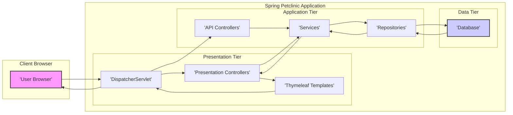
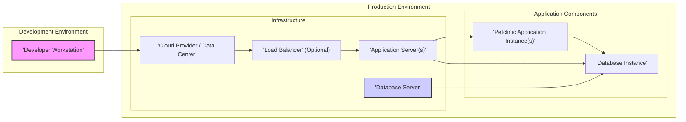

# Project Design Document: Spring Petclinic Application - Improved

**Version:** 1.1
**Date:** October 26, 2023
**Author:** AI Expert

## 1. Project Overview

### 1.1. Project Name
*   Spring Petclinic Application

### 1.2. Project Description
*   The Spring Petclinic application is a representative sample application built using the Spring Framework. It simulates a veterinary clinic management system, enabling the management of veterinarians, pet owners, their pets, and appointment scheduling. It serves as a practical demonstration of Spring development best practices, showcasing Spring Boot, Spring MVC, Spring Data JPA, and Thymeleaf.

### 1.3. Project Goals
*   To provide a fully functional web application example using Spring technologies.
*   To clearly illustrate the practical application of Spring Boot, MVC, and Data JPA.
*   To offer a learning platform for developers exploring Spring Framework features.
*   To act as a foundation for customization and further development.
*   To provide a basis for security assessments and threat modeling exercises.

### 1.4. Target Audience
*   Developers learning the Spring Framework and Spring Boot ecosystem.
*   Software architects evaluating Spring technologies for web application development.
*   Individuals seeking a well-structured, real-world example of a Spring application.
*   Cybersecurity professionals conducting threat modeling and security audits.
*   Students and educators using Petclinic as a teaching tool.

### 1.5. High-Level Architecture
*   The application is structured using a standard three-tier architecture:
    *   **Presentation Tier:**  Handles user interaction and display using Thymeleaf templates.
    *   **Application Tier (Business Logic):** Implements core application logic and data processing via Spring MVC controllers and services.
    *   **Data Tier:** Manages data persistence using Spring Data JPA and interacts with a relational database (default: H2 in-memory, options: MySQL, PostgreSQL).

## 2. System Architecture

### 2.1. Component Breakdown

*   **Frontend (Presentation Tier):**
    *   **Thymeleaf Templates:** Server-side rendered HTML templates for dynamic content display.
    *   **Static Resources:** CSS stylesheets, JavaScript files, and images for UI presentation and client-side behavior.
    *   **Spring MVC Controllers (Presentation Controllers):** Manage user requests from the frontend, orchestrate backend services, and prepare data for Thymeleaf templates.

*   **Backend (Application Tier - Business Logic):**
    *   **Spring MVC REST Controllers (API Controllers):**  Expose RESTful endpoints for potential API integrations (primarily UI-driven in the current version but ready for API expansion).
    *   **Services:** Encapsulate business logic, coordinate data access through repositories, and manage transactions to ensure data consistency.
    *   **Repositories (Spring Data JPA):** Provide an abstraction layer for data access, simplifying database interactions using JPA entities and reducing boilerplate code.
    *   **Entities (JPA Entities):** Represent database tables as Java objects, mapped using JPA annotations for object-relational mapping (ORM).
    *   **Data Transfer Objects (DTOs):**  Used for data transfer between layers, promoting decoupling, data encapsulation, and potentially security by limiting data exposure.

*   **Database (Data Tier):**
    *   **H2 In-Memory Database (Default):** A lightweight, file-based database ideal for development and testing. Data is transient and not persisted across application restarts by default.
    *   **MySQL/PostgreSQL (Optional - Production Ready):** Robust, production-grade relational databases supported through configuration changes for persistent data storage and scalability.

### 2.2. Technology Stack

*   **Core Language:** Java
*   **Primary Framework:** Spring Boot, Spring MVC, Spring Data JPA
*   **Templating Engine:** Thymeleaf
*   **Default Database:** H2 In-Memory
*   **Optional Databases:** MySQL, PostgreSQL
*   **Build Automation:** Maven
*   **Embedded Web Server:** Tomcat (integrated within Spring Boot)

### 2.3. Data Flow Diagram

*   **Data Flow Description:**
    1.  User interacts with the application via the browser (A).
    2.  Browser sends HTTP requests to the Spring Petclinic application, intercepted by the `DispatcherServlet` (B), the central request handler in Spring MVC.
    3.  `DispatcherServlet` routes the request to the appropriate `Presentation Controller` (C) for UI interactions or `API Controller` (G) for API requests.
    4.  `Presentation Controller` (C) or `API Controller` (G) invokes `Services` (E) to execute business logic.
    5.  `Services` (E) utilize `Repositories` (F) to manage data access and persistence.
    6.  `Repositories` (F) interact with the `Database` (H) to perform CRUD (Create, Read, Update, Delete) operations.
    7.  Data is retrieved from the `Database` (H) and flows back through `Repositories`, `Services`, and `Controllers`.
    8.  `Presentation Controllers` (C) prepare data and select the relevant `Thymeleaf Template` (D) for rendering the view.
    9.  `Thymeleaf Templates` (D) are processed with the data, generating dynamic HTML content.
    10. The HTML response is returned to the `DispatcherServlet` (B).
    11. `DispatcherServlet` (B) sends the HTML response back to the User Browser (A) for display.

### 2.4. Deployment Diagram

*   **Deployment Description:**
    *   **Development Environment (I):** Developers typically run the application locally on their workstations for development, debugging, and unit testing. This setup usually includes an IDE, Maven, and an embedded application and database instance (often H2).
    *   **Production Environment (J):** For production deployment, the application is hosted on server infrastructure, which can be cloud-based (e.g., AWS, Azure, GCP) or an on-premises data center.
    *   **Infrastructure (J, K, L, M):**
        *   **Cloud Provider/Data Center (J):** Provides the physical or virtual infrastructure.
        *   **Load Balancer (K - Optional but Recommended for Scalability and HA):** Distributes incoming traffic across multiple application instances to improve performance, scalability, and high availability.
        *   **Application Server(s) (L):** Hosts the deployed Spring Petclinic application instances. These could be traditional application servers or containerized environments (e.g., Docker, Kubernetes).
        *   **Database Server (M):** Dedicated server for hosting the database instance (MySQL or PostgreSQL in production) to ensure performance and isolation.
    *   **Application Components (N, O):**
        *   **Petclinic Application Instance(s) (N):** One or more running instances of the Spring Boot Petclinic application.
        *   **Database Instance (O):** A running instance of the chosen database (H2 for simple setups, MySQL/PostgreSQL for production).
    *   Application instances (N) connect to the database instance (O) to access and persist data. User traffic is routed through the Load Balancer (K), if present, to the Application Servers (L) and then to the application instances (N).

## 3. Data Flow and Processing

### 3.1. Key Data Flows

*   **User Authentication (Future Enhancement - Not in Basic Petclinic):** In a real-world application, user authentication is crucial. This flow would involve:
    *   User submitting login credentials (username and password).
    *   Verification of credentials against a user database or authentication service.
    *   Establishment of a user session to maintain authenticated state.

*   **Owner Registration Process:**
    *   User inputs owner details (name, address, city, telephone number).
    *   Backend performs data validation to ensure data integrity and security.
    *   Owner data is persisted in the database.
    *   A confirmation message is displayed to the user.

*   **Pet Registration Workflow:**
    *   User selects an existing owner and provides pet details (name, birth date, pet type).
    *   Data validation is performed on the submitted pet information.
    *   Pet data is associated with the selected owner and stored in the database.
    *   User receives confirmation of successful pet registration.

*   **Veterinarian Listing Retrieval:**
    *   User requests a list of veterinarians.
    *   Backend queries the database to retrieve veterinarian data.
    *   Retrieved veterinarian data is formatted and presented to the user.

*   **Appointment Scheduling Procedure:**
    *   User selects a pet and specifies appointment details (date, time, reason for visit).
    *   Appointment data is validated.
    *   Appointment information is linked to the pet and saved in the database.
    *   User is notified of successful appointment scheduling.

### 3.2. Data Storage and Persistence

*   **Database System:** Relational database (H2, MySQL, PostgreSQL).
*   **Persistence Framework:** Spring Data JPA, utilizing JPA entities for object-relational mapping.
*   **Data Structure:** Data is organized in a structured format within database tables (e.g., `owners`, `pets`, `vets`, `visits` tables).
*   **Data Backup:** Regular database backups are essential for data recovery and disaster recovery planning.

### 3.3. Data Sensitivity and Classification

*   **Owner Personal Information:**
    *   Name, Address, City, Telephone: Classified as Personally Identifiable Information (PII) and considered highly sensitive. Requires strong protection measures, access controls, and compliance with privacy regulations (e.g., GDPR, CCPA).

*   **Pet Details:**
    *   Name, Birth Date, Type: Less sensitive than owner PII but still personal data related to the owner. Requires appropriate protection.

*   **Veterinarian Public Information:**
    *   Name, Specializations: Generally considered public information, less sensitive.

*   **Visit Records:**
    *   Date, Description of Visit: Potentially sensitive, especially the description, which could contain medical details about the pet. Requires access control and confidentiality.

*   **User Credentials (If Authentication Implemented):**
    *   Username, Password: Extremely sensitive. Passwords must be securely hashed using strong algorithms and stored with appropriate safeguards.

## 4. Security Considerations

### 4.1. Authentication and Authorization

*   **Authentication:**
    *   **Current Status: Not Implemented in Basic Petclinic.** The base application lacks user authentication, making it vulnerable in real-world scenarios.
    *   **Future Implementation Recommendations:**
        *   **Spring Security:** Integrate Spring Security for robust authentication.
        *   **Authentication Mechanisms:**
            *   Form-based login for traditional web authentication.
            *   OAuth 2.0/OpenID Connect for delegated authentication and API access.
            *   LDAP/Active Directory integration for enterprise environments.
            *   Multi-Factor Authentication (MFA) for enhanced security.

*   **Authorization:**
    *   **Current Status: Implicit and Insufficient.** Authorization is not explicitly enforced, meaning any user can potentially access and modify any data.
    *   **Future Implementation Recommendations:**
        *   **Role-Based Access Control (RBAC):** Implement RBAC using Spring Security to define roles (e.g., `ADMIN`, `VET`, `RECEPTIONIST`) and assign permissions based on roles.
        *   **Authorization Granularity:** Define fine-grained authorization rules to control access to specific functionalities and data based on user roles and context.
        *   **Policy Enforcement:** Ensure authorization policies are consistently enforced across the application.

### 4.2. Input Validation and Output Encoding

*   **Input Validation:**
    *   **Current Implementation:** Basic validation using Spring MVC and Bean Validation annotations (`@NotNull`, `@NotEmpty`, `@Size`, `@Pattern`) on form submissions.
    *   **Enhancements Required:**
        *   **Comprehensive Server-Side Validation:** Implement robust server-side validation for all user inputs to prevent injection attacks (SQL Injection, Command Injection, etc.) and ensure data integrity.
        *   **Client-Side Validation (Complementary):** Use JavaScript for client-side validation to provide immediate feedback to users and reduce unnecessary server requests, but always rely on server-side validation for security.
        *   **Input Sanitization:** Sanitize user inputs to remove or encode potentially harmful characters before processing or storing data.
        *   **Regular Expression Validation:** Utilize regular expressions for validating input formats (e.g., email addresses, phone numbers) to prevent unexpected data.

*   **Output Encoding:**
    *   **Thymeleaf Default Escaping:** Thymeleaf provides contextual escaping by default, which is a crucial security feature to prevent Cross-Site Scripting (XSS) vulnerabilities.
    *   **Best Practices:**
        *   **Maintain Default Escaping:** Ensure Thymeleaf's default escaping is enabled and properly configured.
        *   **Context-Aware Encoding:** Understand the different escaping modes provided by Thymeleaf and use them appropriately based on the output context (HTML, JavaScript, URL, etc.).
        *   **Careful Use of Unescaped Output (`th:utext`):** Use `th:utext` with extreme caution and only for trusted content that is already properly sanitized and encoded. Avoid using it for user-generated content unless strictly necessary and after rigorous security review.
        *   **Content Security Policy (CSP):** Implement CSP headers to further mitigate XSS risks by controlling the sources from which the browser is allowed to load resources.

### 4.3. Data Protection

*   **Encryption in Transit:**
    *   **HTTPS Enforcement:** Mandate HTTPS for all communication between the client browser and the server. This encrypts data in transit using TLS/SSL, protecting against eavesdropping, man-in-the-middle attacks, and data interception.
    *   **TLS/SSL Configuration:** Properly configure TLS/SSL on the web server (Tomcat, Nginx, Apache) with strong cipher suites and up-to-date protocols.
    *   **HSTS (HTTP Strict Transport Security):** Implement HSTS to instruct browsers to always use HTTPS and prevent downgrade attacks.

*   **Encryption at Rest:**
    *   **Database Encryption (Transparent Data Encryption - TDE):** For sensitive data, especially in production environments, enable database-level encryption or Transparent Data Encryption (TDE) provided by the database system (MySQL, PostgreSQL). This encrypts data files and backups at rest.
    *   **Data Partitioning and Encryption:** Consider partitioning sensitive data into separate database tables or schemas and applying encryption selectively to those partitions.
    *   **File System Encryption:** If sensitive data is stored in files (e.g., logs, backups, file uploads), ensure file system encryption is enabled at the operating system level.
    *   **Key Management:** Implement secure key management practices for encryption keys, including secure storage, rotation, and access control.

### 4.4. Logging and Auditing

*   **Logging:**
    *   **Spring Boot Logging (Logback):** Spring Boot utilizes Logback for application logging. Configure logging levels and output destinations appropriately for debugging, monitoring, and security analysis.
    *   **Security Logging (Implementation Required):** Implement logging of security-relevant events, such as:
        *   Authentication successes and failures.
        *   Authorization attempts and failures.
        *   Access to sensitive data.
        *   Data modification events (create, update, delete).
        *   Security configuration changes.
        *   Input validation failures and potential attack attempts.
    *   **Centralized Logging:** Aggregate logs from all application components and servers into a centralized logging system (e.g., ELK stack, Splunk) for efficient analysis, monitoring, and incident response.

*   **Auditing (Implementation Recommended):**
    *   **Audit Trails:** Implement audit trails to track user actions and data modifications for compliance, security monitoring, and forensic analysis.
    *   **Audit Log Details:** Audit logs should include:
        *   Who performed the action (user identity).
        *   What action was performed (e.g., data access, modification).
        *   When the action occurred (timestamp).
        *   Where the action originated from (source IP address).
        *   Details of the data affected by the action.
    *   **Audit Log Storage:** Store audit logs securely and separately from application logs to prevent tampering and ensure integrity.
    *   **Spring Data Envers:** Consider using Spring Data Envers or custom auditing solutions to simplify audit trail implementation.

### 4.5. Vulnerabilities and Attack Vectors (Detailed)

*   **Common Web Application Vulnerabilities:**
    *   **Cross-Site Scripting (XSS):**
        *   **Attack Vector:** Malicious scripts injected into web pages viewed by other users.
        *   **Petclinic Relevance:** Potential risk if user-generated content (e.g., pet names, visit descriptions) is not properly encoded when displayed.
        *   **Mitigation:** Robust output encoding using Thymeleaf's contextual escaping, Content Security Policy (CSP), input validation, and sanitization.

    *   **SQL Injection:**
        *   **Attack Vector:** Exploiting vulnerabilities in database queries to inject malicious SQL code, potentially allowing attackers to bypass security measures, access sensitive data, modify data, or execute arbitrary commands on the database server.
        *   **Petclinic Relevance:** Risk if database queries are constructed using string concatenation with user inputs instead of parameterized queries or ORM features that prevent SQL injection.
        *   **Mitigation:** Use Spring Data JPA repositories and parameterized queries, avoid dynamic SQL construction, implement strong input validation, and follow secure coding practices.

    *   **Cross-Site Request Forgery (CSRF):**
        *   **Attack Vector:** Forcing a logged-in user to perform unintended actions on a web application without their knowledge.
        *   **Petclinic Relevance:** Risk if CSRF protection is not enabled, especially for state-changing operations like adding or modifying data.
        *   **Mitigation:** Enable CSRF protection provided by Spring Security (enabled by default when using Spring Security), use CSRF tokens in forms, and implement proper session management.

    *   **Insecure Authentication/Authorization (Major Gap in Basic Petclinic):**
        *   **Attack Vector:** Lack of authentication allows unauthorized users to access the application. Weak or missing authorization allows users to access resources or perform actions they are not permitted to.
        *   **Petclinic Relevance:** The basic Petclinic application is highly vulnerable due to the absence of authentication and authorization.
        *   **Mitigation:** Implement robust authentication and authorization using Spring Security, define clear roles and permissions, enforce the principle of least privilege, and regularly review access controls.

    *   **Data Exposure:**
        *   **Attack Vector:** Sensitive data is exposed due to insecure storage, transmission, or access controls.
        *   **Petclinic Relevance:** Risk of exposing owner PII, pet details, and visit information if data is not properly protected in transit (HTTPS), at rest (database encryption), and through access controls.
        *   **Mitigation:** Enforce HTTPS, implement database encryption, apply strong access controls, minimize data exposure, and comply with data privacy regulations.

    *   **Security Misconfiguration:**
        *   **Attack Vector:** Vulnerabilities arising from insecure default configurations, unnecessary services enabled, or improper security settings.
        *   **Petclinic Relevance:** Risk if default configurations are used in production without hardening, or if unnecessary features are enabled.
        *   **Mitigation:** Review and harden default configurations, disable unnecessary features, follow security best practices for server and application configuration, and perform regular security audits.

    *   **Dependency Vulnerabilities:**
        *   **Attack Vector:** Exploiting known vulnerabilities in third-party libraries and frameworks used by the application.
        *   **Petclinic Relevance:** Risk if dependencies are outdated and contain known vulnerabilities.
        *   **Mitigation:** Regularly update dependencies to the latest secure versions, use dependency scanning tools to identify vulnerabilities, and implement a vulnerability management process.

    *   **Denial of Service (DoS) / Distributed Denial of Service (DDoS):**
        *   **Attack Vector:** Overwhelming the application with requests to make it unavailable to legitimate users.
        *   **Petclinic Relevance:** Potential risk if the application is not protected against DoS/DDoS attacks.
        *   **Mitigation:** Implement rate limiting, request throttling, Web Application Firewall (WAF) with DDoS protection capabilities, and utilize cloud-based DDoS mitigation services.

## 5. Deployment Environment

### 5.1. Infrastructure Options

*   **Cloud-Based Deployment:**
    *   **Providers:** AWS, Azure, GCP, DigitalOcean, etc.
    *   **Services:** Virtual Machines (VMs), Containers (Docker, Kubernetes), Serverless Functions (less applicable for Petclinic's architecture), Managed Databases.
    *   **Benefits:** Scalability, elasticity, high availability, managed services, pay-as-you-go model.
    *   **Security Considerations:** Cloud security best practices, IAM (Identity and Access Management), security groups, network security, data encryption in the cloud provider's environment.

*   **On-Premise Data Center Deployment:**
    *   **Infrastructure:** Physical servers, virtualized infrastructure (VMware, Hyper-V), private cloud.
    *   **Benefits:** Greater control over infrastructure, data residency compliance (in some cases).
    *   **Security Considerations:** Physical security, network security, server hardening, patching, maintaining infrastructure security, higher upfront and ongoing costs.

*   **Containerized Deployment (Docker, Kubernetes):**
    *   **Benefits:** Portability, scalability, consistency across environments, efficient resource utilization, simplified deployment and management.
    *   **Security Considerations:** Container image security scanning, container runtime security, Kubernetes security (RBAC, network policies, secrets management), vulnerability management for container images and orchestrator.

### 5.2. Network Architecture (Example - Cloud Deployment)

*   **Virtual Private Cloud (VPC):** Isolate the application environment within a private network in the cloud.
*   **Public Subnet:** For Load Balancer and potentially Web Application Firewall (WAF) facing the internet.
*   **Private Subnets:**
    *   **Application Tier Subnet:** For Application Servers hosting Petclinic instances. No direct internet access.
    *   **Data Tier Subnet:** For Database Servers. Isolated from the internet and application tier subnet except for necessary connections.
*   **Security Groups/Network ACLs:** Control network traffic flow between subnets and external networks.
*   **Bastion Host/Jump Server:** Securely access private subnets for administration and maintenance.

### 5.3. Security Controls in Deployment Environment

*   **Web Application Firewall (WAF):** Protect against web application attacks (XSS, SQL Injection, CSRF, etc.) at the perimeter.
*   **Intrusion Detection/Prevention System (IDS/IPS):** Monitor network traffic for malicious activity and attempt to block or alert on intrusions.
*   **Security Information and Event Management (SIEM):** Centralized logging and security event analysis for threat detection and incident response.
*   **Vulnerability Scanning (Infrastructure and Application):** Regularly scan infrastructure and applications for known vulnerabilities.
*   **Penetration Testing (Periodic):** Conduct penetration testing to simulate real-world attacks and identify security weaknesses.
*   **Access Control Lists (ACLs) / Security Groups:** Restrict network access based on source and destination IP addresses, ports, and protocols.
*   **Identity and Access Management (IAM):** Manage user identities and access permissions to cloud resources and application components.
*   **Secrets Management:** Securely store and manage sensitive credentials (API keys, database passwords, etc.) using dedicated secrets management services (e.g., HashiCorp Vault, AWS Secrets Manager).
*   **Patch Management:** Implement a robust patch management process to keep operating systems, application servers, databases, and other infrastructure components up-to-date with security patches.
*   **Backup and Disaster Recovery:** Implement regular backups of application data and configurations, and establish a disaster recovery plan to ensure business continuity in case of outages or security incidents.

## 6. Technology Stack Details

*   **Spring Boot Version:** (Refer to `pom.xml` in the GitHub repository for the exact version) - Example: Spring Boot 3.x. **Crucial for security updates and compatibility.**
*   **Spring Framework Version:** (Derived from Spring Boot version) - Example: Spring Framework 6.x. **Ensure using versions with latest security patches.**
*   **Spring Data JPA Version:** (Derived from Spring Boot version). **Keep updated for bug fixes and potential security improvements.**
*   **Thymeleaf Version:** (Refer to `pom.xml`) - Example: Thymeleaf 3.x. **Stay updated for security fixes and feature enhancements.**
*   **H2 Database Version:** (Refer to `pom.xml`). **Primarily for development; production use requires careful consideration and security hardening if used.**
*   **MySQL/PostgreSQL Version:** (Production database choice). **Use latest stable and security-patched versions.**
*   **Maven Version:** (Project build requirement) - Example: Maven 3.6+. **Ensure Maven itself is up-to-date for build security.**
*   **Java Version:** (Project build requirement) - Example: Java 17+. **Use latest LTS (Long-Term Support) Java version with security updates.**
*   **Embedded Tomcat Version:** (Managed by Spring Boot). **Spring Boot manages Tomcat version; ensure Spring Boot updates include Tomcat security patches.**

*   **Security-Relevant Configuration Details:**
    *   **HTTPS Configuration (Web Server):** Mandatory for production. Configure TLS/SSL certificates, cipher suites, and protocols.
    *   **CSRF Protection (Spring Security):** Enable and configure CSRF protection if Spring Security is used.
    *   **Content Security Policy (CSP) Headers:** Implement CSP headers to control resource loading and mitigate XSS.
    *   **HTTP Strict Transport Security (HSTS) Headers:** Enforce HTTPS and prevent downgrade attacks.
    *   **Secure Cookie Flags (HttpOnly, Secure):** Configure cookies with `HttpOnly` and `Secure` flags to enhance cookie security.
    *   **Session Management (Spring Security):** Configure session timeout, session fixation protection, and other session security settings.
    *   **Error Handling and Exception Handling:** Implement secure error handling to avoid leaking sensitive information in error messages.
    *   **Dependency Management (Maven/Gradle):** Use dependency management tools to track and update dependencies, and utilize dependency vulnerability scanning plugins.

## 7. Assumptions and Constraints

### 7.1. Assumptions
*   **Educational and Demonstration Purpose:** Petclinic is primarily intended as a learning tool and demonstration application, not a production-ready, fully secured system out-of-the-box.
*   **Security Enhancements as Future Work:** Security features like authentication, authorization, and advanced security controls are recognized as essential for real-world applications but are not fully implemented in the basic Petclinic example.
*   **Simple Deployment Scenario for Initial Development:** For development and learning, a simplified deployment environment (e.g., single server, embedded database) is assumed. Production deployments require more robust and secure infrastructure.
*   **Focus on Core Spring Features:** The primary focus is on showcasing core Spring Framework functionalities, with security being a secondary, but important, consideration for future development.

### 7.2. Constraints
*   **Time Limitation for Design Document Creation:** This design document was created within a limited timeframe, and further refinement and detail may be beneficial for a comprehensive security analysis.
*   **Scope Focused on Security and Threat Modeling:** The scope of this document is primarily focused on design aspects relevant to security and threat modeling, and may not cover all aspects of the application in exhaustive detail.
*   **GitHub Repository as Source of Truth:** The design is based on the provided GitHub repository (`mengto/spring`). Any discrepancies between this document and the actual codebase should be resolved by referring to the source code in the repository.

## 8. Future Considerations

### 8.1. Scalability and Performance
*   **Horizontal Scaling:** Design the application for horizontal scalability by deploying multiple instances behind a load balancer to handle increased user load and traffic.
*   **Database Scalability Solutions:** Choose a database solution that can scale to accommodate growing data volumes and transaction rates (e.g., database clustering, replication, sharding).
*   **Caching Strategies:** Implement caching mechanisms at various levels (e.g., browser caching, CDN, application-level caching using Spring Cache Abstraction, distributed caching with Redis or Memcached) to improve performance, reduce database load, and enhance user experience.
*   **Asynchronous Processing:** Utilize asynchronous processing techniques (e.g., message queues, Spring Async) for long-running tasks to improve responsiveness and prevent blocking of user requests.
*   **Performance Monitoring and Tuning:** Implement performance monitoring tools and techniques to identify performance bottlenecks and optimize application performance.

### 8.2. Maintainability and DevOps
*   **Modular and Microservices Architecture (Future Evolution):** Consider evolving the application towards a more modular or microservices-based architecture to improve maintainability, scalability, and independent deployability of components.
*   **Automated Testing (CI/CD Pipeline):** Implement comprehensive automated testing (unit tests, integration tests, end-to-end tests) and integrate them into a CI/CD pipeline for continuous integration and continuous delivery, ensuring code quality and faster release cycles.
*   **Infrastructure as Code (IaC):** Use Infrastructure as Code tools (e.g., Terraform, CloudFormation) to automate infrastructure provisioning and management, ensuring consistency and repeatability.
*   **Monitoring and Observability:** Implement comprehensive monitoring and observability solutions (e.g., Prometheus, Grafana, ELK stack) to track application health, performance, and security metrics, enabling proactive issue detection and resolution.
*   **Centralized Configuration Management:** Utilize centralized configuration management tools (e.g., Spring Cloud Config, HashiCorp Consul) to manage application configurations across different environments and instances.
*   **Disaster Recovery and Business Continuity:** Develop and implement a disaster recovery plan and business continuity strategy to ensure application availability and data recovery in case of outages or disasters.

### 8.3. Security Enhancements (Detailed)
*   **Implement Multi-Factor Authentication (MFA):** Add MFA to enhance user authentication security and protect against credential compromise.
*   **Regular Security Audits and Penetration Testing:** Conduct periodic security audits and penetration testing by security professionals to identify and address vulnerabilities proactively.
*   **Security Code Reviews:** Implement security code reviews as part of the development process to identify and mitigate security flaws early in the development lifecycle.
*   **Dependency Vulnerability Scanning and Management:** Integrate dependency vulnerability scanning tools into the CI/CD pipeline and implement a process for managing and patching dependency vulnerabilities promptly.
*   **Implement Rate Limiting and DDoS Protection:** Implement rate limiting and DDoS protection mechanisms to protect against denial-of-service attacks and ensure application availability.
*   **Security Hardening of Infrastructure and Application:** Follow security hardening guidelines and best practices for operating systems, application servers, databases, and the application itself.
*   **Implement Web Application Firewall (WAF):** Deploy a WAF to protect against common web application attacks (XSS, SQL Injection, CSRF, etc.).
*   **Security Awareness Training for Developers and Operations Teams:** Provide regular security awareness training to developers and operations teams to promote secure coding practices and security best practices.
*   **Incident Response Plan:** Develop and maintain an incident response plan to effectively handle security incidents and breaches.
*   **Data Loss Prevention (DLP) Measures:** Implement DLP measures to prevent sensitive data from leaving the organization's control.
*   **Compliance with Security Standards and Regulations:** Ensure compliance with relevant security standards and regulations (e.g., OWASP, PCI DSS, GDPR, HIPAA) based on the application's context and data sensitivity.

This improved document provides a more comprehensive and detailed design overview of the Spring Petclinic application, with a stronger focus on security considerations, deployment environments, and future enhancements. It serves as a more robust foundation for threat modeling, security assessments, and further development of the application.