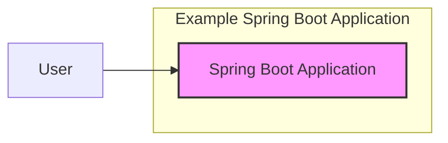

# BUSINESS POSTURE

This project appears to be a basic example of a Spring Boot web application.  Assuming this is intended as a template or a starting point for more complex applications, the primary business priority is to demonstrate a functional and well-structured Spring Boot application.  The goal is likely educational or to provide a foundation for future development.

Most important business risks that need to be addressed:
- Risk of insecure coding practices being propagated if this example is used as a template without proper security review.
- Risk of demonstrating outdated or vulnerable dependencies if the project is not regularly maintained.
- Risk of misinterpretation of the example as production-ready without further hardening and security measures.

# SECURITY POSTURE

Existing security controls:
- security control: Spring Security dependency included in `pom.xml`, suggesting intent to implement authentication and authorization. (Implemented in: `pom.xml`)
- security control: Basic structure for a web application, allowing for implementation of standard security practices. (Implemented in: Project structure)

Accepted risks:
- accepted risk: Example application likely does not have comprehensive security controls implemented out-of-the-box.
- accepted risk: Vulnerabilities in dependencies if not regularly updated.
- accepted risk: Lack of input validation and sanitization in example code.

Recommended security controls:
- security control: Implement robust authentication and authorization mechanisms using Spring Security.
- security control: Implement input validation and sanitization for all user inputs.
- security control: Regularly update dependencies to address known vulnerabilities.
- security control: Integrate static application security testing (SAST) into the build process.
- security control: Implement secure logging and monitoring practices.

Security requirements:
- Authentication:
    - Requirement: The application should support user authentication to verify the identity of users accessing the application.
    - Requirement: Consider different authentication methods (e.g., username/password, OAuth 2.0) based on the intended use case.
- Authorization:
    - Requirement: The application should implement authorization to control access to different parts of the application based on user roles or permissions.
    - Requirement: Define clear roles and permissions based on the application's functionality.
- Input Validation:
    - Requirement: All user inputs should be validated to prevent injection attacks (e.g., SQL injection, cross-site scripting).
    - Requirement: Implement both client-side and server-side validation.
- Cryptography:
    - Requirement: Sensitive data at rest and in transit should be encrypted.
    - Requirement: Use HTTPS for all communication to protect data in transit.
    - Requirement: Consider encrypting sensitive data in the database if applicable.

# DESIGN

## C4 CONTEXT



Context Diagram elements:
- Element:
    - Name: User
    - Type: Person
    - Description: End-user interacting with the Spring Boot application through a web browser or other client.
    - Responsibilities: Accessing application features, providing input data.
    - Security controls: User authentication (username/password, etc.), session management.
- Element:
    - Name: Spring Boot Application
    - Type: Software System
    - Description: The example Spring Boot web application.
    - Responsibilities: Handling user requests, processing data, and providing responses.
    - Security controls: Authentication, authorization, input validation, secure session management, error handling, logging.

## C4 CONTAINER

```mermaid
flowchart LR
    subgraph "Example Spring Boot Application"
        A["Spring Boot Web Application" <br> (Tomcat, Spring MVC)]
    end
    B["User Browser"] --> A
    style A fill:#f9f,stroke:#333,stroke-width:2px
```

Container Diagram elements:
- Element:
    - Name: User Browser
    - Type: Client Application
    - Description: Web browser used by the user to interact with the application.
    - Responsibilities: Rendering user interface, sending requests to the application, receiving and displaying responses.
    - Security controls: Browser security features (e.g., Content Security Policy), secure communication (HTTPS).
- Element:
    - Name: Spring Boot Web Application
    - Type: Web Application
    - Description: The Spring Boot application built using Spring MVC and running within a Tomcat servlet container.
    - Responsibilities: Handling HTTP requests, implementing business logic, interacting with data storage (if any), generating HTTP responses.
    - Security controls: Spring Security for authentication and authorization, input validation, secure session management, error handling, logging, HTTPS configuration.

## DEPLOYMENT

Deployment Solution: Cloud Deployment (Example: AWS ECS)

```mermaid
flowchart LR
    subgraph "AWS Cloud"
        subgraph "ECS Cluster"
            A["ECS Service" <br> (Spring Boot Application Instance)]
        end
        B["Load Balancer"] --> A
        C["Internet"] --> B
    end
    D["User Browser"] --> C
    style A fill:#f9f,stroke:#333,stroke-width:2px
    style B fill:#ccf,stroke:#333,stroke-width:2px
```

Deployment Diagram elements:
- Element:
    - Name: User Browser
    - Type: Client Application
    - Description: Web browser used by the user.
    - Responsibilities: User interaction.
    - Security controls: Browser security features, HTTPS.
- Element:
    - Name: Internet
    - Type: Network
    - Description: Public internet.
    - Responsibilities: Public network connectivity.
    - Security controls: N/A (external network).
- Element:
    - Name: Load Balancer
    - Type: Infrastructure Component
    - Description: AWS Elastic Load Balancer distributing traffic to application instances.
    - Responsibilities: Load balancing, SSL termination, routing requests.
    - Security controls: HTTPS termination, security groups, access logs.
- Element:
    - Name: ECS Service (Spring Boot Application Instance)
    - Type: Containerized Application
    - Description: Instance of the Spring Boot application running as a container in AWS ECS.
    - Responsibilities: Running the application code, handling requests.
    - Security controls: Container security (image scanning, resource limits), application-level security controls (authentication, authorization, etc.), security groups, logging, monitoring.

## BUILD

Build Process: GitHub Actions with Maven

```mermaid
flowchart LR
    A["Developer"] --> B["Code Commit (GitHub)"]
    B --> C["GitHub Actions Workflow"]
    C --> D["Maven Build"]
    D --> E["Unit Tests & SAST"]
    E --> F["Build Artifact (JAR)"]
    F --> G["Container Registry (e.g., Docker Hub)"]
    style A fill:#fff,stroke:#333,stroke-width:2px
    style B fill:#ccf,stroke:#333,stroke-width:2px
    style C fill:#ccf,stroke:#333,stroke-width:2px
    style D fill:#ccf,stroke:#333,stroke-width:2px
    style E fill:#ccf,stroke:#333,stroke-width:2px
    style F fill:#f9f,stroke:#333,stroke-width:2px
    style G fill:#ccf,stroke:#333,stroke-width:2px
```



Build Diagram elements:
- Element:
    - Name: Developer
    - Type: Person
    - Description: Software developer writing and committing code.
    - Responsibilities: Writing secure code, committing code changes.
    - Security controls: Secure development practices, code reviews.
- Element:
    - Name: Code Commit (GitHub)
    - Type: Version Control System
    - Description: GitHub repository hosting the project code.
    - Responsibilities: Version control, code storage.
    - Security controls: Access control, branch protection, audit logs.
- Element:
    - Name: GitHub Actions Workflow
    - Type: CI/CD System
    - Description: Automated workflow defined in GitHub Actions for building and testing the application.
    - Responsibilities: Build automation, running tests, security checks.
    - Security controls: Workflow access control, secret management, audit logs.
- Element:
    - Name: Maven Build
    - Type: Build Tool
    - Description: Maven build process to compile code and manage dependencies.
    - Responsibilities: Dependency management, compilation, packaging.
    - Security controls: Dependency vulnerability scanning (e.g., using Maven plugins), build reproducibility.
- Element:
    - Name: Unit Tests & SAST
    - Type: Quality & Security Checks
    - Description: Automated unit tests and Static Application Security Testing (SAST) tools run during the build process.
    - Responsibilities: Code quality assurance, vulnerability detection.
    - Security controls: SAST tool configuration, test coverage.
- Element:
    - Name: Build Artifact (JAR)
    - Type: Software Artifact
    - Description: Compiled and packaged JAR file of the Spring Boot application.
    - Responsibilities: Deployable application artifact.
    - Security controls: Artifact signing (optional), storage security.
- Element:
    - Name: Container Registry (e.g., Docker Hub)
    - Type: Artifact Repository
    - Description: Container registry to store Docker images (if containerized).
    - Responsibilities: Storing and distributing container images.
    - Security controls: Access control, image scanning, vulnerability scanning, audit logs.

# RISK ASSESSMENT

Critical business processes we are trying to protect:
- For an example application, there are no critical business processes in a real-world sense. However, if this were a template for other applications, the critical process would be demonstrating a secure and functional application foundation.  In a broader context, for applications built using this template, critical business processes would depend on the specific application's purpose (e.g., user management, data processing, e-commerce transactions).

Data we are trying to protect and their sensitivity:
- In this example, there is likely no sensitive data being handled.  However, in a real application built upon this foundation, data sensitivity would vary.  Potential data types and sensitivities could include:
    - User credentials (highly sensitive)
    - Personal user data (sensitive depending on type - PII, GDPR considerations)
    - Application data (sensitivity depends on business context)

# QUESTIONS & ASSUMPTIONS

Questions:
- What is the intended purpose of this Spring Boot example beyond being a basic template?
- Are there specific security requirements or compliance standards that need to be considered?
- What is the target deployment environment for applications built using this template?
- Is there any specific data that this example application is intended to handle or demonstrate handling?

Assumptions:
- BUSINESS POSTURE: Assumed to be an educational example or template, not a production application in itself. Business priority is demonstrating functionality and good structure.
- SECURITY POSTURE: Assumed basic security considerations are important, but comprehensive security is not the primary focus of the example itself. Security should be a key consideration for applications built using this as a template.
- DESIGN: Assumed a standard web application architecture with a browser client and a Spring Boot backend. Deployment is assumed to be cloud-based for scalability and availability. Build process is assumed to be automated using CI/CD practices.