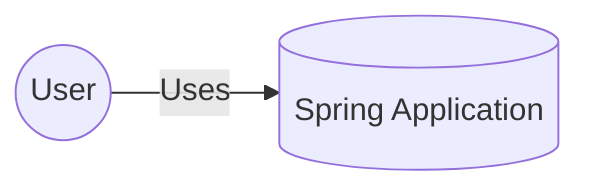
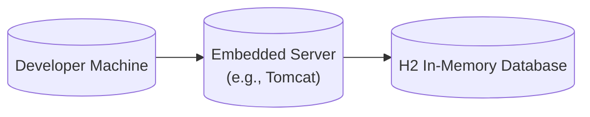
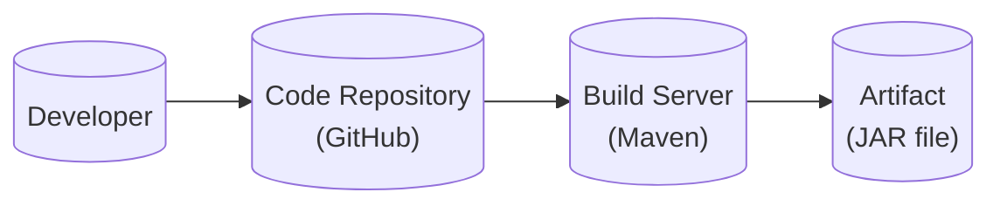

Okay, let's create a design document for the provided GitHub repository, focusing on aspects relevant to threat modeling.

# BUSINESS POSTURE

Business Priorities and Goals:

The project, "spring" (from the provided repository), appears to be a simple, personal, or demonstration project showcasing basic Spring Boot functionalities.  The primary business goals likely revolve around:

*   Learning and Experimentation:  The project serves as a practical example of using Spring Boot, Spring Data JPA, and potentially other Spring ecosystem components.  The goal is likely to gain hands-on experience.
*   Demonstration/Portfolio: The project could be used to showcase skills and understanding of Spring Boot to potential employers or collaborators.
*   Potential Foundation: While simple now, it *could* be the starting point for a more complex application.  However, based on the current state, this is speculative.

Most Important Business Risks:

Given the likely goals, the most significant business risks are relatively low, but still worth considering:

*   Reputational Risk (Low): If presented as a portfolio piece, vulnerabilities or poor coding practices could negatively impact the developer's reputation.
*   Wasted Effort (Low): If intended as a learning exercise, incorrect implementation or security flaws could hinder the learning process.
  Misleading Representation (Low): If this project is used to represent skills, it should accurately reflect the developer's capabilities.  Overstating its complexity or security would be misleading.
*   Foundation for insecure application (Medium): If this project will be used as foundation for more complex application, it's crucial to address all security issues now.

# SECURITY POSTURE

Existing Security Controls:

*   security control: Dependency Management (pom.xml): The project uses Maven (indicated by `pom.xml`) to manage dependencies. This *can* help with security by facilitating updates to address known vulnerabilities in libraries, but only if the developer actively keeps dependencies up-to-date.
*   security control: Framework Security Features (Implicit): Spring Boot, by default, provides some built-in security features, such as basic protection against CSRF (Cross-Site Request Forgery) and session fixation. However, these need to be properly configured and may not be enabled or sufficient by default.
*   security control: H2 in-memory database: Using in-memory database for development and testing.

Accepted Risks:

*   accepted risk: Limited Explicit Security Configuration: The provided code shows minimal explicit security configuration (e.g., no custom `WebSecurityConfigurerAdapter` or similar). This suggests reliance on Spring Boot defaults, which may not be sufficient for a production application.
*   accepted risk: No Input Validation: The `GreetingController` does not appear to have any explicit input validation on the `name` parameter. This could be a vulnerability (e.g., to Cross-Site Scripting (XSS) if the output is rendered in a web page without proper encoding).
*   accepted risk: Development-Focused Configuration: The use of an in-memory H2 database is common for development but is not suitable for production due to data loss on restart. This implies a development-focused posture.
*   accepted risk: Lack of Authentication/Authorization: There's no visible authentication or authorization mechanism. This is acceptable for a simple "hello world" type application, but a significant risk for anything handling sensitive data or requiring user-specific functionality.
*   accepted risk: No HTTPS: The project, in its current state, likely runs over HTTP, not HTTPS. This is a major security risk for any application handling sensitive data, as it exposes traffic to eavesdropping and tampering.
*   accepted risk: No error handling: The project, in its current state, has very simple error handling.

Recommended Security Controls (High Priority):

*   Input Validation: Implement robust input validation on all user-supplied data (e.g., the `name` parameter in the `GreetingController`). This should include length checks, character whitelisting/blacklisting, and appropriate encoding to prevent injection attacks.
*   Authentication and Authorization: If the application grows beyond a simple demonstration, implement proper authentication (verifying user identity) and authorization (controlling access to resources based on user roles/permissions). Spring Security provides comprehensive tools for this.
*   HTTPS: Enforce HTTPS for all communication, even during development. This protects against eavesdropping and man-in-the-middle attacks.
*   Secure Configuration Management: Avoid hardcoding sensitive information (e.g., database credentials, API keys) directly in the code. Use environment variables or a secure configuration management solution.
*   Dependency Scanning: Integrate a dependency scanning tool (e.g., OWASP Dependency-Check, Snyk) into the build process to automatically identify and report known vulnerabilities in project dependencies.
*   Error handling: Implement robust error handling.

Security Requirements:

*   Authentication: Currently, no authentication is implemented. If user-specific functionality or sensitive data is added, a robust authentication mechanism will be required.
*   Authorization: Currently, no authorization is implemented. If different user roles or access levels are needed, an authorization mechanism (e.g., role-based access control) will be necessary.
*   Input Validation: All user-supplied input *must* be validated to prevent injection attacks (e.g., XSS, SQL injection). This includes validating data type, length, format, and allowed characters.
*   Cryptography: If sensitive data is stored or transmitted, appropriate cryptographic techniques (e.g., hashing for passwords, encryption for sensitive data at rest and in transit) *must* be used. Currently, this is not applicable, but it's a crucial consideration for any future development.
*   Output Encoding: All data rendered in a web page *must* be properly encoded to prevent XSS attacks.

# DESIGN

## C4 CONTEXT



Element Descriptions:

*   Element:
    *   Name: User
    *   Type: Person
    *   Description: A user interacting with the Spring Application.
    *   Responsibilities: Interacts with the application, provides input, and receives output.
    *   Security controls: None (Security controls are implemented on the application side).

*   Element:
    *   Name: Spring Application
    *   Type: Software System
    *   Description: The Spring Boot application, providing a simple greeting service.
    *   Responsibilities: Receives requests, processes data, and returns responses.
    *   Security controls: Dependency Management, Framework Security Features (Implicit), Input Validation (to be implemented), Authentication/Authorization (to be implemented if needed), HTTPS (to be implemented).

## C4 CONTAINER

```mermaid
graph LR
    User((User)) --> WebApp[("Web Application\n(Spring Boot)")]
    WebApp --> Database[(Database\n(H2 In-Memory))]
```

Element Descriptions:

*   Element:
    *   Name: User
    *   Type: Person
    *   Description: A user interacting with the Spring Application.
    *   Responsibilities: Interacts with the application, provides input, and receives output.
    *   Security controls: None (Security controls are implemented on the application side).

*   Element:
    *   Name: Web Application (Spring Boot)
    *   Type: Container (Web Application)
    *   Description: The main Spring Boot application, handling web requests and business logic.
    *   Responsibilities: Receives HTTP requests, processes them using controllers and services, interacts with the database, and returns HTTP responses.
    *   Security controls: Dependency Management, Framework Security Features (Implicit), Input Validation (to be implemented), Authentication/Authorization (to be implemented if needed), HTTPS (to be implemented).

*   Element:
    *   Name: Database (H2 In-Memory)
    *   Type: Container (Database)
    *   Description: An in-memory H2 database used for development and testing.
    *   Responsibilities: Stores application data.
    *   Security controls: Limited inherent security controls due to its in-memory nature. Relies on the application for access control.

## DEPLOYMENT

Possible Deployment Solutions:

1.  Local Development Environment: Running the application directly on the developer's machine using an embedded server (e.g., Tomcat).
2.  Cloud Platform (e.g., AWS, Azure, GCP): Deploying the application as a JAR or WAR file to a cloud platform's application hosting service (e.g., AWS Elastic Beanstalk, Azure App Service, Google App Engine).
3.  Containerized Deployment (e.g., Docker, Kubernetes): Packaging the application as a Docker container and deploying it to a container orchestration platform like Kubernetes.

Chosen Solution (for detailed description): Local Development Environment



Element Descriptions:

*   Element:
    *   Name: Developer Machine
    *   Type: Infrastructure Node
    *   Description: The developer's local machine where the application is built and run.
    *   Responsibilities: Hosts the development environment, build tools, and the running application.
    *   Security controls: Relies on the developer's machine security (e.g., firewall, antivirus).

*   Element:
    *   Name: Embedded Server (e.g., Tomcat)
    *   Type: Infrastructure Node
    *   Description: An embedded application server (likely Tomcat, the Spring Boot default) running within the application's JVM.
    *   Responsibilities: Handles incoming HTTP requests and serves the application.
    *   Security controls: Relies on the application's security configuration and the security of the underlying JVM and operating system.

*   Element:
    *   Name: H2 In-Memory Database
    *   Type: Infrastructure Node
    *   Description: The in-memory H2 database instance running within the application's JVM.
    *   Responsibilities: Stores application data during development.
    *   Security controls: Limited inherent security controls; relies on the application for access control.

## BUILD


Build Process Description:

1.  Developer: The developer writes code and commits it to the GitHub repository.
2.  Code Repository (GitHub): The code is stored in a GitHub repository.
3.  Build Server (Maven): Maven is used as the build tool. It retrieves the code from the repository, compiles it, resolves dependencies, runs tests, and packages the application into an executable JAR file.
4.  Artifact (JAR file): The output of the build process is an executable JAR file containing the compiled application code and its dependencies.

Security Controls in Build Process:

*   security control: Dependency Management (Maven): Maven manages project dependencies, allowing for easier updates to address known vulnerabilities.
*   security control: (Recommended) Dependency Scanning: Integrate a dependency scanning tool (e.g., OWASP Dependency-Check, Snyk) into the Maven build process to automatically identify vulnerable dependencies. This is a crucial supply chain security measure.
*   security control: (Recommended) Static Code Analysis: Integrate a static code analysis tool (e.g., SonarQube, FindBugs) into the Maven build process to identify potential security vulnerabilities and code quality issues.

# RISK ASSESSMENT

Critical Business Processes:

At this stage, there are no truly *critical* business processes, as the project is primarily for learning or demonstration. However, if it were to evolve, the critical process would become the "greeting service" – providing a personalized greeting based on user input.

Data and Sensitivity:

*   User-Provided Name (Potentially PII): The `name` parameter in the greeting service could be considered Personally Identifiable Information (PII), depending on the context. If the application were to store this data or associate it with other information, its sensitivity would increase.  Currently, it appears to be used only transiently.
*   Application Data (Low Sensitivity):  The data stored in the H2 database (if any beyond the example) is likely of low sensitivity during development.

# QUESTIONS & ASSUMPTIONS

Questions:

*   What is the intended long-term purpose of this project? (Learning, portfolio, foundation for a larger application?)
*   Will the application be deployed to a production environment? If so, what are the deployment requirements?
*   Will the application handle any sensitive data beyond the user's name?
*   Are there any specific security standards or compliance requirements that need to be met?
*   What is the expected user base and traffic volume?

Assumptions:

*   BUSINESS POSTURE: The project is primarily for learning and demonstration purposes.
*   SECURITY POSTURE: The developer has a basic understanding of Spring Boot but may not be fully aware of all security best practices.  The current security posture is minimal.
*   DESIGN: The application is simple and follows a standard Spring Boot structure. The use of an in-memory database is solely for development convenience. The build process relies on Maven.