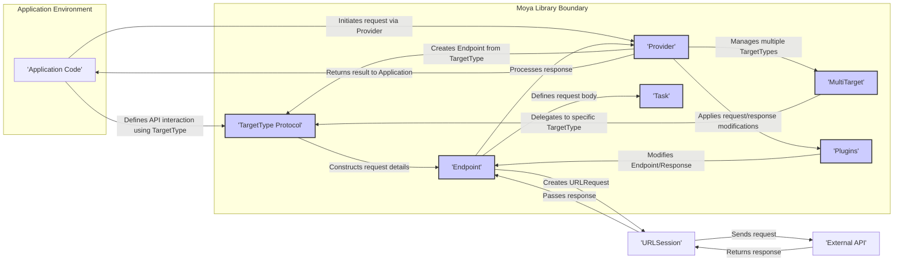
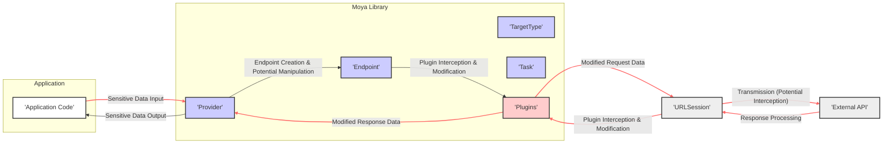

## Project Design Document: Moya Networking Library

**Document Version:** 1.1
**Date:** October 26, 2023
**Prepared By:** Gemini (AI Language Model)

### 1. Introduction

This document provides a detailed architectural design of the Moya networking library for Swift (as represented by the repository: https://github.com/Moya/Moya). This design document is specifically created to serve as a foundation for subsequent threat modeling activities. It outlines the key components, data flow, and security considerations of the library, focusing on aspects relevant to identifying potential vulnerabilities.

### 2. Goals

*   Provide a clear and comprehensive overview of Moya's architecture, emphasizing elements relevant to security.
*   Identify key components and their interactions, highlighting potential attack surfaces.
*   Describe the data flow within the library, pinpointing stages where data manipulation or interception could occur.
*   Highlight potential security considerations and vulnerabilities for threat modeling, providing specific examples where possible.

### 3. System Overview

Moya is a Swift networking library that provides an abstraction layer on top of `URLSession`. It aims to simplify the process of making network requests by providing a type-safe and concise way to define API endpoints and handle responses. This abstraction, while beneficial for development, introduces its own set of potential security considerations.

Here's a high-level diagram illustrating the core components and their interactions from a security perspective:

**Key Components (with Security Focus):**

*   **Application Code:** The entry point for network requests. Potential vulnerabilities here include insecure handling of sensitive data before sending or after receiving.
*   **Provider:** Central point for request execution. Security considerations include proper configuration and handling of credentials or sensitive information passed through it.
*   **TargetType Protocol:** Defines the API contract. Insecure definitions (e.g., hardcoded credentials in paths) can introduce vulnerabilities.
*   **Endpoint:** Represents the final request. Manipulation of the `Endpoint` before reaching `URLSession` could lead to unintended requests.
*   **Task:** Defines the request body. Incorrect encoding or inclusion of sensitive data in the body without proper protection is a risk.
*   **MultiTarget:**  While convenient, using `MultiTarget` requires careful management of configurations for different APIs to avoid cross-contamination or accidental access.
*   **Plugins:** Powerful but potentially risky. Malicious or poorly implemented plugins can intercept, modify, or leak sensitive data.
*   **URLSession:** The underlying networking framework. Security relies on its correct configuration (e.g., enforcing HTTPS).
*   **External API:** The target server. Security depends on the API's own security measures, which Moya interacts with.

### 4. Component Details

This section provides a more detailed description of each key component within the Moya library, with a focus on security implications.

*   **Provider:**
    *   Acts as a factory for `Endpoint` creation, making it a critical point for enforcing security policies.
    *   Custom `Session` configurations allow for control over TLS settings, proxy configurations, and certificate pinning, which are crucial for secure communication.
    *   Improper handling of authentication tokens or API keys within the `Provider` can lead to credential exposure.
    *   The `Provider`'s interceptor mechanism (via plugins) can be a point of vulnerability if not carefully managed.

*   **TargetType Protocol:**
    *   The source of truth for API endpoint definitions. Hardcoding sensitive information like API keys or secrets within `baseURL`, `path`, or `headers` is a significant security risk.
    *   The `sampleData` property, while useful for testing, should not contain real or sensitive data.
    *   Inconsistent or incorrect definitions of `parameterEncoding` can lead to data being sent insecurely (e.g., sensitive data in the URL).

*   **Endpoint:**
    *   Represents the fully formed request before being passed to `URLSession`. Any manipulation of the `Endpoint` object after its creation but before execution could lead to security issues.
    *   Custom `Endpoint` closures offer flexibility but also introduce potential for insecure modifications if not implemented carefully.

*   **Task:**
    *   The way request data is structured and sent. Using `.requestPlain` when data should be sent can lead to information not being transmitted.
    *   Incorrectly using `.requestParameters` with `URLEncoding` for sensitive data can expose it in the URL.
    *   When using `.requestJSONEncodable` or `.requestMultipart`, ensure that sensitive data is handled appropriately and not inadvertently included in logs or error messages.

*   **MultiTarget:**
    *   Simplifies working with multiple APIs but requires careful management of configurations for each target.
    *   Potential for accidentally using configurations intended for one API with another, leading to authorization issues or data breaches.

*   **Plugins:**
    *   Offer powerful capabilities for request and response modification, logging, and authentication.
    *   **Security Risk:** Malicious plugins could intercept and exfiltrate sensitive data, modify requests in unintended ways, or bypass security checks.
    *   **Security Best Practice:**  Thoroughly vet and trust all plugins used. Implement proper authorization and access controls for plugin management.
    *   Examples of security-relevant plugins:
        *   **Authentication Plugins:** If not implemented correctly, they can introduce vulnerabilities in how credentials are handled.
        *   **Logging Plugins:**  May inadvertently log sensitive data if not configured carefully.
        *   **Error Handling Plugins:** Could expose internal system details if error messages are too verbose.

*   **URLSession:**
    *   The foundation for network communication. Security relies heavily on its configuration.
    *   **Critical Security Configurations:**
        *   **Enforcing HTTPS:**  Ensuring that only secure connections are allowed.
        *   **Certificate Pinning:**  Validating the server's certificate to prevent man-in-the-middle attacks.
        *   **Proxy Settings:**  Incorrect proxy configurations can expose traffic.
        *   **Cookie Management:**  Securely handling session cookies to prevent hijacking.

### 5. Data Flow (Security Perspective)

The typical data flow for a network request using Moya, highlighting potential points of security concern, is as follows:

1. The **Application Code** provides data, potentially sensitive, to the **Provider**. **Threat:** Insecure handling or storage of sensitive data within the application before sending.
2. The **Provider** uses the **TargetType** to create an **Endpoint**. **Threat:**  Manipulation of the `Endpoint` object to redirect requests or modify parameters maliciously.
3. **Plugins** intercept the request. **Threat:** Malicious plugins could log, modify, or exfiltrate sensitive data.
4. The request is passed to **URLSession** for transmission. **Threat:** Man-in-the-middle attacks if HTTPS is not enforced or certificate pinning is not implemented.
5. The **External API** processes the request and sends a response. **Threat:**  The API itself might have vulnerabilities.
6. **URLSession** receives the response.
7. **Plugins** intercept the response. **Threat:** Malicious plugins could modify the response or log sensitive information.
8. The **Provider** processes the response and returns data to the **Application Code**. **Threat:** Insecure handling or storage of sensitive data received from the API within the application.

### 6. Security Considerations (Detailed)

This section expands on the security considerations, providing more specific examples of potential vulnerabilities and threats.

*   **Transport Security (HTTPS):**
    *   **Vulnerability:** Applications not enforcing HTTPS in `URLSession` configuration or allowing insecure connections.
    *   **Threat:** Man-in-the-middle attacks, eavesdropping on sensitive data transmitted over the network.
    *   **Mitigation:** Ensure `URLSessionConfiguration` enforces HTTPS. Consider implementing certificate pinning for enhanced security.

*   **Data Validation and Sanitization:**
    *   **Vulnerability:** Lack of input validation on data sent to the API or output sanitization on data received.
    *   **Threat:** Injection attacks (e.g., SQL injection if data is used in database queries on the backend), cross-site scripting (XSS) if received data is displayed in a web view without sanitization.
    *   **Mitigation:** Implement robust input validation and output sanitization within the application layer, before sending data via Moya and after receiving it.

*   **Authentication and Authorization:**
    *   **Vulnerability:** Hardcoding API keys or secrets within the `TargetType` or application code. Insecure storage or transmission of authentication tokens.
    *   **Threat:** Unauthorized access to API resources, data breaches.
    *   **Mitigation:** Use secure methods for storing and managing API keys (e.g., Keychain). Implement secure authentication flows (e.g., OAuth 2.0). Avoid hardcoding credentials.

*   **Data Storage and Caching:**
    *   **Vulnerability:** Caching of sensitive data by `URLSession` without proper protection.
    *   **Threat:** Exposure of sensitive data if the device is compromised.
    *   **Mitigation:** Configure `URLSession` caching policies appropriately, especially for sensitive data. Consider encrypting cached data.

*   **Error Handling and Information Disclosure:**
    *   **Vulnerability:**  Verbose error messages from the API or within the application exposing sensitive information about the system or data.
    *   **Threat:** Attackers gaining insights into the system's architecture or potential vulnerabilities.
    *   **Mitigation:** Implement generic error handling and logging that avoids exposing sensitive details.

*   **Plugin Security:**
    *   **Vulnerability:** Using untrusted or malicious plugins.
    *   **Threat:** Data exfiltration, request manipulation, bypassing security controls.
    *   **Mitigation:**  Thoroughly vet and trust all plugins. Implement code reviews for custom plugins. Consider using only well-established and maintained plugins.

*   **Dependency Management:**
    *   **Vulnerability:** Using outdated versions of Moya or its dependencies with known security vulnerabilities.
    *   **Threat:** Exploitation of known vulnerabilities in the library or its dependencies.
    *   **Mitigation:** Regularly update Moya and its dependencies to the latest stable versions. Use dependency management tools to track and manage dependencies.

*   **Man-in-the-Middle Attacks:**
    *   **Vulnerability:**  Failure to implement certificate pinning or proper trust evaluation.
    *   **Threat:** Attackers intercepting and potentially modifying communication between the application and the API.
    *   **Mitigation:** Implement certificate pinning to ensure the application only trusts the expected server certificate.

### 7. Assumptions and Constraints

*   It is assumed that applications using Moya intend to communicate with backend services over a network.
*   The security of the overall system depends not only on Moya but also on the security practices of the application developers and the backend API.
*   This design document focuses on potential vulnerabilities within the Moya library and its interaction with the application and `URLSession`.

### 8. Future Considerations

*   Further analysis of specific popular Moya plugins and their potential security implications.
*   Detailed examination of how custom `Session` configurations can be leveraged for enhanced security or introduce vulnerabilities.
*   Development of guidelines for secure implementation of authentication and authorization using Moya.
*   Creation of best practices for handling sensitive data within the context of Moya requests and responses.
