## Project Design Document: Moya - An Abstraction for Network Requests

**Version:** 1.1
**Date:** October 26, 2023
**Author:** AI Software Architect

### 1. Introduction

This document provides an enhanced design overview of the Moya library, a popular Swift networking library that offers compile-time safety for network requests through the utilization of enums. The primary goal of this document is to provide a clear and detailed understanding of Moya's architecture, key components, and data flow, making it suitable for comprehensive threat modeling exercises. This revised version expands on the initial design to provide greater clarity and detail relevant to security considerations.

### 2. Goals

*   Provide a comprehensive and easily understandable description of the Moya library's architecture and functionality.
*   Clearly identify key components, their specific responsibilities, and their interactions within the system.
*   Illustrate the typical data flow during a network request initiated using Moya, highlighting critical stages.
*   Emphasize security considerations relevant to Moya's design and usage, outlining potential threats and vulnerabilities.

### 3. System Overview

Moya serves as an abstraction layer built upon established Swift networking libraries, most notably Alamofire. It simplifies the process of initiating network requests by enabling developers to define API endpoints as distinct cases within Swift enums. This design choice offers compile-time verification of API interactions, significantly reduces repetitive boilerplate code, and enhances the overall maintainability of networking logic within Swift applications.

The fundamental principle involves defining a `TargetType` protocol, which is then implemented by an enum that represents the specific API being consumed. Each case within this enum corresponds to a unique API endpoint and encapsulates essential information such as the endpoint's path, the required HTTP method, necessary parameters, and any specific headers. Moya leverages this information to construct and execute the actual network request by delegating to the underlying networking library.

### 4. Key Components

*   **`Provider`:** This is the central point of interaction for initiating network requests with Moya. Developers typically instantiate a `MoyaProvider` to manage and execute these requests. It accepts a `TargetType` instance, using its defined properties to build and subsequently perform the network operation.
    *   **Security Relevance:** The `Provider` is responsible for applying plugins, which can include security-related logic like authentication. A compromised or misconfigured plugin could introduce vulnerabilities.
*   **`TargetType` Protocol:** This protocol establishes the contract for defining an API endpoint. Concrete implementations, typically Swift enums, provide the necessary details for Moya to construct a network request. Key properties defined within `TargetType` include:
    *   `baseURL`: The fundamental URL for the target API.
        *   **Security Relevance:** Ensuring this is always `https://` is critical for protecting data in transit.
    *   `path`: The specific path segment for the desired endpoint.
        *   **Security Relevance:** Incorrectly constructed paths could lead to unintended access or expose sensitive information.
    *   `method`: The HTTP verb to be used for the request (e.g., GET, POST, PUT, DELETE).
    *   `task`: Specifies how parameters are transmitted with the request (e.g., as URL parameters, in the request body).
        *   **Security Relevance:** The choice of `Task` can impact how sensitive data is transmitted. For instance, large amounts of sensitive data should generally be sent in the request body using POST or PUT.
    *   `headers`:  Additional HTTP headers to be included in the request.
        *   **Security Relevance:** Crucial for including authentication tokens or other security-related headers. Misconfiguration or exposure of these headers can lead to security breaches.
*   **Enum-based API Definition:** This is the conventional method for implementing the `TargetType` protocol. Each case within the enum represents a distinct API endpoint, and associated values can be used to supply endpoint-specific parameters or data.
    *   **Security Relevance:**  Care must be taken to avoid hardcoding sensitive information (like API keys) directly within the enum cases.
*   **`Task` Enum:**  This nested enum within `TargetType` dictates how request parameters are encoded and sent to the server. Available options include:
    *   `requestPlain`: Indicates no additional data is sent with the request.
    *   `requestData`: Sends raw `Data` in the request body.
    *   `requestJSONEncodable`: Encodes an `Encodable` Swift object to JSON format for the request body.
        *   **Security Relevance:**  Ensure proper encoding of sensitive data to prevent unintended exposure.
    *   `requestParameters(parameters: [String: Any], encoding: ParameterEncoding)`: Sends parameters either as query parameters in the URL or within the request body, determined by the specified `ParameterEncoding`.
        *   **Security Relevance:**  Be mindful of sending sensitive information in URL query parameters, as they can be logged or cached.
    *   `uploadMultipart(MultipartFormData)`: Used for uploading files and associated data.
        *   **Security Relevance:**  Validate file uploads to prevent malicious uploads.
    *   `download(DownloadDestination)`: Used for downloading files.
*   **`ParameterEncoding`:**  Determines the mechanism used to encode request parameters. Common options include `URLEncoding` (for sending parameters in the URL) and `JSONEncoding` (for sending parameters in the JSON request body).
    *   **Security Relevance:**  Choosing the appropriate encoding is important for security. `URLEncoding` should be avoided for sensitive data.
*   **`Plugins`:** Moya offers a flexible plugin system that allows developers to extend its core functionality. Plugins can be used for various tasks, including logging requests and responses, adding authentication headers, and managing network activity indicators.
    *   **Security Relevance:** Plugins operate with access to request and response data. Untrusted or poorly written plugins can introduce significant security vulnerabilities.
*   **Underlying Networking Library (e.g., Alamofire):** Moya relies on a lower-level networking library to handle the actual network communication. Alamofire is the most commonly used and recommended library for this purpose.
    *   **Security Relevance:** Moya's security is partially dependent on the security of the underlying networking library. Keeping this dependency updated is crucial.
*   **`Response` Object:**  Represents the server's response to a network request. It encapsulates the response data, the HTTP status code, and response headers.
    *   **Security Relevance:**  Carefully inspect response headers for security-related information (e.g., `Strict-Transport-Security`).
*   **Result Type (`Result<Response, MoyaError>`):** Moya utilizes the `Result` type to represent the outcome of a network request, indicating either a successful `Response` or a `MoyaError` in case of failure.
*   **`MoyaError` Enum:**  Provides a structured categorization of different types of errors that can occur during a network request, aiding in debugging and error handling.
    *   **Security Relevance:** Avoid exposing overly detailed error messages to the user, as they might reveal sensitive information about the server or application.

### 5. Data Flow

The following steps detail the typical data flow involved when initiating a network request using Moya:

1. The developer instantiates a `MoyaProvider`.
2. The developer defines the specific API endpoint by selecting the appropriate case within their `TargetType` enum, providing any necessary associated values for parameters or data.
3. The developer invokes a method on the `MoyaProvider` (e.g., `request(_:completion:)`), passing the specific enum case representing the target API endpoint.
4. The `MoyaProvider` receives the `TargetType` instance containing the API endpoint definition.
5. The `MoyaProvider` utilizes the information extracted from the `TargetType` (including `baseURL`, `path`, `method`, `task`, and `headers`) to construct a `URLRequest` object.
6. If any plugins are configured for the `MoyaProvider`, they are applied to the `URLRequest`. This might involve adding authentication headers, logging the request details, or other pre-processing steps.
7. The `MoyaProvider` delegates the execution of the constructed `URLRequest` to the underlying networking library (e.g., Alamofire).
8. The underlying networking library establishes a connection with the server and transmits the request.
9. The server processes the received request and generates a response.
10. The underlying networking library receives the response from the server, including the response body, HTTP status code, and headers.
11. The `MoyaProvider` receives the raw response data, status code, and headers from the underlying networking library.
12. If any plugins are configured, they are given the opportunity to process the received response. This might involve logging the response, handling specific error codes, or other post-processing actions.
13. Moya creates a `Response` object, encapsulating the received data, status code, and headers.
14. Moya returns a `Result` type to the developer, wrapping either the successful `Response` object or a `MoyaError` instance indicating the reason for failure.
15. The developer handles the returned `Result`, processing the response data if successful or implementing appropriate error handling logic if the request failed.

```mermaid
graph LR
    subgraph "Moya Client"
        A["Developer Code"] --> B("MoyaProvider");
        B --> C("TargetType Instance (Enum Case)");
        C --> D("Construct URLRequest");
        D --> E("Apply Request Plugins");
        E --> F("Underlying Networking Library");
    end
    F --> G("Server");
    G --> H("Underlying Networking Library");
    H --> I("Receive Response");
    I --> J("Apply Response Plugins");
    J --> K("Create Response Object");
    K --> L("Return Result");
    L --> M["Developer Code"];
    style A fill:#ccf,stroke:#333,stroke-width:2px
    style M fill:#ccf,stroke:#333,stroke-width:2px
    style G fill:#bbb,stroke:#333,stroke-width:2px
    style F fill:#eee,stroke:#333,stroke-width:1px, dash-array: 5 5
    style H fill:#eee,stroke:#333,stroke-width:1px, dash-array: 5 5
```

### 6. Security Considerations

Moya, while primarily focused on simplifying networking operations, introduces several security considerations that developers must be aware of and address:

*   **Data in Transit Security:** Moya relies on the underlying networking library (typically Alamofire) for establishing secure connections.
    *   **Threat:** Man-in-the-middle attacks where an attacker intercepts communication.
    *   **Mitigation:** Ensure all `baseURL` configurations and dynamically constructed URLs consistently use the `https://` scheme to enforce TLS encryption. Consider implementing certificate pinning for enhanced security against certificate-based attacks.
*   **Authentication and Authorization Handling:** Moya provides flexibility in implementing authentication but doesn't enforce specific methods.
    *   **Threat:** Unauthorized access to API endpoints.
    *   **Mitigation:** Implement robust authentication mechanisms (e.g., OAuth 2.0, API keys) and securely manage credentials. Utilize Moya's plugin system to consistently add authorization headers to requests. Avoid storing sensitive credentials directly in the application code.
*   **Input Data Validation:** Moya facilitates sending data to APIs but doesn't inherently validate the data being sent.
    *   **Threat:** Injection attacks (e.g., SQL injection if passing data to a backend database through the API), sending malformed data that could cause server-side errors.
    *   **Mitigation:** Implement client-side validation of data before sending it via Moya. The backend API should also perform thorough validation on all received data.
*   **Response and Error Handling Security:** How the application handles server responses and errors is crucial for security.
    *   **Threat:** Information disclosure through overly verbose error messages, potential for denial-of-service if error handling is not robust.
    *   **Mitigation:** Implement secure error handling practices. Avoid displaying detailed error messages to the end-user that could reveal sensitive information about the server or application internals. Log errors securely for debugging purposes.
*   **Dependency Vulnerabilities:** Moya depends on other libraries, such as Alamofire.
    *   **Threat:** Security vulnerabilities in these dependencies could be exploited.
    *   **Mitigation:** Regularly update Moya and its dependencies to the latest versions to patch any known security vulnerabilities. Utilize dependency management tools to track and manage dependencies effectively.
*   **Security of Plugins:** The plugin system offers extensibility but also introduces potential security risks.
    *   **Threat:** Malicious or poorly written plugins could intercept sensitive data, modify requests, or introduce vulnerabilities.
    *   **Mitigation:** Carefully vet the source and trustworthiness of any third-party plugins used. Implement code reviews for custom plugins to identify potential security flaws. Limit the permissions and access granted to plugins.
*   **Data Caching Security:** If response caching is enabled (either through Moya or the underlying networking library), consider the sensitivity of the cached data.
    *   **Threat:** Unauthorized access to cached sensitive information.
    *   **Mitigation:** Implement secure caching mechanisms if necessary. Avoid caching sensitive data if possible, or ensure appropriate encryption and access controls are in place for cached data.
*   **Certificate Pinning Implementation:** While mentioned earlier, the implementation of certificate pinning deserves specific attention.
    *   **Threat:**  Circumvention of TLS by attackers with compromised or rogue certificates.
    *   **Mitigation:**  Implement certificate pinning within the underlying networking library's configuration to ensure that the application only trusts specific certificates, mitigating the risk of man-in-the-middle attacks using fraudulently obtained certificates.

### 7. Future Considerations

*   A more in-depth analysis of specific plugin implementations and their potential security implications, including common vulnerabilities.
*   A detailed examination of Moya's error handling mechanisms and potential scenarios for information disclosure through error responses.
*   A review of Moya's default configurations and their security implications, identifying any settings that might introduce vulnerabilities if not properly configured.
*   An assessment of how different `Task` types and `ParameterEncoding` options can impact the security of data transmission, providing guidelines for secure usage.

This enhanced document provides a more comprehensive understanding of the Moya library's architecture and its security considerations, making it a more robust foundation for subsequent threat modeling activities.