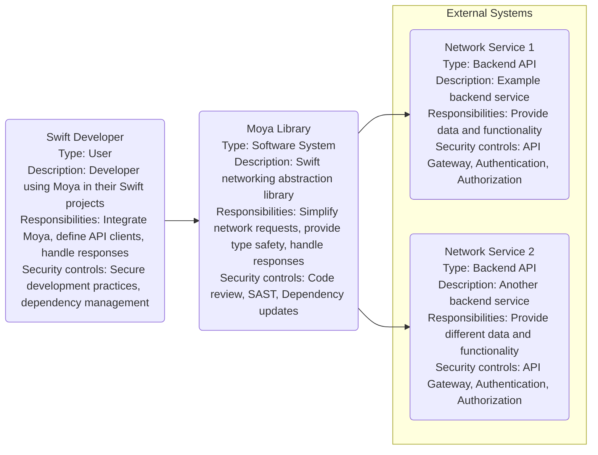
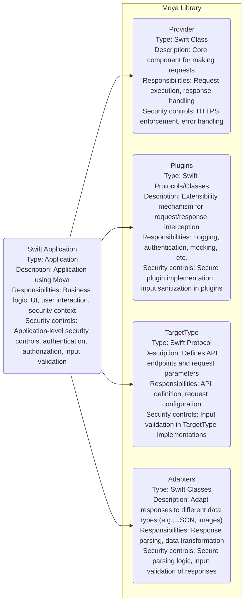
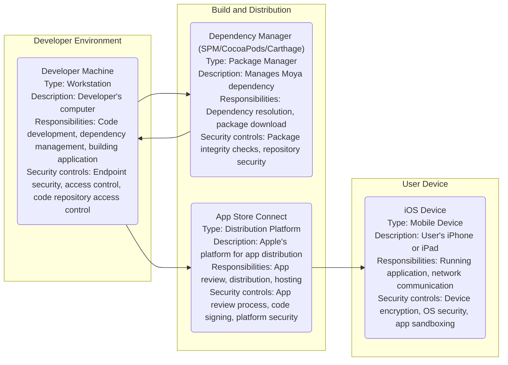
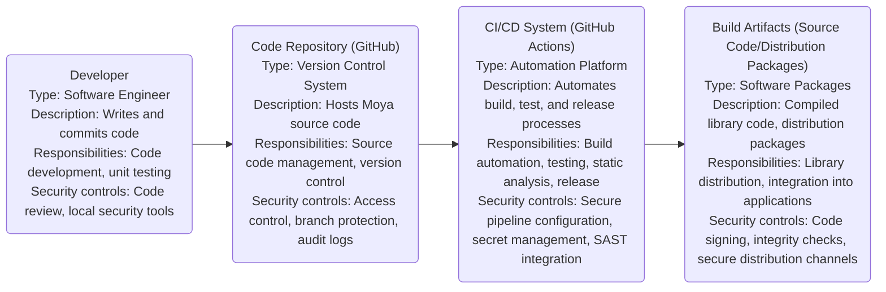

# BUSINESS POSTURE

- Business priorities and goals:
 - Simplify network layer implementation for Swift developers.
 - Provide a type-safe and composable way to define API clients.
 - Reduce boilerplate code associated with network requests.
 - Enhance code maintainability and testability in Swift networking layers.
 - Foster a strong community around the library for continuous improvement and support.
- Most important business risks:
 - Security vulnerabilities in the library could be exploited by malicious actors in applications using Moya, leading to data breaches or other security incidents.
 - Instability or bugs in the library could disrupt applications relying on Moya, impacting user experience and business operations.
 - Lack of community support or slow response to issues could deter developers from adopting or continuing to use Moya.
 - Supply chain attacks targeting the library's dependencies or distribution channels could compromise the integrity of Moya and applications using it.

# SECURITY POSTURE

- Existing security controls:
 - security control: Code review process for contributions (described in GitHub repository contribution guidelines).
 - security control: Dependency management using Swift Package Manager (implicitly used in Swift projects).
 - accepted risk: Open source nature implies public code visibility, potentially revealing vulnerabilities if not carefully reviewed.
- Recommended security controls:
 - security control: Implement automated static analysis security testing (SAST) in the CI/CD pipeline to identify potential code vulnerabilities.
 - security control: Regularly update dependencies to patch known vulnerabilities.
 - security control: Establish a process for reporting and handling security vulnerabilities, including a security policy and contact information.
 - security control: Consider signing releases to ensure authenticity and integrity of distributed artifacts.
- Security requirements:
 - Authentication: Not directly applicable to a networking library itself, but Moya is designed to facilitate the implementation of authentication in client applications using it when interacting with backend services. Applications using Moya should implement appropriate authentication mechanisms (e.g., OAuth 2.0, API keys) based on the requirements of the backend services they interact with.
 - Authorization: Similar to authentication, authorization is the responsibility of applications using Moya. Moya should provide mechanisms to easily include authorization tokens or headers in network requests, enabling applications to enforce access control policies defined by backend services.
 - Input validation: While Moya itself doesn't directly handle user input, it's crucial that applications using Moya validate all data received from backend services before processing or displaying it. Moya should not introduce vulnerabilities that bypass input validation in consuming applications.
 - Cryptography: Moya relies on the underlying networking libraries provided by the operating system (e.g., URLSession in iOS, macOS) for secure communication channels like HTTPS. Moya should encourage and facilitate the use of HTTPS for all network requests to protect data in transit. Moya should not implement custom cryptography but rely on well-established and vetted system libraries.

# DESIGN

## C4 CONTEXT

- Elements of context diagram:
 - - Name: Swift Developer
   - Type: User
   - Description: Developers who use the Moya library to simplify networking in their Swift applications.
   - Responsibilities: Integrate Moya into their projects, define API clients using Moya's abstractions, handle network responses, and implement application-level security controls.
   - Security controls: Secure development practices, dependency management, input validation in applications, secure storage of credentials.
 - - Name: Moya Library
   - Type: Software System
   - Description: A Swift library that provides an abstraction layer over URLSession and simplifies the process of making network requests.
   - Responsibilities: Provide a type-safe and composable way to define API clients, handle request construction and response parsing, and offer extensibility through plugins.
   - Security controls: Code review, automated static analysis security testing (SAST), regular dependency updates, vulnerability reporting process.
 - - Name: Network Service 1
   - Type: Backend API
   - Description: An example backend service that the Swift application might interact with using Moya.
   - Responsibilities: Provide data and functionality to the Swift application via a network API, handle authentication and authorization, and ensure data security on the server-side.
   - Security controls: API Gateway, authentication mechanisms (e.g., OAuth 2.0), authorization policies, input validation, secure data storage, regular security audits.
 - - Name: Network Service 2
   - Type: Backend API
   - Description: Another example backend service, possibly with different functionalities and security requirements.
   - Responsibilities: Similar to Network Service 1, provide data and functionality, handle security.
   - Security controls: API Gateway, authentication, authorization, input validation, secure data storage.

## C4 CONTAINER

- Elements of container diagram:
 - - Name: Provider
   - Type: Swift Class
   - Description: The central component of Moya, responsible for executing network requests and handling responses using URLSession.
   - Responsibilities: Creating and executing URLRequests, managing URLSession, handling network errors, and providing a consistent interface for making requests.
   - Security controls: Enforcing HTTPS by default, handling network errors gracefully to prevent information leakage, and ensuring proper disposal of sensitive data in requests and responses.
 - - Name: Plugins
   - Type: Swift Protocols/Classes
   - Description: A system for extending Moya's functionality by intercepting and modifying requests and responses. Plugins can be used for logging, authentication, mocking, and other cross-cutting concerns.
   - Responsibilities: Providing extensibility points for customization, allowing developers to add custom logic to the request/response lifecycle.
   - Security controls: Ensuring secure implementation of plugins to avoid introducing vulnerabilities, sanitizing inputs and outputs within plugins, and providing clear documentation on secure plugin development.
 - - Name: TargetType
   - Type: Swift Protocol
   - Description: A protocol that defines the API endpoints and request parameters for each API call. Developers conform to this protocol to define their API clients.
   - Responsibilities: Defining the structure and parameters of API requests in a type-safe manner, providing a clear contract for network interactions.
   - Security controls: Implementing input validation within TargetType implementations to ensure request parameters are valid and safe, avoiding injection vulnerabilities.
 - - Name: Adapters
   - Type: Swift Classes
   - Description: Components responsible for adapting network responses into different data types, such as JSON, images, or custom model objects.
   - Responsibilities: Parsing response data, transforming data into usable formats, and handling data serialization and deserialization.
   - Security controls: Implementing secure parsing logic to prevent vulnerabilities like buffer overflows or injection attacks, validating the structure and content of responses, and handling errors during parsing.
 - - Name: Swift Application
   - Type: Application
   - Description: The application that integrates and uses the Moya library to perform network operations.
   - Responsibilities: Utilizing Moya to interact with backend services, implementing business logic, handling user interactions, and managing the overall security context of the application.
   - Security controls: Application-level security controls, including authentication and authorization, input validation of data received from Moya, secure data storage, and protection against application-specific vulnerabilities.

## DEPLOYMENT

- Deployment solutions:
 - Moya library is distributed as source code and integrated into Swift applications using dependency managers.
 - Deployment of applications using Moya varies widely depending on the application type (iOS, macOS, etc.) and distribution method (App Store, TestFlight, enterprise distribution, etc.).
- Detailed deployment description (example: iOS App Store deployment):
 - Swift developers integrate Moya into their iOS application project using Swift Package Manager, CocoaPods, or Carthage.
 - The application, including the Moya library code, is compiled and packaged into an IPA file.
 - The IPA file is submitted to the Apple App Store for review and distribution.
 - Users download and install the application from the App Store onto their iOS devices.
 - At runtime, the application uses Moya to make network requests to backend services.

- Elements of deployment diagram:
 - - Name: Developer Machine
   - Type: Workstation
   - Description: The computer used by a Swift developer to write code, manage dependencies, and build the iOS application.
   - Responsibilities: Code development, integration of Moya, building and testing the application.
   - Security controls: Endpoint security software, access control to development tools and resources, secure access to code repositories, and protection against malware.
 - - Name: Dependency Manager (SPM/CocoaPods/Carthage)
   - Type: Package Manager
   - Description: Tools like Swift Package Manager, CocoaPods, or Carthage used to manage external dependencies, including Moya, in the Swift project.
   - Responsibilities: Resolving dependencies, downloading and integrating library code into the project.
   - Security controls: Package integrity checks (e.g., checksum verification), security of package repositories, and protection against dependency confusion attacks.
 - - Name: App Store Connect
   - Type: Distribution Platform
   - Description: Apple's platform for managing and distributing iOS applications through the App Store.
   - Responsibilities: App submission, review process, distribution to users, and hosting application binaries.
   - Security controls: App review process to identify malicious or vulnerable applications, code signing to ensure application integrity, and platform-level security measures.
 - - Name: iOS Device
   - Type: Mobile Device
   - Description: The user's iPhone or iPad where the application is installed and run.
   - Responsibilities: Running the application, executing Moya code for network requests, and interacting with backend services.
   - Security controls: Device encryption, operating system security updates, app sandboxing to isolate applications, and user-controlled permissions.

## BUILD

- Elements of build diagram:
 - - Name: Developer
   - Type: Software Engineer
   - Description: A developer contributing to the Moya project by writing and committing code.
   - Responsibilities: Writing code, performing unit tests, and adhering to coding standards and security guidelines.
   - Security controls: Code review by other developers, use of local security tools (e.g., linters, IDE security plugins), and secure workstation practices.
 - - Name: Code Repository (GitHub)
   - Type: Version Control System
   - Description: GitHub repository hosting the Moya source code and managing version history.
   - Responsibilities: Source code management, version control, collaboration, and issue tracking.
   - Security controls: Access control to the repository, branch protection rules, audit logs of repository activities, and vulnerability scanning of dependencies.
 - - Name: CI/CD System (GitHub Actions)
   - Type: Automation Platform
   - Description: GitHub Actions is used to automate the build, test, and release processes for Moya.
   - Responsibilities: Automated building of the library, running unit tests, performing static analysis security testing (SAST), and creating release artifacts.
   - Security controls: Secure pipeline configuration, secret management for API keys and credentials, integration of SAST tools to identify vulnerabilities, and access control to CI/CD workflows.
 - - Name: Build Artifacts (Source Code/Distribution Packages)
   - Type: Software Packages
   - Description: The output of the build process, including compiled library code and distribution packages (e.g., Swift Package Manager manifest, CocoaPods podspec).
   - Responsibilities: Distribution of the Moya library to developers for integration into their applications.
   - Security controls: Code signing to ensure the integrity and authenticity of the library, integrity checks (e.g., checksums) for distribution packages, and secure distribution channels (e.g., GitHub Releases, package registries).

# RISK ASSESSMENT

- Critical business processes to protect:
 - Maintaining the integrity and availability of the Moya library code.
 - Ensuring the security and reliability of the library for developers and applications using it.
 - Preserving the trust and reputation of the Moya project within the Swift developer community.
- Data to protect and sensitivity:
 - Moya source code: High sensitivity - compromise could lead to vulnerabilities in the library and applications using it.
 - Build artifacts (distribution packages): High sensitivity - integrity is crucial to prevent supply chain attacks.
 - Developer credentials and secrets used in the build process: High sensitivity - compromise could allow unauthorized modifications or releases.
 - Community trust and project reputation: High sensitivity - essential for the long-term success and adoption of Moya.

# QUESTIONS & ASSUMPTIONS

- Questions:
 - What is the intended audience and use cases for applications using Moya? (Assuming general-purpose Swift applications needing network communication).
 - Are there specific regulatory compliance requirements for applications using Moya? (Assuming general best practices for security and data protection).
 - What is the process for reporting and handling security vulnerabilities in Moya? (Assuming standard open-source vulnerability reporting practices should be implemented).
 - Are there any specific security certifications or audits planned for Moya? (Assuming no specific certifications are currently in place, but recommended security controls should be considered).
- Assumptions:
 - BUSINESS POSTURE: The primary goal is to provide a secure, reliable, and easy-to-use networking library for the Swift community.
 - SECURITY POSTURE: Standard open-source security practices are followed, but there is room for improvement in automated security testing and vulnerability management. Applications using Moya are expected to implement their own application-level security controls.
 - DESIGN: Moya is designed as a modular and extensible library, relying on system-provided security features (e.g., HTTPS via URLSession). Deployment is primarily through dependency managers, and the build process can be enhanced with more robust security checks.