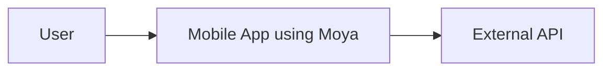
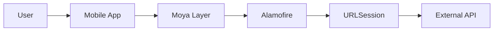
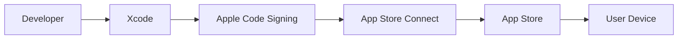
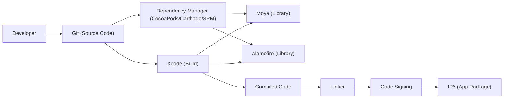

Okay, let's create a design document for the Moya project, focusing on aspects relevant for threat modeling.

# BUSINESS POSTURE

Moya is a network abstraction layer built on top of Alamofire in Swift.  It's designed to make network requests cleaner and easier to manage, particularly in the context of interacting with APIs.  From the perspective of a business adopting Moya, the primary goals and priorities are:

*   _Maintainability_: Reduce the complexity of network-related code, making it easier to understand, modify, and maintain over time.  This directly impacts development velocity and reduces the risk of introducing bugs during changes.
*   _Testability_:  Enable easy testing of network interactions, including mocking and stubbing of responses. This improves the overall quality and reliability of the application.
*   _Consistency_:  Provide a consistent and predictable way to interact with APIs, regardless of the specific endpoint or data format. This reduces cognitive load for developers and promotes a uniform codebase.
*   _Developer Productivity_:  Streamline the process of making network requests, allowing developers to focus on business logic rather than low-level networking details.

_Most Important Business Risks_:

*   _Incorrect API Interaction_:  Bugs in the networking layer (or how it's used) could lead to incorrect data being sent or received, potentially corrupting data, causing application malfunctions, or leading to incorrect business decisions.
*   _Security Vulnerabilities_:  While Moya itself is an abstraction, misuse or vulnerabilities in underlying libraries (Alamofire, URLSession) could expose the application to security risks like man-in-the-middle attacks, data breaches, or denial-of-service.
*   _Dependency Management Issues_:  Problems with Moya's dependencies (like Alamofire) could introduce instability, security vulnerabilities, or compatibility issues, impacting the overall application.
*   _Performance Bottlenecks_: Inefficient use of Moya or underlying networking components could lead to performance problems, slow response times, and a poor user experience.

# SECURITY POSTURE

*   _security control_: Moya, as a library, relies heavily on the security features provided by Alamofire and the underlying Apple networking frameworks (URLSession).  These frameworks handle TLS/SSL encryption, certificate validation, and other low-level security aspects. (Implementation: Relies on Alamofire and URLSession).
*   _security control_: Moya encourages the use of enums and structured types to define API endpoints, which can help prevent common errors like typos in URLs or parameter names. (Implementation: Encouraged through Moya's design and examples).
*   _security control_: Moya's design promotes separation of concerns, making it easier to implement security-related logic (like authentication) in a centralized and consistent manner. (Implementation: Facilitated by Moya's architecture).
*   _accepted risk_: Moya itself does not directly handle sensitive data like passwords or API keys. It's the responsibility of the application using Moya to manage these securely.
*   _accepted risk_: Moya does not provide built-in mechanisms for advanced security features like certificate pinning or two-factor authentication. These must be implemented at the application level or using Alamofire's capabilities.
*   _accepted risk_: Moya's plugin system allows for extending its functionality, but this also introduces a potential risk if plugins are not carefully vetted for security vulnerabilities.

_Recommended Security Controls_:

*   _security control_: Implement certificate pinning using Alamofire's `ServerTrustManager` to mitigate man-in-the-middle attacks. This is crucial for applications handling sensitive data.
*   _security control_: Thoroughly audit any Moya plugins used in the project for security vulnerabilities and ensure they are kept up-to-date.
*   _security control_: Implement robust input validation and sanitization on all data received from API responses, even if Moya is used correctly. This protects against vulnerabilities like cross-site scripting (XSS) or injection attacks.
*   _security control_: Securely store and manage API keys, tokens, and other sensitive credentials. Avoid hardcoding them in the application code. Use secure storage mechanisms provided by the operating system (e.g., Keychain on iOS).

_Security Requirements_:

*   _Authentication_:
    *   The application using Moya must implement appropriate authentication mechanisms based on the API's requirements (e.g., OAuth 2.0, API keys, JWT).
    *   Authentication tokens should be securely stored and managed.
    *   Implement refresh token mechanisms where appropriate to minimize the lifetime of access tokens.

*   _Authorization_:
    *   The application should enforce authorization checks based on the user's roles and permissions after receiving data from the API. Moya itself does not handle authorization.
    *   Ensure that the application correctly handles unauthorized responses from the API (e.g., 401 Unauthorized, 403 Forbidden).

*   _Input Validation_:
    *   All data received from the API should be treated as untrusted and thoroughly validated before being used or displayed.
    *   Validate data types, lengths, formats, and ranges to prevent common vulnerabilities.

*   _Cryptography_:
    *   Rely on Alamofire and URLSession for secure communication via HTTPS (TLS/SSL).
    *   If custom encryption is required, use well-established cryptographic libraries and follow best practices.
    *   Ensure that any cryptographic keys are securely generated, stored, and managed.

# DESIGN

## C4 CONTEXT

*   Elements Description:
    *   _Name_: User
        *   _Type_: Person
        *   _Description_: The end-user of the mobile application.
        *   _Responsibilities_: Interacts with the mobile application, triggering network requests.
        *   _Security controls_: Relies on the security of the mobile device and the application's authentication mechanisms.
    *   _Name_: Mobile App using Moya
        *   _Type_: Software System
        *   _Description_: The mobile application that utilizes Moya for network communication.
        *   _Responsibilities_: Handles user interactions, makes network requests via Moya, processes API responses, and displays data to the user.
        *   _Security controls_: Implements authentication, authorization, input validation, and secure storage of sensitive data. Relies on Moya, Alamofire, and URLSession for secure communication.
    *   _Name_: External API
        *   _Type_: Software System
        *   _Description_: The external API that the mobile application interacts with.
        *   _Responsibilities_: Provides data and services to the mobile application.
        *   _Security controls_: Implements its own security measures, including authentication, authorization, and input validation.

## C4 CONTAINER

*   Elements Description:

    *   _Name_: User
        *   _Type_: Person
        *   _Description_: The end-user of the mobile application.
        *   _Responsibilities_: Interacts with the mobile application.
        *   _Security controls_: Relies on device and application security.
    *   _Name_: Mobile App
        *   _Type_: Container (Mobile Application)
        *   _Description_: The main application code, including UI and business logic.
        *   _Responsibilities_: Handles user input, interacts with the Moya layer, processes data, and displays the UI.
        *   _Security controls_: Implements authentication, authorization, and input validation.
    *   _Name_: Moya Layer
        *   _Type_: Container (Library)
        *   _Description_: The Moya networking abstraction layer.
        *   _Responsibilities_: Provides a clean and consistent interface for making network requests.  Translates application-specific requests into Alamofire calls.
        *   _Security controls_: Enforces consistent API endpoint definitions. Relies on Alamofire and URLSession for secure transport.
    *   _Name_: Alamofire
        *   _Type_: Container (Library)
        *   _Description_: A Swift-based networking library.
        *   _Responsibilities_: Handles the complexities of making HTTP requests and managing responses.
        *   _Security controls_: Provides features like TLS/SSL, certificate pinning (via ServerTrustManager), and request/response validation.
    *   _Name_: URLSession
        *   _Type_: Container (Framework)
        *   _Description_: Apple's built-in networking framework.
        *   _Responsibilities_: Provides the underlying networking capabilities for making HTTP requests.
        *   _Security controls_: Handles low-level security aspects like TLS/SSL and certificate validation.
    *   _Name_: External API
        *   _Type_: Software System
        *   _Description_: The external API being accessed.
        *   _Responsibilities_: Provides data and services.
        *   _Security controls_: Implements its own security measures.

## DEPLOYMENT

Moya, being a library, is not "deployed" in the traditional sense. It's integrated into the mobile application's codebase. Therefore, the deployment considerations are those of the mobile application itself.

_Possible Deployment Solutions_:

1.  _Standard iOS App Store Deployment_: The most common scenario. The application is built, signed, and submitted to the Apple App Store for review and distribution.
2.  _Enterprise Distribution_: For internal applications, the app can be distributed through an enterprise program, bypassing the public App Store.
3.  _Ad Hoc Distribution_: For testing, the app can be distributed to a limited number of registered devices.

_Chosen Solution (Standard iOS App Store Deployment)_:

*   Elements Description:

    *   _Name_: Developer
        *   _Type_: Person
        *   _Description_: The developer writing and building the application.
        *   _Responsibilities_: Writes code, integrates Moya, builds the application, and manages the deployment process.
        *   _Security controls_: Uses secure coding practices, manages code signing keys securely.
    *   _Name_: Xcode
        *   _Type_: Tool (IDE)
        *   _Description_: Apple's integrated development environment.
        *   _Responsibilities_: Used for building, compiling, and packaging the application.
        *   _Security controls_: Integrates with Apple's code signing process.
    *   _Name_: Apple Code Signing
        *   _Type_: Process
        *   _Description_: Apple's code signing mechanism.
        *   _Responsibilities_: Ensures the integrity and authenticity of the application.
        *   _Security controls_: Uses digital certificates and cryptographic signatures to verify the developer's identity and prevent tampering.
    *   _Name_: App Store Connect
        *   _Type_: Platform
        *   _Description_: Apple's platform for managing app submissions and distribution.
        *   _Responsibilities_: Handles app review, metadata, and release management.
        *   _Security controls_: Enforces Apple's security policies and guidelines.
    *   _Name_: App Store
        *   _Type_: Platform
        *   _Description_: Apple's app distribution platform.
        *   _Responsibilities_: Makes the application available to users.
        *   _Security controls_: Provides a secure channel for downloading and installing applications.
    *   _Name_: User Device
        *   _Type_: Device
        *   _Description_: The user's iOS device.
        *   _Responsibilities_: Runs the application.
        *   _Security controls_: Relies on iOS's built-in security features.

## BUILD

The build process for a Swift project using Moya typically involves the following steps:

1.  _Code Checkout_: The developer checks out the source code from a version control system (e.g., Git).
2.  _Dependency Management_: Dependencies (including Moya and Alamofire) are fetched and managed using a dependency manager like CocoaPods, Carthage, or Swift Package Manager.
3.  _Compilation_: The Swift code is compiled into machine code.
4.  _Linking_: The compiled code and libraries are linked together to create the final executable.
5.  _Code Signing_: The application is digitally signed using Apple's code signing process.
6.  _Packaging_: The application is packaged into an IPA file for distribution.

_Security Controls in the Build Process_:

*   _security control_: _Dependency Management_: Use a dependency manager with features like version pinning and checksum verification to prevent dependency confusion attacks and ensure that the correct versions of libraries are used. Regularly audit dependencies for known vulnerabilities.
*   _security control_: _Code Signing_: Apple's code signing process ensures the integrity and authenticity of the application, preventing tampering and unauthorized modifications.
*   _security control_: _Static Analysis_: Integrate static analysis tools (e.g., linters, SAST scanners) into the build process to identify potential security vulnerabilities in the code. SwiftLint is a common choice for Swift projects.
*   _security control_: _Build Automation_: Use a CI/CD system (e.g., GitHub Actions, Jenkins, GitLab CI) to automate the build process, ensuring consistency and reducing the risk of manual errors.
*   _security control_: _Supply Chain Security_: If using third-party libraries or tools, ensure they come from trusted sources and are regularly updated to address security vulnerabilities.

# RISK ASSESSMENT

*   _Critical Business Processes_:
    *   _User Authentication and Authorization_: Ensuring only authorized users can access sensitive data and functionality.
    *   _Data Retrieval and Display_: Correctly fetching and displaying data from the API.
    *   _Data Submission_: Securely sending data to the API.
    *   _Application Stability and Performance_: Maintaining a responsive and reliable user experience.

*   _Data We Are Trying to Protect_:
    *   _User Data_: Any personal information collected from the user (e.g., name, email, address, etc.). Sensitivity: High.
    *   _Authentication Tokens_: Tokens used to authenticate the user with the API. Sensitivity: High.
    *   _API Keys_: Keys used to access the API. Sensitivity: High.
    *   _Application Data_: Data fetched from the API, which may contain sensitive business information or user-specific data. Sensitivity: Varies depending on the specific data.
    *   _Configuration Data_: Information about the application's configuration, including API endpoints. Sensitivity: Medium.

# QUESTIONS & ASSUMPTIONS

*   _Questions_:
    *   What specific API(s) will Moya be used to interact with?  This is crucial for understanding the data being handled and the security requirements of the API.
    *   What is the sensitivity level of the data handled by the application? This will influence the necessary security controls.
    *   Are there any specific compliance requirements (e.g., GDPR, HIPAA) that need to be considered?
    *   What is the expected user base and usage patterns? This can impact performance and scalability considerations.
    *   What level of error handling and logging is required?
    *   Will the application use any Moya plugins? If so, which ones?
    *   What is the existing security infrastructure and expertise within the development team?

*   _Assumptions_:
    *   _BUSINESS POSTURE_: The application using Moya is a standard mobile application with typical business needs for maintainability, testability, and developer productivity.
    *   _SECURITY POSTURE_: The development team has a basic understanding of secure coding practices and will follow Apple's guidelines for iOS development. The underlying operating system (iOS) is kept up-to-date with security patches.
    *   _DESIGN_: The API being accessed is a RESTful API using HTTPS. The application will use a standard dependency manager (CocoaPods, Carthage, or SPM). The application will be distributed through the Apple App Store.
    *   _RISK ASSESSMENT_: The application will handle some level of user data, requiring appropriate security measures to protect it.