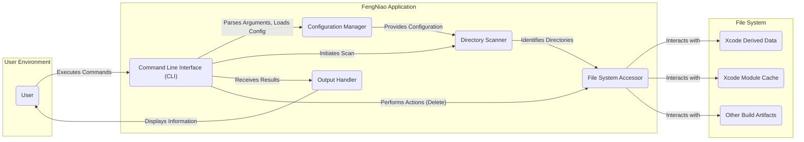
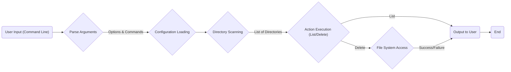

# Project Design Document: FengNiao - Xcode Derived Data Cleaner

**Version:** 1.1
**Date:** October 26, 2023
**Author:** AI Software Architect

## 1. Introduction

This document provides a detailed design overview of the FengNiao project, a command-line tool designed to clean up Xcode's derived data, module cache, and other build artifacts. This document serves as a foundation for understanding the system's architecture, components, and data flow, which will be crucial for subsequent threat modeling activities.

### 1.1. Purpose

The primary purpose of this document is to provide a comprehensive and clear description of the FengNiao application's design. This document will be a key input for threat modeling exercises, enabling the identification of potential security vulnerabilities and risks associated with the application's operation.

### 1.2. Scope

This document details the design of the FengNiao command-line interface (CLI) application as described in the provided GitHub repository: [https://github.com/onevcat/FengNiao](https://github.com/onevcat/FengNiao). It specifically focuses on the core functionalities of the tool, including:

*   Discovery and location of Xcode derived data directories.
*   Discovery and location of Xcode module cache directories.
*   Discovery and location of other user-specified build artifact directories.
*   Functionality to list identified directories for review.
*   Functionality to delete identified directories.
*   Handling and interpretation of user input via command-line arguments.
*   Providing feedback and status updates to the user.

### 1.3. Goals

The goals of this design document are to:

*   Clearly and concisely articulate the architecture and key components of the FengNiao application.
*   Describe the flow of data and interactions between different parts of the system.
*   Provide sufficient technical detail to enable security professionals to perform effective and targeted threat modeling.
*   Serve as a reliable reference point for future development, maintenance, and security audits.

## 2. System Overview

FengNiao is implemented as a command-line utility using the Swift programming language. Its primary function is to interact with the local file system to locate and manipulate directories and files associated with Xcode builds. The core logic involves identifying specific directories based on predefined patterns, user-provided options, and then performing actions (listing or deleting) on these directories.

### 2.1. High-Level Architecture

### 2.2. Components

*   **Command Line Interface (CLI):** This is the application's entry point. It is responsible for receiving and parsing command-line arguments provided by the user, initiating the appropriate actions based on the input.
*   **Configuration Manager:** This component handles the loading and management of configuration settings. These settings may originate from default values within the application or potentially from a user-defined configuration file. Configuration includes paths to be scanned and patterns for excluding specific directories.
*   **Directory Scanner:** This is the core logic component responsible for traversing the file system. It uses provided configuration to identify target directories based on predefined patterns and user-specified exclusions.
*   **File System Accessor:** This component provides an abstraction layer for all interactions with the underlying file system. It encapsulates operations such as listing directory contents, checking the existence of files or directories, and deleting directories. This abstraction helps in isolating file system operations and potentially allows for easier testing or future modifications.
*   **Output Handler:** This component manages the presentation of information and feedback to the user. This includes displaying lists of identified directories, confirmation prompts, and any error messages.

## 3. Detailed Design

### 3.1. Command Processing Flow

### 3.2. Component Interactions

*   **User Interaction:** The user interacts with FengNiao by executing commands in the command line, providing instructions and options.
    *   Example commands: `fengniao`, `fengniao --list`, `fengniao --delete`.
    *   Example options: `--path <directory_path>`, `--exclude <pattern>`.

*   **CLI and Configuration Manager Interaction:** The CLI component parses the arguments provided by the user and passes relevant information to the Configuration Manager. The Configuration Manager then loads the application's settings, potentially reading from a configuration file (if implemented) or using default values.

*   **Configuration Manager and Directory Scanner Interaction:** The Configuration Manager provides the Directory Scanner with the specific target paths to be scanned and any patterns that should be used to exclude directories from the scan.

*   **Directory Scanner and File System Accessor Interaction:** The Directory Scanner utilizes the File System Accessor to perform all interactions with the file system. It requests lists of directories and checks for specific patterns within directory names to identify the target directories for cleaning.

*   **File System Accessor and File System Interaction:** The File System Accessor directly interacts with the operating system's file system APIs to perform the necessary operations, such as listing the contents of directories and deleting files or directories.

*   **Directory Scanner and Output Handler Interaction:** Once the Directory Scanner has identified the target directories, it passes this list to the Output Handler.

*   **CLI and Output Handler Interaction:** The CLI component instructs the Output Handler on how to present the information to the user, such as displaying the list of directories to be cleaned or showing confirmation messages before proceeding with deletion.

### 3.3. Data Flow

*   **Input Data:** Command-line arguments provided by the user.
    *   Examples: Specific target paths for scanning, patterns for excluding directories, the desired action (list or delete).
*   **Configuration Data:** Settings loaded and managed by the Configuration Manager.
    *   Examples: Default paths to scan for derived data and module caches, default exclusion patterns for specific directories.
*   **File System Metadata:** Information about directories and files retrieved from the file system by the File System Accessor.
    *   Examples: Lists of directory names within specified paths, timestamps of directories.
*   **Identified Directories Data:** The list of directories identified by the Directory Scanner as matching the criteria for cleaning.
*   **Output Data:** Information presented to the user.
    *   Examples: A list of directories that will be cleaned, confirmation prompts before deletion, status and error messages indicating the success or failure of operations.

### 3.4. Key Functionalities

*   **Command Parsing:**  Likely implemented using a library such as `ArgumentParser` in Swift, this functionality is responsible for interpreting the command-line arguments and options provided by the user.
    *   Supported commands (inferred from options):  Implicitly "list" (default if no action specified) and "delete".
    *   Supported options:
        *   `--list` (or `-l`): Instructs FengNiao to list the directories that would be cleaned without actually deleting them.
        *   `--delete` (or `-d`): Instructs FengNiao to delete the identified directories.
        *   `--path <directory_path>` (or `-p <directory_path>`): Allows the user to specify a custom directory path to scan, overriding the default locations.
        *   `--exclude <pattern>` (or `-x <pattern>`): Allows the user to specify a pattern to exclude certain directories from the cleaning process.
        *   `--verbose` (or `-v`): Enables more detailed output, providing additional information about the scanning and cleaning process.
        *   `--yes` (or `-y`):  Skips the confirmation prompt before deleting directories. Use with extreme caution.

*   **Target Directory Identification:** This core functionality involves the following steps:
    *   Initialization with predefined default paths, such as `~/Library/Developer/Xcode/DerivedData`.
    *   Incorporation of any user-specified paths provided via the `--path` option.
    *   Scanning these paths for directories that match specific naming conventions and structures associated with Xcode derived data and module caches.
    *   Application of exclusion patterns provided via the `--exclude` option to filter out specific directories that should not be cleaned.

*   **File System Operations:**  This functionality relies on Swift's built-in file management APIs (within the `FileManager` class) to perform the necessary interactions with the file system:
    *   Listing the contents of directories to identify potential target directories.
    *   Checking for the existence of specific paths before attempting to operate on them.
    *   Recursively deleting directories and their contents when the `--delete` option is used.

*   **Configuration Handling:**  This functionality may involve:
    *   Loading default configuration values embedded within the application.
    *   Potentially reading configuration settings from a dedicated configuration file (e.g., a `.fengniao.yml` or similar file in the user's home directory).
    *   Allowing command-line options to override default or file-based configuration values.

*   **Output and Reporting:** This functionality provides feedback to the user through the command line interface:
    *   Displaying a list of the directories that have been identified for cleaning when the `--list` option is used.
    *   Presenting a confirmation prompt to the user before proceeding with the deletion of directories (unless the `--yes` option is used).
    *   Showing progress messages or completion summaries after the cleaning process.
    *   Reporting any errors encountered during the scanning or deletion process.

## 4. Security Considerations (For Threat Modeling)

This section outlines potential security considerations and areas of concern that should be thoroughly examined during the threat modeling process.

*   **Path Traversal Vulnerabilities:** Improper sanitization or validation of user-provided paths (via the `--path` option) or exclusion patterns (via the `--exclude` option) could allow an attacker to manipulate these inputs to target files or directories outside the intended scope, potentially leading to unauthorized access or deletion of critical data.
    *   **Threat Scenario:** An attacker provides a path like `/../../important_system_file` to the `--path` option, potentially leading to unintended operations on system files.
*   **Arbitrary Code Execution (Low Probability, High Impact):** While less likely for a tool with this specific functionality, vulnerabilities in the parsing of command-line arguments or the handling of external libraries could theoretically be exploited to execute arbitrary code.
    *   **Threat Scenario:** A crafted command-line argument exploits a vulnerability in the argument parsing library, allowing the execution of malicious commands.
*   **Denial of Service (DoS):** An attacker could provide a path to the `--path` option that points to a directory containing an extremely large number of files or subdirectories. This could cause FengNiao to consume excessive system resources (CPU, memory, disk I/O), potentially leading to a denial of service.
    *   **Threat Scenario:**  Providing the root directory `/` as the path to scan.
*   **Information Disclosure:** Verbose output (enabled by the `--verbose` option) or poorly formatted error messages might inadvertently reveal sensitive information about the file system structure, user environment, or internal workings of the application.
    *   **Threat Scenario:** Error messages reveal the exact path structure of internal Xcode directories.
*   **Privilege Escalation (Context Dependent):** If FengNiao is executed with elevated privileges (e.g., using `sudo`), any vulnerabilities could be exploited to gain unauthorized access to system resources. While FengNiao itself likely doesn't require elevated privileges for its intended use, users might mistakenly run it with `sudo`.
    *   **Threat Scenario:** A vulnerability allows an attacker to manipulate file permissions in a way that wouldn't be possible without elevated privileges.
*   **Race Conditions:** If FengNiao operates on directories that are being concurrently modified by other processes (e.g., Xcode building a project), race conditions could occur, leading to unexpected behavior, data corruption, or the deletion of files that should not have been targeted.
    *   **Threat Scenario:** FengNiao attempts to delete a directory while Xcode is actively writing to it.
*   **Dependency Vulnerabilities:** If FengNiao relies on external libraries or dependencies, vulnerabilities within those dependencies could introduce security risks. Regular updates and security audits of dependencies are crucial.
    *   **Threat Scenario:** A vulnerability in the `ArgumentParser` library is exploited.
*   **Configuration File Security (If Implemented):** If future versions implement configuration file support, the security of this file becomes important. Improper file permissions or insecure storage locations could allow attackers to modify the configuration and potentially compromise the tool's behavior.
    *   **Threat Scenario:** An attacker modifies the configuration file to include malicious exclusion patterns or target sensitive directories.
*   **Unintended Data Loss:** Bugs in the logic for identifying and deleting directories could lead to the accidental deletion of important files or directories that were not intended to be targeted. The `--yes` option significantly increases the risk of unintended data loss if used without careful consideration.
    *   **Threat Scenario:** A flaw in the directory scanning logic causes FengNiao to incorrectly identify and delete essential project files.

## 5. Deployment

FengNiao is typically deployed as a standalone, self-contained command-line executable.

*   **Installation Methods:** Users commonly install FengNiao using package managers like `brew` (if a formula is available) or by downloading a pre-built binary from the project's releases page.
*   **Execution Environment:** FengNiao is executed directly from the user's command-line interface.
*   **Runtime Dependencies:** The primary runtime dependency is the Swift standard library and any other libraries statically linked into the executable.

## 6. Future Considerations

*   **Configuration File Support:** Implementing support for a configuration file (e.g., in YAML or JSON format) would provide users with a more persistent and manageable way to customize default paths, exclusion patterns, and other settings.
*   **More Granular Cleaning Options:** Expanding the tool's functionality to allow users to target specific types of derived data or module cache components for cleaning, providing more fine-grained control.
*   **Graphical User Interface (GUI) (Optional):** While currently a CLI tool, a future version could potentially include a graphical user interface to make it more accessible and user-friendly for individuals less comfortable with the command line.
*   **Enhanced Error Handling and Logging:** Implementing more robust error handling and logging mechanisms would aid in debugging and troubleshooting issues, as well as potentially providing valuable information for security auditing.

This document provides an improved and more detailed design overview of the FengNiao project, with a strong focus on aspects relevant to security threat modeling. The information presented here should enable security professionals to conduct a thorough analysis of the application and identify potential vulnerabilities and risks.