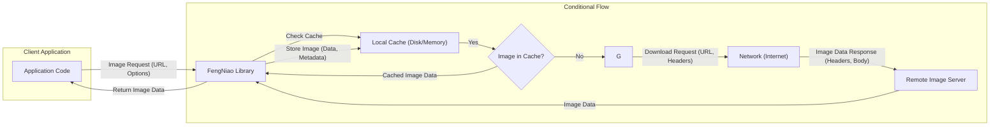
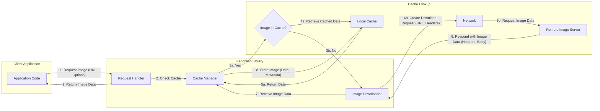

# Project Design Document: FengNiao Image Downloader Library

**Version:** 1.1
**Author:** Gemini (AI Language Model)
**Date:** October 26, 2023

## 1. Introduction

This document provides an enhanced design overview of the FengNiao image downloader library, as found in the GitHub repository [https://github.com/onevcat/fengniao](https://github.com/onevcat/fengniao). Building upon the initial design, this version aims to provide a more detailed and nuanced understanding of the library's architecture, components, and data flow, specifically tailored for effective threat modeling. This document focuses on the core functionalities and interactions within the library, highlighting potential security implications.

## 2. Goals and Objectives

The primary goals of the FengNiao library are to:

*   Provide an efficient and reliable mechanism for downloading images from remote URLs.
*   Implement a robust caching strategy to minimize redundant downloads, conserve bandwidth, and improve application performance.
*   Offer a flexible and configurable interface for customizing download and caching behavior to meet diverse application needs.
*   Ensure seamless integration into Swift-based applications with a clean and intuitive API.

This design document aims to meticulously capture the key elements of the library's design, providing the necessary context and detail to enable a comprehensive and insightful threat modeling exercise.

## 3. System Architecture

The FengNiao library can be conceptually divided into several interconnected components, each with specific responsibilities in the image downloading and caching process.

### 3.1 High-Level Architecture

### 3.2 Component Description

*   **Client Application:** The integrating application that utilizes the FengNiao library to manage the retrieval and display of remote images. It initiates image download requests with specific URLs and optional configurations.
    *   **Security Relevance:** The application's security posture can influence how securely FengNiao is used. For instance, if the application doesn't enforce HTTPS, it might inadvertently use FengNiao over insecure connections.
*   **FengNiao Library:** The central component responsible for orchestrating image downloads and caching. It internally manages various modules to handle different aspects of the process.
    *   **Image Downloader:**  This module is responsible for the actual fetching of image data from remote URLs. It handles:
        *   Establishing network connections using protocols like HTTP/HTTPS.
        *   Constructing and sending requests, including headers.
        *   Receiving and processing responses, including status codes and headers.
        *   Handling potential network errors and timeouts.
        *   **Security Relevance:** Vulnerabilities in this component could lead to bypassing security protocols (e.g., ignoring certificate errors), exposing sensitive information through insecure connections, or being susceptible to injection attacks if request parameters are not properly handled.
    *   **Cache Manager:**  Manages the local storage of downloaded images to optimize performance and reduce bandwidth usage. It includes functionalities for:
        *   Checking if an image corresponding to a given URL exists in the cache.
        *   Retrieving images from the cache (both memory and disk).
        *   Storing newly downloaded images in the cache, along with relevant metadata (e.g., expiration dates, headers).
        *   Implementing cache eviction policies to manage storage space.
        *   **Security Relevance:**  A poorly implemented cache manager can be vulnerable to cache poisoning attacks, where malicious content is stored in the cache and served to the application. Insecure storage of cached data could also lead to information disclosure if the device is compromised.
    *   **Image Processor (Potentially):** While not explicitly detailed in the core repository description, a common feature in image loading libraries is image processing. This module might handle:
        *   Decoding image data from various formats (e.g., JPEG, PNG).
        *   Performing transformations like resizing, cropping, or applying filters.
        *   **Security Relevance:** Vulnerabilities in image decoding libraries can lead to crashes or arbitrary code execution if malformed image data is processed.
    *   **Request Manager/Queue:**  Manages the execution of image download requests, ensuring efficient resource utilization and preventing the application or network from being overwhelmed. This involves:
        *   Queuing incoming download requests.
        *   Limiting the number of concurrent downloads.
        *   Prioritizing requests based on certain criteria.
        *   **Security Relevance:**  Improper request management could be exploited for denial-of-service attacks by flooding the library with excessive requests.
    *   **Configuration Manager:**  Allows the client application to configure various aspects of the library's behavior. This might include settings for:
        *   Cache policies (e.g., size limits, expiration times).
        *   Timeout values for network requests.
        *   Custom network configurations (e.g., proxies).
        *   **Security Relevance:**  Insecure default configurations or insufficient validation of configuration parameters could weaken the library's security.
*   **Network (Internet):** The communication channel facilitating the transfer of image data between the client device and remote image servers.
    *   **Security Relevance:** This is the primary attack vector for man-in-the-middle attacks if communication is not properly secured (e.g., using HTTPS).
*   **Remote Image Server:** The server hosting the images requested by the client application.
    *   **Security Relevance:** While not directly part of FengNiao, the security of the remote server is crucial. Compromised servers could serve malicious images.
*   **Local Cache (Disk/Memory):** The storage location on the client device where downloaded images are temporarily stored.
    *   **Security Relevance:** The security of the local cache depends on the device's security. Sensitive information should not be stored unencrypted in the cache.

### 3.3 Data Flow

The detailed data flow for an image request using FengNiao involves several steps and conditional logic:

1. The **Client Application** initiates an image download request by calling a method in the **FengNiao Library**, providing the image **URL** and potentially other **Options** (e.g., cache policy).
2. The **FengNiao Library's Request Handler** receives the request and consults the **Cache Manager**.
3. The **Cache Manager** checks the **Local Cache** (both memory and disk) to determine if the image corresponding to the provided URL exists.
    *   **If the image is found in the cache:**
        *   The **Cache Manager** retrieves the cached image data.
        *   The **Cache Manager** returns the cached image data to the **FengNiao Library**.
        *   The **FengNiao Library** returns the image data to the **Client Application**.
    *   **If the image is not found in the cache:**
        *   The **FengNiao Library's Image Downloader** prepares a download request.
        *   The **Image Downloader** sends a **Download Request** to the **Remote Image Server** over the **Network**, including the URL and potentially **Headers** (e.g., user-agent).
        *   The **Remote Image Server** processes the request and sends an **Image Data Response** back to the **Image Downloader**, including **Headers** (e.g., content-type, cache-control) and the **Body** containing the image data.
        *   The **Image Downloader** receives the **Image Data**.
        *   The **FengNiao Library's Cache Manager** stores the downloaded **Image Data** in the **Local Cache**, potentially along with **Metadata** extracted from the response headers.
        *   The **FengNiao Library** returns the downloaded **Image Data** to the **Client Application**.
4. (Potentially) If image processing is involved, the **Image Processor** might process the image data before it's returned to the application.

## 4. Technology Stack

The FengNiao library likely utilizes the following technologies:

*   **Swift:** The primary programming language for implementation, ensuring type safety and modern language features.
*   **Foundation Framework (URLSession):**  Crucial for handling network operations, including making HTTP/HTTPS requests, managing sessions, and handling authentication.
*   **Grand Central Dispatch (GCD):**  Likely employed for managing asynchronous operations, such as network requests and background caching tasks, ensuring responsiveness.
*   **Core Graphics/ImageIO:**  Potentially used for decoding and encoding image data in various formats, as well as for basic image manipulation if that functionality is included.
*   **Disk I/O APIs:**  For managing persistent storage of cached images on the device's file system.

## 5. Deployment Model

The FengNiao library is designed to be integrated as a dependency within a client application. This typically involves:

*   **Package Managers (e.g., Swift Package Manager, CocoaPods, Carthage):** Used to manage the library's integration into the application project.
*   **Embedded Framework:** The library is compiled and linked directly into the application's executable.
*   **Runtime Execution:** The library's code runs within the application's process, utilizing the device's resources (network, storage, memory).

## 6. Security Considerations (For Threat Modeling)

This section expands on the initial security considerations, providing more specific examples and focusing on potential threats and vulnerabilities relevant for threat modeling:

*   **Man-in-the-Middle (MITM) Attacks:**
    *   **Threat:** An attacker intercepts communication between the application and the remote image server, potentially eavesdropping on the image data or injecting malicious content.
    *   **Vulnerability:** If the application or FengNiao is not configured to enforce HTTPS, communication occurs over unencrypted HTTP.
    *   **Mitigation:** Ensure HTTPS is used for all image URLs. Implement certificate pinning for enhanced security.
*   **Cache Poisoning:**
    *   **Threat:** An attacker manipulates the cache to serve malicious or incorrect images to the application, potentially leading to misinformation, UI manipulation, or exploitation of vulnerabilities in image processing.
    *   **Vulnerabilities:**
        *   **HTTP Response Manipulation:** If network communication is compromised, an attacker could inject malicious responses that FengNiao caches.
        *   **Lack of Integrity Checks:** If FengNiao doesn't verify the integrity of cached images (e.g., using hashes), poisoned data can persist undetected.
        *   **Insecure Cache Storage:** If the local cache storage is not properly protected, an attacker with access to the device's file system could modify cached images.
    *   **Mitigation:** Enforce HTTPS, implement integrity checks for cached data, secure local cache storage with appropriate permissions. Consider using cache-control headers effectively.
*   **Denial of Service (DoS):**
    *   **Threat:** An attacker attempts to overwhelm the library or the application by sending a large number of image requests or requests for very large images, consuming excessive resources (network bandwidth, memory, CPU).
    *   **Vulnerabilities:**
        *   **Lack of Request Rate Limiting:** If FengNiao doesn't implement mechanisms to limit the rate of incoming requests.
        *   **Inefficient Resource Management:**  If the library doesn't handle large images or a high volume of requests efficiently, it can lead to resource exhaustion.
    *   **Mitigation:** Implement request queuing and rate limiting, optimize resource usage, consider timeouts for network requests.
*   **Data Exfiltration (Cached Data):**
    *   **Threat:** If the device is compromised, an attacker could gain access to the local cache and potentially exfiltrate sensitive image data.
    *   **Vulnerabilities:**
        *   **Unencrypted Cache Storage:** If cached images are stored without encryption.
        *   **Insufficient File System Permissions:** If the cache directory has overly permissive access rights.
    *   **Mitigation:** Encrypt sensitive cached data, set appropriate file system permissions for the cache directory.
*   **Bypass of Security Measures:**
    *   **Threat:** Attackers might find ways to circumvent intended security features or configurations.
    *   **Vulnerabilities:**
        *   **Configuration Errors:** Incorrectly configured settings that weaken security (e.g., disabling certificate validation).
        *   **Logic Errors:** Flaws in the library's code that allow bypassing security checks.
    *   **Mitigation:** Implement secure default configurations, provide clear documentation on security settings, conduct thorough code reviews and security testing.
*   **Dependency Vulnerabilities:**
    *   **Threat:** If FengNiao relies on other libraries with known vulnerabilities, those vulnerabilities could be exploited through FengNiao.
    *   **Vulnerability:** Using outdated or vulnerable versions of dependencies.
    *   **Mitigation:** Regularly update dependencies and monitor for security advisories.
*   **Insecure Deserialization (If applicable):**
    *   **Threat:** If the caching mechanism involves serializing and deserializing objects, vulnerabilities related to insecure deserialization could allow attackers to execute arbitrary code.
    *   **Vulnerability:** Using insecure deserialization methods on untrusted data.
    *   **Mitigation:** Avoid deserializing untrusted data, use secure serialization methods.
*   **Image Processing Vulnerabilities:**
    *   **Threat:** Processing maliciously crafted images could lead to crashes, memory corruption, or even arbitrary code execution due to vulnerabilities in the underlying image decoding libraries.
    *   **Vulnerability:** Using vulnerable image decoding libraries or not properly validating image data before processing.
    *   **Mitigation:** Use up-to-date and well-vetted image processing libraries, implement input validation for image data.

## 7. Future Considerations

Future enhancements to the FengNiao library could introduce new security considerations:

*   **Support for new image formats:**  Requires careful evaluation of the security of the corresponding decoding libraries.
*   **Advanced caching strategies (e.g., CDN integration):**  Introduces complexities related to CDN security and potential vulnerabilities in CDN interactions.
*   **More sophisticated image processing:**  Increases the attack surface related to image processing vulnerabilities.

## Appendix A: Glossary

*   **Remote Image Server:** The web server hosting the images being downloaded.
*   **Client Application:** The application integrating and using the FengNiao library.
*   **Cache:** A temporary storage location for downloaded images to improve performance.
*   **URL:** Uniform Resource Locator, the address of a resource on the internet.
*   **HTTPS:** Hypertext Transfer Protocol Secure, a secure communication protocol using encryption.
*   **HTTP:** Hypertext Transfer Protocol, the foundation of data communication on the web.
*   **MITM Attack:** Man-in-the-Middle attack, where an attacker intercepts communication between two parties.
*   **Cache Poisoning:**  An attack where malicious content is inserted into a cache.
*   **DoS Attack:** Denial of Service attack, aimed at overwhelming a system and making it unavailable.
*   **CDN:** Content Delivery Network, a distributed network of servers used to deliver content efficiently.
