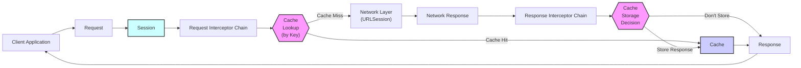
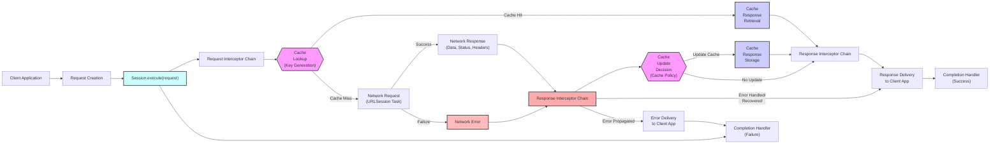
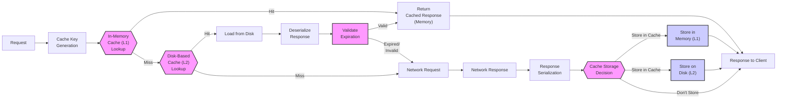

# Project Design Document: FengNiao - Lightweight Network Utility Library

**Version:** 1.1
**Date:** October 27, 2023
**Author:** Gemini (AI Expert)
**Project Repository:** [https://github.com/onevcat/fengniao](https://github.com/onevcat/fengniao)

## 1. Introduction

### 1.1 Project Overview

FengNiao is envisioned as a streamlined, cross-platform network utility library developed in Swift. Its primary objective is to simplify and enhance network interactions within Swift applications across diverse platforms, including iOS, macOS, watchOS, tvOS, Linux, and potentially server-side Swift environments. The library is designed with a focus on providing a clear and efficient Application Programming Interface (API) for executing network requests, managing responses, implementing caching strategies, and facilitating network traffic interception for purposes such as logging, debugging, or request/response modification.

### 1.2 Project Goals

The key objectives for the FengNiao project are:

*   **Simplicity and Ease of Use:** To offer a straightforward and intuitive API for handling common network operations in Swift, reducing boilerplate code and complexity for developers.
*   **Cross-Platform Compatibility:** To ensure seamless operation across multiple platforms, minimizing the need for platform-specific network code and promoting code reusability.
*   **Efficient Caching:** To incorporate robust caching mechanisms to improve application performance by reducing network latency and bandwidth consumption, and to enhance offline capabilities.
*   **Extensibility and Customization:** To provide interception capabilities, allowing developers to customize and extend the library's behavior for logging, authentication, request manipulation, and response processing.
*   **Lightweight and Minimal Dependencies:** To maintain a small library footprint with minimal external dependencies, ensuring easy integration and reducing potential conflicts with other libraries.
*   **Security Best Practices:** To promote and facilitate secure network communication by default, incorporating security considerations throughout the design and implementation.

### 1.3 Target Audience

This design document is intended for the following audiences:

*   **Swift Developers:** Software engineers who will integrate and utilize FengNiao in their Swift-based application projects.
*   **Security Engineers:** Cybersecurity professionals responsible for conducting threat modelling, security assessments, and audits of systems that incorporate FengNiao.
*   **Project Stakeholders:** Individuals involved in the project's decision-making process, requiring a comprehensive understanding of FengNiao's architecture, design principles, and functionalities.
*   **Contributors:** Developers interested in contributing to the FengNiao project, needing a clear understanding of the project's design and direction.

## 2. Architecture Overview

FengNiao is structured around a modular architecture, composed of distinct yet interconnected components that collectively manage network communication. This modularity promotes maintainability, testability, and extensibility.

### 2.1 Core Components

*   **"Request"**:  A value object representing a network request. It encapsulates all the necessary details for initiating a network call, including the target URL, HTTP method, request headers, request body, timeout settings, cache policy, and other request-specific options.
*   **"Session"**: The central component responsible for managing the execution of network requests. It handles the lifecycle of requests, from creation to completion or cancellation. It interacts with the underlying networking layer (primarily `URLSession` in Swift), manages connection pooling for efficiency, and orchestrates request processing through interceptors and caching.
*   **"Cache"**:  A subsystem dedicated to caching network responses to improve performance and reduce network traffic. It stores responses based on request characteristics and retrieves them when appropriate, adhering to configured cache policies. The cache can utilize various storage strategies, including in-memory, disk-based persistence, or a hybrid approach.
*   **"Interceptor"**: A mechanism for intercepting and potentially modifying network requests before they are dispatched and network responses after they are received. Interceptors are designed to be modular and can be chained together to implement cross-cutting concerns such as logging, authentication, request/response transformation, error handling, and retry logic.
*   **"Task"**: Represents a single, active network operation. It manages the state and lifecycle of an individual request initiated by the "Session", providing control over execution, cancellation, and progress monitoring.

### 2.2 Component Interactions

The following diagram illustrates the interaction flow between the core components during a typical network request initiated by a client application:

**Flow Description:**

1.  The "Client Application" initiates a network operation by constructing a "Request" object, defining the specifics of the network call.
2.  The "Request" object is passed to the "Session" component to begin the request execution process.
3.  The "Session" first applies the registered "Request Interceptor Chain". Each interceptor in the chain has the opportunity to inspect and modify the outgoing request.
4.  After request interception, the "Session" queries the "Cache" subsystem. A "Cache Key" is generated from the "Request" to perform the lookup.
    *   **Cache Hit**: If a valid and fresh cached response is found corresponding to the "Cache Key", it is retrieved directly from the "Cache", bypassing the network request.
    *   **Cache Miss**: If no valid cached response is found, the request proceeds to the "Network Layer".
5.  The "Network Layer" (leveraging `URLSession`) executes the actual network request, sending it to the server and receiving a "Network Response".
6.  The "Network Response", containing data, status code, and headers, is then passed through the "Response Interceptor Chain". Response interceptors can process, modify, or log the incoming response.
7.  Following response interception, a "Cache Storage Decision" is made based on the request's cache policy and response headers.
    *   **Store Response**: If caching is permitted and the response is cacheable, the "Response" is stored in the "Cache" associated with the generated "Cache Key".
    *   **Don't Store**: If caching is not applicable or the response is not cacheable, the response is not stored in the cache.
8.  Finally, the "Response", whether retrieved from the cache or from the network (and potentially modified by interceptors), is delivered back to the "Client Application", completing the network operation.

## 3. Detailed Design

### 3.1 Request Handling

*   **"Request" Object Details**:
    *   **Properties**:
        *   `url`:  The target URL for the request, represented as a String or URL object for flexibility.
        *   `httpMethod`:  The HTTP method to be used for the request (e.g., "GET", "POST", "PUT", "DELETE", "PATCH"). Enforced to be a valid HTTP method.
        *   `headers`:  A dictionary of HTTP headers (String key-value pairs). Allows for customization of request headers.
        *   `body`:  The request body data, represented as `Data` or a `Stream` to handle various types of request payloads efficiently.
        *   `timeoutInterval`:  The request timeout interval, specified as a `TimeInterval` in seconds. Defines the maximum time to wait for a response.
        *   `cachePolicy`:  The caching policy for this specific request, using predefined enum values (e.g., `.useProtocolCachePolicy`, `.reloadIgnoringLocalCacheData`, `.returnCacheDataElseLoad`).
        *   `allowsCellularAccess`: A boolean flag indicating whether the request is allowed to use cellular network access.
        *   `customParameters`:  A dictionary to accommodate any additional, request-specific parameters or metadata that might be needed by interceptors or custom logic.
    *   **Creation**:
        *   "Request" objects are intended to be immutable after creation.
        *   Builder pattern or convenience initializers will be provided to facilitate easy and readable "Request" object construction for different HTTP methods and common use cases. For example, static factory methods like `Request.get(url:)`, `Request.post(url:body:)` could be provided.

*   **Request Execution Flow**:
    *   The `Session` component's `execute(request:)` method is the primary entry point for initiating network requests.
    *   Network operations are performed asynchronously using Swift Concurrency's `async/await` or Grand Central Dispatch (GCD) to prevent blocking the main application thread and maintain UI responsiveness.
    *   **Error Handling**:
        *   Comprehensive error handling is implemented to gracefully manage various failure scenarios:
            *   **Network Errors**: Handling connection failures, DNS resolution issues, timeouts, and network reachability problems.
            *   **HTTP Errors**: Processing HTTP status codes indicating errors (e.g., 4xx Client Errors, 5xx Server Errors).
            *   **Data Parsing Errors**: Managing errors during response data deserialization (e.g., JSON parsing failures).
        *   Error information will be encapsulated in a structured error type, providing details about the error source and nature for effective debugging and error reporting.
        *   Interceptors can be used to implement custom error handling and retry mechanisms based on specific error conditions.

### 3.2 Caching Mechanism

*   **"Cache" Storage Strategies**:
    *   **Multi-Level Cache**: Employs a layered caching approach for optimal performance:
        *   **In-Memory Cache (L1 Cache)**:  Utilizes a fast, in-memory data structure (e.g., `NSCache` or a Swift `Dictionary`) for frequently accessed responses, providing very low latency retrieval. Limited by available memory.
        *   **Disk-Based Cache (L2 Cache)**: Leverages persistent storage on disk (e.g., file system or a database) for larger datasets and to retain cached responses across application launches. Offers greater capacity but slower access compared to in-memory cache.
    *   **Customizable Storage**: The architecture should allow for the possibility of implementing custom cache storage backends, enabling developers to integrate with alternative caching solutions or cloud-based caching services if needed.
*   **"Cache Key" Generation**:
    *   Robust cache key generation is crucial for accurate cache lookups and avoiding collisions.
    *   Cache keys are generated based on:
        *   Request URL (absolute URL).
        *   HTTP Method (primarily for distinguishing GET requests from others if needed).
        *   Relevant Request Headers:  `Accept` header (to differentiate content types), `Authorization` header (for user-specific caching if applicable), and potentially other headers that significantly affect the response.
    *   A consistent and deterministic key generation algorithm will be used to ensure reliable cache operations.
*   **"Cache Policies" and Management**:
    *   **HTTP Cache Policy Adherence**: FengNiao will respect standard HTTP caching directives specified in response headers (`Cache-Control`, `Expires`, `ETag`, `Last-Modified`).
    *   **Configurable Cache Expiration**: Allows for setting default and request-specific cache expiration times.
    *   **Cache Validation**: Supports cache validation using `ETag` and `Last-Modified` headers to efficiently check if a cached response is still valid with the server, minimizing data transfer.
    *   **Cache Invalidation Strategies**:
        *   **Time-Based Invalidation**:  Responses expire after a defined time period.
        *   **Explicit Invalidation**: API to programmatically invalidate cached responses based on events or user actions.
        *   **LRU (Least Recently Used) Eviction**:  When the cache reaches its capacity, the least recently accessed cached responses are evicted to make space for new ones. Configurable cache size limits will be provided.
*   **Cache Security**:
    *   For disk-based caching, consider encrypting sensitive data at rest to protect confidentiality.
    *   Implement appropriate file system permissions or database access controls to restrict unauthorized access to the cache storage.

### 3.3 Interceptors

*   **"Interceptor" Protocol/Interface**:
    *   Defines a clear protocol or interface (`Interceptor` protocol in Swift) that all interceptors must conform to.
    *   The protocol will define methods for intercepting both requests and responses:
        *   `intercept(request: Request) async throws -> Request`: For request interception. Allows modifying the request before it's sent.
        *   `intercept(response: Response, for request: Request) async throws -> Response`: For response interception. Allows modifying the response or handling errors after receiving it.
    *   Interceptors are registered with the `Session` instance.
*   **"Interceptor Chain" Implementation**:
    *   Interceptors are organized and executed as a chain of responsibility.
    *   The `Session` maintains an ordered list of registered interceptors.
    *   When a request is executed, the "Request Interceptor Chain" is processed sequentially. Each interceptor in the chain is invoked to process the request.
    *   Similarly, after receiving a response, the "Response Interceptor Chain" is processed sequentially.
    *   The order of interceptors in the chain is configurable, allowing developers to control the sequence of interception logic.
*   **"Interceptor" Use Cases (Examples)**:
    *   **Request Logging Interceptor**: Logs request details (URL, headers, method) before sending.
    *   **Response Logging Interceptor**: Logs response details (status code, headers, response time, and potentially response body) after receiving.
    *   **Authentication Interceptor**: Adds authentication headers (e.g., "Authorization: Bearer <token>") to outgoing requests. Can handle token refresh if needed.
    *   **Request Transformation Interceptor**: Modifies request parameters or headers based on application logic or context.
    *   **Response Transformation Interceptor**: Parses and transforms response data into application-specific models or formats.
    *   **Error Handling/Retry Interceptor**: Implements custom error handling logic, such as retrying failed requests based on specific error codes or network conditions (e.g., exponential backoff retry).
    *   **Cache Control Interceptor**: Dynamically modifies cache policies based on request or response characteristics.

### 3.4 Session Management

*   **"Session" Configuration**:
    *   Provides a `SessionConfiguration` object to configure session-level settings.
    *   Configuration options include:
        *   `defaultHeaders`:  Default HTTP headers to be included in all requests made by the session.
        *   `timeoutInterval`: Default request timeout interval for the session.
        *   `cacheConfiguration`: Configuration for the caching subsystem (e.g., cache size limits, storage locations, cache policies).
        *   `securityConfiguration`: TLS/SSL settings, such as minimum TLS version, certificate pinning policies (if implemented).
        *   `proxyConfiguration`: Settings for using proxy servers for network requests.
        *   `interceptorChain`:  The ordered list of request and response interceptors to be applied to all requests in the session.
    *   Sessions can be created with different configurations to cater to various networking needs within an application (e.g., a session for authenticated requests, a session for public API calls).
*   **Connection Pooling and Reuse**:
    *   Leverages `URLSession`'s built-in connection pooling mechanisms for efficient reuse of network connections, reducing connection establishment overhead and improving performance.
*   **Session Lifecycle Management**:
    *   `Session` instances are typically created and managed by the application.
    *   Consider providing mechanisms for session persistence and sharing across different parts of the application if beneficial.
    *   Properly manage session resources and cleanup when sessions are no longer needed.
*   **Cookie Handling**:
    *   Leverage `URLSession`'s automatic cookie management capabilities to handle HTTP cookies for session persistence and state management.
    *   Potentially provide options to customize cookie storage and policies if advanced cookie handling is required.

## 4. Security Considerations

Security is paramount in FengNiao's design, especially given its role in handling network communication and potentially sensitive data.

### 4.1 Data in Transit Security

*   **HTTPS Enforcement by Default**: FengNiao strongly encourages and defaults to using HTTPS for all network requests. Documentation and examples will emphasize HTTPS usage.
*   **TLS/SSL Configuration and Best Practices**:
    *   Relies on `URLSession` for TLS/SSL implementation.
    *   Document best practices for configuring `URLSession` for secure TLS/SSL communication.
    *   Consider providing options in `securityConfiguration` to:
        *   Set minimum TLS version (e.g., TLS 1.2 or higher).
        *   Enable certificate pinning (for advanced security, to prevent Man-in-the-Middle attacks by validating server certificates against a pre-defined set of certificates).
        *   Control cipher suites (if necessary, for very specific security requirements).
    *   Warn against disabling TLS/SSL verification unless absolutely necessary and with clear security implications.
*   **Secure Protocol Selection**: Ensure that `URLSession` and FengNiao configurations prioritize secure network protocols and avoid older, vulnerable protocols (e.g., SSLv3, TLS 1.0, TLS 1.1).

### 4.2 Data at Rest Security (Caching)

*   **Encrypted Cache Storage (Sensitive Data)**:
    *   For disk-based caching, especially when caching potentially sensitive data, implement encryption of cached data at rest.
    *   Explore using platform-provided encryption mechanisms (e.g., iOS Data Protection API, macOS FileVault) or robust encryption libraries.
    *   Provide options to enable/disable cache encryption based on sensitivity of data being cached and performance considerations.
*   **Cache Access Control and Permissions**:
    *   Implement appropriate file system permissions or database access controls to restrict access to the cache storage location, preventing unauthorized reading or modification of cached data.
    *   Ensure that the cache storage location is within the application's sandbox and not accessible to other applications without proper authorization.
*   **Sensitive Data Handling and Cache Control**:
    *   Provide clear guidance and API options to prevent caching of highly sensitive data (e.g., passwords, API secrets, personal identifiable information - PII) when not absolutely necessary.
    *   Offer request-specific cache policies to disable caching for requests that handle sensitive information.
    *   Implement "no-store" cache directive support to explicitly prevent caching of responses containing sensitive data.
*   **Secure Cache Invalidation and Eviction**:
    *   Implement robust cache invalidation mechanisms to ensure that stale or sensitive cached data is removed promptly when it's no longer valid or relevant.
    *   Use secure cache eviction policies (e.g., LRU) to manage cache size and remove older data, reducing the window of exposure for potentially outdated information.

### 4.3 Input Validation and Sanitization

*   **Strict URL Validation**: Validate URLs provided in "Request" objects to prevent URL injection attacks and ensure they conform to expected formats. Sanitize URLs to remove potentially harmful characters or sequences.
*   **HTTP Header Validation and Sanitization**:
    *   Validate and sanitize HTTP headers to prevent header injection vulnerabilities.
    *   Enforce restrictions on allowed characters and header values to mitigate potential risks.
    *   Be cautious when allowing user-controlled headers, and sanitize them thoroughly.
*   **Request Body Handling Security**:
    *   Securely handle and process request bodies, especially when dealing with user-provided data or file uploads.
    *   Implement input validation and sanitization for request body data to prevent injection attacks (e.g., SQL injection, command injection if request body is processed server-side).
    *   Handle file uploads securely, validating file types, sizes, and content to prevent malicious file uploads.
*   **Response Data Validation**: Validate and sanitize response data received from the server to prevent vulnerabilities like Cross-Site Scripting (XSS) if response data is displayed in a web view or processed in a way that could lead to code execution.

### 4.4 Dependency Security

*   **Secure and Audited Dependencies**:
    *   Minimize external dependencies to reduce the attack surface.
    *   If dependencies are necessary, carefully select well-maintained, reputable, and security-audited libraries.
    *   Regularly audit and update dependencies to address known vulnerabilities. Use dependency scanning tools to identify potential security issues in dependencies.
*   **Underlying Networking Layer Security**:
    *   Rely on the security features and updates provided by the underlying platform's networking libraries (`URLSession`).
    *   Stay informed about security advisories and best practices related to `URLSession` and the platform's networking stack.

### 4.5 General Security Practices

*   **Principle of Least Privilege**: Design components and APIs with the principle of least privilege in mind. Grant only necessary permissions and access rights to components and users.
*   **Secure Error Handling and Logging**:
    *   Implement secure error handling practices. Avoid exposing sensitive information in error messages or logs that could be exploited by attackers.
    *   Sanitize and redact sensitive data from logs.
    *   Use structured logging to facilitate security monitoring and analysis.
*   **Regular Security Audits and Penetration Testing**:
    *   Conduct regular security audits and code reviews to identify potential vulnerabilities in FengNiao's code and design.
    *   Perform penetration testing to simulate real-world attacks and assess the library's security posture.
    *   Address identified vulnerabilities promptly and release security updates.
*   **Secure Development Lifecycle (SDL)**: Integrate security considerations throughout the entire software development lifecycle, from design to implementation, testing, and deployment.
*   **Security Awareness Training**: Ensure that developers contributing to FengNiao are trained in secure coding practices and are aware of common web and network security vulnerabilities.

## 5. Deployment Architecture

FengNiao is intended to be deployed as a library directly integrated into Swift applications.

### 5.1 Library Integration Methods

*   **Swift Package Manager (SPM) - Primary**: FengNiao will be primarily distributed as a Swift Package, leveraging SPM for dependency management and seamless integration into Swift projects. SPM is the recommended and preferred method.
*   **CocoaPods - Secondary**:  Optionally, provide CocoaPods support for projects that still rely on CocoaPods for dependency management.
*   **Carthage - Tertiary**: Consider Carthage support for projects using Carthage, if feasible and maintainable.
*   **Binary Distribution (XCFramework)**: Potentially offer a pre-built XCFramework for easier integration in certain scenarios, especially for projects with complex build setups or for distribution without source code.
*   **Platform Compatibility**: Ensure seamless integration and operation across all targeted platforms: iOS, macOS, watchOS, tvOS, Linux, and potentially server-side Swift environments.

### 5.2 Usage within Applications

*   **Direct Library Linking**: Developers integrate FengNiao into their Swift applications by declaring it as a dependency in their `Package.swift` (for SPM), `Podfile` (for CocoaPods), or `Cartfile` (for Carthage).
*   **API Utilization**: Applications utilize FengNiao's API (primarily the `Session` component) to create and execute network requests. They can leverage FengNiao's caching, interception, and configuration features to customize network behavior.
*   **In-Process Operation**: FengNiao operates entirely within the application's process. It does not require any separate deployment, server-side components, or external infrastructure. It's a self-contained library.

## 6. Technology Stack

*   **Primary Programming Language**: Swift (idiomatic Swift code, leveraging modern Swift features).
*   **Core Networking Library**: `URLSession` (Apple's foundation networking framework) - for underlying network operations.
*   **Concurrency Model**: Swift Concurrency (`async/await`) - for asynchronous operations and improved code readability and maintainability. GCD (Grand Central Dispatch) might be used for specific low-level tasks if needed, but `async/await` will be preferred for high-level asynchronous workflows.
*   **Caching Implementation**:
    *   In-Memory Cache: `NSCache` or Swift `Dictionary` for L1 cache.
    *   Disk-Based Cache: File system (using `FileManager`) or potentially a lightweight database (like SQLite via a Swift wrapper) for L2 cache. Custom cache implementations might be considered for specific needs.
*   **Build System and Dependency Management**:
    *   Swift Package Manager (SPM) - primary build and dependency management tool.
    *   CocoaPods - secondary dependency management support.
    *   Carthage - tertiary dependency management support (if feasible).
*   **Testing Framework**:  XCTest - for unit and integration testing of FengNiao components.

## 7. Diagrams

### 7.1 Request Flow Diagram (Detailed with Error Handling)

### 7.2 Caching Subsystem Diagram (Detailed Storage Layers)

This revised design document provides a more detailed and enhanced description of the FengNiao library, incorporating greater depth in security considerations, clarifying component interactions, and refining the overall architecture. It aims to serve as a robust foundation for threat modelling and further development of the project.