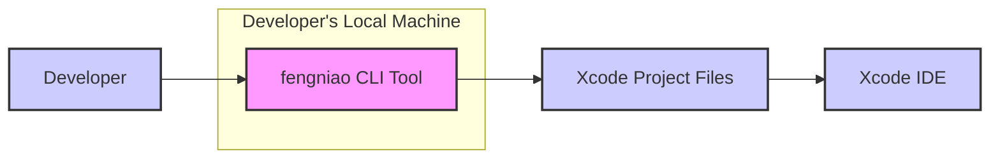
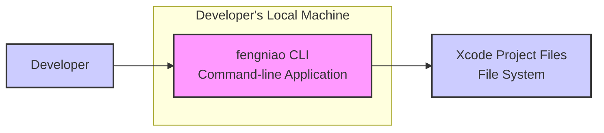
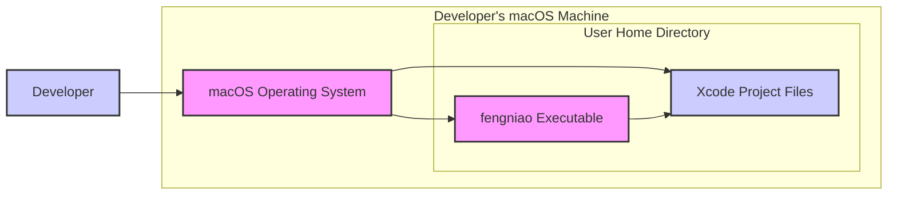
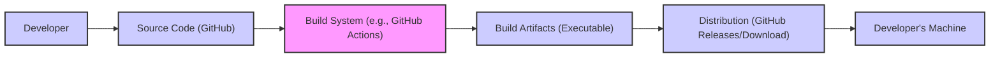

# BUSINESS POSTURE

This project, named fengniao, is a command-line tool designed to expedite the process of modifying Xcode project settings. The primary business priority it addresses is enhancing developer productivity and efficiency in managing Xcode projects.

- Business Priorities:
  - Increase developer productivity by automating repetitive Xcode project configuration tasks.
  - Reduce manual errors associated with modifying Xcode project settings.
  - Streamline the development workflow, allowing developers to focus on core development activities rather than project setup.

- Business Goals:
  - Provide a user-friendly command-line interface for common Xcode project setting modifications.
  - Minimize the time spent on project configuration, leading to faster iteration cycles.
  - Improve the consistency and accuracy of Xcode project settings across development teams.

- Business Risks:
  - Incorrect project settings application leading to build failures, unexpected application behavior, or issues during app submission to the App Store.
  - Potential for accidental or malicious modification of critical project settings, causing development delays or security vulnerabilities.
  - Risk of tool malfunction or bugs that could corrupt Xcode project files, leading to data loss or project instability.
  - Supply chain risks if dependencies of the tool are compromised, potentially introducing malicious functionality.

# SECURITY POSTURE

Currently, based on the nature of a command-line tool and the provided repository, there are likely limited explicit security controls implemented within fengniao itself, relying heavily on the security posture of the user's development environment.

- Existing Security Controls:
  - security control: User access control provided by the operating system, governing who can execute the tool and access Xcode project files. Implemented by: Operating System.
  - security control: Code hosted on GitHub, benefiting from GitHub's security measures for repository integrity and access control. Implemented by: GitHub.

- Accepted Risks:
  - accepted risk: Reliance on the user's local machine security posture. It is assumed that developers using the tool have secure development environments.
  - accepted risk: Trust in the source of the tool (GitHub repository and maintainer). Users implicitly trust that the provided code is not malicious.
  - accepted risk: Potential for user error in specifying project settings through the command-line interface.

- Recommended Security Controls:
  - recommended security control: Implement input validation and sanitization for all command-line arguments and project settings to prevent injection attacks or unexpected behavior.
  - recommended security control: Code signing of the compiled binary to ensure the integrity and authenticity of the tool, allowing users to verify they are running a genuine version.
  - recommended security control: Implement basic error handling and logging to provide informative feedback to users and aid in debugging potential issues, including security-related problems.
  - recommended security control: Conduct static application security testing (SAST) during the build process to identify potential security vulnerabilities in the codebase.
  - recommended security control: Dependency scanning to identify and manage known vulnerabilities in third-party libraries used by the tool.

- Security Requirements:
  - Authentication: Not directly applicable for a command-line tool executed locally. Authentication is implicitly handled by the user's operating system login.
  - Authorization: Authorization is managed by the file system permissions of the operating system. The tool operates under the permissions of the user executing it. Ensure the tool operates with the least privileges necessary.
  - Input Validation: Robust input validation is crucial. All inputs from the command line, especially those modifying project settings, must be validated to prevent injection attacks and ensure data integrity. Validate data type, format, and allowed values for each setting.
  - Cryptography: Cryptography is likely not a primary requirement for this tool, as it primarily manipulates Xcode project settings. However, if future features involve handling sensitive data (e.g., API keys in project files - which is discouraged), appropriate encryption mechanisms should be considered. For now, focus on secure storage and handling of project files by relying on operating system security features.

# DESIGN

fengniao is designed as a command-line interface (CLI) tool that developers can use to modify Xcode project settings. The tool interacts directly with Xcode project files on the user's local file system.

## C4 CONTEXT

- Context Diagram Elements:
  - - Name: "fengniao CLI Tool"
    - Type: Software System
    - Description: A command-line tool for switching Xcode project settings fast. It is executed by developers on their local machines to modify Xcode project files.
    - Responsibilities:
      - Parse command-line arguments provided by the developer.
      - Read and modify Xcode project files (.xcodeproj, project.pbxproj).
      - Apply changes to specified project settings based on developer input.
      - Provide feedback to the developer on the outcome of the operations.
    - Security controls:
      - security control: Input validation of command-line arguments. Implemented by: "fengniao CLI Tool".
      - security control: Operates under the user's file system permissions. Implemented by: Operating System.

  - - Name: "Developer"
    - Type: Person
    - Description: Software developers who use fengniao to manage Xcode project settings.
    - Responsibilities:
      - Execute the fengniao CLI tool with appropriate commands and arguments.
      - Provide correct project paths and desired setting modifications.
      - Review and verify the changes applied by fengniao.
    - Security controls:
      - security control: Responsible for maintaining the security of their local development environment. Implemented by: Developer.
      - security control: Responsible for using the tool correctly and understanding its impact on Xcode projects. Implemented by: Developer.

  - - Name: "Xcode Project Files"
    - Type: Data Store
    - Description: Files that store Xcode project configurations, including settings like bundle identifiers, version numbers, build settings, and more. Typically represented by `.xcodeproj` directories and `project.pbxproj` files.
    - Responsibilities:
      - Persistently store Xcode project settings.
      - Be read and modified by tools like fengniao and Xcode IDE.
      - Define the configuration of iOS, macOS, and other Apple platform applications.
    - Security controls:
      - security control: Access control managed by the operating system's file system permissions. Implemented by: Operating System.
      - security control: Integrity should be maintained to ensure project stability and build correctness. Implemented by: Developer, "fengniao CLI Tool", Xcode IDE.

  - - Name: "Xcode IDE"
    - Type: Software System
    - Description: Apple's Integrated Development Environment (IDE) used by developers to build, debug, and manage Xcode projects. Xcode IDE also reads and writes Xcode project files.
    - Responsibilities:
      - Provide a graphical interface for developers to interact with Xcode projects.
      - Build, run, and debug applications based on project settings.
      - Read and write Xcode project files.
      - Provide project management and code editing features.
    - Security controls:
      - security control: Xcode IDE itself has its own security features and update mechanisms. Implemented by: Apple.
      - security control: Relies on the operating system's security for file access and execution. Implemented by: Operating System.

## C4 CONTAINER

For this project, the container diagram is essentially an extension of the context diagram, as fengniao is a single, self-contained command-line application.

- Container Diagram Elements:
  - - Name: "fengniao CLI"
    - Type: Command-line Application
    - Description: A single executable command-line application written in Go (inferred from repository structure). It is responsible for all functionalities of fengniao.
    - Responsibilities:
      - Command-line argument parsing using libraries like `flag` or `cobra` (Go ecosystem).
      - Xcode project file parsing and modification, likely using libraries for plist or project file manipulation.
      - Logic for applying project setting changes based on user commands.
      - Outputting results and errors to the command line.
    - Security controls:
      - security control: Input validation within the application code. Implemented by: "fengniao CLI".
      - security control: Error handling and logging within the application. Implemented by: "fengniao CLI".
      - security control: Code signing of the binary (recommended). Implemented during Build process.

  - - Name: "Xcode Project Files"
    - Type: File System
    - Description: Represents the file system where Xcode project files are stored. fengniao interacts directly with these files on disk.
    - Responsibilities:
      - Persistent storage of Xcode project data.
      - Providing file system access to applications like fengniao.
    - Security controls:
      - security control: File system permissions managed by the operating system. Implemented by: Operating System.
      - security control: Disk encryption (if enabled by the user/organization). Implemented by: Operating System.

## DEPLOYMENT

fengniao is deployed as a standalone command-line executable that developers download and run on their local macOS machines. There isn't a typical server-side deployment for this type of tool.

- Deployment Architecture: Local execution on developer machines.

- Deployment Diagram Elements:
  - - Name: "macOS Operating System"
    - Type: Operating System
    - Description: The operating system on which developers run fengniao. It provides the environment for executing the tool and accessing the file system.
    - Responsibilities:
      - Provide a runtime environment for applications.
      - Manage file system access and permissions.
      - Provide user authentication and authorization.
    - Security controls:
      - security control: Operating system level security features (firewall, user access control, etc.). Implemented by: macOS.
      - security control: Software update mechanisms for security patches. Implemented by: macOS.

  - - Name: "fengniao Executable"
    - Type: Executable File
    - Description: The compiled binary of the fengniao command-line tool, downloaded and stored in a directory accessible to the developer (typically within their home directory or a designated tools directory).
    - Responsibilities:
      - Execute the fengniao application logic when run by the developer.
      - Interact with the operating system and file system.
    - Security controls:
      - security control: Code signing to verify origin and integrity (recommended). Implemented during Build process.
      - security control: File system permissions to control access to the executable. Implemented by: macOS.

  - - Name: "Xcode Project Files"
    - Type: Files on Disk
    - Description: Xcode project files residing on the developer's local file system.
    - Responsibilities:
      - Store Xcode project configuration data.
      - Be accessed and modified by fengniao and Xcode IDE.
    - Security controls:
      - security control: File system permissions to control access. Implemented by: macOS.
      - security control: Disk encryption (optional, managed by the user/OS). Implemented by: macOS (if enabled).

## BUILD

The build process for fengniao likely involves compiling the Go source code into a standalone executable. A secure build process is crucial for ensuring the integrity and trustworthiness of the tool.

- Build Process Elements:
  - - Name: "Developer"
    - Type: Person
    - Description: Developers who write and maintain the fengniao source code and commit it to the GitHub repository.
    - Responsibilities:
      - Write secure and functional code.
      - Review code changes for security vulnerabilities.
      - Manage dependencies and ensure they are up-to-date and secure.
    - Security controls:
      - security control: Code review process to identify potential vulnerabilities. Implemented by: Development Team.
      - security control: Secure coding practices. Implemented by: Development Team.

  - - Name: "Source Code (GitHub)"
    - Type: Code Repository
    - Description: The GitHub repository hosting the fengniao source code.
    - Responsibilities:
      - Store and version control the source code.
      - Provide access control to the codebase.
      - Track changes and facilitate collaboration.
    - Security controls:
      - security control: GitHub's security features for repository protection (access control, branch protection, etc.). Implemented by: GitHub.
      - security control: Vulnerability scanning of dependencies (GitHub Dependabot). Implemented by: GitHub.

  - - Name: "Build System (e.g., GitHub Actions)"
    - Type: CI/CD System
    - Description: An automated build system, potentially GitHub Actions, used to compile the source code, run tests, and create build artifacts.
    - Responsibilities:
      - Automate the build process.
      - Compile the Go source code.
      - Run unit and integration tests.
      - Perform security checks (SAST, dependency scanning).
      - Sign the build artifacts.
      - Publish build artifacts.
    - Security controls:
      - security control: Secure build environment (isolated and hardened build agents). Implemented by: CI/CD System (e.g., GitHub Actions).
      - security control: Automated security scans (SAST, dependency scanning) integrated into the build pipeline. Implemented by: CI/CD System and Security Tools.
      - security control: Code signing of the executable during the build process. Implemented by: Build System.

  - - Name: "Build Artifacts (Executable)"
    - Type: Executable File
    - Description: The compiled fengniao executable, ready for distribution.
    - Responsibilities:
      - Contain the compiled application code.
      - Be distributed to users.
    - Security controls:
      - security control: Code signing to ensure integrity and authenticity. Implemented during Build process.
      - security control: Stored securely during and after the build process. Implemented by: Build System and Distribution Platform.

  - - Name: "Distribution (GitHub Releases/Download)"
    - Type: Distribution Platform
    - Description: The platform used to distribute the fengniao executable to users, likely GitHub Releases or a similar download mechanism.
    - Responsibilities:
      - Host the build artifacts for download.
      - Provide a secure download mechanism (HTTPS).
      - Potentially provide checksums or signatures for verification.
    - Security controls:
      - security control: HTTPS for secure download. Implemented by: Distribution Platform (e.g., GitHub).
      - security control: Checksums or signatures for artifact verification. Implemented by: Distribution Platform and Build System.

  - - Name: "Developer's Machine"
    - Type: End-user Environment
    - Description: The developer's local machine where they download and execute the fengniao tool.
    - Responsibilities:
      - Download and verify the integrity of the tool.
      - Execute the tool in a secure manner.
    - Security controls:
      - security control: User responsibility to download from trusted sources and verify signatures/checksums. Implemented by: Developer.
      - security control: Local machine security posture. Implemented by: Developer and Operating System.

# RISK ASSESSMENT

- Critical Business Processes:
  - Software Development Lifecycle, specifically the Xcode project configuration phase.
  - Maintaining consistency and accuracy in Xcode project settings across development teams and projects.

- Data to Protect:
  - Xcode Project Files (.xcodeproj, project.pbxproj): These files contain project configurations, build settings, and potentially sensitive information like API keys (though best practices discourage storing sensitive keys directly in project files).
    - Data Sensitivity: Moderate to High. While project files are not typically considered highly sensitive in themselves, they are crucial for the integrity and functionality of software projects. Incorrect modifications or corruption can lead to significant development disruptions. If sensitive information is inadvertently included, the sensitivity increases.

# QUESTIONS & ASSUMPTIONS

- Questions:
  - Is there a plan to implement automated security testing (SAST, dependency scanning) in the build pipeline?
  - Are there any specific guidelines or best practices followed during development to ensure secure coding?
  - Is code signing of the fengniao executable planned for future releases?
  - What is the intended audience for fengniao (internal team, public developers)? This can influence the risk appetite and required security measures.

- Assumptions:
  - Assumption: fengniao is intended to be used by developers to improve their workflow and is not directly exposed to end-users or external systems in a production environment.
  - Assumption: Developers using fengniao are expected to have a basic understanding of Xcode project settings and the potential impact of modifications.
  - Assumption: The primary goal is to enhance developer productivity, and security is a secondary but important consideration.
  - Assumption: The tool is distributed as a command-line executable for macOS.
  - Assumption: The development team is small and likely operates with a startup-like posture, potentially accepting slightly higher risks in favor of rapid development and feature delivery, but still valuing security best practices.