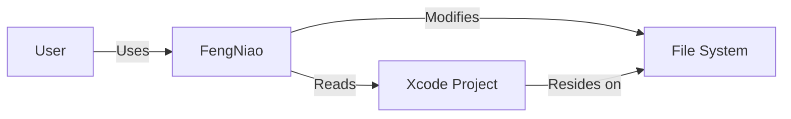
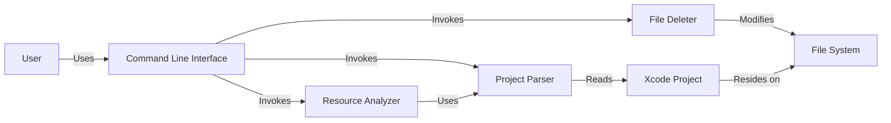
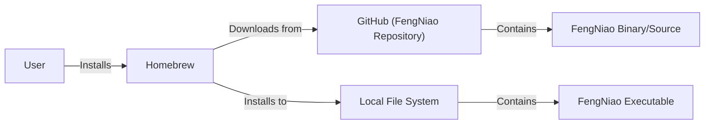
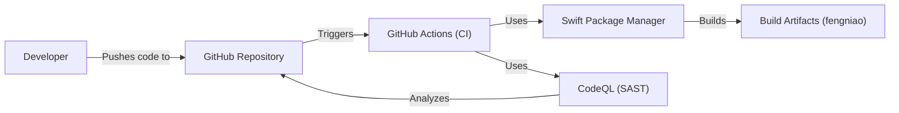

# BUSINESS POSTURE

Business Priorities and Goals:

The FengNiao project aims to provide a command-line tool for deleting unused resource files in Xcode projects. This addresses the following business priorities:

*   Reduce project size: By removing unused resources, the overall size of the Xcode project and the resulting application can be reduced.
*   Improve build times: Smaller project sizes can lead to faster build times, improving developer productivity.
*   Maintain a cleaner codebase: Removing unused resources helps maintain a cleaner and more organized codebase, making it easier to understand and maintain.
*   Reduce potential attack surface (although minimal in this context): Removing unused code reduces the overall attack surface, even if the impact is small in this specific case.

Business Risks:

*   Accidental deletion of required resources: The primary risk is the accidental deletion of resources that are still in use, potentially leading to runtime errors or application malfunctions. This could disrupt development workflows and require time to restore or recreate the deleted resources.
*   Compatibility issues with different Xcode versions or project setups: The tool may not be fully compatible with all Xcode versions or project configurations, leading to unexpected behavior or errors.
*   False positives/negatives: The tool might incorrectly identify used resources as unused (false positive) or fail to identify unused resources (false negative).
*   Impact on version control: Frequent deletion and addition of resources could create unnecessary noise in the version control history, making it harder to track meaningful changes.

# SECURITY POSTURE

Existing Security Controls:

*   security control: Code reviews: The project is open-source and hosted on GitHub, allowing for community code reviews and contributions. (Described in GitHub repository)
*   security control: Limited scope: The tool's functionality is limited to identifying and deleting unused resource files, reducing the potential for broader security vulnerabilities. (Described in GitHub repository)
*   security control: User confirmation: The tool likely requires user confirmation before deleting files, mitigating the risk of accidental deletion. (Implied, needs verification)
*   accepted risk: Reliance on Xcode project structure: The tool's effectiveness relies on the accuracy and consistency of the Xcode project structure. Any deviations or inconsistencies could lead to incorrect results.
*   accepted risk: Limited error handling: The tool may have limited error handling for unexpected scenarios, potentially leading to crashes or incomplete operations.
*   accepted risk: No formal security audits: There is no indication of formal security audits or penetration testing being conducted on the tool.

Recommended Security Controls:

*   security control: Implement robust error handling: Enhance error handling to gracefully handle unexpected scenarios, such as invalid project files or file system errors.
*   security control: Provide a "dry run" option: Allow users to preview the files that would be deleted without actually deleting them.
*   security control: Integrate with version control: Before deleting files, check if they are under version control and potentially create a backup or commit.
*   security control: Static analysis: Incorporate static analysis tools to identify potential vulnerabilities or code quality issues.

Security Requirements:

*   Authentication: Not applicable, as the tool operates locally on the user's machine and does not require authentication.
*   Authorization: Not applicable, as the tool operates with the user's existing file system permissions.
*   Input Validation:
    *   The tool should validate the input Xcode project path to ensure it is a valid directory and contains a valid Xcode project file.
    *   The tool should handle file paths and names correctly, including those with special characters or spaces.
*   Cryptography: Not applicable, as the tool does not handle sensitive data that requires encryption.

# DESIGN

## C4 CONTEXT

Element Descriptions:

*   User:
    *   Name: User
    *   Type: Person
    *   Description: The developer who uses FengNiao to clean up their Xcode project.
    *   Responsibilities: Runs the FengNiao tool, provides the Xcode project path, confirms file deletions.
    *   Security controls: Operates with the user's existing file system permissions.

*   FengNiao:
    *   Name: FengNiao
    *   Type: Software System
    *   Description: The command-line tool for deleting unused resources in Xcode projects.
    *   Responsibilities: Parses Xcode project files, identifies unused resources, deletes selected files.
    *   Security controls: Input validation of Xcode project path, user confirmation before deletion (assumed).

*   Xcode Project:
    *   Name: Xcode Project
    *   Type: Data
    *   Description: The Xcode project that FengNiao analyzes.
    *   Responsibilities: Contains source code, resource files, and project settings.
    *   Security controls: Relies on Xcode's built-in security features.

*   File System:
    *   Name: File System
    *   Type: System
    *   Description: The underlying file system where the Xcode project resides.
    *   Responsibilities: Stores the Xcode project files and resources.
    *   Security controls: Relies on the operating system's file system security.

## C4 CONTAINER

Element Descriptions:

*   User:
    *   Name: User
    *   Type: Person
    *   Description: The developer who uses FengNiao.
    *   Responsibilities: Runs the FengNiao tool, provides input, confirms actions.
    *   Security controls: Operates with the user's existing file system permissions.

*   Command Line Interface:
    *   Name: Command Line Interface
    *   Type: Container
    *   Description: The interface through which the user interacts with FengNiao.
    *   Responsibilities: Parses command-line arguments, displays output to the user.
    *   Security controls: Input validation of command-line arguments.

*   Project Parser:
    *   Name: Project Parser
    *   Type: Container
    *   Description: Component responsible for parsing the Xcode project file.
    *   Responsibilities: Reads and interprets the Xcode project file structure.
    *   Security controls: Input validation of the Xcode project file format.

*   Resource Analyzer:
    *   Name: Resource Analyzer
    *   Type: Container
    *   Description: Component that analyzes resource usage.
    *   Responsibilities: Identifies unused resource files based on the project structure and code.
    *   Security controls: None specific, relies on the accuracy of the analysis algorithm.

*   File Deleter:
    *   Name: File Deleter
    *   Type: Container
    *   Description: Component responsible for deleting the identified unused files.
    *   Responsibilities: Removes files from the file system.
    *   Security controls: User confirmation before deletion (assumed), error handling for file system operations.

*   Xcode Project:
    *   Name: Xcode Project
    *   Type: Data
    *   Description: The Xcode project being analyzed.
    *   Responsibilities: Contains source code, resource files, and project settings.
    *   Security controls: Relies on Xcode's built-in security features.

*   File System:
    *   Name: File System
    *   Type: System
    *   Description: The underlying file system.
    *   Responsibilities: Stores the Xcode project files.
    *   Security controls: Relies on the operating system's file system security.

## DEPLOYMENT

Possible Deployment Solutions:

1.  Manual Installation: User downloads the compiled binary or source code and places it in a directory within their PATH.
2.  Homebrew: Package the tool for easy installation via Homebrew, a popular package manager for macOS.
3.  Source Installation: User clones the repository and builds the tool from source using Swift Package Manager.

Chosen Solution (Homebrew):

Element Descriptions:

*   User:
    *   Name: User
    *   Type: Person
    *   Description: The developer installing FengNiao.
    *   Responsibilities: Runs the Homebrew installation command.
    *   Security controls: Relies on Homebrew's security mechanisms.

*   Homebrew:
    *   Name: Homebrew
    *   Type: Software System
    *   Description: The package manager used to install FengNiao.
    *   Responsibilities: Downloads, verifies, and installs the FengNiao package.
    *   Security controls: Homebrew uses checksums to verify the integrity of downloaded packages.

*   GitHub (FengNiao Repository):
    *   Name: GitHub (FengNiao Repository)
    *   Type: System
    *   Description: The source code repository for FengNiao.
    *   Responsibilities: Hosts the FengNiao source code and releases.
    *   Security controls: GitHub provides security features such as code scanning and access controls.

*   Local File System:
    *   Name: Local File System
    *   Type: System
    *   Description: The user's local file system.
    *   Responsibilities: Stores the installed FengNiao executable.
    *   Security controls: Relies on the operating system's file system security.

*   FengNiao Binary/Source:
    *   Name: FengNiao Binary/Source
    *   Type: Data
    *   Description: The compiled binary or source code of FengNiao.
    *   Responsibilities: N/A
    *   Security controls: N/A

*   FengNiao Executable:
    *   Name: FengNiao Executable
    *   Type: Data
    *   Description: The installed FengNiao executable.
    *   Responsibilities: N/A
    *   Security controls: N/A

## BUILD

Build Process Description:

1.  Developer pushes code changes to the GitHub repository.
2.  GitHub Actions is triggered by the push event.
3.  The GitHub Actions workflow sets up the build environment (macOS, Swift).
4.  Swift Package Manager is used to build the project and resolve dependencies.
5.  CodeQL (GitHub's static analysis tool) is run to perform security checks on the codebase.
6.  If the build and security checks are successful, the build artifacts (the `fengniao` executable) are created.
7.  The artifacts can be uploaded to a release on GitHub or deployed to a package manager (e.g., Homebrew).

Security Controls:

*   security control: GitHub Actions: Automates the build process, ensuring consistency and repeatability.
*   security control: Swift Package Manager: Manages dependencies, reducing the risk of using vulnerable libraries (assuming dependencies are well-maintained).
*   security control: CodeQL: Performs static analysis to identify potential security vulnerabilities in the code.
*   security control: Code Reviews: All changes are subject to code review before being merged into the main branch.

# RISK ASSESSMENT

Critical Business Processes:

*   Software development and maintenance of Xcode projects.

Data Protection:

*   Source code: The tool interacts with the source code of Xcode projects. While source code is not typically considered highly sensitive in the same way as personal data, it is still valuable intellectual property. Sensitivity: Medium.
*   Project configuration files: The tool parses Xcode project files, which contain project settings and configurations. Sensitivity: Low.
*   Resource files: The tool identifies and deletes resource files (images, sounds, etc.). Sensitivity: Low to Medium (depending on the nature of the resources).

# QUESTIONS & ASSUMPTIONS

Questions:

*   Does FengNiao have a mechanism to exclude specific files or directories from deletion?
*   What specific error handling mechanisms are in place?
*   Is there any logging or auditing of FengNiao's actions?
*   How does FengNiao handle symbolic links or aliases within the Xcode project?
*   Are there any known limitations or compatibility issues with specific Xcode versions or project types?

Assumptions:

*   BUSINESS POSTURE: The primary goal is to reduce project size and improve build times, with a secondary benefit of maintaining a cleaner codebase.
*   SECURITY POSTURE: The tool requires user confirmation before deleting files. The tool operates with the user's existing file system permissions.
*   DESIGN: The tool's core components are a project parser, a resource analyzer, and a file deleter. The tool is deployed via Homebrew or manual installation. The build process is automated using GitHub Actions and includes static analysis with CodeQL.