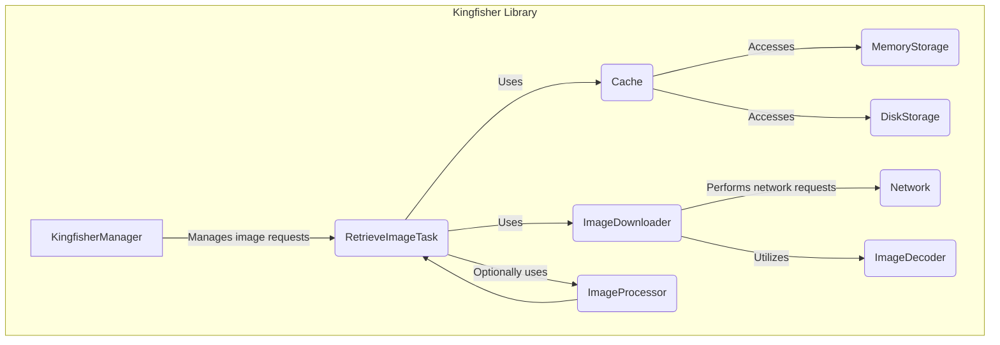
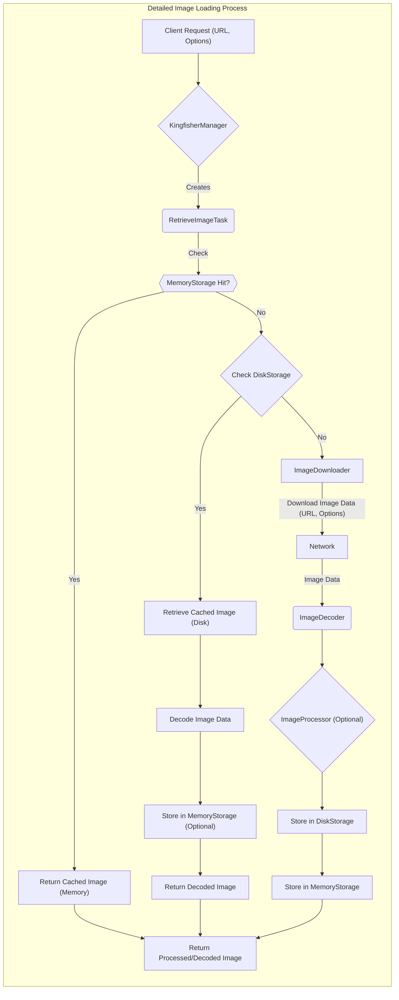

# Project Design Document: Kingfisher Image Downloading and Caching Library

**Version:** 1.1
**Date:** October 26, 2023
**Author:** Gemini (AI Language Model)

## 1. Introduction

This document provides an enhanced design overview of the Kingfisher library, an open-source Swift library for downloading and caching images from the web. This revised document aims to provide a more detailed articulation of the architecture, components, and data flow within Kingfisher, specifically tailored for subsequent threat modeling activities. We will delve deeper into the responsibilities of each component and potential security implications.

## 2. Goals and Objectives

The primary goals of Kingfisher are to:

*   Provide an efficient and developer-friendly mechanism for asynchronously downloading images from remote URLs.
*   Implement a robust, multi-layered caching system (in-memory and on-disk) to minimize redundant network requests and significantly improve application performance and responsiveness.
*   Offer a flexible and extensible architecture for image processing and transformations.
*   Provide a clear and concise API for seamless integration of image loading and caching functionalities into iOS, macOS, tvOS, and watchOS applications.
*   Abstract away the complexities of image loading, including handling placeholder images, error scenarios, and animated image support.

## 3. System Architecture

Kingfisher's architecture is modular and designed around a set of well-defined, interacting components. This design promotes maintainability and extensibility.

### 3.1. Key Components

*   **KingfisherManager:** The central orchestrator of the library. It receives image loading requests from clients, manages the lifecycle of `RetrieveImageTask` instances, interacts with the `Cache`, and utilizes the `ImageDownloader`. It provides the main API entry points for developers.
*   **RetrieveImageTask:** Represents a single, ongoing image retrieval operation. It encapsulates the state of a request, including the URL, options, and completion handlers. It coordinates the interaction between the cache and the downloader.
*   **Cache:** An abstraction layer responsible for managing both in-memory and on-disk image storage. It provides a unified interface for storing, retrieving, and removing cached images, hiding the underlying storage mechanisms.
    *   **MemoryStorage:**  Implements the in-memory cache, typically using a dictionary or similar data structure. It employs eviction policies (like LRU) to manage memory usage.
    *   **DiskStorage:**  Handles the persistence of images to disk. It manages file storage, retrieval, and cleanup based on configured limits (e.g., size, age).
*   **ImageDownloader:**  Focuses solely on the task of downloading image data from remote URLs. It handles network requests using `URLSession`, manages connection configurations, and provides mechanisms for authentication and request customization.
*   **Network:** Represents the underlying networking stack provided by the operating system (e.g., `URLSession` in iOS).
*   **ImageDecoder:** Responsible for decoding the downloaded image data into a usable `UIImage` or `NSImage` object. It handles various image formats and potential decoding errors.
*   **ImageProcessor:**  An interface (and concrete implementations) for applying transformations to images. This allows developers to perform operations like resizing, applying filters, or watermarking before the image is displayed or cached.

## 4. Data Flow

The process of loading an image using Kingfisher involves a series of steps orchestrated by the `KingfisherManager` and its associated components.

### 4.1. Detailed Data Flow Steps

1. **Client Request:** The application initiates an image loading request by calling a method on `KingfisherManager`, providing the image URL and optional configurations (e.g., cache options, processors).
2. **Task Creation:** The `KingfisherManager` creates a `RetrieveImageTask` to manage this specific request.
3. **Memory Cache Lookup:** The `RetrieveImageTask` first queries the `Cache`, specifically the `MemoryStorage`, for an image associated with the provided URL (and potentially processing key).
4. **Memory Cache Hit:** If a valid image is found in the `MemoryStorage`, it is immediately returned to the client via the completion handler.
5. **Disk Cache Lookup:** If the image is not in the memory cache, the `RetrieveImageTask` queries the `Cache`, specifically the `DiskStorage`.
6. **Disk Cache Hit:** If a cached image file exists in the `DiskStorage`, it is retrieved.
7. **Image Decoding:** The retrieved data from the disk cache is passed to the `ImageDecoder` to convert it back into an image object.
8. **Optional Memory Storage:** The decoded image might be stored in the `MemoryStorage` for faster subsequent access, depending on the configuration.
9. **Return from Disk Cache:** The decoded image is returned to the client.
10. **Image Download Initiation:** If the image is not found in either cache, the `RetrieveImageTask` instructs the `ImageDownloader` to start downloading the image data from the specified URL.
11. **Network Request:** The `ImageDownloader` uses `URLSession` to perform an asynchronous network request to the remote server. Request options (headers, timeouts, etc.) can be configured.
12. **Image Data Reception:** The `Network` delivers the downloaded image data back to the `ImageDownloader`.
13. **Image Decoding:** The `ImageDownloader` passes the downloaded data to the `ImageDecoder` for conversion into an image object.
14. **Optional Image Processing:** If an `ImageProcessor` was specified in the original request, the decoded image is passed through it for transformation.
15. **Disk Cache Storage:** The processed (or decoded) image data is then stored in the `DiskStorage`.
16. **Memory Cache Storage:** The processed (or decoded) image is also stored in the `MemoryStorage`.
17. **Return Downloaded Image:** The final processed or decoded image is returned to the client through the completion handler.

## 5. Security Considerations

Security is a crucial aspect of any software that interacts with external resources. Here's a more detailed look at potential security considerations for Kingfisher:

*   **Data Integrity and Authenticity:** Kingfisher relies heavily on the security of the underlying network transport.
    *   **Threat:** Man-in-the-middle (MITM) attacks could allow attackers to intercept and modify downloaded image data.
    *   **Mitigation:**  Enforce the use of HTTPS for all image URLs to ensure encrypted communication and server authentication. Kingfisher itself doesn't enforce this, so it's the responsibility of the integrating application. Consider implementing certificate pinning for enhanced security.
*   **Cache Poisoning:**  Attackers might attempt to inject malicious or incorrect images into the cache.
    *   **Threat:** If an attacker can compromise the network or the storage mechanisms, they could replace legitimate cached images with malicious ones.
    *   **Mitigation:**  Using HTTPS mitigates network-based cache poisoning. Secure local storage practices are essential. Kingfisher doesn't provide built-in mechanisms for verifying image integrity after download (e.g., checksums). This could be a potential enhancement.
*   **Denial of Service (DoS):**  Malicious actors could try to overwhelm the application with image loading requests.
    *   **Threat:**  Repeated requests for large images or non-existent resources can consume excessive network bandwidth, CPU, and memory, potentially leading to application crashes or unresponsiveness.
    *   **Mitigation:** Implement rate limiting on the server-side. Kingfisher itself doesn't have built-in DoS protection. Consider using appropriate caching headers on the server to reduce redundant downloads.
*   **Local Storage Security:** Images stored in the disk cache reside within the application's sandbox.
    *   **Threat:** On jailbroken or compromised devices, these cached files could be accessed by unauthorized applications or users.
    *   **Mitigation:** For highly sensitive applications, consider encrypting the disk cache. Kingfisher doesn't provide built-in encryption for the disk cache.
*   **Information Disclosure:** While image content itself might not always be sensitive, the presence of specific images in the cache could reveal user behavior or interests.
    *   **Threat:**  Access to the disk cache could potentially expose user activity.
    *   **Mitigation:**  Consider the sensitivity of the images being cached. Implement appropriate access controls on the device. Clearing the cache periodically can also reduce the risk.
*   **Dependency Vulnerabilities:** Kingfisher depends on system frameworks and potentially other libraries indirectly.
    *   **Threat:** Vulnerabilities in these dependencies could be exploited.
    *   **Mitigation:** Regularly update Kingfisher and its dependencies. Monitor security advisories for any reported vulnerabilities.
*   **Image Processing Vulnerabilities:**  Processing untrusted image data can introduce security risks.
    *   **Threat:** Malformed or crafted images could potentially exploit vulnerabilities in the image decoding or processing libraries, leading to crashes or even code execution.
    *   **Mitigation:**  Ensure the underlying image decoding libraries are up-to-date. Sanitize or validate image data where possible. Be cautious when using custom `ImageProcessor` implementations.
*   **Cache Evasion:** Attackers might try to bypass the cache to force repeated downloads.
    *   **Threat:** By manipulating request headers or URLs, attackers could force the application to repeatedly download the same image, consuming resources.
    *   **Mitigation:**  Ensure proper cache control headers are set on the server. Kingfisher respects these headers.

## 6. Dependencies

Kingfisher relies on the following core system frameworks and may optionally utilize others:

*   **Foundation:** Provides fundamental data types, collections, and operating system services essential for networking and file management.
*   **Dispatch:**  Used for managing concurrent operations, particularly for background image downloading and cache management.
*   **Combine (Optional):** Enables reactive programming paradigms for handling asynchronous image loading results.
*   **Swift Concurrency (Async/Await):** Provides modern language features for asynchronous operations, offering an alternative to Combine.
*   **UIKit (iOS, tvOS):** Provides the necessary classes for displaying images (`UIImage`, `UIImageView`).
*   **AppKit (macOS):** Provides the necessary classes for displaying images (`NSImage`, `NSImageView`).
*   **WatchKit (watchOS):** Provides the necessary classes for displaying images on watchOS.

## 7. Deployment

Kingfisher is typically integrated directly into application projects as a library. Common deployment methods include:

*   **CocoaPods:** A widely used dependency manager for Swift and Objective-C projects. Developers specify Kingfisher as a dependency in their `Podfile`.
*   **Carthage:** A decentralized dependency manager. Developers specify Kingfisher in their `Cartfile`.
*   **Swift Package Manager (SPM):** Apple's official dependency management tool, integrated directly into Xcode. Developers add Kingfisher as a package dependency in their project settings.

## 8. Future Considerations

Potential areas for future development and improvement include:

*   **Enhanced Security Features:** Implementing optional mechanisms for verifying image integrity (e.g., using content hashes or signatures). Adding built-in support for disk cache encryption.
*   **Improved Cache Management:**  More advanced cache eviction strategies, support for content delivery network (CDN) integration and cache invalidation techniques.
*   **Advanced Image Processing Capabilities:** Expanding the range of built-in image processors or providing a more flexible API for custom processor creation.
*   **Metrics and Monitoring:**  Adding instrumentation to track image loading performance, cache hit rates, and potential errors for better debugging and optimization.
*   **Optimized Image Decoding:** Exploring more efficient image decoding techniques and format support.

This enhanced design document provides a more in-depth understanding of the Kingfisher library's architecture, data flow, and security considerations. It serves as a valuable resource for threat modeling and further development efforts.
