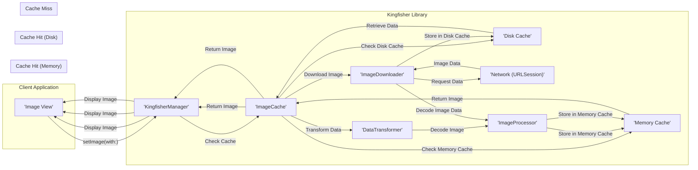

# Project Design Document: Kingfisher Image Loading and Caching Library

**Version:** 1.1
**Date:** October 26, 2023
**Author:** AI Software Architect

## 1. Introduction

This document provides a detailed design overview of the Kingfisher library, an open-source Swift library for downloading and caching images from the web. This document aims to provide a comprehensive understanding of Kingfisher's architecture, components, and data flow. This will serve as a foundation for subsequent threat modeling activities, enabling a thorough security assessment of the library and its integration within applications.

## 2. Goals

*   Articulate a clear and detailed architectural overview of the Kingfisher library.
*   Identify and describe the responsibilities of each key component within the library.
*   Illustrate the data flow within Kingfisher, tracing the journey of an image from request to display.
*   Highlight potential areas of interest and specific concerns for security analysis and threat modeling.

## 3. Non-Goals

*   This document does not provide a line-by-line code analysis or delve into granular implementation details.
*   The specific implementation of individual functions or methods is outside the scope.
*   Performance benchmarking, optimization strategies, and detailed performance metrics are not covered.
*   Exhaustive documentation of all configuration options and their nuanced effects is not included.

## 4. Architectural Overview

Kingfisher employs a modular and extensible architecture to manage image downloading, caching, and processing. Its core functionalities are encapsulated within distinct, interacting components, promoting separation of concerns and maintainability. This design facilitates customization and extension to meet specific application requirements.

## 5. Key Components

*   **`KingfisherManager`:** The central orchestrator for image loading tasks. It acts as the primary interface for interacting with Kingfisher, managing the lifecycle of `RetrieveImageTask` instances and coordinating with other managers and caches.
*   **`ImageDownloader`:**  The component responsible for fetching image data from remote URLs. It leverages `URLSession` to handle network requests, managing session configurations, handling HTTP redirects, and processing network-related errors.
*   **`Cache` (Memory Cache & Disk Cache):** Kingfisher implements a two-tiered caching system for optimal performance.
    *   **Memory Cache:** Stores *decoded* images in volatile memory for rapid retrieval. It uses a Least Recently Used (LRU) eviction policy to manage memory usage.
    *   **Disk Cache:** Stores *encoded* image data persistently on the device's storage. It also employs an LRU eviction policy to manage disk space and ensures data persistence across application launches.
*   **`ImageProcessor`:**  A protocol defining how images can be transformed. Concrete implementations allow for applying various transformations such as resizing, cropping, applying filters, and watermarking. Processing can occur before caching or after retrieval.
*   **`ImageCache`:** Provides an abstraction layer for interacting with both the memory and disk caches. It encapsulates the logic for checking both cache levels and storing images in the appropriate location based on configuration and policies.
*   **`RetrieveImageTask`:** Represents an individual, asynchronous image loading request. It encapsulates the image URL, loading options, associated progress handlers, and completion callbacks.
*   **`ImagePrefetcher`:** A utility for proactively downloading and caching images in the background. This anticipates future image needs, improving the user experience by reducing perceived loading times.
*   **`AnimatedImageView` (and related classes):** Specialized `UIImageView` subclasses designed to efficiently display animated image formats like GIFs and APNGs, handling frame rendering and animation timing.
*   **`DataTransformer`:** Responsible for converting raw data (e.g., from the disk cache) into usable image data and vice-versa. This often involves decompression and can be extended to handle custom data formats.
*   **`Session` (within `ImageDownloader`):**  Manages the underlying `URLSession` instance used for network communication. This includes configuration settings for timeouts, caching policies at the `URLSession` level (separate from Kingfisher's cache), proxy settings, and authentication challenges.

## 6. Data Flow

The following diagram illustrates the typical sequence of operations when loading an image using Kingfisher:

**Detailed Steps:**

*   The client application initiates an image loading request, typically using an extension on `UIImageView` (e.g., `imageView.kf.setImage(with: URL)`).
*   The `KingfisherManager` receives the request and queries the `ImageCache`.
*   The `ImageCache` first checks the `Memory Cache` for a previously loaded and decoded image.
    *   **Memory Cache Hit:** If found, the decoded image is immediately returned to the `KingfisherManager` and displayed in the `UIImageView`.
*   If the image is not in the memory cache, the `ImageCache` checks the `Disk Cache` for the encoded image data.
    *   **Disk Cache Hit:** The encoded image data is retrieved from the `Disk Cache`.
        *   The `DataTransformer` is used to transform the raw data (e.g., decompress it).
        *   The transformed data is then decoded into an image, potentially using an `ImageProcessor` if transformations are required.
        *   The decoded image is stored in the `Memory Cache` for future quick access.
        *   The decoded image is returned to the `KingfisherManager` and displayed.
*   If the image is not found in either cache (Cache Miss):
    *   The `KingfisherManager` instructs the `ImageDownloader` to download the image from the provided URL.
    *   The `ImageDownloader` uses `URLSession` to initiate an asynchronous network request.
    *   Upon successful download, the raw image data is received.
    *   The `ImageDownloader` stores the raw data in the `Disk Cache` for future use.
    *   The downloaded data is decoded into an image, potentially using an `ImageProcessor`.
    *   The decoded image is stored in the `Memory Cache`.
    *   The decoded image is returned to the `KingfisherManager` and displayed in the `UIImageView`.

## 7. Security Considerations

This section highlights potential security considerations relevant to Kingfisher and its usage:

*   **Network Communication (ImageDownloader & URLSession):**
    *   **HTTPS Enforcement:** Ensure that applications using Kingfisher enforce HTTPS for image URLs to protect against man-in-the-middle attacks. Lack of HTTPS can expose image data and potentially compromise user privacy.
    *   **TLS Configuration:**  The underlying `URLSession`'s TLS configuration is crucial. Weak TLS versions or insecure cipher suites could be exploited. Applications should ensure strong TLS settings.
    *   **Certificate Validation:** Proper validation of server certificates is essential to prevent connection to malicious servers impersonating legitimate ones. Developers should rely on the system's default certificate validation or implement custom validation with caution.
    *   **HTTP Redirect Handling:**  Careful consideration should be given to how HTTP redirects are handled. Malicious actors could use redirects to serve unexpected or harmful content. Kingfisher's default behavior should be reviewed, and applications might need to implement custom redirect policies.
    *   **Denial of Service (DoS) via Large Images:**  Downloading and processing extremely large images could consume excessive device resources, leading to DoS. Applications should consider mechanisms to limit the size of downloaded images or implement timeouts.
*   **Caching Mechanisms (Memory Cache & Disk Cache):**
    *   **Cache Poisoning:** If the image source is compromised, malicious images could be cached and subsequently served to users, potentially leading to application vulnerabilities or displaying inappropriate content. Implementing integrity checks (e.g., comparing hashes) could mitigate this.
    *   **Local Storage Security (Disk Cache):** Image data stored in the disk cache resides on the device's file system. Depending on the sensitivity of the images, encryption at rest might be necessary. The default permissions of the cache directory should be reviewed to prevent unauthorized access.
    *   **Cache Injection:**  While less likely in typical usage, vulnerabilities in how cache keys are generated or handled could potentially allow an attacker to inject arbitrary content into the cache.
    *   **Information Disclosure via Cache:** If a device is compromised, the disk cache could reveal previously viewed images, potentially exposing sensitive information.
*   **Image Processing (ImageProcessor):**
    *   **Denial of Service (DoS) via Malformed Images:** Processing specially crafted or malformed image files could exploit vulnerabilities in underlying image decoding libraries, leading to crashes or resource exhaustion.
    *   **Integer Overflows/Buffer Overflows:** Vulnerabilities in image processing logic or underlying libraries could potentially lead to integer overflows or buffer overflows when handling image data.
*   **Dependencies:**
    *   **Third-Party Library Vulnerabilities:**  Kingfisher's security posture is also dependent on the security of its underlying dependencies (though it has minimal external dependencies). Regularly reviewing and updating dependencies is crucial to address known vulnerabilities.
*   **Error Handling:**
    *   **Information Leaks in Error Messages:**  Detailed error messages, while helpful for debugging, could inadvertently expose sensitive information about the application's internal workings or file paths.
*   **Data Transformation (DataTransformer):**
    *   **Vulnerabilities in Custom Transformers:** If applications implement custom `DataTransformer` implementations, vulnerabilities in this custom logic could introduce security risks. Ensure thorough testing and validation of custom transformers.

## 8. Deployment Considerations

Kingfisher is typically integrated into iOS, macOS, tvOS, and watchOS applications using Swift Package Manager, CocoaPods, or Carthage. The security of Kingfisher within a deployed application is influenced by the overall security practices employed during application development, including secure coding practices and regular security assessments.

## 9. Future Considerations

*   **Built-in Cache Encryption:** Exploring options for providing built-in encryption of cached data on disk would enhance the security of sensitive image data.
*   **Content Security Policy (CSP) Awareness:**  Investigating how Kingfisher could potentially integrate with or respect CSP headers for image resources could provide an additional layer of security.
*   **Subresource Integrity (SRI) Support:** While primarily a web concept, exploring the feasibility of verifying the integrity of downloaded images using SRI hashes could be considered for high-security scenarios.

This document provides a detailed design overview suitable for threat modeling. Security assessments should consider the specific context of how Kingfisher is used within an application and the potential attack vectors relevant to that context.