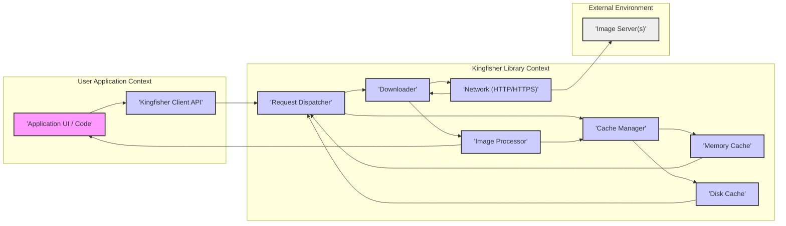

# Project Design Document: Kingfisher for Threat Modeling

## 1. Introduction

### 1.1. Project Overview

Kingfisher is a robust, Swift-based library designed for efficient image downloading and caching. It simplifies the process of displaying images from the web in applications across Apple platforms (iOS, macOS, tvOS, watchOS, and visionOS). Kingfisher abstracts away the complexities of network requests, caching strategies, and image processing, allowing developers to focus on application logic.  Key features include:

*   **Asynchronous Image Loading:**  Performs image downloads in a non-blocking manner, ensuring a smooth user interface.
*   **Comprehensive Caching:** Implements a two-tiered caching system (memory and disk) to minimize network usage and accelerate image retrieval.
*   **Flexible Image Transformations:** Offers a range of built-in image transformations and allows for custom processing to meet specific application needs.
*   **User Experience Enhancements:** Provides mechanisms for displaying placeholder images during loading and handling image loading errors gracefully.
*   **Advanced Image Handling:** Supports features like background image processing and progressive image loading.
*   **Seamless UI Integration:**  Designed for easy integration with standard UI components like `UIImageView` and `NSImageView`.

### 1.2. Purpose of this Document

This document provides a detailed architectural overview of the Kingfisher library. Its primary purpose is to serve as a resource for conducting threat modeling. By clearly defining the system's components, data flow, and external interactions, this document enables security professionals to systematically identify potential security vulnerabilities and assess the overall security risk associated with using Kingfisher in applications. This document focuses on design aspects relevant to security and does not delve into implementation-level details.

## 2. System Architecture

### 2.1. High-Level Architecture Diagram

### 2.2. Architecture Description

Kingfisher's architecture is modular, promoting maintainability and efficiency in image handling. The key components and their interactions are detailed below:

*   **User Application Context:** Represents the application code that integrates and utilizes Kingfisher for image display. Interaction occurs solely through the Kingfisher Client API.
*   **Kingfisher Client API:**  This is the public interface of the Kingfisher library. It provides methods for:
    *   Setting image URLs for image views.
    *   Prefetching images for improved responsiveness.
    *   Managing and configuring the cache.
    *   Customizing download and processing behavior.
*   **Request Dispatcher:**  Acts as the central orchestrator for image requests. Its responsibilities include:
    *   Receiving image requests from the Client API.
    *   Checking the cache (memory and disk) for existing images.
    *   Delegating to the Downloader if a cache miss occurs.
    *   Coordinating image processing.
    *   Storing processed images in the cache.
    *   Returning the image data to the Client API.
*   **Cache Manager:**  Manages the library's caching mechanisms, encompassing both memory and disk caches.
    *   **Memory Cache:**  A fast, volatile cache residing in RAM. It is optimized for rapid retrieval of frequently accessed images within the current application session. Implemented using `NSCache` or similar.
    *   **Disk Cache:** A persistent cache that stores images on the device's storage. It ensures images are available across application launches, reducing redundant downloads. File system operations are used for storage and retrieval.
*   **Downloader:**  Handles the network communication aspect of image retrieval.
    *   Utilizes `URLSession` or equivalent platform networking APIs for making HTTP/HTTPS requests.
    *   Manages network connections, data streaming, and response handling.
    *   Abstracts away the complexities of network protocols.
*   **Network (HTTP/HTTPS):** Represents the network communication layer. Kingfisher supports standard HTTP and secure HTTPS protocols for fetching images from remote servers.
*   **Image Processor:**  Applies transformations to images.
    *   Offers built-in processors for common transformations (resizing, cropping, filters, etc.).
    *   Allows developers to define and integrate custom image processors for specialized needs.
    *   Processing can occur before or after caching, depending on configuration.
*   **Image Server(s):** External servers that host the image resources accessed and downloaded by Kingfisher. These are outside the scope of the Kingfisher library itself but are a critical part of the overall system.

## 3. Data Flow

### 3.1. Image Loading Flow Diagram

```mermaid
graph LR
    A["'Image View Request (URL)'"] --> B["'Kingfisher API (setImage)'"]
    B --> C{"'Memory Cache Check'"}
    C -- "Cache Hit" --> G["'Return Image from Memory Cache'"]
    C -- "Cache Miss" --> D{"'Disk Cache Check'"}
    D -- "Cache Hit" --> E["'Load Image from Disk Cache'"]
    E --> F["'Memory Cache Write'"]
    F --> G
    D -- "Cache Miss" --> H["'Downloader Request (URLSession)'"]
    H --> I["'Network Request to Image Server'"]
    I --> J["'Image Download'"]
    J --> K["'Image Processing (Optional)'"]
    K --> L["'Disk Cache Write'"]
    L --> M["'Memory Cache Write'"]
    M --> G
    G --> N["'Display Image in Image View'"]
    style A fill:#f9f,stroke:#333,stroke-width:2px
    style B fill:#ccf,stroke:#333,stroke-width:2px
    style C fill:#ccf,stroke:#333,stroke-width:2px
    style D fill:#ccf,stroke:#333,stroke-width:2px
    style E fill:#ccf,stroke:#333,stroke-width:2px
    style F fill:#ccf,stroke:#333,stroke-width:2px
    style G fill:#ccf,stroke:#333,stroke-width:2px
    style H fill:#ccf,stroke:#333,stroke-width:2px
    style I fill:#ccf,stroke:#333,stroke-width:2px
    style J fill:#ccf,stroke:#333,stroke-width:2px
    style K fill:#ccf,stroke:#333,stroke-width:2px
    style L fill:#ccf,stroke:#333,stroke-width:2px
    style M fill:#ccf,stroke:#333,stroke-width:2px
    style N fill:#f9f,stroke:#333,stroke-width:2px
```

### 3.2. Data Flow Description

The sequence of operations for loading and displaying an image using Kingfisher follows these steps:

1.  **Image View Request (URL):** The application initiates an image loading request by calling a Kingfisher API method (e.g., `setImage(with:)`) on an image view, providing the image URL.
2.  **Kingfisher API (setImage):** The Client API receives the request and starts the image retrieval process.
3.  **Memory Cache Check:** Kingfisher first queries the Memory Cache to determine if the image is already cached in memory.
    *   **Cache Hit:** If the image is found in the Memory Cache, it is immediately retrieved and the process proceeds to step 7.
    *   **Cache Miss:** If the image is not in the Memory Cache, the flow continues to the next step.
4.  **Disk Cache Check:** If a memory cache miss occurs, Kingfisher checks the Disk Cache for a persistent copy of the image.
    *   **Cache Hit:** If the image is found in the Disk Cache, it is loaded from disk.
    *   **Cache Miss:** If the image is not in the Disk Cache, a network download is required.
5.  **Load Image from Disk Cache:** When a Disk Cache hit occurs, the image data is read from the persistent storage.
6.  **Memory Cache Write:** After loading from the Disk Cache, the image is written to the Memory Cache to optimize subsequent accesses within the current session.
7.  **Return Image from Memory Cache:** The image data, whether retrieved from the Memory Cache directly or loaded from Disk Cache and then cached in memory, is now ready for display.
8.  **Downloader Request (URLSession):** In case of both Memory and Disk Cache misses, Kingfisher utilizes `URLSession` (or the platform's equivalent networking API) to initiate a network request to the image server using the provided URL.
9.  **Network Request to Image Server:** A network request is sent to the remote image server to fetch the image data.
10. **Image Download:** The image server responds by sending the image data, which is downloaded by Kingfisher.
11. **Image Processing (Optional):** If image transformations are configured for the request, they are applied to the downloaded image data at this stage.
12. **Disk Cache Write:** The processed (or downloaded, if no processing) image data is written to the Disk Cache for persistent storage.
13.  **Memory Cache Write:** The image data is also written to the Memory Cache for faster access in the current application session.
14. **Display Image in Image View:** Finally, the image data is used to set the image content of the requested image view, making the image visible in the user interface.

## 4. Key Components

### 4.1. Image Downloader

*   **Functionality:**  Downloads image data from remote URLs over the network.
*   **Key Features:**
    *   **Asynchronous Operations:** Performs downloads asynchronously to prevent blocking the main thread.
    *   **Protocol Support:** Supports HTTP and HTTPS protocols for image retrieval.
    *   **Task Management:** Manages download tasks, including starting, pausing, resuming, and cancellation.
    *   **Request Prioritization (Potentially):** May offer mechanisms for prioritizing or throttling download requests (implementation specific).
    *   **Error Handling:** Handles network errors, including connection failures, timeouts, and server errors. May implement retry mechanisms.
*   **Security Relevance:**
    *   **Network Attack Surface:** Network communication is inherently a primary attack vector.
    *   **MITM Vulnerability:** Susceptible to Man-in-the-Middle (MITM) attacks if HTTPS is not correctly implemented or enforced, allowing attackers to intercept or modify image data.
    *   **Malicious URL Exploitation:** Vulnerable to issues arising from processing untrusted or maliciously crafted URLs, potentially leading to SSRF or other attacks.
    *   **DoS Potential:**  If not properly rate-limited or if resources are not managed efficiently, the downloader could be exploited for Denial of Service (DoS) attacks against the application or target servers.

### 4.2. Cache System

*   **Functionality:** Provides efficient storage and retrieval of images using both memory and disk caching.
*   **Key Features:**
    *   **Dual-Level Cache:** Employs both Memory Cache (fast, in-memory) and Disk Cache (persistent storage) for optimal performance and persistence.
    *   **Memory Cache Details:** Utilizes `NSCache` or similar in-memory structures for rapid access. Typically implements LRU (Least Recently Used) or similar eviction policies to manage memory usage.
    *   **Disk Cache Details:** Stores images persistently on disk. Uses file system APIs for read/write operations. May employ techniques like hashing URLs to generate unique file names for efficient retrieval.
    *   **Cache Invalidation Mechanisms:** Provides ways to invalidate or expire cached images based on criteria such as time-to-live (TTL), size limits, or explicit programmatic invalidation.
    *   **Configuration Options:** Offers customizable settings for cache size limits, expiration policies, and disk cache location.
*   **Security Relevance:**
    *   **Data at Rest Security:** The Disk Cache stores image data persistently, potentially including sensitive information.
        *   **Access Control:**  Inadequate permissions on the disk cache directory could lead to unauthorized access to cached images.
        *   **Encryption Needs:** Depending on the sensitivity of the images handled by the application, encryption of the Disk Cache contents might be necessary to protect data at rest.
        *   **Storage Location Risks:** The default or configurable location of the Disk Cache should be considered from a security perspective, especially in shared storage environments.
    *   **Cache Poisoning Risks:** If the cache is not robustly managed, it could be vulnerable to cache poisoning attacks. Attackers might attempt to inject malicious or corrupted images into the cache, which would then be served to application users.
    *   **Information Disclosure via Cache:** Improperly secured cache directories or metadata could inadvertently disclose information about user activity or accessed images.

### 4.3. Image Processor

*   **Functionality:** Transforms images before they are cached and displayed, allowing for modifications like resizing, cropping, and applying visual effects.
*   **Key Features:**
    *   **Transformation Library:** Includes a set of built-in image transformations (e.g., resizing, cropping, applying filters, format conversions).
    *   **Custom Processor Support:** Enables developers to create and integrate custom image processors to implement application-specific image manipulations.
    *   **Processing Stage Configuration:** Allows configuration of whether processing occurs before or after caching, offering flexibility in workflow design.
*   **Security Relevance:**
    *   **Image Processing Library Vulnerabilities:** Image processing operations often rely on underlying image processing libraries (e.g., CoreGraphics, ImageIO). Vulnerabilities in these libraries (such as buffer overflows, integer overflows, or format string bugs) could be exploited if Kingfisher does not handle image processing securely.
    *   **DoS via Processing Complexity:**  Malicious actors could attempt to trigger computationally expensive image processing operations as a form of Denial of Service (DoS) attack, overloading processing resources and impacting application performance.

### 4.4. View Extension

*   **Functionality:** Provides convenient extensions to UI components like `UIImageView` and `NSImageView` to simplify the process of loading and displaying images using Kingfisher.
*   **Key Features:**
    *   **Simplified API:** Introduces methods like `kf.setImage(with:)` to directly load images into image views with minimal code.
    *   **Placeholder and Error Handling Integration:** Streamlines the display of placeholder images while loading and error images in case of loading failures.
    *   **Lifecycle Management:** Manages image loading tasks in conjunction with the lifecycle of the associated view, ensuring efficient resource utilization and preventing leaks.
*   **Security Relevance:**
    *   **Indirect Exposure of Core Vulnerabilities:** While primarily a convenience layer, vulnerabilities in the core Kingfisher library could be indirectly exposed and more easily exploited through misuse of these view extensions.
    *   **UI-Level Information Disclosure:** If placeholder or error image handling is not carefully implemented, there is a potential risk of unintentionally displaying sensitive information in error messages or placeholder states within the user interface.

## 5. Dependencies

### 5.1. External Libraries

*   **Swift Standard Library:** Kingfisher is built using Swift and depends on the Swift Standard Library. The security of the Swift language and its standard library is a fundamental dependency.
*   **Operating System/Platform Frameworks:**
    *   **URLSession (Foundation Framework):** Used for all network communication. The security of `URLSession` and the underlying networking stack provided by the operating system is critical.
    *   **CoreGraphics/UIKit/AppKit:** Used for image manipulation and display. Platform-specific frameworks. Security vulnerabilities in these frameworks could indirectly affect Kingfisher's security.
    *   **Foundation Framework:** Provides essential utilities for file system operations, caching, and general system-level functionalities.

### 5.2. Operating System/Platform APIs

*   **Network APIs (URLSession, etc.):** The security of the OS-provided network stack is paramount for Kingfisher's secure operation.
*   **File System APIs:** Kingfisher relies on file system APIs for Disk Cache operations. The security of these APIs and the underlying file system permissions model is important.
*   **Memory Management APIs:** The OS's memory management mechanisms directly impact the Memory Cache and overall application stability and security.
*   **Security Frameworks (Potentially):** If Kingfisher incorporates security frameworks for features like HTTPS certificate validation or secure storage, the security of these frameworks becomes a dependency.

## 6. Security Considerations (For Threat Modeling)

This section outlines key security considerations derived from the design, intended to guide threat modeling activities.

### 6.1. Input Validation (URLs and Image Data)

*   **URL Validation:** Kingfisher must rigorously validate input URLs to prevent various attacks:
    *   **Server-Side Request Forgery (SSRF):**  Insufficient URL validation could allow an attacker to manipulate Kingfisher into making requests to internal resources or unintended external servers, potentially exposing sensitive data or internal services.
    *   **Malicious URL Exploits:**  Processing specially crafted URLs could trigger vulnerabilities in the networking stack, URL parsing libraries, or image processing components.
*   **Image Data Validation:** Validation of downloaded image data is crucial to mitigate risks:
    *   **Image Format Exploits:** Maliciously crafted image files could exploit vulnerabilities in image decoding libraries, potentially leading to crashes, arbitrary code execution, or other security breaches. Kingfisher should employ robust image format validation and decoding practices.
    *   **Denial of Service (DoS) via Large/Malformed Images:** Processing extremely large or intentionally malformed images could consume excessive system resources (CPU, memory, disk I/O), leading to Denial of Service. Kingfisher should implement safeguards against processing resource-intensive or malformed image data.

### 6.2. Data Storage Security (Cache)

*   **Disk Cache Security:** Protecting the Disk Cache is essential for data confidentiality and integrity:
    *   **File System Permissions:**  Ensure that the Disk Cache directory and files have restrictive permissions to prevent unauthorized access, modification, or deletion by other applications or users on the device.
    *   **Data Encryption at Rest:** For applications handling sensitive image data, consider encrypting the contents of the Disk Cache to protect data at rest. Platform-provided encryption mechanisms or third-party libraries could be used.
    *   **Secure Cache Location:** Carefully choose the location for the Disk Cache. Avoid storing it in publicly accessible directories or locations with weak security controls. Consider platform-specific best practices for secure data storage.
*   **Cache Invalidation and Expiration:** Implement robust cache invalidation and expiration mechanisms to:
    *   **Prevent Stale Data:** Ensure that users are not served outdated or potentially compromised images from the cache.
    *   **Enforce Security Policies:**  Allow for programmatic invalidation of cached images based on security events or policy changes.

### 6.3. Network Security (HTTP/HTTPS)

*   **HTTPS Enforcement:**  Strongly enforce the use of HTTPS for all image downloads to protect data in transit and prevent Man-in-the-Middle (MITM) attacks. Configure Kingfisher to prefer or require HTTPS connections.
*   **Certificate Pinning (Advanced):** For highly sensitive applications or critical image servers, consider implementing certificate pinning. This technique further mitigates MITM risks by validating the server's certificate against a pre-defined set of trusted certificates, rather than relying solely on system-wide trust stores.
*   **Secure HTTP Redirect Handling:**  Handle HTTP redirects securely to prevent redirection to potentially malicious or untrusted sites. Validate redirect URLs and avoid automatically following redirects to different domains without user confirmation or policy checks.
*   **Network Error Handling and Information Disclosure:** Implement robust network error handling to gracefully manage network failures. Avoid exposing sensitive information (e.g., internal server paths, detailed error messages) in error responses or logs that could be accessible to attackers.

### 6.4. Dependency Security

*   **Third-Party Dependency Management:**  Maintain a comprehensive inventory of all third-party libraries and dependencies used by Kingfisher (both direct and transitive).
    *   **Regular Vulnerability Scanning:**  Periodically scan dependencies for known security vulnerabilities using vulnerability scanning tools and databases.
    *   **Timely Updates:**  Apply timely updates and patches to dependencies to address identified vulnerabilities and ensure you are running the most secure versions.
*   **Operating System and Platform Security:** Stay informed about security updates and best practices for the target operating systems and platforms (iOS, macOS, etc.) on which Kingfisher is deployed. Apply OS security patches promptly, as Kingfisher relies on OS-level APIs and frameworks.

### 6.5. Denial of Service (DoS) Considerations

*   **Resource Management and Limits:** Implement robust resource management practices within Kingfisher to prevent resource exhaustion and DoS attacks:
    *   **Memory Limits:** Set limits on memory usage for the Memory Cache and image processing operations to prevent excessive memory consumption.
    *   **Disk Space Limits:** Enforce limits on the Disk Cache size to prevent uncontrolled disk space usage and potential disk exhaustion DoS.
    *   **Network Connection Limits:** Manage network connection concurrency and timeouts to prevent excessive connection attempts or prolonged connection holding that could lead to resource depletion on the server or client side.
*   **Rate Limiting and Throttling:** Consider implementing rate limiting or throttling mechanisms for image download requests to prevent abuse and protect both the application and backend image servers from being overwhelmed by excessive requests.
*   **Image Processing Complexity Limits:**  Establish limits on the complexity or computational cost of image processing operations to prevent attackers from triggering resource-intensive processing tasks that could lead to DoS.
*   **Cache Size and Eviction Policies:**  Carefully configure cache size limits and eviction policies (e.g., LRU, FIFO) to ensure efficient cache management and prevent uncontrolled cache growth that could contribute to DoS.

This design document provides a solid foundation for conducting a comprehensive threat model of the Kingfisher library and applications that integrate it. Further in-depth analysis and security testing are recommended to identify and mitigate specific threats based on the application's specific context, deployment environment, and security requirements.