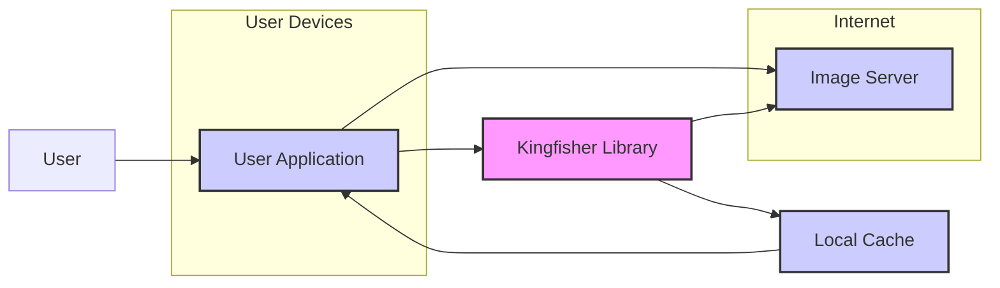
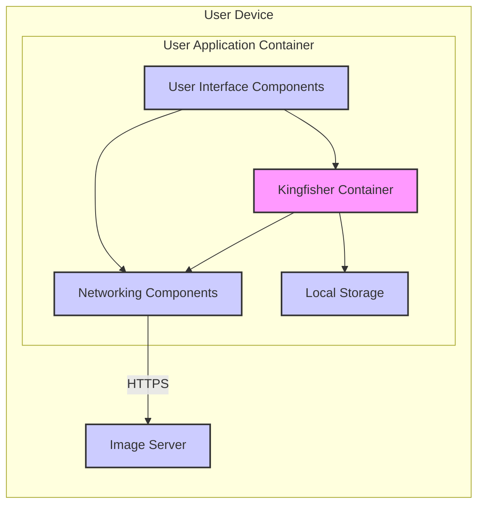
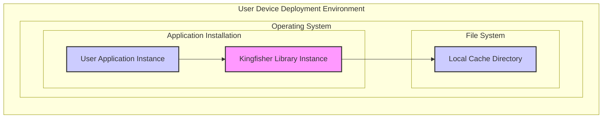

# BUSINESS POSTURE

- Business Priorities and Goals:
 - Improve application performance by efficiently downloading and caching images.
 - Enhance user experience by reducing image loading times.
 - Optimize bandwidth usage and potentially reduce data transfer costs.

- Business Risks:
 - Application performance degradation or instability due to issues within the image loading and caching library.
 - Security vulnerabilities in the library leading to potential compromise of applications using it.
 - Operational disruptions if the library fails to function correctly, impacting image display within applications.

# SECURITY POSTURE

- Existing Security Controls:
 - security control: Dependency management using Swift Package Manager or CocoaPods. Described in project documentation and dependency files.
 - security control: Code review process via GitHub pull requests. Evident in project's contribution guidelines and pull request history.
 - security control: Open source community review and scrutiny. Inherent to the open source nature of the project on GitHub.
 - accepted risk: Potential vulnerabilities in third-party dependencies used by Kingfisher. Assumed to be managed through dependency updates and community vigilance.
 - accepted risk: Risk of misconfiguration or misuse of the library by developers integrating it into their applications. Addressed through documentation and examples.

- Recommended Security Controls:
 - security control: Implement automated Static Application Security Testing (SAST) on Kingfisher codebase to identify potential vulnerabilities.
 - security control: Integrate dependency vulnerability scanning into the development pipeline to proactively detect and address vulnerable dependencies.
 - security control: Provide security guidelines and best practices for developers using Kingfisher to ensure secure integration and usage.

- Security Requirements:
 - Authentication:
  - Requirement: If Kingfisher is used to download images that require authentication, the application integrating Kingfisher is responsible for handling authentication and providing necessary credentials (e.g., headers, tokens) to the image server. Kingfisher itself should support passing through authentication headers.
 - Authorization:
  - Requirement: Authorization to access images is assumed to be handled by the image server and the application. Kingfisher should not bypass any authorization mechanisms implemented by the image server.
 - Input Validation:
  - Requirement: Kingfisher should perform basic validation of image URLs to prevent malformed requests. However, comprehensive input validation of URLs and image data is primarily the responsibility of the application using Kingfisher and the image server providing the images.
 - Cryptography:
  - Requirement: Kingfisher should support HTTPS for secure communication with image servers to protect image data in transit.
  - Requirement: If cached images contain sensitive information (which is generally not expected for public image caching libraries), consider encrypting the cache storage. However, for typical use cases of caching public images, encryption of the cache might not be a primary requirement.

# DESIGN

## C4 CONTEXT



- Context Diagram Elements:
 - - Name: User
   - Type: Person
   - Description: End user interacting with the application on their device.
   - Responsibilities: Uses the application to view content, including images.
   - Security controls: User device security controls (OS security, device encryption, etc.).
 - - Name: User Application
   - Type: Software System
   - Description: iOS or macOS application that utilizes Kingfisher library to display images.
   - Responsibilities: Presents user interface, fetches data, displays images, manages user interactions. Integrates Kingfisher for image loading and caching.
   - Security controls: Application-level security controls (authentication, authorization within the app, secure data handling, input validation).
 - - Name: Kingfisher Library
   - Type: Software System
   - Description: Open-source Swift library for asynchronous image downloading, caching, and processing.
   - Responsibilities: Downloads images from URLs, caches images locally, provides image processing functionalities, manages cache invalidation.
   - Security controls: Library-level security controls (secure coding practices, input validation of URLs, HTTPS support, dependency management).
 - - Name: Image Server
   - Type: Software System
   - Description: Server hosting images that are accessed and displayed by the User Application.
   - Responsibilities: Stores and serves images, handles image requests, potentially manages authentication and authorization for image access.
   - Security controls: Server-side security controls (access control, server hardening, secure image storage, DDoS protection).
 - - Name: Local Cache
   - Type: Data Store
   - Description: Local storage on the user's device used by Kingfisher to cache downloaded images.
   - Responsibilities: Persistently stores downloaded images to reduce network requests and improve loading times.
   - Security controls: Operating system level file system permissions, potential application-level encryption if required for sensitive cached data (though less common for public image caches).

## C4 CONTAINER



- Container Diagram Elements:
 - - Name: User Interface Components
   - Type: Application Component
   - Description: Parts of the User Application responsible for displaying images and interacting with the user.
   - Responsibilities: Displaying images fetched by Kingfisher, triggering image loading, handling user interactions related to images.
   - Security controls: Input validation of user inputs, secure handling of displayed image data.
 - - Name: Kingfisher Container
   - Type: Library Container
   - Description: The Kingfisher library integrated into the User Application.
   - Responsibilities: Managing image download requests, caching images in local storage, retrieving images from cache, providing image processing functionalities.
   - Security controls: Input validation of image URLs, secure handling of network requests (HTTPS), secure cache management, protection against common library vulnerabilities.
 - - Name: Networking Components
   - Type: Application Component
   - Description: Components within the User Application responsible for network communication.
   - Responsibilities: Making network requests to Image Servers to download images, handling network responses.
   - Security controls: Enforcing HTTPS for communication, handling network errors securely, potentially implementing network request rate limiting.
 - - Name: Local Storage
   - Type: Data Store
   - Description: File system on the user's device used for caching images by Kingfisher.
   - Responsibilities: Persistently storing cached images, providing access to cached images for Kingfisher.
   - Security controls: Operating system file system permissions, potentially application-level encryption for sensitive cache data (less common for public image caches).
 - - Name: Image Server
   - Type: External System
   - Description: Server hosting images accessed by the User Application.
   - Responsibilities: Serving image files, handling image requests, potentially managing authentication and authorization.
   - Security controls: Server-side security controls (access control, server hardening, secure image storage, DDoS protection).

## DEPLOYMENT



- Deployment Diagram Elements:
 - - Name: User Application Instance
   - Type: Software Instance
   - Description: Running instance of the User Application on a user's device.
   - Responsibilities: Executing application logic, displaying user interface, utilizing Kingfisher library for image handling.
   - Security controls: Application runtime security controls, OS-level security controls, user device security posture.
 - - Name: Kingfisher Library Instance
   - Type: Library Instance
   - Description: Instance of the Kingfisher library running within the User Application process.
   - Responsibilities: Handling image download and caching operations for the User Application instance.
   - Security controls: Library runtime security controls, relies on the security of the application environment and OS.
 - - Name: Local Cache Directory
   - Type: File System Directory
   - Description: Directory on the user device's file system where Kingfisher stores cached images.
   - Responsibilities: Persistent storage for cached image files.
   - Security controls: Operating system file system permissions, access control to the directory.
 - - Name: Operating System
   - Type: Environment
   - Description: User device operating system (iOS or macOS) providing the runtime environment for the application and Kingfisher.
   - Responsibilities: Managing application execution, providing file system access, handling network communication, enforcing security policies.
   - Security controls: OS-level security features (sandboxing, permissions, memory protection, etc.).
 - - Name: User Device Deployment Environment
   - Type: Environment
   - Description: The overall environment where the User Application and Kingfisher are deployed, encompassing the user's device and operating system.
   - Responsibilities: Providing the physical and logical infrastructure for running the application.
   - Security controls: Device security settings, user security practices, network security of the user's network.

## BUILD

```mermaid
flowchart LR
    subgraph Development Environment
        Developer["Developer"]
        CodeRepo["Code Repository (GitHub)"]
        Developer --> CodeRepo: Push Code
    end
    subgraph CI/CD Pipeline
        BuildServer["Build Server (GitHub Actions)"]
        CodeRepo --> BuildServer: Trigger Build
        BuildServer --> Test["Automated Tests"]
        BuildServer --> SAST["SAST Scanner"]
        Test --> BuildServer: Test Results
        SAST --> BuildServer: SAST Results
        BuildServer --> ArtifactStore["Artifact Store (GitHub Releases, SPM)"] : Publish Artifacts
    end
    ArtifactStore --> User: Download/Integrate Library
    style BuildServer fill:#ccf,stroke:#333,stroke-width:2px
    style CodeRepo fill:#ccf,stroke:#333,stroke-width:2px
    style ArtifactStore fill:#ccf,stroke:#333,stroke-width:2px
    style SAST fill:#ccf,stroke:#333,stroke-width:2px
    style Test fill:#ccf,stroke:#333,stroke-width:2px
```

- Build Process Elements:
 - - Name: Developer
   - Type: Person
   - Description: Software developer contributing to the Kingfisher project.
   - Responsibilities: Writing code, fixing bugs, implementing new features, committing code to the repository.
   - Security controls: Developer workstation security, secure coding practices, code review participation.
 - - Name: Code Repository (GitHub)
   - Type: Software System
   - Description: GitHub repository hosting the Kingfisher source code.
   - Responsibilities: Version control, code storage, collaboration platform, managing pull requests.
   - Security controls: Access control to the repository, branch protection, audit logs, vulnerability scanning of repository infrastructure.
 - - Name: Build Server (GitHub Actions)
   - Type: Software System
   - Description: Automated build server using GitHub Actions for CI/CD.
   - Responsibilities: Automating build process, compiling code, running tests, performing static analysis, publishing build artifacts.
   - Security controls: Secure build environment, access control to build configurations, secrets management for build process, build artifact signing.
 - - Name: Automated Tests
   - Type: Software System
   - Description: Automated test suite for Kingfisher (unit tests, integration tests).
   - Responsibilities: Verifying code functionality, detecting regressions, ensuring code quality.
   - Security controls: Secure test environment, test code review, coverage analysis.
 - - Name: SAST Scanner
   - Type: Software System
   - Description: Static Application Security Testing tool integrated into the build pipeline.
   - Responsibilities: Scanning code for potential security vulnerabilities, identifying code quality issues.
   - Security controls: Regularly updated vulnerability rules, secure configuration of SAST tool, review of SAST findings.
 - - Name: Artifact Store (GitHub Releases, SPM)
   - Type: Software System
   - Description: Location where build artifacts (releases, Swift Package Manager package) are stored and distributed.
   - Responsibilities: Storing and distributing compiled library artifacts, managing releases.
   - Security controls: Access control to artifact store, integrity checks for artifacts (checksums, signatures), secure distribution channels (HTTPS).

# RISK ASSESSMENT

- Critical Business Processes:
 - Displaying images within applications is a critical process for user engagement, content presentation, and overall application functionality. If image loading fails or is slow, user experience is negatively impacted.

- Data to Protect and Sensitivity:
 - Primarily, the data being handled by Kingfisher is image data downloaded from image servers and cached locally.
 - Sensitivity of image data depends on the application context. For many applications using Kingfisher for public images (e.g., social media, news apps), the sensitivity is low. However, if Kingfisher is used in applications dealing with private or sensitive images (e.g., medical imaging, personal photo storage), the sensitivity would be higher.
 - For typical use cases of Kingfisher as a public image caching library, the primary data security concerns are related to availability and integrity of the library and the images, rather than confidentiality of the image content itself. However, ensuring the library is free from vulnerabilities that could compromise the application or user device is a high priority.

# QUESTIONS & ASSUMPTIONS

- BUSINESS POSTURE:
 - Assumption: The primary business goal for using Kingfisher is to improve application performance and user experience by efficiently handling image loading and caching of publicly accessible images.
 - Question: Are there specific regulatory compliance requirements (e.g., GDPR, HIPAA) that need to be considered for applications using Kingfisher, especially if handling user-generated or potentially sensitive images?

- SECURITY POSTURE:
 - Assumption: Applications integrating Kingfisher are responsible for implementing higher-level security controls such as user authentication and authorization for accessing protected images. Kingfisher's role is primarily focused on secure and efficient image handling once the application has access to the image URL.
 - Question: Are there known common vulnerabilities or attack patterns associated with image processing libraries in general or Kingfisher specifically that should be considered during threat modeling?

- DESIGN:
 - Assumption: Kingfisher is designed to be integrated into applications and relies on the security features of the underlying operating system and application environment.
 - Question: Are there any specific configuration options or usage patterns of Kingfisher that could introduce security risks if not properly understood or implemented by developers? For example, are there any insecure default settings or features that should be avoided?