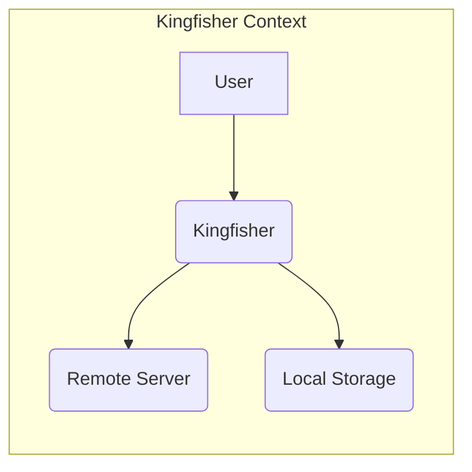
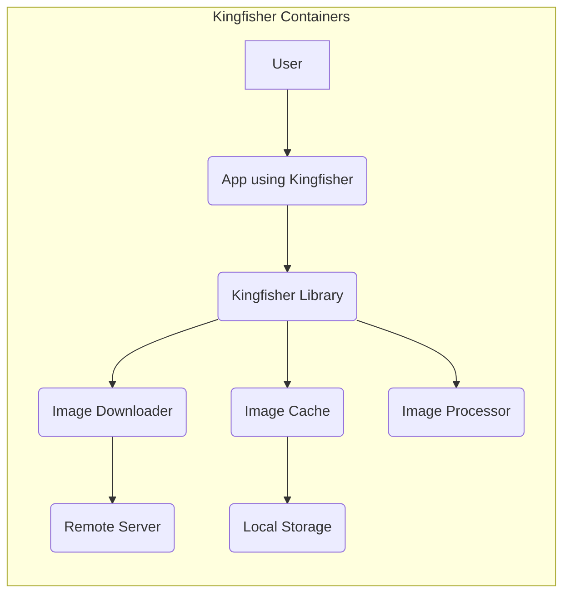
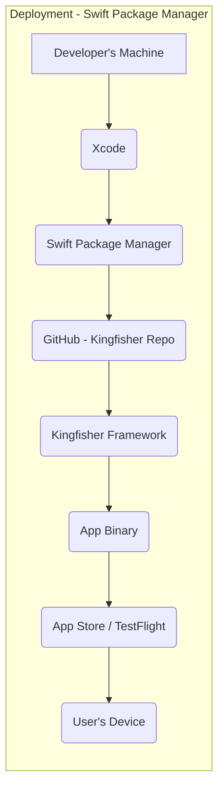
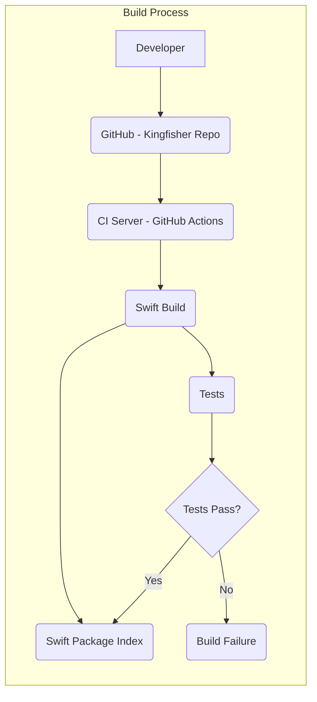

Okay, let's create a design document for the Kingfisher project.

# BUSINESS POSTURE

Kingfisher is a popular open-source library for downloading and caching images from the web in iOS and macOS applications.  It's widely used, suggesting a strong emphasis on reliability, performance, and ease of use for developers.  The project's goals likely include:

*   Provide a robust and efficient image downloading and caching solution.
*   Minimize developer effort for integrating image handling into their apps.
*   Maintain high performance to ensure smooth user experiences.
*   Offer flexibility and customization options for various use cases.
*   Ensure stability and compatibility across different iOS/macOS versions.
*   Maintain a strong reputation within the developer community.

Business priorities are likely centered around:

*   User Experience: Fast and reliable image loading is crucial for a positive app user experience.
*   Developer Adoption:  Ease of use and good documentation are key for widespread adoption.
*   Maintainability:  The project needs to be easily maintainable and updated to support new OS versions and features.
*   Community Trust:  Security and reliability are paramount to maintain the trust of the developer community.

Most important business risks:

*   Security vulnerabilities that could expose user data or lead to app instability.
*   Performance issues that degrade the user experience of apps using the library.
*   Compatibility problems with new OS versions or devices, breaking existing apps.
*   Lack of maintenance and updates, leading to the library becoming obsolete.
*   Negative community perception due to bugs, security issues, or poor support.

# SECURITY POSTURE

Existing security controls (based on the GitHub repository and common practices):

*   security control: Code Reviews: Pull requests are used, suggesting code reviews are part of the development process. (Implicit in the GitHub workflow).
*   security control: Community Scrutiny: Being open-source, the code is subject to scrutiny by the wider developer community.
*   security control: Dependency Management: Uses Swift Package Manager, which helps manage dependencies and their versions. (Visible in `Package.swift`).
*   security control: Basic Input Validation: The library likely performs basic checks on URLs and image data to prevent crashes or obvious errors. (Inferred, but needs verification in code).
*   security control: Automated Testing: The project includes a comprehensive test suite, which helps identify bugs and regressions. (Visible in the `Tests` directory).
*   security control: Secure by default settings: Kingfisher uses secure defaults where possible, such as HTTPS.

Accepted risks:

*   accepted risk: Reliance on Third-Party Dependencies: The library depends on external libraries (like `ImageIO` and `CoreGraphics`), inheriting any vulnerabilities they might have.
*   accepted risk: Potential for Denial of Service (DoS):  A malicious actor could potentially craft requests that consume excessive resources, although this is more of an issue for the app using Kingfisher than Kingfisher itself.
*   accepted risk: Limited Control over Server-Side Security: Kingfisher downloads images from external servers, and has no control over the security of those servers.
*   accepted risk: Data exposure if cache is not properly secured: If the application using Kingfisher does not properly secure the cached images, they could be accessed by unauthorized parties.

Recommended security controls:

*   security control: Static Analysis: Integrate static analysis tools (e.g., SwiftLint, SonarQube) into the CI/CD pipeline to automatically detect potential security issues.
*   security control: Dependency Scanning: Implement automated dependency scanning (e.g., GitHub's Dependabot, Snyk) to identify and alert on known vulnerabilities in dependencies.
*   security control: Fuzz Testing: Introduce fuzz testing to check how the library handles unexpected or malformed input (e.g., corrupted image data, invalid URLs).
*   security control: Security Audits: Conduct periodic security audits, either internally or by a third-party, to identify potential vulnerabilities.

Security Requirements:

*   Authentication: Not directly applicable to Kingfisher itself, as it's a client-side library. Authentication is the responsibility of the application using Kingfisher or the server hosting the images.
*   Authorization: Not directly applicable to Kingfisher itself. Authorization for accessing images should be handled by the server.
*   Input Validation:
    *   URLs should be validated to ensure they are well-formed and use supported schemes (primarily HTTPS).
    *   Image data should be checked for basic integrity (e.g., valid headers, reasonable size) to prevent processing of corrupted or malicious files.
    *   Implement checks to prevent path traversal vulnerabilities when accessing cached files.
*   Cryptography:
    *   HTTPS should be enforced for all image downloads to protect data in transit.
    *   If caching sensitive images, consider encrypting the cache at rest (this is primarily the responsibility of the app using Kingfisher).

# DESIGN

## C4 CONTEXT

Element Descriptions:

*   Element:
    *   Name: User
    *   Type: Person
    *   Description: The user of an iOS or macOS application that utilizes Kingfisher.
    *   Responsibilities: Interacts with the application's UI, triggering image loading requests.
    *   Security controls: N/A - The user is external to the system.

*   Element:
    *   Name: Kingfisher
    *   Type: Software System
    *   Description: The Kingfisher library, embedded within an iOS/macOS application.
    *   Responsibilities: Handles image downloading, caching, and display.
    *   Security controls: Input validation, HTTPS enforcement, secure dependency management.

*   Element:
    *   Name: Remote Server
    *   Type: Software System
    *   Description: A web server hosting the images to be downloaded.
    *   Responsibilities: Serves image files upon request.
    *   Security controls: Server-side security measures (outside Kingfisher's control).

*   Element:
    *   Name: Local Storage
    *   Type: Software System
    *   Description: The device's local storage (e.g., disk, memory) where images are cached.
    *   Responsibilities: Stores cached image data.
    *   Security controls: File system permissions, potential encryption (managed by the app).

## C4 CONTAINER

Element Descriptions:

*   Element:
    *   Name: User
    *   Type: Person
    *   Description: The user of an iOS or macOS application.
    *   Responsibilities: Interacts with the application.
    *   Security controls: N/A

*   Element:
    *   Name: App using Kingfisher
    *   Type: Application
    *   Description: iOS/macOS application that uses Kingfisher library.
    *   Responsibilities: Provides application functionality to the user.
    *   Security controls: Application-specific security controls.

*   Element:
    *   Name: Kingfisher Library
    *   Type: Library
    *   Description: The main entry point for the library.
    *   Responsibilities: Provides API for image downloading and caching.
    *   Security controls: Input validation, API security.

*   Element:
    *   Name: Image Downloader
    *   Type: Component
    *   Description: Responsible for downloading images from remote servers.
    *   Responsibilities: Handles network requests, manages connections, and downloads image data.
    *   Security controls: HTTPS enforcement, connection security.

*   Element:
    *   Name: Image Cache
    *   Type: Component
    *   Description: Manages the image cache (both in-memory and on-disk).
    *   Responsibilities: Stores, retrieves, and removes cached images.
    *   Security controls: Cache key validation, file system permissions.

*   Element:
    *   Name: Image Processor
    *   Type: Component
    *   Description: Handles image processing tasks (e.g., resizing, transformations).
    *   Responsibilities: Applies image transformations as requested.
    *   Security controls: Input validation for processing parameters.

*   Element:
    *   Name: Remote Server
    *   Type: Software System
    *   Description: A web server hosting the images.
    *   Responsibilities: Serves image files.
    *   Security controls: Server-side security (outside Kingfisher's control).

*   Element:
    *   Name: Local Storage
    *   Type: Software System
    *   Description: The device's storage.
    *   Responsibilities: Stores cached data.
    *   Security controls: File system permissions, potential encryption (by the app).

## DEPLOYMENT

Kingfisher is a library, not a standalone application. Therefore, it's "deployed" as part of an iOS or macOS application.  There are several ways an app developer might integrate Kingfisher:

1.  Swift Package Manager (SPM):  This is the recommended and most modern approach.
2.  CocoaPods:  A popular dependency manager for Cocoa projects.
3.  Carthage:  Another decentralized dependency manager.
4.  Manual Integration:  Copying the source code directly into the project (not recommended).

We'll describe the SPM approach, as it's the recommended method.

Element Descriptions:

*   Element:
    *   Name: Developer's Machine
    *   Type: Device
    *   Description: The developer's computer where the app is built.
    *   Responsibilities: Hosts the development environment.
    *   Security controls: Developer machine security.

*   Element:
    *   Name: Xcode
    *   Type: Software
    *   Description: Apple's IDE for iOS/macOS development.
    *   Responsibilities: Manages the project, builds the app, and integrates dependencies.
    *   Security controls: Xcode's built-in security features.

*   Element:
    *   Name: Swift Package Manager
    *   Type: Software
    *   Description: Swift's built-in dependency manager.
    *   Responsibilities: Downloads and manages dependencies specified in `Package.swift`.
    *   Security controls: Package signing, integrity checks.

*   Element:
    *   Name: GitHub - Kingfisher Repo
    *   Type: Software System
    *   Description: The Kingfisher repository on GitHub.
    *   Responsibilities: Hosts the Kingfisher source code and releases.
    *   Security controls: GitHub's security features.

*   Element:
    *   Name: Kingfisher Framework
    *   Type: Library
    *   Description: The compiled Kingfisher library.
    *   Responsibilities: Provides image downloading and caching functionality.
    *   Security controls: Code signing, build process security.

*   Element:
    *   Name: App Binary
    *   Type: Application
    *   Description: The compiled iOS/macOS application.
    *   Responsibilities: Provides the app's functionality to the user.
    *   Security controls: App-level security measures.

*   Element:
    *   Name: App Store / TestFlight
    *   Type: Software System
    *   Description: Apple's platforms for distributing apps.
    *   Responsibilities: Distributes the app to users.
    *   Security controls: App Store review process, code signing.

*   Element:
    *   Name: User's Device
    *   Type: Device
    *   Description: The user's iOS or macOS device.
    *   Responsibilities: Runs the application.
    *   Security controls: Device-level security features.

## BUILD

The build process for Kingfisher itself (not the app using it) likely involves the following:

* Developer commits code to the GitHub repository.
* GitHub Actions (or a similar CI system) is triggered.
* The CI server checks out the code.
* `swift build` is executed to compile the library.
* Unit and UI tests are run.
* If tests pass, the build is considered successful.
* The built framework and package information are made available (e.g., through Swift Package Index).

Security Controls in the Build Process:

*   security control: CI/CD: GitHub Actions (or similar) automates the build and testing process, ensuring consistency and reducing manual errors.
*   security control: Automated Testing: Comprehensive tests help catch bugs and regressions before release.
*   security control: Code Signing: The compiled framework should be code-signed to ensure its authenticity and integrity.
*   security control: Dependency Management: SPM helps manage dependencies securely.
*   security control: (Recommended) Static Analysis: Integrate static analysis tools into the CI pipeline.
*   security control: (Recommended) Dependency Scanning: Integrate dependency scanning into the CI pipeline.

# RISK ASSESSMENT

*   Critical Business Processes:
    *   Image Downloading: The core function of the library; must be reliable and performant.
    *   Image Caching: Essential for performance and offline access; must be secure and efficient.
    *   Image Display: Integration with UI frameworks; must be seamless and bug-free.

*   Data We Are Trying to Protect:
    *   Image Data: The primary data handled by Kingfisher. Sensitivity depends on the specific images being downloaded and cached by the app using Kingfisher.  If the app deals with user-generated content or private images, the sensitivity is high.  If it only deals with public images, the sensitivity is lower.
    *   Cache Metadata: Information about cached images (URLs, timestamps, etc.).  Could potentially reveal information about user activity.
    *   (Potentially) User Credentials: If the app uses Kingfisher to download images that require authentication, the app is responsible for securely handling credentials. Kingfisher itself should not handle credentials directly.

Data Sensitivity:

*   Varies greatly depending on the application using Kingfisher.  The library itself doesn't inherently handle sensitive data, but the *application* using it might.

# QUESTIONS & ASSUMPTIONS

Questions:

*   What specific image processing features are used, and are there any known security considerations for those features?
*   Are there any specific configurations or settings that could impact security (e.g., custom cache implementations)?
*   How are errors and exceptions handled, and are there any potential information leaks?
*   Are there plans to implement any additional security features, such as support for encrypted caches?
*   What is the process for handling reported security vulnerabilities?

Assumptions:

*   BUSINESS POSTURE: Assumed that maintaining a positive reputation and community trust is a high priority.
*   SECURITY POSTURE: Assumed that basic security best practices are followed (e.g., using HTTPS, validating URLs). Assumed that the developers are aware of common security vulnerabilities and take steps to mitigate them.
*   DESIGN: Assumed that the provided diagrams accurately reflect the high-level architecture of Kingfisher. Assumed that the library relies primarily on standard iOS/macOS frameworks for networking and caching.
*   BUILD: Assumed that GitHub Actions is used for CI/CD.
*   RISK ASSESSMENT: Assumed that the application using Kingfisher is responsible for handling any sensitive data or user authentication.