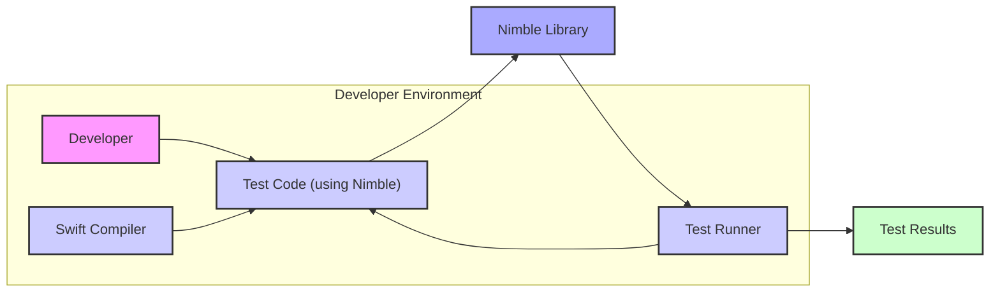
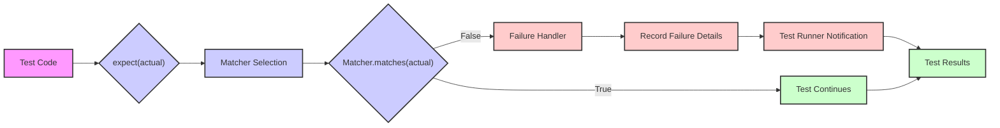

# Project Design Document: Nimble Testing Framework

**Version:** 1.1
**Date:** October 26, 2023
**Author:** AI Cloud & Security Architect

## 1. Introduction

This document provides an enhanced and more detailed design overview of the Nimble testing framework, an open-source library for expressing expectations in Swift. This revised document aims to provide a stronger foundation for subsequent threat modeling activities by offering a more granular understanding of the key components, data flows, and interactions within the Nimble ecosystem. We have expanded on several sections to provide greater clarity and depth.

## 2. Goals

* Provide a clear, comprehensive, and more detailed architectural description of the Nimble framework.
* Identify key components and their specific responsibilities with greater granularity.
* Describe the data flow and interactions within the framework with more precision, especially concerning the evaluation of expectations.
* Highlight potential areas of security concern with more specific examples and categorization for future threat modeling.
* Serve as an improved reference point for developers and security analysts.

## 3. Non-Goals

* This document still does not aim to provide a detailed code-level analysis of Nimble.
* It does not cover the intricacies of the Swift language or the underlying operating system beyond their interaction with Nimble.
* This document remains focused on the architectural aspects relevant to threat modeling and does not provide specific security recommendations, fixes, or implementation details for mitigation.

## 4. High-Level Architecture

Nimble functions as a library deeply integrated into Swift projects. Its core purpose is to simplify the creation and execution of test assertions. The fundamental interaction involves developers writing test code that leverages Nimble's specific syntax. These tests are then compiled and executed by a test runner, such as Xcode's built-in runner or a command-line interface.

* **Developer:**  Writes Swift test code that incorporates Nimble's assertion framework to define expected outcomes.
* **Test Code (using Nimble):** Contains individual test cases, each including one or more expectations defined using Nimble's `expect` function and various matchers.
* **Swift Compiler:** Translates the Swift source code, including the test code and the Nimble library, into executable code.
* **Test Runner:**  Executes the compiled test suite. This could be Xcode's integrated test runner, a command-line tool like `swift test`, or a testing mechanism within a CI/CD pipeline.
* **Nimble Library:** The central component, providing the `expect` function, a collection of built-in matchers, and the infrastructure for handling test failures.
* **Test Results:** The output generated by the test runner, indicating the success or failure of each individual test case and the overall test suite.

## 5. Detailed Design

### 5.1. Core Components

* **`expect` Function:** The primary interface for asserting expectations. It takes an expression representing the actual value to be tested.
* **Matchers:** Objects responsible for performing the comparison between the actual value and the expected condition.
    * List Item: **Built-in Matchers:** Nimble provides a set of predefined matchers for common comparisons (e.g., `equal`, `beNil`, `throwError`, `contain`).
    * List Item: **Custom Matchers:** Developers can create their own matchers to encapsulate specific comparison logic, which can introduce potential security considerations if not implemented carefully.
* **Failure Handler:**  A mechanism within Nimble that is invoked when an expectation fails. It records the failure, typically including a descriptive message, and informs the test runner.
* **DSL (Domain Specific Language):** Nimble's expressive syntax makes writing assertions more readable and maintainable. This DSL relies on Swift's language features.
* **Configuration Options:**  Limited configuration options are available, such as customizing failure messages or setting timeouts for asynchronous expectations.

### 5.2. Interaction Flow

1. **Test Case Definition:** A developer writes a test function in Swift. Within this function, they use Nimble's `expect` function to assert a specific condition.
2. **Compilation Phase:** The Swift compiler compiles the test code along with the Nimble library. The compiler resolves the Nimble function calls and links the necessary code.
3. **Test Execution Initialization:** The test runner begins executing the compiled test suite.
4. **`expect` Function Invocation:** When the test runner encounters an `expect` call, it evaluates the expression provided as the actual value.
5. **Matcher Selection and Execution:** The appropriate matcher (specified within the `expect` call) is selected. The matcher's `matches` function is then executed, comparing the evaluated actual value against the expected condition.
6. **Result Determination:** The matcher's `matches` function returns a boolean value indicating whether the expectation was met.
7. **Failure Handling (if applicable):** If the matcher returns `false`, Nimble's failure handler is invoked.
    * List Item: The failure handler records the failure, including the provided failure message (if any) and information about the actual and expected values.
    * List Item: This failure information is communicated to the test runner.
8. **Test Outcome Reporting:** The test runner aggregates the results of all executed expectations within the test case. If any expectation failed, the entire test case is marked as failed.
9. **Suite Completion:** The test runner continues executing other test cases in the suite and finally reports the overall test results.

### 5.3. Data Flow

* **Test Code:** Contains the `expect` statement with the `actual` expression to be evaluated.
* **`expect(actual)`:** The Nimble function receives the expression representing the actual value.
* **Matcher Selection:** Nimble determines the appropriate matcher based on the syntax used in the `expect` call (e.g., `to(equal(expected))`).
* **`Matcher.matches(actual)`:** The selected matcher's `matches` function is invoked with the evaluated actual value.
* **True:** The matcher returns `true`, indicating the expectation was met, and the test continues.
* **False:** The matcher returns `false`, indicating the expectation failed.
* **Failure Handler:** Nimble's failure handling mechanism is triggered.
* **Record Failure Details:** The failure handler records information about the failure, such as the actual and expected values and a descriptive message.
* **Test Runner Notification:** The failure handler informs the test runner about the failure.
* **Test Results:** The test runner aggregates the results and reports the overall outcome.

## 6. Security Considerations

While Nimble itself is designed as a testing library and does not inherently manage sensitive data or engage in network communication in its core functionality, several security considerations arise from how it is used and the context in which it operates. These can be broadly categorized as follows:

* **Information Disclosure Risks:**
    * List Item: **Exposure of Sensitive Data in Assertions:**  Developers might inadvertently include sensitive information (e.g., API keys, passwords, personally identifiable information) directly within the `actual` value being asserted or in the expected value. Failure messages could then expose this data.
    * List Item: **Revealing Internal State in Failure Messages:** Overly verbose or poorly constructed failure messages from custom matchers or default Nimble matchers could reveal internal application state or logic that might be valuable to an attacker.
* **Risks Associated with Custom Matchers:**
    * List Item: **Vulnerable Comparison Logic:** Custom matchers implemented with insecure comparison logic could lead to incorrect test results, masking underlying vulnerabilities in the system under test.
    * List Item: **Resource Exhaustion:** Poorly written custom matchers could consume excessive CPU, memory, or other resources during test execution, potentially leading to denial-of-service conditions within the testing environment.
    * List Item: **Code Injection Vulnerabilities:** If custom matchers dynamically evaluate code based on input, they could be susceptible to code injection attacks if the input is not properly sanitized.
* **Integrity of the Testing Process:**
    * List Item: **Compromised Test Code:** If the test code itself is compromised, attackers could manipulate tests to always pass, regardless of the actual state of the system under test, leading to a false sense of security.
    * List Item: **Tampering with Test Results:** In a compromised CI/CD environment, attackers might be able to directly manipulate test results, hiding evidence of vulnerabilities.
* **Dependency Management:**
    * List Item: **Vulnerabilities in Nimble's Dependencies:** Nimble relies on other Swift packages. Vulnerabilities in these dependencies could indirectly affect the security of the testing process or the environment where tests are executed.
* **Security of the Test Execution Environment:**
    * List Item: **Unsecured CI/CD Pipelines:** If tests are executed in an unsecured CI/CD pipeline, the environment itself could be compromised, leading to the risks mentioned above.

## 7. Assumptions and Constraints

* **Developer Awareness:** It is assumed that developers using Nimble have a basic understanding of secure coding practices and are aware of the potential risks of including sensitive information in test code.
* **Secure Development Practices:** The design assumes that Nimble is used within a development process that incorporates other security best practices, such as code reviews and static analysis.
* **Reliable Test Runner:** The reliability and security of the underlying test runner (e.g., Xcode's test runner, `swift test`) are assumed. Issues within the test runner itself are outside the scope of this document.
* **Focus on Functional Correctness:** Nimble's primary focus is on verifying the functional correctness of code. While it can be used in conjunction with security testing, it is not inherently a security testing tool.
* **No Direct Network Interaction by Nimble:** Nimble itself does not initiate network requests or handle network responses. Any network interaction would occur within the code being tested, not within the Nimble library itself.

## 8. Future Considerations

* **Mechanisms for Sensitive Data Handling in Tests:** Explore potential features or best practices for securely handling sensitive data within test cases, such as using mock data or secure vaults.
* **Enhanced Security Guidance for Custom Matcher Development:** Provide clearer guidelines and recommendations for developers creating custom matchers to avoid common security pitfalls.
* **Integration with Security Scanning Tools:** Investigate possibilities for integrating Nimble or the test execution process with security scanning tools to automatically identify potential security issues in test code or failure messages.
* **Consideration of Test Isolation:**  Evaluate the impact of test isolation on security and whether Nimble's design facilitates or hinders secure testing practices in isolated environments.

This enhanced design document provides a more detailed understanding of the Nimble testing framework's architecture, offering a stronger foundation for conducting thorough threat modeling. The more specific and categorized security considerations aim to facilitate a more targeted and effective analysis of potential vulnerabilities.