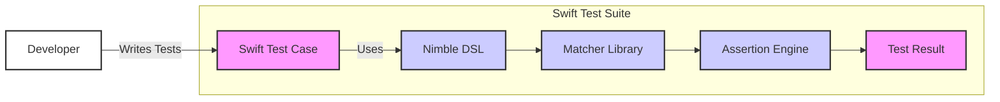

# Project Design Document: Nimble Testing Framework

**Project Name:** Nimble

**Project Repository:** [https://github.com/quick/nimble](https://github.com/quick/nimble)

**Document Version:** 1.1
**Date:** October 27, 2023
**Author:** AI Expert

## 1. Project Overview

### 1.1. Project Goals and Objectives

*   **Primary Goal:** To provide a Swift-based framework for expressing expectations in tests in a descriptive and human-readable manner.
*   **Objectives:**
    *   Offer a rich set of matchers for common testing scenarios, covering various data types and assertion needs.
    *   Enable developers to write expressive and maintainable tests, reducing boilerplate and improving test clarity.
    *   Integrate seamlessly with popular Swift testing frameworks like XCTest and Swift Package Manager, ensuring broad compatibility.
    *   Provide robust asynchronous testing capabilities, handling complex asynchronous operations in tests.
    *   Maintain a stable and reliable testing framework for the Swift community through continuous development and bug fixes.

### 1.2. Target Audience

*   Swift developers writing unit, integration, and UI tests for iOS, macOS, watchOS, tvOS, and Linux applications and libraries, across all experience levels.
*   Quality Assurance engineers using Swift for test automation, seeking a more expressive and less error-prone assertion library.
*   Developers seeking a more readable and expressive alternative to standard assertion libraries, improving collaboration and understanding within development teams.

### 1.3. High-Level Project Description

Nimble is a Swift framework designed to make writing assertions in tests more enjoyable and expressive. It provides a domain-specific language (DSL) for expressing expectations, using "matchers" to define conditions that must be met for a test to pass. Nimble aims to improve test readability and maintainability by moving away from verbose and less intuitive assertion syntax. It integrates with existing Swift testing frameworks and supports both synchronous and asynchronous testing scenarios. Nimble is distributed as a Swift package and is intended to be included as a development dependency in Swift projects, requiring minimal setup and configuration.

## 2. System Architecture

### 2.1. High-Level Architecture Diagram

### 2.2. Component Description

*   **Swift Test Case:** Represents an individual test within a Swift test suite (e.g., using XCTest). Developers write test cases that utilize Nimble for assertions to verify the behavior of their code.
*   **Nimble DSL (Domain Specific Language):** Provides the expressive syntax for writing assertions. This includes keywords like `expect`, `to`, `toNot`, `equal`, `beNil`, `contain`, `throwError`, etc. It acts as the user-facing API of Nimble, making tests more readable and intent-revealing.
*   **Matcher Library:** A collection of pre-built matchers for common assertion types (e.g., equality, nil checks, collection containment, string matching, type checking, error handling, asynchronous operations). Developers can also create custom matchers to extend Nimble's capabilities for specific testing needs.
*   **Assertion Engine:** The core component that evaluates the expectations defined using the DSL and matchers. It orchestrates the execution of matchers, performs the actual comparison between the actual and expected values, handles asynchronous operations, and determines if an assertion passes or fails. It also manages failure reporting and diagnostic message generation.
*   **Test Result:** The outcome of an assertion, indicating whether it passed or failed. These results are reported back to the testing framework (e.g., XCTest) and ultimately to the developer through test reports and console output.
*   **Developer:** The user who writes Swift tests and utilizes Nimble to create expressive assertions within those tests, improving the quality and reliability of their Swift code.

### 2.3. Data Flow Diagram

```mermaid
graph LR
    A["Test Case Execution"] --> B{{"expect(actualValue)"}};
    B --> C["Matcher Selection (e.g., .to(equal(expectedValue)))"];
    C --> D["Matcher Execution (equal Matcher)"];
    D --> E["Assertion Engine"];
    E --> F{{"Comparison (actualValue vs expectedValue)"}};
    F -- Pass --> G["Test Result: Success"];
    F -- Fail --> H["Test Result: Failure"];
    G --> I["Report to Testing Framework"];
    H --> I;
    style A fill:#f9f,stroke:#333,stroke-width:2px
    style B fill:#ccf,stroke:#333,stroke-width:2px
    style C fill:#ccf,stroke:#333,stroke-width:2px
    style D fill:#ccf,stroke:#333,stroke-width:2px
    style E fill:#ccf,stroke:#333,stroke-width:2px
    style F fill:#ccf,stroke:#333,stroke-width:2px
    style G fill:#f9f,stroke:#333,stroke-width:2px
    style H fill:#f9f,stroke:#333,stroke-width:2px
    style I fill:#f9f,stroke:#333,stroke-width:2px
```

### 2.4. Technology Stack

*   **Programming Language:** Swift, leveraging modern Swift language features and paradigms.
*   **Build System/Package Manager:** Swift Package Manager (SPM), for dependency management, building, and distribution.
*   **Testing Framework Integration:** Primarily designed for XCTest, but aims for broader compatibility with other Swift testing frameworks and environments.
*   **Distribution:** Swift Package Manager (dependency management), making it easy to integrate Nimble into Swift projects.
*   **Version Control:** Git (via GitHub repository), for source code management and collaboration.
*   **Continuous Integration/Continuous Delivery (CI/CD):**  Utilized for automated testing, building, and release processes of Nimble itself.

## 3. Security Considerations

### 3.1. Authentication and Authorization

*   **Not Applicable:** Nimble is a testing framework and does not handle user authentication or authorization in the context of its own operation. It operates within the security context of the development environment and the application being tested.
*   **Indirect Relevance:**  The security of the *tests themselves* is important. If tests are compromised (e.g., malicious test cases are introduced), they could potentially be used to bypass security checks, leak sensitive information during development or CI/CD processes, or introduce vulnerabilities into the application under test.  Proper access control and code review processes for test code are crucial.

### 3.2. Data Storage and Handling

*   **Minimal Data Storage:** Nimble itself does not persistently store application data. It operates in memory during test execution, handling data passed to it by the test cases.
*   **Test Data:** Tests written using Nimble may interact with application data. The security of this data handling is the responsibility of the application being tested and the test suite design, not Nimble itself. Developers must ensure secure data handling practices in their tests.
*   **Sensitive Information in Tests:** Developers should strictly avoid hardcoding sensitive information (e.g., API keys, passwords, secrets) directly within test cases. Secure methods for managing test data and secrets, such as environment variables, dedicated secret management tools, or mock data, should be employed in the testing environment.

### 3.3. Input Validation and Output Encoding

*   **Input Validation in Matchers:** Matchers within Nimble perform implicit input validation by checking the types and values being compared to ensure they are compatible with the matcher's logic. For example, `equal` matcher validates that the compared types are equatable. Custom matchers should be designed with explicit and robust input validation to prevent unexpected behavior, crashes, or security vulnerabilities arising from malformed or unexpected inputs. This includes null checks, type validation, and range checks where applicable.
*   **Output Encoding:** Nimble's output is primarily in the form of test results (pass/fail) and diagnostic messages, which are strings intended for developer consumption. Output encoding is generally handled by the testing framework and the development environment's console or reporting mechanisms. Nimble itself does not perform specific output encoding for security purposes, but it's important to ensure that diagnostic messages do not inadvertently leak sensitive information.

### 3.4. Communication Security

*   **Not Applicable:** Nimble does not involve network communication as part of its core functionality. It operates within the process of the test execution environment.
*   **Indirect Relevance:** If tests written using Nimble interact with network services, the security of that communication (e.g., using HTTPS, TLS, secure protocols) is the responsibility of the application being tested and the test suite design, not Nimble. Tests should adhere to secure communication practices when interacting with external systems.

### 3.5. Logging and Monitoring

*   **Test Logging:** Nimble integrates with the logging mechanisms of the underlying testing framework (e.g., XCTest). Test execution logs will typically include information about assertions, including failures and detailed diagnostic messages provided by Nimble matchers. These logs are crucial for debugging and understanding test failures.
*   **Monitoring:** Nimble itself does not provide specific monitoring capabilities. Monitoring of test execution performance and trends is typically handled by CI/CD systems or development environment tools.
*   **Security Logging Considerations:**  Test logs can be valuable for debugging and identifying issues, including potential security flaws. In security-sensitive contexts, it's critically important to ensure that test logs do not inadvertently expose sensitive information such as passwords, API keys, or personally identifiable information (PII). Secure logging practices should be implemented to sanitize or redact sensitive data from test logs.

### 3.6. Dependency Management Security

*   **Swift Package Manager Dependencies:** Nimble relies on dependencies managed by Swift Package Manager. Security vulnerabilities in Nimble's dependencies (transitive dependencies included) could potentially impact projects using Nimble.
*   **Dependency Auditing:** Regular and automated auditing of Nimble's dependencies is crucial. This includes using dependency scanning tools to identify known vulnerabilities in dependencies and updating to secure versions promptly.  The Nimble project should also practice dependency minimization, only including necessary dependencies to reduce the attack surface.
*   **Supply Chain Security:**  Ensuring the security of the Nimble supply chain, including the Swift Package Registry and build processes, is important to prevent the introduction of compromised dependencies or malicious code.

## 4. Deployment Architecture

### 4.1. Deployment Environment

*   **Development Environment:** Nimble is primarily "deployed" within developer's local development environments (e.g., Xcode) and CI/CD environments, wherever Swift tests are executed.
*   **Integration as a Library:** Nimble is integrated into Swift projects as a Swift Package Manager dependency. It is not deployed as a standalone application or service, but rather as a library embedded within Swift projects.

### 4.2. Deployment Diagram

### 4.3. Scalability and Availability Considerations

*   **Not Directly Applicable:** Scalability and availability are not directly applicable to Nimble in the traditional sense of a deployed application or service. Nimble's performance impact is generally minimal and does not introduce scalability concerns.
*   **Test Suite Scalability:** The performance and scalability of test suites using Nimble depend on the design of the tests themselves, the complexity of the application being tested, and the efficiency of the matchers used, not Nimble's inherent limitations.  Well-designed tests are crucial for maintaining scalable test suites.
*   **Availability:** Nimble's "availability" is tied to the availability of the Swift Package Manager and the development environment infrastructure. As a library distributed via SPM, it is generally highly available as long as the Swift ecosystem infrastructure is operational.  Outages in SPM or GitHub could temporarily impact access to Nimble.

## 5. Threat Modeling Preparation

### 5.1. Assets

*   **Nimble Framework Codebase:** The source code of the Nimble framework itself, hosted on GitHub. Integrity, confidentiality (to prevent unauthorized modifications), and availability are important to ensure a reliable and trustworthy testing framework.
*   **Nimble's Release Infrastructure:** The systems and processes used to build, test, and release new versions of Nimble, including CI/CD pipelines, signing keys, and distribution mechanisms. Security of this infrastructure is vital to prevent supply chain attacks.
*   **Developer Environments Using Nimble:** The environments where developers use Nimble to write and run tests, including local machines and CI/CD agents. Security of these environments is crucial to prevent compromised tests or development workflows that could introduce vulnerabilities.
*   **Test Suites Using Nimble:** The collection of tests written using Nimble for various projects. Integrity of these test suites is important for ensuring the quality and security of the software being tested. Tampering with tests can lead to undetected vulnerabilities.
*   **Test Results and Logs:** Information generated during test execution, which can contain diagnostic data, performance metrics, and potentially sensitive information if not handled carefully. Confidentiality and integrity of test results can be important in certain contexts.

### 5.2. Threat Landscape

*   **Dependency Vulnerabilities:** Exploitation of known vulnerabilities in Nimble's direct or transitive dependencies. Attack vectors include leveraging public exploits or zero-day vulnerabilities in vulnerable libraries. Impact could range from denial of service to code execution within developer environments or CI/CD systems. Mitigation includes regular dependency scanning and updates.
*   **Malicious Code Injection (into Nimble codebase):**  Compromise of the Nimble repository (e.g., GitHub account compromise, supply chain attack on maintainer infrastructure) or release process could lead to the distribution of a malicious version of Nimble. Attack vectors include pull request poisoning, compromised maintainer accounts, or vulnerabilities in release automation tools. Impact could be widespread, affecting all projects using the compromised Nimble version, potentially leading to code execution, data theft, or backdoors in applications under test. Mitigation includes strong access controls, code review processes, and secure release pipelines.
*   **Denial of Service (DoS) against Nimble repository/distribution:**  Disrupting access to the Nimble GitHub repository or Swift Package Registry could temporarily impact development workflows, preventing developers from downloading or updating Nimble. Attack vectors could include DDoS attacks against GitHub or SPM infrastructure. While less likely for a widely used open-source project, it's a potential availability threat. Mitigation relies on the resilience of GitHub and SPM infrastructure.
*   **Compromised Development Environments:** If developer environments are compromised (e.g., malware infection, insider threat), malicious tests could be introduced or existing tests could be altered to bypass security checks or exfiltrate sensitive data. Attack vectors include phishing, malware, or insider actions. Impact could be the introduction of vulnerabilities into the application under test or data breaches. Mitigation includes endpoint security, access control, and security awareness training for developers.
*   **Information Disclosure in Test Logs:**  Accidental exposure of sensitive information (e.g., API keys, passwords, PII) in test logs if logging is not configured securely or if tests are not designed to avoid logging sensitive data. Attack vectors include misconfigured logging frameworks or poorly written tests. Impact could be data breaches or unauthorized access to sensitive resources. Mitigation includes secure logging practices, log sanitization, and developer training.
*   **Logic Bugs in Matchers:**  Bugs in Nimble's matchers could lead to incorrect test results (false positives or false negatives), potentially masking real issues, including security vulnerabilities, in the software being tested. Attack vectors are unintentional coding errors in matcher implementations. Impact could be undetected vulnerabilities in applications under test. Mitigation includes thorough testing of Nimble matchers, code reviews, and community contributions to identify and fix bugs.

### 5.3. Assumptions and Out of Scope

*   **Assumptions:**
    *   Developers using Nimble are responsible for the security of their own test suites, test data, and development environments.
    *   The underlying Swift testing frameworks (e.g., XCTest) and Swift Package Manager are assumed to be reasonably secure and follow security best practices.
    *   GitHub's infrastructure and Swift Package Registry are assumed to be generally secure and resilient against common attacks.
    *   Developers will use Nimble as intended and will not intentionally misuse it for malicious purposes.
*   **Out of Scope:**
    *   Security of the applications being tested using Nimble. Nimble is a tool to aid in testing, but application security is the responsibility of the application developers.
    *   Detailed security analysis of the Swift language or compiler.
    *   Operational security of GitHub or Swift Package Manager infrastructure (beyond the scope of the Nimble project itself).
    *   Specific security configurations of developer machines or CI/CD environments using Nimble. These are the responsibility of the organizations using Nimble.
    *   Performance testing and optimization of Nimble. This document focuses on security design considerations.

This document provides a foundation for conducting a more detailed threat model of the Nimble testing framework and its usage within software development workflows. The next step would be to use this design document to perform a structured threat modeling exercise (e.g., using STRIDE) to identify specific threats, vulnerabilities, and mitigation strategies in more granular detail. This will involve analyzing each component and data flow in the context of the identified assets and threats.