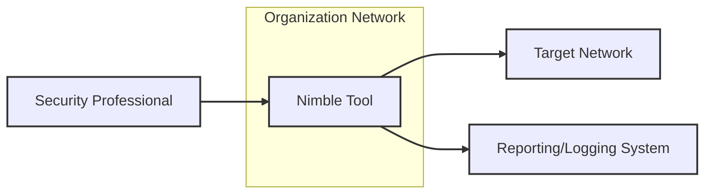
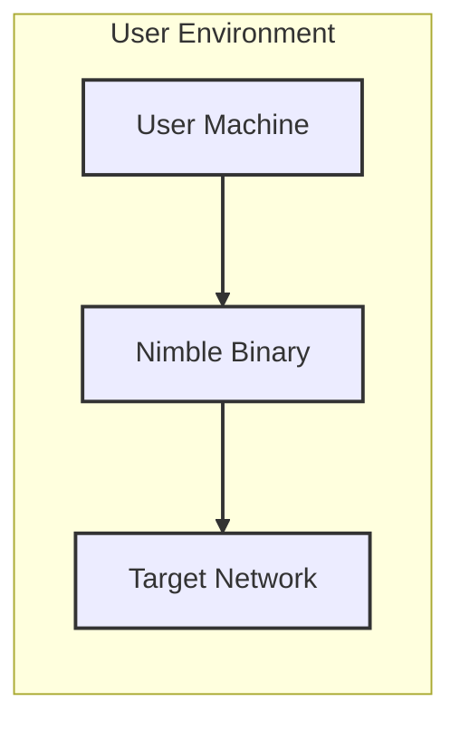
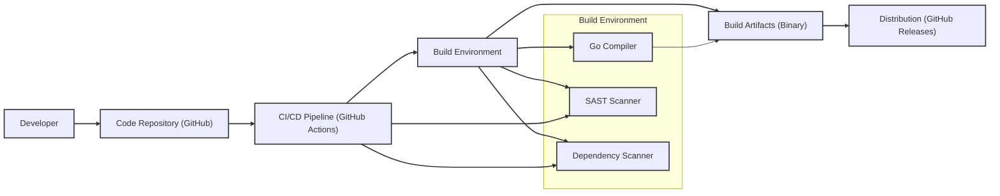

# BUSINESS POSTURE

- Business Priorities and Goals:
  - Provide a fast and efficient network scanning tool.
  - Offer a modular and extensible architecture for diverse scanning needs.
  - Enable security professionals and developers to quickly assess network security posture.
  - Deliver a command-line tool that is easy to use and integrate into existing workflows.
- Business Risks:
  - Misuse of the tool for unauthorized network scanning or malicious activities.
  - Vulnerabilities within the Nimble tool itself could be exploited to compromise systems.
  - Inaccurate or incomplete scan results leading to flawed security assessments.
  - Lack of user-friendliness hindering adoption and effective use.
  - Potential for the tool to be detected by intrusion detection systems (IDS) during legitimate use, causing alerts and investigations.

# SECURITY POSTURE

- Existing Security Controls:
  - security control: Go Language Security - Nimble is written in Go, which benefits from Go's built-in security features and standard libraries. (Implemented in: Language choice)
  - security control: Dependency Management - Go modules are used for dependency management, which helps in tracking and managing dependencies. (Implemented in: go.mod and go.sum files)
  - security control: Open Source - Being open source allows for community review and contributions, potentially leading to faster identification and resolution of security issues. (Implemented in: Public GitHub repository)
- Accepted Risks:
  - accepted risk: Dependency Vulnerabilities -  Reliance on external Go modules introduces potential vulnerabilities from those dependencies. Mitigation is through regular dependency updates and vulnerability scanning.
  - accepted risk: Misuse of Tool - As a network scanning tool, Nimble can be misused for malicious purposes. This risk is inherent to the nature of security tools and is mitigated by responsible use and ethical guidelines.
  - accepted risk: Information Disclosure during Scanning - Network scanning inherently involves sending and receiving network packets, which could potentially disclose information to network observers. This is mitigated by using Nimble in controlled environments and understanding network traffic patterns.
- Recommended Security Controls:
  - security control: Static Application Security Testing (SAST) - Implement SAST tools in the CI/CD pipeline to automatically scan the codebase for potential vulnerabilities.
  - security control: Dependency Vulnerability Scanning - Integrate dependency vulnerability scanning tools to automatically check for vulnerabilities in Go modules used by Nimble.
  - security control: Input Validation - Implement robust input validation for all user-provided inputs, such as target networks, ports, and scan options, to prevent injection attacks.
  - security control: Secure Build Pipeline - Harden the build pipeline to ensure the integrity and authenticity of the Nimble binary.
  - security control: Code Review - Conduct regular code reviews, including security-focused reviews, to identify and address potential security flaws.
- Security Requirements:
  - Authentication: Not applicable for the core functionality of Nimble as a command-line scanning tool. Authentication might be relevant if Nimble is extended with features like result storage or a web interface in the future.
  - Authorization: Not applicable for the core functionality of Nimble as a command-line scanning tool. Authorization might be relevant if Nimble is extended with features like multi-user access or role-based access control in the future.
  - Input Validation: Critical for preventing injection vulnerabilities. All user inputs, including target specifications, port ranges, and scan options, must be thoroughly validated and sanitized.
  - Cryptography:  Potentially relevant for future features like secure storage of scan results or encrypted communication channels if Nimble is extended beyond a simple command-line tool. Currently not a primary requirement for the core scanning functionality.

# DESIGN

## C4 CONTEXT



- Context Diagram Elements:
  - - Name: Nimble Tool
    - Type: Software System
    - Description: Nimble is a fast, modular network scanning tool written in Go. It is used to discover and assess network devices and services.
    - Responsibilities:
      - Perform network scans based on user-defined configurations.
      - Provide scan results in a structured format.
      - Support various scanning techniques and modules.
    - Security controls:
      - Input validation for scan targets and options.
      - Secure handling of scan results (if persistence is added in future).
  - - Name: Security Professional
    - Type: Person
    - Description: Security professionals use Nimble to assess the security posture of networks, identify vulnerabilities, and perform penetration testing.
    - Responsibilities:
      - Define scan targets and configurations.
      - Interpret scan results.
      - Take action based on scan findings.
    - Security controls:
      - Responsible use of the tool.
      - Secure storage and handling of scan results.
  - - Name: Target Network
    - Type: External System
    - Description: The network infrastructure being scanned by Nimble. It can be an internal network, external network, or cloud environment.
    - Responsibilities:
      - Respond to scan requests from Nimble.
      - Host network devices and services being scanned.
    - Security controls:
      - Network security controls (firewalls, IDS/IPS) to protect against unauthorized scanning and access.
  - - Name: Reporting/Logging System
    - Type: External System
    - Description: A system used to store, analyze, and report on scan results generated by Nimble. This could be a SIEM, log management system, or a simple file storage.
    - Responsibilities:
      - Receive and store scan results from Nimble.
      - Provide reporting and analysis capabilities.
      - Ensure secure storage and access to scan data.
    - Security controls:
      - Access control to scan results.
      - Encryption of stored scan data (if sensitive).
      - Audit logging of access and modifications.

## C4 CONTAINER

```mermaid
flowchart LR
    subgraph "Nimble Tool"
        subgraph "Command-Line Interface (CLI)"
            CLI["CLI"]
        end
        subgraph "Scan Engine"
            ScanEngine["Scan Engine"]
            ScanModules["Scan Modules"]
        end
        subgraph "Configuration"
            Configuration["Configuration"]
        end
        subgraph "Output"
            Output["Output Formatter"]
        end
    end

    CLI --> Configuration
    CLI --> ScanEngine
    ScanEngine --> ScanModules
    ScanEngine --> Output
    Output --> CLI

    linkStyle 0,1,2,3,4 stroke:#333,stroke-width:2px;

    classDef element stroke:#333,stroke-width:2px;
    class CLI,ScanEngine,ScanModules,Configuration,Output element;
```

- Container Diagram Elements:
  - - Name: Command-Line Interface (CLI)
    - Type: Application
    - Description: The command-line interface is the primary way users interact with Nimble. It parses user commands, manages configuration, initiates scans, and displays results.
    - Responsibilities:
      - Accept user input and commands.
      - Parse command-line arguments.
      - Manage configuration settings.
      - Initiate scan execution.
      - Display scan results to the user.
    - Security controls:
      - Input validation of command-line arguments.
      - Secure handling of configuration data.
  - - Name: Scan Engine
    - Type: Application
    - Description: The core component of Nimble responsible for orchestrating and executing network scans. It manages scan modules and processes scan results.
    - Responsibilities:
      - Manage scan modules.
      - Execute scan tasks.
      - Process scan results from modules.
      - Coordinate scanning activities.
    - Security controls:
      - Secure module loading and execution.
      - Resource management during scans to prevent denial-of-service.
  - - Name: Scan Modules
    - Type: Library
    - Description:  Modular components that implement specific scanning techniques (e.g., TCP connect scan, SYN scan, UDP scan, service detection). Nimble's modularity allows for easy extension with new scan types.
    - Responsibilities:
      - Implement specific network scanning techniques.
      - Return scan results in a standardized format.
    - Security controls:
      - Secure coding practices within modules to prevent vulnerabilities.
      - Input validation within modules.
  - - Name: Configuration
    - Type: Data Store (in-memory or file-based)
    - Description: Manages configuration settings for Nimble, such as scan options, module settings, and output formats. Configuration can be loaded from files or provided via command-line arguments.
    - Responsibilities:
      - Store and retrieve configuration settings.
      - Validate configuration parameters.
    - Security controls:
      - Secure storage of configuration data (if persistent).
      - Access control to configuration files (if applicable).
  - - Name: Output Formatter
    - Type: Application
    - Description: Responsible for formatting scan results into various output formats (e.g., plain text, JSON, CSV) for display or further processing.
    - Responsibilities:
      - Format scan results according to user-specified formats.
      - Output results to the console or files.
    - Security controls:
      - Secure handling of scan results during formatting.
      - Prevention of output injection vulnerabilities (if applicable).

## DEPLOYMENT

- Deployment Options:
  - Standalone Binary: Nimble can be distributed and deployed as a standalone executable binary for various operating systems (Linux, macOS, Windows). This is the most likely and simplest deployment method.
  - Containerized (Docker): Nimble can be containerized using Docker, allowing for consistent deployment across different environments. This provides isolation and simplifies dependency management.
  - Package Manager: Nimble could be packaged and distributed through system package managers (e.g., apt, yum, brew) for easier installation on specific operating systems.

- Detailed Deployment (Standalone Binary - most likely scenario):



- Deployment Diagram Elements (Standalone Binary):
  - - Name: User Machine
    - Type: Infrastructure
    - Description: The user's computer or server where the Nimble binary is executed. This could be a laptop, desktop, virtual machine, or cloud instance.
    - Responsibilities:
      - Provide the execution environment for Nimble.
      - Provide network connectivity to the target network.
    - Security controls:
      - Operating system security controls (access control, patching).
      - Endpoint security software (antivirus, EDR).
  - - Name: Nimble Binary
    - Type: Software Deployment Unit
    - Description: The compiled executable file of the Nimble tool, deployed on the user machine.
    - Responsibilities:
      - Execute network scans as instructed by the user.
    - Security controls:
      - Integrity of the binary (verified during build and distribution).
      - Least privilege execution (run with necessary permissions only).
  - - Name: Target Network
    - Type: Infrastructure
    - Description: The network being scanned, which is external to the user machine and Nimble deployment environment.
    - Responsibilities:
      - Host the systems and services being scanned.
      - Respond to network scan requests.
    - Security controls:
      - Network security controls (firewalls, IDS/IPS).
      - System hardening on target devices.

## BUILD



- Build Process Elements:
  - - Name: Developer
    - Type: Person
    - Description: Software developers who write and maintain the Nimble codebase.
    - Responsibilities:
      - Write secure and functional code.
      - Commit code changes to the repository.
      - Participate in code reviews.
    - Security controls:
      - Secure coding training.
      - Secure development environment.
      - Code review process.
  - - Name: Code Repository (GitHub)
    - Type: Software System
    - Description: GitHub repository hosting the Nimble source code, used for version control and collaboration.
    - Responsibilities:
      - Store and manage source code.
      - Track code changes and history.
      - Facilitate collaboration among developers.
    - Security controls:
      - Access control to the repository.
      - Branch protection and code review requirements.
      - Audit logging of repository activities.
  - - Name: CI/CD Pipeline (GitHub Actions)
    - Type: Software System
    - Description: Automated CI/CD pipeline using GitHub Actions to build, test, and package Nimble.
    - Responsibilities:
      - Automate the build process.
      - Run automated tests.
      - Perform security scans (SAST, dependency scanning).
      - Package and release build artifacts.
    - Security controls:
      - Secure pipeline configuration.
      - Access control to pipeline workflows and secrets.
      - Audit logging of pipeline executions.
  - - Name: Build Environment
    - Type: Infrastructure
    - Description: The environment where the Nimble code is compiled and built. This includes tools like Go compiler, SAST scanner, and dependency scanner.
    - Responsibilities:
      - Provide necessary tools for building Nimble.
      - Execute build steps and security scans.
    - Security controls:
      - Hardened build environment.
      - Regularly updated build tools.
      - Isolation of build environment.
  - - Name: Build Artifacts (Binary)
    - Type: Software Deployment Unit
    - Description: The compiled Nimble executable binary, ready for distribution.
    - Responsibilities:
      - Package the compiled binary.
      - Ensure integrity of the binary.
    - Security controls:
      - Code signing of the binary (optional, but recommended).
      - Checksums or hashes for binary integrity verification.
  - - Name: Distribution (GitHub Releases)
    - Type: Software System
    - Description: GitHub Releases used to distribute Nimble binaries to users.
    - Responsibilities:
      - Host and distribute Nimble binaries.
      - Provide release notes and documentation.
    - Security controls:
      - Secure access to release management.
      - HTTPS for download distribution.
      - Verification mechanisms for downloaded binaries (checksums, signatures).
  - - Name: Go Compiler
    - Type: Tool
    - Description: The Go compiler used to compile Nimble source code into an executable binary.
    - Responsibilities:
      - Compile Go code into machine code.
    - Security controls:
      - Use of a trusted and verified Go compiler version.
  - - Name: SAST Scanner
    - Type: Tool
    - Description: Static Application Security Testing tool used to scan the Nimble source code for potential vulnerabilities.
    - Responsibilities:
      - Analyze source code for security flaws.
      - Generate reports of identified vulnerabilities.
    - Security controls:
      - Properly configured and updated SAST scanner.
  - - Name: Dependency Scanner
    - Type: Tool
    - Description: Tool used to scan Nimble's dependencies (Go modules) for known vulnerabilities.
    - Responsibilities:
      - Analyze dependencies for known vulnerabilities.
      - Generate reports of identified vulnerabilities.
    - Security controls:
      - Properly configured and updated dependency scanner.

# RISK ASSESSMENT

- Critical Business Processes:
  - Providing network scanning functionality to security professionals and developers.
  - Maintaining the integrity and availability of the Nimble tool itself.
  - Ensuring the accuracy and reliability of scan results.
- Data to Protect:
  - Scan Configurations: Relatively low sensitivity, but could reveal scanning strategies if exposed.
  - Scan Results: Potentially high sensitivity. Scan results can contain detailed information about network infrastructure, open ports, services, and potential vulnerabilities. Sensitivity depends on the target network and the scope of the scan.
  - Nimble Binary: High sensitivity. Compromise of the Nimble binary could lead to distribution of a malicious version of the tool.

# QUESTIONS & ASSUMPTIONS

- Questions:
  - What is the intended user base for Nimble? (Assumed: Security professionals and developers)
  - What are the primary use cases for Nimble? (Assumed: Network security assessments, vulnerability scanning, penetration testing)
  - Are there any specific regulatory compliance requirements for Nimble or its users? (Assumed: General security best practices apply)
  - Are there plans to extend Nimble with features beyond command-line scanning, such as result storage, reporting dashboards, or a web interface? (Assumed: Currently a command-line tool, future extensions are possible but not defined)
  - What is the expected sensitivity of the networks and systems that Nimble will be used to scan? (Assumed: Potentially sensitive networks, requiring secure handling of scan results)
- Assumptions:
  - BUSINESS POSTURE: The primary goal is to provide a useful and efficient network scanning tool for security purposes.
  - SECURITY POSTURE: Security is a consideration, but the project is currently in an early stage and may not have implemented all recommended security controls yet. Focus is on core functionality first.
  - DESIGN: Nimble is primarily designed as a command-line tool with a modular architecture. Deployment is expected to be as a standalone binary. Build process uses standard Go tooling and GitHub Actions for CI/CD.