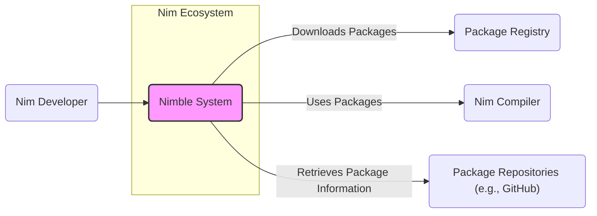
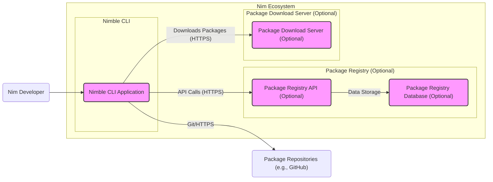
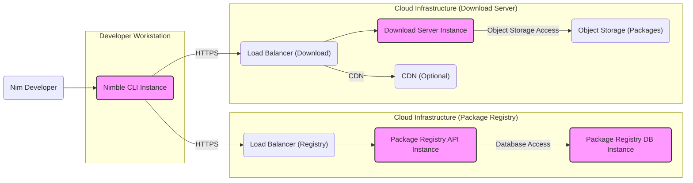
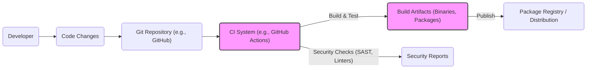

# BUSINESS POSTURE

This project, Nimble, aims to provide a robust and user-friendly package manager for the Nim programming language. The primary business goal is to foster the growth and adoption of Nim by simplifying dependency management and package distribution for Nim developers. This involves creating a tool that is reliable, efficient, and secure, enabling developers to easily discover, install, and manage Nim packages.

Key business priorities include:
- Ease of use for Nim developers to manage dependencies.
- Reliability and availability of package management services.
- A rich ecosystem of Nim packages accessible through Nimble.
- Security and integrity of packages to protect developers from malicious software.
- Community growth and contribution to the Nim package ecosystem.

The most important business risks that need to be addressed are:
- Risk of package integrity compromise, leading to distribution of malicious packages.
- Risk of service unavailability, disrupting Nim development workflows.
- Risk of vulnerabilities in Nimble itself, affecting the security of Nim developers' environments.
- Risk of slow adoption if Nimble is not user-friendly or reliable.

# SECURITY POSTURE

Existing security controls:
- security control: Code hosted on GitHub, leveraging GitHub's infrastructure security. Implemented: GitHub.
- security control: Open source project, allowing for community review and scrutiny. Implemented: Open source nature of the project.
- security control: HTTPS used for accessing GitHub and potentially package download locations. Implemented: Web servers and GitHub infrastructure.

Accepted risks:
- accepted risk: Reliance on community contributions for security vulnerability identification and patching.
- accepted risk: Potential for vulnerabilities in dependencies used by Nimble.
- accepted risk: Lack of formal security audits.

Recommended security controls:
- security control: Implement automated vulnerability scanning for Nimble codebase and dependencies.
- security control: Implement package signing to ensure package integrity and authenticity.
- security control: Introduce dependency scanning to identify and manage vulnerable dependencies within packages.
- security control: Implement a process for reporting and handling security vulnerabilities.
- security control: Enforce security best practices in development, including secure coding guidelines and regular security training for contributors.

Security requirements:
- Authentication:
    - Requirement: For package publishing, ensure only authorized developers can upload new packages or versions.
    - Requirement: Consider authentication for administrative tasks related to the package registry (if applicable).
- Authorization:
    - Requirement: Implement authorization controls to manage access to package publishing and administrative functions.
    - Requirement: Ensure users can only access and manage packages they are authorized to.
- Input validation:
    - Requirement: Validate all inputs to Nimble CLI and any backend services to prevent injection attacks and other input-related vulnerabilities.
    - Requirement: Sanitize package metadata and descriptions to prevent cross-site scripting (XSS) if displayed in a web interface.
- Cryptography:
    - Requirement: Use HTTPS for all communication between Nimble CLI and backend services.
    - Requirement: Implement package signing using cryptographic signatures to ensure integrity and authenticity of packages.
    - Requirement: Securely store and manage any cryptographic keys used for package signing or authentication.

# DESIGN

## C4 CONTEXT

Elements of context diagram:
- - Name: Nimble
  - Type: System
  - Description: Nimble is the Nim package manager, used to discover, install, and manage Nim packages and dependencies.
  - Responsibilities:
    - Package discovery and search.
    - Package installation and uninstallation.
    - Dependency resolution.
    - Package management operations (e.g., listing installed packages, updating packages).
  - Security controls:
    - Input validation on user commands.
    - HTTPS for communication with package registry and repositories.
    - Package signature verification (recommended).

- - Name: Nim Developer
  - Type: User
  - Description: Software developers who use Nimble to manage dependencies for their Nim projects.
  - Responsibilities:
    - Using Nimble CLI to manage project dependencies.
    - Publishing Nim packages to the registry (package authors).
  - Security controls:
    - User authentication for package publishing (if applicable).
    - Securely storing credentials for package registries (if applicable).

- - Name: Package Registry
  - Type: External System
  - Description: A central repository (if it exists) that stores package metadata and potentially package files, allowing Nimble to discover and download packages. This could be a dedicated service or a decentralized system relying on package repositories.
  - Responsibilities:
    - Storing and serving package metadata.
    - Hosting package files for download (potentially).
    - Providing search and discovery capabilities for packages.
  - Security controls:
    - Access control to package metadata and files.
    - HTTPS for serving content.
    - Protection against denial-of-service attacks.
    - Package signature verification (if implemented).

- - Name: Nim Compiler
  - Type: External System
  - Description: The Nim compiler, which uses Nimble to resolve and install project dependencies during the compilation process.
  - Responsibilities:
    - Compiling Nim code.
    - Integrating with Nimble to resolve and install dependencies.
  - Security controls:
    - Not directly responsible for Nimble's security, but relies on Nimble for secure package delivery.

- - Name: Package Repositories (e.g., GitHub)
  - Type: External System
  - Description: Version control systems like GitHub, GitLab, or similar, where Nim packages are hosted. Nimble might retrieve package information or download packages directly from these repositories.
  - Responsibilities:
    - Hosting Nim package source code and related files.
    - Providing access to package files for download.
  - Security controls:
    - Repository access controls (e.g., public/private repositories).
    - HTTPS for accessing repositories.
    - Security features provided by the hosting platform (e.g., GitHub security scanning).

## C4 CONTAINER

Elements of container diagram:
- - Name: Nimble CLI Application
  - Type: Application
  - Description: Command-line interface application that Nim developers interact with to manage Nim packages. This is the primary interface for Nimble.
  - Responsibilities:
    - Processing user commands.
    - Interacting with Package Registry API (if applicable).
    - Downloading packages from Download Server or Package Repositories.
    - Managing local package installations.
  - Security controls:
    - Input validation of user commands.
    - Secure storage of user credentials (if needed for registry authentication).
    - HTTPS for communication with backend services and repositories.
    - Package signature verification (recommended).

- - Name: Package Registry API (Optional)
  - Type: Web Application
  - Description: REST API for accessing and managing package metadata in the Package Registry. This component is optional if Nimble operates in a decentralized manner.
  - Responsibilities:
    - Providing API endpoints for package search, metadata retrieval, and package publishing.
    - Authentication and authorization for package publishing and administrative tasks.
    - Data validation and sanitization.
  - Security controls:
    - HTTPS enforcement.
    - Authentication and authorization mechanisms.
    - Input validation and output encoding to prevent injection attacks.
    - Rate limiting and protection against denial-of-service attacks.

- - Name: Package Registry Database (Optional)
  - Type: Data Store
  - Description: Database to store package metadata, user accounts (if needed), and other registry-related data. This component is optional and depends on whether a centralized registry is implemented.
  - Responsibilities:
    - Persistent storage of package metadata.
    - User account management (if applicable).
    - Data integrity and availability.
  - Security controls:
    - Access control to the database.
    - Data encryption at rest and in transit.
    - Regular backups and disaster recovery mechanisms.

- - Name: Package Download Server (Optional)
  - Type: Web Server
  - Description: Web server for hosting and serving package files for download. This component is optional, packages might be downloaded directly from package repositories.
  - Responsibilities:
    - Hosting and serving package files.
    - Handling download requests from Nimble CLI.
    - Potentially providing CDN capabilities for faster downloads.
  - Security controls:
    - HTTPS enforcement.
    - Access control to package files (if needed).
    - Protection against denial-of-service attacks.

- - Name: Package Repositories (e.g., GitHub)
  - Type: External System
  - Description: Version control systems hosting Nim package source code. Nimble CLI interacts with these repositories to retrieve package information and potentially download packages.
  - Responsibilities:
    - Hosting package source code and files.
    - Providing access to package data via Git or HTTPS.
  - Security controls:
    - Repository access controls.
    - Security features provided by the hosting platform.

## DEPLOYMENT

Deployment architecture can vary. Here we describe a possible deployment scenario using cloud infrastructure for a centralized package registry and download server, and end-users running Nimble CLI locally.

Elements of deployment diagram:
- - Name: Nimble CLI Instance
  - Type: Software Instance
  - Description: An instance of the Nimble CLI application running on a developer's workstation.
  - Responsibilities:
    - Executing Nimble commands.
    - Communicating with backend services.
  - Security controls:
    - Operating system and workstation security controls.
    - User access controls on the workstation.

- - Name: Load Balancer (Registry)
  - Type: Infrastructure Component
  - Description: Load balancer distributing traffic to Package Registry API instances.
  - Responsibilities:
    - Distributing incoming requests.
    - Ensuring high availability and scalability of the Registry API.
  - Security controls:
    - DDoS protection.
    - SSL termination.

- - Name: Package Registry API Instance
  - Type: Software Instance
  - Description: Running instance of the Package Registry API application.
  - Responsibilities:
    - Handling API requests.
    - Interacting with the database.
  - Security controls:
    - Application-level security controls (authentication, authorization, input validation).
    - Security hardening of the server environment.

- - Name: Package Registry DB Instance
  - Type: Infrastructure Component
  - Description: Database instance for storing Package Registry data.
  - Responsibilities:
    - Persistent data storage.
    - Data integrity and availability.
  - Security controls:
    - Database access controls.
    - Data encryption at rest and in transit.
    - Regular backups.

- - Name: Load Balancer (Download)
  - Type: Infrastructure Component
  - Description: Load balancer distributing traffic to Download Server instances.
  - Responsibilities:
    - Distributing download requests.
    - Ensuring high availability and scalability of the Download Server.
  - Security controls:
    - DDoS protection.
    - SSL termination.

- - Name: Download Server Instance
  - Type: Software Instance
  - Description: Running instance of the Package Download Server application.
  - Responsibilities:
    - Serving package files.
    - Retrieving packages from object storage.
  - Security controls:
    - Access control to package files.
    - Security hardening of the server environment.

- - Name: Object Storage (Packages)
  - Type: Infrastructure Component
  - Description: Object storage service (e.g., AWS S3, Google Cloud Storage) for storing package files.
  - Responsibilities:
    - Durable and scalable storage for package files.
  - Security controls:
    - Access control to object storage buckets.
    - Data encryption at rest.

- - Name: CDN (Optional)
  - Type: Infrastructure Component
  - Description: Content Delivery Network to cache and serve package files closer to users, improving download speeds.
  - Responsibilities:
    - Caching and serving package files.
    - Reducing latency for downloads.
  - Security controls:
    - CDN security features (e.g., DDoS protection, access controls).
    - Secure delivery of content (HTTPS).

## BUILD

Build process description:
1. Developer writes code and commits changes to a Git repository (e.g., GitHub).
2. A CI system (e.g., GitHub Actions, Jenkins) is triggered by code changes.
3. The CI system performs the build process, including:
    - Checking out the code from the Git repository.
    - Building the Nimble CLI application and potentially packages.
    - Running automated tests.
    - Performing security checks such as SAST (Static Application Security Testing) and linters to identify potential vulnerabilities and code quality issues.
4. Security reports are generated from the security checks. These reports should be reviewed and addressed.
5. Build artifacts, including Nimble CLI binaries and packages, are created.
6. The CI system publishes the build artifacts to the Package Registry or distribution channels, making them available for Nim developers.

Security controls in build process:
- security control: Automated build process using CI/CD to ensure consistency and repeatability. Implemented: CI System.
- security control: Source code hosted in a version control system (Git) to track changes and enable code review. Implemented: Git Repository.
- security control: Static Application Security Testing (SAST) tools integrated into the CI pipeline to detect potential vulnerabilities in the code. Recommended: CI System.
- security control: Code linters to enforce code quality and coding standards. Recommended: CI System.
- security control: Dependency scanning to identify vulnerable dependencies used in the project. Recommended: CI System.
- security control: Build artifact signing to ensure integrity and authenticity of distributed binaries and packages. Recommended: CI System & Package Registry.
- security control: Access control to the CI/CD system and build artifacts to prevent unauthorized modifications. Implemented: CI System & Package Registry.
- security control: Regular security audits of the build process and CI/CD pipeline. Recommended: Security Team.

# RISK ASSESSMENT

Critical business processes we are trying to protect:
- Package installation process: Ensuring developers can reliably and securely install packages.
- Package publishing process: Ensuring package authors can securely publish their packages.
- Dependency resolution: Ensuring Nimble correctly and securely resolves dependencies.
- Package discovery: Ensuring developers can find and discover packages easily and safely.

Data we are trying to protect and their sensitivity:
- Package metadata (package names, versions, descriptions, dependencies): Sensitivity: Low to Medium. Integrity and availability are important to ensure correct package management. Public information, but tampering could lead to supply chain attacks.
- Package files (binaries, source code): Sensitivity: Medium. Integrity is critical to prevent distribution of malicious software. Availability is important for developers to download packages. Confidentiality is less critical for open-source packages, but important for private packages if supported.
- User credentials (for package publishing, if applicable): Sensitivity: High. Confidentiality and integrity are crucial to prevent unauthorized package publishing.
- Security logs and audit trails: Sensitivity: Medium. Confidentiality and integrity are important for security monitoring and incident response.

# QUESTIONS & ASSUMPTIONS

Questions:
- Is there a central Nimble package registry or is it purely decentralized relying on Git repositories?
- What is the intended mechanism for package signing and verification?
- What authentication and authorization mechanisms are planned for package publishing?
- Are there plans for a web interface for package discovery and management?
- What is the strategy for handling security vulnerabilities reported in Nimble or Nimble packages?

Assumptions:
- BUSINESS POSTURE: The primary goal is to provide a secure and reliable package manager to foster the Nim ecosystem growth. Security and ease of use are high priorities.
- SECURITY POSTURE: Current security controls are basic, relying on open-source community review and GitHub's platform security. There is room for improvement in automated security checks, package signing, and formal security processes.
- DESIGN: Nimble likely consists of a CLI application and potentially backend services for a package registry and download server. Deployment might involve cloud infrastructure for backend services and local installation of the CLI. Build process should be automated and include security checks.