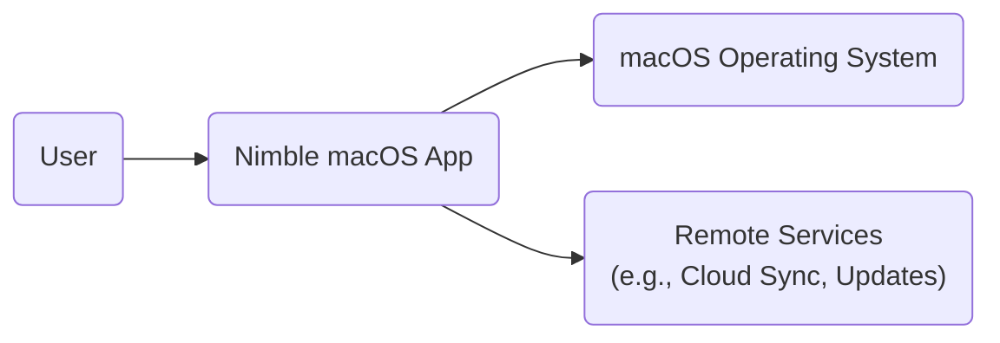
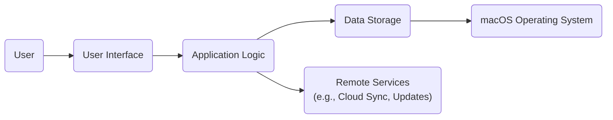
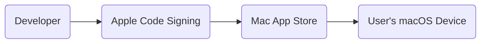
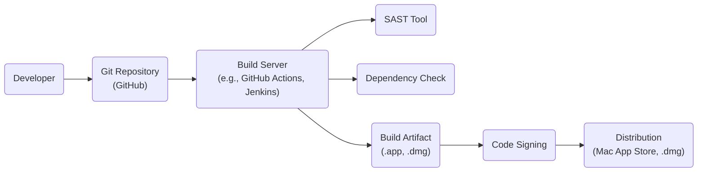

Okay, let's create a design document for the Nimble project, focusing on aspects relevant to threat modeling.

# BUSINESS POSTURE

Nimble is a native macOS application focused on providing a streamlined and efficient experience for users.  The project's primary goal appears to be offering a superior alternative to existing solutions, likely emphasizing speed, ease of use, and a native macOS feel.  Given that it's a relatively new project (based on the GitHub repository), we can assume a higher risk tolerance than a large, established enterprise.  However, user data privacy and application stability are still paramount.

Business Priorities:

*   Rapid iteration and feature development.
*   Building a loyal user base through a superior user experience.
*   Maintaining a positive reputation (avoiding security incidents that could damage trust).
*   Potentially monetizing the application in the future (which introduces additional security considerations around payment processing, licensing, etc.).

Business Goals:

*   Provide a fast and responsive macOS application.
*   Offer a user-friendly and intuitive interface.
*   Ensure the application is stable and reliable.
*   Attract and retain users.

Most Important Business Risks:

*   Data breaches exposing user data.
*   Application vulnerabilities leading to crashes or instability.
*   Malicious actors exploiting the application to compromise user systems.
*   Reputational damage due to security incidents.
*   Intellectual property theft (source code leakage).

# SECURITY POSTURE

Based on the provided GitHub repository, here's an assessment of the existing security posture, along with recommendations:

Existing Security Controls:

*   security control: Use of Swift: Swift is a memory-safe language, which helps prevent common vulnerabilities like buffer overflows. (Source: GitHub repository code)
*   security control: Native macOS Application: Leveraging native macOS frameworks and APIs can provide inherent security benefits, assuming Apple's frameworks are properly used. (Source: Project description)
*   security control: Code Reviews: While not explicitly stated, the presence of multiple contributors suggests some level of code review is likely occurring. (Source: GitHub repository activity)
*   security control: Basic Input Validation: The UI components will have some inherent input validation, but this needs to be explicitly verified and strengthened. (Source: Inferred from macOS development practices)

Accepted Risks:

*   accepted risk: Limited automated security testing: The repository doesn't show evidence of comprehensive security testing (SAST, DAST, etc.).
*   accepted risk: Dependency vulnerabilities: Third-party libraries might introduce vulnerabilities.
*   accepted risk: Lack of formal threat model: No documented threat model is available.
*   accepted risk: Potential for client-side vulnerabilities: As a native application, vulnerabilities like injection, XSS (if web views are used), and insecure data storage are possible.

Recommended Security Controls (High Priority):

*   Implement a robust Software Security Assurance program, including regular security training for developers.
*   Integrate Static Application Security Testing (SAST) into the build process.
*   Perform regular Dynamic Application Security Testing (DAST) on the compiled application.
*   Conduct regular dependency vulnerability scanning and updates.
*   Develop a formal threat model.
*   Implement a secure data storage strategy, leveraging macOS Keychain where appropriate.
*   Consider using a code signing certificate to ensure the integrity of the application.

Security Requirements:

*   Authentication:
    *   If the application handles user accounts, use strong password hashing (e.g., Argon2, bcrypt).
    *   Consider supporting multi-factor authentication (MFA).
    *   Implement secure session management.
    *   Protect against brute-force attacks.
*   Authorization:
    *   Implement appropriate access controls based on user roles (if applicable).
    *   Ensure users can only access data they are authorized to view/modify.
*   Input Validation:
    *   Validate all user inputs rigorously to prevent injection attacks.
    *   Use appropriate encoding and escaping techniques.
    *   Implement length restrictions and data type checks.
*   Cryptography:
    *   Use strong, industry-standard cryptographic algorithms for all sensitive data (e.g., AES-256 for encryption, SHA-256 for hashing).
    *   Store cryptographic keys securely (e.g., using macOS Keychain).
    *   Use HTTPS for all network communication.
    *   Ensure proper implementation of cryptographic libraries to avoid common pitfalls.

# DESIGN

## C4 CONTEXT

Element Descriptions:

*   Element:
    *   Name: User
    *   Type: Person
    *   Description: A person interacting with the Nimble macOS application.
    *   Responsibilities: Using the application's features, providing input, viewing output.
    *   Security controls: Strong password (if applicable), MFA (if applicable), awareness of phishing and social engineering attacks.

*   Element:
    *   Name: Nimble macOS App
    *   Type: Software System
    *   Description: The Nimble application running on macOS.
    *   Responsibilities: Providing the core application functionality, managing user data, interacting with the OS and potentially remote services.
    *   Security controls: Input validation, secure data storage, secure coding practices, regular security updates.

*   Element:
    *   Name: macOS Operating System
    *   Type: Software System
    *   Description: The underlying operating system providing services to the Nimble application.
    *   Responsibilities: Providing system resources, managing processes, enforcing security policies.
    *   Security controls: OS-level security features (e.g., sandboxing, code signing), regular security updates.

*   Element:
    *   Name: Remote Services (e.g., Cloud Sync, Updates)
    *   Type: Software System
    *   Description: External services that Nimble might interact with.
    *   Responsibilities: Providing cloud synchronization, software updates, or other remote functionality.
    *   Security controls: Secure communication (HTTPS), authentication and authorization, secure API design.

## C4 CONTAINER

Since Nimble is a relatively simple, single-process macOS application, the Container diagram is essentially an extension of the Context diagram. We'll break down the single "Nimble macOS App" into its major components.

Element Descriptions:

*   Element:
    *   Name: User
    *   Type: Person
    *   Description: A person interacting with the Nimble macOS application.
    *   Responsibilities: Using the application's features, providing input, viewing output.
    *   Security controls: Strong password (if applicable), MFA (if applicable), awareness of phishing and social engineering attacks.

*   Element:
    *   Name: User Interface
    *   Type: Container
    *   Description: The visual components of the application that the user interacts with.
    *   Responsibilities: Displaying data, accepting user input, handling user interactions.
    *   Security controls: Input validation, output encoding, protection against UI manipulation attacks.

*   Element:
    *   Name: Application Logic
    *   Type: Container
    *   Description: The core logic of the application, handling business rules and data processing.
    *   Responsibilities: Processing user requests, managing data, interacting with data storage and remote services.
    *   Security controls: Secure coding practices, input validation, authorization checks, secure error handling.

*   Element:
    *   Name: Data Storage
    *   Type: Container
    *   Description: The mechanism for storing application data (e.g., preferences, user data).
    *   Responsibilities: Persisting data, retrieving data, ensuring data integrity.
    *   Security controls: Secure data storage (e.g., using macOS Keychain or encrypted files), access controls, data validation.

*   Element:
    *   Name: macOS Operating System
    *   Type: Software System
    *   Description: The underlying operating system providing services to the Nimble application.
    *   Responsibilities: Providing system resources, managing processes, enforcing security policies.
    *   Security controls: OS-level security features (e.g., sandboxing, code signing), regular security updates.

*   Element:
    *   Name: Remote Services (e.g., Cloud Sync, Updates)
    *   Type: Software System
    *   Description: External services that Nimble might interact with.
    *   Responsibilities: Providing cloud synchronization, software updates, or other remote functionality.
    *   Security controls: Secure communication (HTTPS), authentication and authorization, secure API design.

## DEPLOYMENT

Possible Deployment Solutions:

1.  Direct Download (.dmg): Users download a disk image from the developer's website.
2.  Mac App Store: Users download the application through the official Mac App Store.
3.  Homebrew Cask: Users install the application via the Homebrew package manager.

Chosen Solution (for detailed description): Mac App Store

The Mac App Store provides a secure and trusted distribution channel for macOS applications. It handles code signing, sandboxing, and updates automatically.

Element Descriptions:

*   Element:
    *   Name: Developer
    *   Type: Person
    *   Description: The developer of the Nimble application.
    *   Responsibilities: Writing code, building the application, submitting it to the Mac App Store.
    *   Security controls: Secure development environment, strong passwords, MFA for Apple Developer account.

*   Element:
    *   Name: Apple Code Signing
    *   Type: Process
    *   Description: Apple's code signing process, verifying the developer's identity and ensuring the application's integrity.
    *   Responsibilities: Digitally signing the application, verifying the developer's certificate.
    *   Security controls: Strong cryptographic algorithms, secure key management by Apple.

*   Element:
    *   Name: Mac App Store
    *   Type: Software System
    *   Description: Apple's official distribution platform for macOS applications.
    *   Responsibilities: Hosting the application, handling downloads and installations, managing updates.
    *   Security controls: Sandboxing, code signing verification, malware scanning.

*   Element:
    *   Name: User's macOS Device
    *   Type: Device
    *   Description: The user's computer running macOS.
    *   Responsibilities: Downloading and installing the application, running the application.
    *   Security controls: OS-level security features, regular security updates.

## BUILD

The build process likely involves Xcode and Swift build tools.  While the repository doesn't contain explicit CI/CD pipelines, we'll outline a secure build process that *should* be implemented.

Build Process Description:

1.  Developer commits code to the Git repository (GitHub).
2.  A build server (e.g., GitHub Actions, Jenkins) is triggered by the commit.
3.  The build server checks out the code.
4.  A SAST tool (e.g., SonarQube, Semgrep) analyzes the code for vulnerabilities.
5.  A dependency check tool (e.g., OWASP Dependency-Check) scans for known vulnerabilities in third-party libraries.
6.  If no critical vulnerabilities are found, the build server compiles the application into a build artifact (.app, .dmg).
7.  The build artifact is code-signed using the developer's Apple Developer certificate.
8.  The signed artifact is then distributed (either uploaded to the Mac App Store or made available for direct download).

Security Controls in Build Process:

*   SAST: Identifies vulnerabilities in the source code.
*   Dependency Check: Identifies vulnerabilities in third-party libraries.
*   Code Signing: Ensures the integrity and authenticity of the application.
*   Build Server: Automates the build process and enforces security checks.
*   Git: Provides version control and audit trails.

# RISK ASSESSMENT

Critical Business Processes:

*   Application Usage: Users should be able to use the application without experiencing crashes, data loss, or security breaches.
*   Data Management: User data (if any) must be handled securely and protected from unauthorized access.
*   Software Updates: Updates should be delivered securely and reliably to address vulnerabilities and improve functionality.

Data to Protect and Sensitivity:

*   User Preferences: Low sensitivity, but should still be protected from unauthorized modification.
*   User Data (if any, e.g., notes, documents): Potentially high sensitivity, depending on the nature of the data. Requires strong encryption and access controls.
*   Application Logs: Potentially sensitive, as they may contain information about user activity or system errors. Should be stored securely and access should be restricted.
*   Crash Reports: Potentially sensitive, as they may contain information about the application's internal state. Should be anonymized and transmitted securely.

# QUESTIONS & ASSUMPTIONS

Questions:

*   What specific types of user data will Nimble store (if any)?
*   Will Nimble integrate with any remote services (e.g., cloud sync, analytics)?
*   What is the intended monetization strategy for Nimble?
*   Are there any specific regulatory requirements that Nimble needs to comply with (e.g., GDPR, CCPA)?
*   What level of logging and monitoring is planned for the application?
*   Is there a plan for handling security incidents and vulnerabilities?

Assumptions:

*   BUSINESS POSTURE: The developers prioritize user experience and rapid development, but also recognize the importance of security.
*   SECURITY POSTURE: The developers are familiar with basic secure coding practices, but may not have extensive security expertise.
*   DESIGN: The application is relatively simple and does not involve complex interactions with external systems (at least initially). The primary deployment method will be via the Mac App Store. The build process will be improved to include automated security checks.