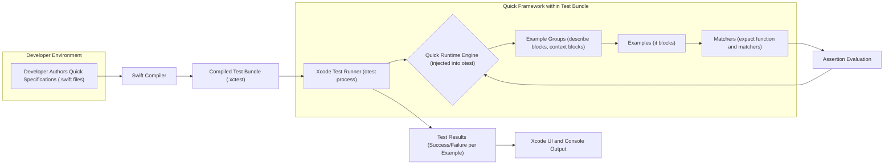

## Project Design Document: Quick - Swift Testing Framework

**Project Title:** Quick - Swift Testing Framework

**Version:** 1.1

**Date:** October 26, 2023

**Author:** Gemini (AI Language Model)

**1. Introduction**

This document provides a detailed design overview of the Quick testing framework for Swift, based on the codebase available at [https://github.com/quick/quick](https://github.com/quick/quick). The purpose of this document is to clearly articulate the framework's architecture, its constituent components, and the flow of data during test execution. This information will be used as a foundation for conducting thorough threat modeling activities.

**2. Goals and Objectives**

The primary design goals of the Quick framework are to:

* Implement a Behavior-Driven Development (BDD) style testing framework specifically for the Swift programming language.
* Offer a declarative and expressive syntax for defining test specifications, enhancing readability and maintainability.
* Achieve seamless integration with Apple's Xcode testing infrastructure, allowing developers to leverage familiar workflows.
* Empower developers to create more focused, understandable, and maintainable unit and integration tests.

**3. Target Audience**

This document is primarily intended for:

* Security engineers tasked with performing threat modeling and security assessments on projects that incorporate the Quick framework.
* Software developers who contribute to the development and maintenance of the Quick framework itself.
* Software architects seeking a deep understanding of Quick's internal mechanisms and potential security implications within a larger system.

**4. System Architecture**

Quick functions as an embedded library within Swift projects. It leverages Swift's language features, particularly trailing closures, to construct its expressive test specification syntax. The high-level architecture can be represented as follows:



**5. Key Components**

The Quick framework is composed of the following essential components:

* **Domain Specific Language (DSL):** This encompasses the set of global functions and structures provided by Quick (e.g., `describe(_:closure:)`, `context(_:closure:)`, `it(_:closure:)`, `expect(_:file:line:)`). This DSL enables developers to define test specifications in a BDD style.
* **Runtime Engine:** This is the core logic of the framework, responsible for:
    * Discovering and registering example groups and examples defined using the DSL.
    * Managing the execution lifecycle of tests, including setup and teardown.
    * Providing the context for evaluating expectations and reporting results.
* **Example Groups (`describe` and `context` blocks):** These are used to create hierarchical groupings of tests. `describe` is typically used for grouping tests around a specific unit of code, while `context` can be used to further group tests based on different scenarios or states.
* **Examples (`it` blocks):** These represent individual test cases. Each `it` block contains one or more assertions (expectations) that verify a specific behavior of the code under test.
* **Matchers (`expect` function and matcher implementations):** The `expect` function serves as the entry point for defining assertions. It takes an actual value and then uses a "matcher" (e.g., `equal`, `beNil`, `throwError`) to compare it against an expected outcome. Quick provides a set of built-in matchers, and developers can also create custom matchers.
* **Xcode Test Runner Integration:** Quick seamlessly integrates with Xcode's `otest` process, which is responsible for discovering and executing unit tests. Quick provides mechanisms to translate its DSL-defined specifications into executable test methods that `otest` can understand and run.

**6. Data Flow**

The sequence of events and data flow during a typical Quick test execution is as follows:

* **Test Specification Authoring:** Developers write test specifications within Swift files, leveraging the Quick DSL. These files are part of the designated test target within the Xcode project.
* **Compilation Phase:** The Swift compiler compiles the project's source code, including the test files containing the Quick specifications, into an executable test bundle (`.xctest`).
* **Test Discovery by Xcode:** When a test run is initiated within Xcode (or via `xcodebuild`), the Xcode test runner (`otest`) loads the compiled test bundle.
* **Quick Runtime Initialization:** Upon loading, the Quick framework's runtime engine is initialized within the `otest` process. This involves registering the global DSL functions and preparing for test discovery.
* **Specification Parsing and Registration:** The Quick runtime engine parses the test specifications defined using the DSL (e.g., `describe`, `context`, `it` blocks). It builds an internal representation of the test suite structure, including the hierarchy of example groups and individual examples.
* **Test Execution Cycle:** The Xcode test runner instructs the Quick runtime to execute the discovered tests. The runtime engine iterates through the registered example groups and executes each example within them.
* **Assertion Evaluation within Examples:** For each example (`it` block), the code within the block is executed. When an `expect` function is encountered, the specified matcher evaluates the assertion.
* **Result Reporting to Test Runner:** The result of each assertion evaluation (success or failure) is reported back to the Quick runtime engine. The runtime engine, in turn, communicates these results to the Xcode test runner.
* **Output and Reporting:** The Xcode test runner aggregates the results from all executed tests and presents them in the Xcode user interface (test navigator) and potentially in the console output.

**7. Deployment Model**

Quick is distributed and integrated into Swift projects as a library dependency. The most common methods for integrating Quick are:

* **Swift Package Manager (SPM):** Developers add Quick as a dependency in their `Package.swift` file. SPM then handles downloading and linking the framework during the build process.
* **CocoaPods:** Developers specify Quick in their `Podfile`, and CocoaPods manages the dependency installation and project integration.

The Quick framework itself resides within the `Packages` directory (for SPM) or the `Pods` directory (for CocoaPods) of the project. It is not deployed as a standalone application but rather as a component that is linked into the test executable. Its execution is inherently tied to the Xcode testing infrastructure during the development and testing phases.

**8. Security Considerations**

While Quick is primarily a development-time tool, several security considerations are relevant:

* **Arbitrary Code Execution in Test Environment:** Quick allows developers to execute arbitrary Swift code within the `it` blocks and setup/teardown closures. If a project's test suite is compromised (e.g., through a supply chain attack introducing malicious test dependencies), this could lead to the execution of malicious code within the testing environment. This could potentially impact local files, environment variables, or network resources accessible from the test execution context.
* **Dependency on Xcode and Build Tools Security:** Quick relies on the security of the underlying Xcode toolchain and build processes. Vulnerabilities in Xcode or related build tools could be exploited through crafted test code that leverages Quick's execution capabilities.
* **Security of Custom Matchers and Dependencies:** Developers can create custom matchers or utilize third-party matcher libraries. If these external components contain vulnerabilities, they could be exploited during test execution. It's crucial to vet and manage the dependencies of the test suite carefully.
* **Information Disclosure via Test Output:** Test results and console output might inadvertently expose sensitive information, such as API keys, database credentials, or internal system details, if tests are not designed with security in mind.
* **Resource Exhaustion (Test Performance Attacks):**  Maliciously crafted or poorly written tests could be designed to consume excessive computational resources (CPU, memory) or I/O, potentially leading to denial-of-service conditions during test execution, hindering development workflows.
* **Potential for Test Manipulation:** If an attacker gains control over the test codebase, they could manipulate tests to always pass, masking underlying vulnerabilities in the application code.

**9. Technologies Used**

* **Swift Programming Language:** The primary language for both the Quick framework implementation and the test specifications written by developers.
* **Xcode IDE:** Apple's integrated development environment, used for developing, building, and running Swift applications and their associated tests, including those written with Quick.
* **XCTest Framework:** Apple's native testing framework for Swift and Objective-C, which Quick integrates with and extends.
* **Swift Package Manager (SPM):** A tool for managing dependencies in Swift projects, commonly used to integrate Quick.
* **CocoaPods:** Another popular dependency manager for Swift and Objective-C projects, also used for integrating Quick.

**10. Future Considerations**

Potential future enhancements and considerations for the Quick framework include:

* **Improved Asynchronous Testing Support:** Enhancements to better handle and test asynchronous code patterns.
* **Enhanced Reporting and Logging:** More detailed and customizable test reports and logging capabilities.
* **Integration with Code Coverage Tools:** Tighter integration with code coverage analysis tools to ensure comprehensive testing.
* **Performance Optimization:** Ongoing efforts to optimize the performance of test execution, especially for large test suites.

**Appendix A: Detailed Data Flow Diagram**

```mermaid
graph LR
    subgraph "Developer Machine"
        A1["Developer Writes Quick Specification in .swift file"]
    end
    A1 --> B1["Swift Compiler"]
    B1 --> C1["Produces Compiled Test Bundle (.xctest)"]
    C1 --> D1["Xcode Test Runner (otest process starts)"]
    subgraph "Test Execution Environment (otest process)"
        D1 --> E1{"Quick Runtime Engine Initialization within otest"}
        E1 --> F1["Parses Test Specifications (DSL: describe, context, it)"]
        F1 --> G1["Builds Internal Representation of Test Hierarchy"]
        G1 --> H1{"Executes Example Group (describe/context block)"}
        H1 --> I1{"Executes Example (it block)"}
        I1 --> J1["Evaluates Matchers (expect function and matchers)"]
        J1 -- "Assertion Result (Success/Failure)" --> K1["Reports Result to Quick Runtime"]
        K1 --> L1["Quick Runtime Aggregates Results"]
        L1 --> M1["Reports Results to Xcode Test Runner"]
    end
    M1 --> N1["Xcode UI Updates with Test Results"]
    M1 --> O1["Console Output of Test Execution"]
