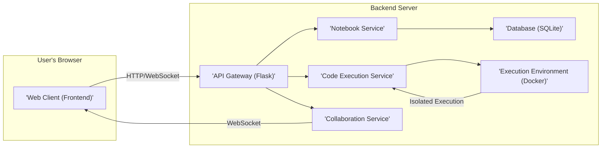

# Project Design Document: Quick Notebook (Improved)

## 1. Project Overview

### 1.1. Project Title
Quick Notebook

### 1.2. Project Description
Quick is a lightweight, web-based notebook application tailored for developers, system administrators, and technical writers. It provides a streamlined environment for creating, organizing, and sharing notes, code snippets, and technical documentation. Quick emphasizes simplicity, efficiency, and self-hosting, making it ideal for individuals and small teams who need a private and customizable notebook solution.  It supports rich text formatting using Markdown, interactive code execution in multiple languages, and real-time collaborative editing.

### 1.3. Project Goals
*   **Enhanced User Experience:** Deliver a highly intuitive and responsive user interface for seamless notebook creation, editing, and management.
*   **Comprehensive Markdown Support:** Implement full CommonMark Markdown specification support, including extensions for enhanced formatting and features.
*   **Versatile Code Execution:** Expand code execution capabilities to support a wide range of popular programming languages and environments, with robust sandboxing for security.
*   **Flexible Notebook Sharing:** Offer granular sharing options, including public read-only links, private shared access with specific users (if user accounts are implemented), and export functionalities.
*   **Robust Real-time Collaboration:** Implement a performant and reliable real-time collaboration feature with conflict resolution and version history (future enhancement).
*   **Reliable Data Persistence:** Ensure data integrity and durability through database persistence, with options for backup and restore.
*   **Simplified Self-Hosting:** Design for easy deployment and configuration on various platforms, including local machines, cloud servers, and containerized environments.
*   **Extensibility and Customization:**  Provide a plugin or extension mechanism (future enhancement) to allow users to customize features and integrations.

## 2. System Architecture

### 2.1. High-Level Architecture Diagram

### 2.2. Component Description

*   **Web Client (Frontend):**
    *   **Description:** The user-facing interface of Quick, responsible for rendering notebooks, handling user interactions, and communicating with the backend.
    *   **Technology:** JavaScript, React (or similar modern framework like Vue.js or Svelte), HTML5, CSS3, WebSockets API.  Likely using a component library for UI elements (e.g., Material UI, Ant Design). Markdown rendering will be handled client-side using a JavaScript Markdown library (e.g., marked.js, commonmark.js).
    *   **Functionality:**
        *   Notebook UI rendering (editor, viewer).
        *   Markdown parsing and rendering.
        *   Code editor with syntax highlighting (e.g., using CodeMirror or Monaco Editor).
        *   Real-time collaboration UI updates.
        *   Communication with API Gateway via HTTP REST APIs for notebook operations and WebSockets for collaboration and code execution feedback.
    *   **Communication:** HTTP requests for API calls, WebSocket for real-time updates and code execution streams.

*   **API Gateway (Backend - Flask):**
    *   **Description:** The central entry point for all client requests, responsible for routing, authentication (if implemented), and request handling.
    *   **Technology:** Python, Flask framework, Flask-RESTX (or similar for API documentation and structure), Werkzeug, potentially gunicorn or uWSGI for production deployment.
    *   **Functionality:**
        *   API endpoint routing and management.
        *   Request validation and input sanitization.
        *   Authentication and authorization middleware (if user accounts are implemented, using libraries like Flask-Login or similar).
        *   Proxying requests to backend services (Notebook Service, Code Execution Service, Collaboration Service).
        *   Handling WebSocket connections and forwarding messages to the Collaboration Service.
        *   Basic logging and error handling.
    *   **Communication:** Receives HTTP requests and WebSocket connections from the Web Client, communicates with backend services via internal function calls or HTTP requests (depending on service separation strategy).

*   **Notebook Service:**
    *   **Description:** Manages the persistence and retrieval of notebook data. Handles all operations related to notebooks, such as creation, reading, updating, deletion, and listing.
    *   **Technology:** Python, potentially using Flask blueprints for modularity, interacts directly with the SQLite database using Python's built-in `sqlite3` module or an ORM like SQLAlchemy (for future scalability if database needs change).
    *   **Functionality:**
        *   CRUD operations for notebooks (Create, Read, Update, Delete).
        *   Notebook versioning (future enhancement).
        *   Search functionality within notebooks (future enhancement).
        *   Data validation and sanitization before database interaction.
        *   File storage management for attachments (if implemented in future).
    *   **Communication:** Receives requests from the API Gateway (Flask) via function calls within the backend application. Interacts with the Database (SQLite) directly.

*   **Code Execution Service:**
    *   **Description:** Responsible for securely executing code snippets submitted by users within notebooks. Isolates execution environments to prevent security risks and resource contention.
    *   **Technology:** Python, Docker SDK for Python (or similar Docker client library), potentially Celery or similar task queue for asynchronous execution management.
    *   **Functionality:**
        *   Receives code execution requests from the API Gateway.
        *   Manages Docker container creation and lifecycle for each execution request.
        *   Supports multiple programming languages by utilizing different Docker images pre-configured with language runtimes (e.g., Python, Node.js, Java, Go, Ruby).
        *   Executes code within isolated Docker containers.
        *   Captures standard output and standard error from code execution.
        *   Enforces resource limits (CPU, memory, execution time) on Docker containers to prevent abuse.
        *   Returns execution results (output, errors) back to the API Gateway.
    *   **Communication:** Receives requests from the API Gateway (Flask) via function calls. Interacts with the Docker daemon to manage containers.

*   **Collaboration Service:**
    *   **Description:** Handles real-time collaborative editing of notebooks by multiple users. Manages WebSocket connections and synchronizes changes between clients.
    *   **Technology:** Python, WebSockets library for Python (e.g., websockets, Flask-Sockets), potentially Redis or similar in-memory data store for managing active sessions and temporary data (for scalability in future).
    *   **Functionality:**
        *   Manages WebSocket connections from Web Clients.
        *   Broadcasts notebook changes from one client to all other connected clients in real-time.
        *   Handles concurrent editing and conflict resolution (basic optimistic concurrency initially, more sophisticated algorithms in future).
        *   Manages user presence and online status (future enhancement).
        *   Integrates with the Notebook Service to persist collaborative changes to the database.
    *   **Communication:** Receives WebSocket connections from the Web Client. Communicates with the API Gateway and Notebook Service via function calls within the backend application.

*   **Database (SQLite):**
    *   **Description:** Provides persistent storage for all application data, including notebook content, metadata, user information (if implemented), and application settings.
    *   **Technology:** SQLite. File-based database, simple to deploy and manage, suitable for self-hosted single-server setups.
    *   **Functionality:**
        *   Stores notebook content (likely in Markdown format).
        *   Stores notebook metadata (title, creation date, modification date, sharing settings, etc.).
        *   Stores user accounts and session data (if user authentication is implemented).
        *   Provides basic data querying and retrieval capabilities.
    *   **Communication:** Accessed directly by the Notebook Service.

*   **Execution Environment (Docker):**
    *   **Description:** Provides isolated and containerized environments for executing code snippets. Ensures security, reproducibility, and language runtime consistency.
    *   **Technology:** Docker, Docker images for various programming languages (e.g., `python:latest`, `node:latest`, `openjdk:latest`, `golang:latest`, `ruby:latest`).
    *   **Functionality:**
        *   Provides isolated execution environments for each code execution request.
        *   Enforces resource limits (CPU, memory, time).
        *   Pre-configured with necessary language runtimes and libraries.
        *   Facilitates easy addition of support for new programming languages by adding new Docker images.
    *   **Communication:** Managed by the Code Execution Service via the Docker SDK.

## 3. Data Flow

### 3.1. Creating a New Notebook
1.  User interacts with the **Web Client (Frontend)** to create a new notebook via UI elements (e.g., "New Notebook" button).
2.  **Web Client (Frontend)** sends an HTTP POST request to the `/api/notebooks` endpoint of the **API Gateway (Backend - Flask)**. The request body includes notebook metadata, such as a title (e.g., in JSON format: `{"title": "My New Notebook"}`).
3.  **API Gateway (Backend - Flask)** receives the request, potentially performs authentication/authorization checks (if implemented), and routes the request to the **Notebook Service**.
4.  **Notebook Service** receives the creation request, validates the input data, and creates a new notebook record in the **Database (SQLite)**. This includes generating a unique notebook ID and storing the provided metadata. Initially, the notebook content might be empty.
5.  **Notebook Service** returns the newly created notebook ID and a success status to the **API Gateway (Backend - Flask)**.
6.  **API Gateway (Backend - Flask)** sends an HTTP 201 Created response back to the **Web Client (Frontend)**, including the notebook ID in the response body (e.g., in JSON format: `{"notebook_id": "unique-notebook-id"}`).
7.  **Web Client (Frontend)** receives the response, updates the UI to display the new notebook, and potentially redirects the user to the editor view for the newly created notebook.

### 3.2. Editing a Notebook
1.  User edits the content of a notebook in the **Web Client (Frontend)** using the editor interface.
2.  **Non-Collaborative Editing:** For simple saving (e.g., user clicks "Save"), the **Web Client (Frontend)** sends an HTTP PUT or PATCH request to the `/api/notebooks/{notebook_id}` endpoint of the **API Gateway (Backend - Flask)**. The request body contains the updated notebook content (e.g., in Markdown format).
3.  **Collaborative Editing:** For real-time collaborative editing, as the user types or makes changes, the **Web Client (Frontend)** sends WebSocket messages to the **Collaboration Service**. These messages contain granular changes (e.g., text insertions, deletions, cursor positions) and the notebook ID.
4.  **API Gateway (Backend - Flask)** (for non-collaborative edits) receives the HTTP request, performs authentication/authorization checks, and routes it to the **Notebook Service**.
5.  **Notebook Service** (for non-collaborative edits) receives the update request, validates the input data, and updates the corresponding notebook record in the **Database (SQLite)** with the new content.
6.  **Notebook Service** (for non-collaborative edits) returns a success status (e.g., HTTP 200 OK) to the **API Gateway (Backend - Flask)**.
7.  **API Gateway (Backend - Flask)** (for non-collaborative edits) relays the success status back to the **Web Client (Frontend)**.
8.  **Collaboration Service** (for collaborative edits) receives WebSocket messages from a client. It processes the changes, broadcasts them via WebSockets to all other connected **Web Clients (Frontend)** currently editing the same notebook, and also updates the **Notebook Service** (via function call) to persist the changes to the **Database (SQLite)**.

### 3.3. Executing Code in a Notebook
1.  User selects a code block in the **Web Client (Frontend)** and triggers execution (e.g., by clicking a "Run" button).
2.  **Web Client (Frontend)** sends an HTTP POST request to the `/api/execute` endpoint of the **API Gateway (Backend - Flask)**. The request body includes the code to be executed, the programming language specified for the code block, and potentially other execution parameters. (e.g., JSON: `{"code": "print('Hello')", "language": "python"}`).
3.  **API Gateway (Backend - Flask)** receives the request, performs authentication/authorization checks, and routes it to the **Code Execution Service**.
4.  **Code Execution Service** receives the execution request. It selects a suitable Docker image based on the specified programming language. It then uses the Docker SDK to create a new Docker container based on the chosen image.
5.  **Code Execution Service** sends the code to be executed to the Docker container's standard input (or via a temporary file mounted into the container).
6.  **Execution Environment (Docker)** executes the code within the isolated container.
7.  **Execution Environment (Docker)** captures the standard output and standard error streams generated by the code execution.
8.  **Code Execution Service** retrieves the captured output and error streams from the Docker container.
9.  **Code Execution Service** sends the execution results (output, errors, execution status) back to the **API Gateway (Backend - Flask)**, potentially streaming the output in real-time via WebSockets for long-running executions (future enhancement).
10. **API Gateway (Backend - Flask)** relays the execution results back to the **Web Client (Frontend)**, potentially via WebSocket for streaming output.
11. **Web Client (Frontend)** receives the execution results and displays them below the code block in the notebook UI.

### 3.4. Sharing a Notebook
1.  User initiates the sharing process in the **Web Client (Frontend)**, e.g., by clicking a "Share" button.
2.  **Web Client (Frontend)** sends an HTTP POST request to the `/api/notebooks/{notebook_id}/share` endpoint of the **API Gateway (Backend - Flask)**. The request body might include sharing options, such as "public read-only", "private with specific users", etc. (e.g., JSON: `{"permission": "public-read"}`).
3.  **API Gateway (Backend - Flask)** receives the request, performs authentication/authorization checks, and routes it to the **Notebook Service**.
4.  **Notebook Service** receives the sharing request, validates the sharing options, and updates the notebook metadata in the **Database (SQLite)** to reflect the sharing settings. This might involve generating a unique shareable link or updating access control lists for the notebook.
5.  **Notebook Service** returns sharing information to the **API Gateway (Backend - Flask)**. This could be a shareable link, success status, or updated permissions information.
6.  **API Gateway (Backend - Flask)** sends an HTTP 200 OK response back to the **Web Client (Frontend)**, including the sharing information in the response body (e.g., JSON: `{"share_link": "https://quicknotebook.example.com/share/unique-share-id"}`).
7.  **Web Client (Frontend)** receives the response and displays the sharing information to the user, e.g., showing the shareable link in a dialog box or updating the notebook's sharing status in the UI.

## 4. Technology Stack

*   **Frontend (Web Client):**
    *   Programming Language: JavaScript (ES6+)
    *   Frontend Framework: React (or Vue.js, Svelte)
    *   UI Library/Framework: Material UI, Ant Design, or similar
    *   Markdown Rendering: marked.js, commonmark.js, or similar
    *   Code Editor: CodeMirror, Monaco Editor
    *   WebSockets API (Browser native)
    *   Bundler/Build Tool: Webpack, Parcel, or similar
    *   Package Manager: npm or yarn

*   **Backend (API Gateway, Services):**
    *   Programming Language: Python 3.x
    *   Web Framework: Flask
    *   API Framework/Library: Flask-RESTX (or Flask-RESTful, Marshmallow)
    *   WebSockets Library: websockets, Flask-Sockets
    *   Database Interaction: Python's `sqlite3` module (or SQLAlchemy for future ORM)
    *   Docker Integration: Docker SDK for Python
    *   Asynchronous Task Queue (Optional, for future): Celery, Redis (as broker)
    *   WSGI Server (for production): gunicorn, uWSGI

*   **Database:**
    *   Database System: SQLite

*   **Code Execution Environment:**
    *   Containerization: Docker
    *   Base Docker Images: Official language images from Docker Hub (e.g., `python:3.9-slim-buster`, `node:16-alpine`, `openjdk:17-slim`)
    *   Image Management: Docker Hub or a private registry

*   **Collaboration Service:**
    *   Real-time Communication: WebSockets
    *   State Management (Optional, for future scalability): Redis, in-memory data store

*   **Operating System (for Server):**
    *   Linux (Ubuntu, Debian, CentOS recommended for server deployments)

## 5. Deployment Model

*   **Primary Deployment Model: Self-Hosted**
    *   Designed for easy self-hosting on user-controlled infrastructure.
    *   Suitable for deployment on personal computers, virtual machines, cloud servers (e.g., AWS EC2, Google Compute Engine, Azure VMs), and container platforms.
    *   Installation typically involves cloning the repository, installing Python dependencies (using `pip`), and running the Flask application.
    *   Configuration via environment variables or a configuration file (e.g., for database path, port settings, Docker image versions).

*   **Deployment Scenarios:**
    *   **Single-Server Deployment (Typical):** All backend components (API Gateway, Notebook Service, Code Execution Service, Collaboration Service, Database) and potentially the frontend (serving static files) are deployed on a single server instance. This is the simplest and most common self-hosting scenario.
    *   **Containerized Deployment (Recommended for Production):** Backend application (API Gateway and services) is containerized using Docker. Docker Compose can be used to orchestrate the backend containers and the database. This simplifies deployment, ensures consistency across environments, and improves scalability. Frontend can be served as static files from a web server (e.g., Nginx) or also containerized.
    *   **Deployment Behind a Reverse Proxy (Recommended for Production):** For production deployments, it's recommended to deploy Quick behind a reverse proxy server like Nginx or Apache. The reverse proxy handles SSL termination, load balancing (if scaling horizontally in future), and serving static files efficiently.

*   **Frontend Deployment:**
    *   Frontend files (HTML, CSS, JavaScript, assets) are typically served as static files.
    *   Can be served by the same server hosting the backend (e.g., Flask can serve static files), or from a dedicated web server (e.g., Nginx, Apache) or a CDN (Content Delivery Network) for improved performance and scalability.

## 6. Security Considerations (Detailed)

*   **Authentication and Authorization (If Implemented):**
    *   **Authentication:**
        *   Use strong password hashing algorithms (e.g., bcrypt, Argon2) to store user passwords securely.
        *   Implement secure session management using HTTP-only and Secure cookies to prevent session hijacking.
        *   Consider multi-factor authentication (MFA) for enhanced security (future enhancement).
        *   Protect against brute-force login attempts by implementing rate limiting on login requests and account lockout mechanisms.
    *   **Authorization:**
        *   Implement role-based access control (RBAC) or attribute-based access control (ABAC) to manage user permissions and access to notebooks and features.
        *   Ensure proper authorization checks are performed on all API endpoints to prevent unauthorized access to data and functionality.
        *   For notebook sharing, implement granular permissions (e.g., read-only, read-write, owner) and enforce them correctly.

*   **Code Execution Security:**
    *   **Sandboxing with Docker:**
        *   Utilize Docker containers to provide strong isolation for code execution environments.
        *   Run Docker containers with minimal privileges and restricted capabilities.
        *   Use resource limits (CPU, memory, time) for Docker containers to prevent resource exhaustion and denial-of-service attacks.
        *   Consider using security profiles like AppArmor or SELinux to further restrict container capabilities (future enhancement).
    *   **Input Validation and Sanitization:**
        *   Strictly validate and sanitize all code snippets submitted for execution to prevent code injection vulnerabilities.
        *   Whitelist allowed programming languages and versions to limit potential attack surface.
        *   Sanitize environment variables passed to the execution environment to prevent injection of malicious variables.
    *   **Output Handling:**
        *   Carefully handle and sanitize the output from code execution before displaying it in the Web Client to prevent Cross-Site Scripting (XSS) vulnerabilities.
        *   Limit the size of execution output to prevent excessive data transfer and potential denial-of-service.

*   **Data Security:**
    *   **Data at Rest:**
        *   Protect the SQLite database file with appropriate file system permissions to restrict access to authorized users and processes only.
        *   Consider database encryption for sensitive data at rest (future enhancement, SQLite encryption extensions available).
        *   Implement regular backups of the database to prevent data loss.
    *   **Data in Transit:**
        *   Enforce HTTPS for all communication between the Web Client and the Backend to encrypt data in transit and protect against eavesdropping and man-in-the-middle attacks.
        *   Configure the web server (e.g., Flask development server is NOT suitable for production, use gunicorn/uWSGI behind Nginx) to properly handle SSL/TLS certificates.

*   **Input Validation and Output Encoding (General):**
    *   **Input Validation:**
        *   Validate all user inputs on both the client-side (for user experience) and server-side (for security).
        *   Validate notebook content, titles, filenames, and any other user-provided data to prevent injection attacks and data corruption.
    *   **Output Encoding:**
        *   Properly encode all user-generated content (notebook content, code execution output) before rendering it in the Web Client to prevent XSS vulnerabilities. Use context-aware output encoding functions provided by the frontend framework.
        *   Set appropriate Content Security Policy (CSP) headers to mitigate XSS risks by controlling the sources from which the browser is allowed to load resources.

*   **Session Management:**
    *   Use secure session management practices as mentioned in Authentication section.
    *   Implement session timeouts to automatically invalidate sessions after a period of inactivity.
    *   Regenerate session IDs after successful login to prevent session fixation attacks.

*   **Dependency Security:**
    *   Regularly audit and update all frontend and backend dependencies to patch known security vulnerabilities.
    *   Use dependency scanning tools to identify vulnerable dependencies.
    *   Follow security best practices for dependency management (e.g., using `requirements.txt` and `package-lock.json` for dependency pinning and reproducible builds).

*   **Rate Limiting:**
    *   Implement rate limiting on API endpoints, especially for sensitive operations like login, code execution, and notebook creation, to prevent brute-force attacks and denial-of-service.

*   **Security Audits and Penetration Testing (Best Practice):**
    *   Conduct regular security audits and penetration testing to identify and address potential vulnerabilities in the application.
    *   Consider using automated security scanning tools and manual code reviews.

This improved design document provides a more detailed and comprehensive overview of the Quick Notebook project, including enhanced descriptions of components, data flows, technology stack, deployment models, and security considerations. It is intended to serve as a solid foundation for threat modeling and further development of the project.