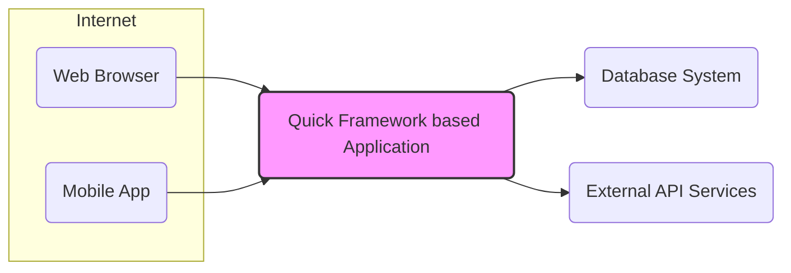

# BUSINESS POSTURE

- Business Priorities and Goals:
 - Enable rapid development of web applications and APIs.
 - Provide a lightweight and efficient framework for building performant web services.
 - Simplify the development process for Go-based web applications.
 - Offer a flexible and extensible framework adaptable to various project needs.
 - Reduce time to market for new web applications and features.

- Business Risks:
 - Security vulnerabilities in the framework could lead to compromise of applications built with it.
 - Lack of community support or maintenance could lead to project stagnation and security issues.
 - Incompatibility with future Go versions or libraries could require significant rework.
 - Performance bottlenecks in the framework could limit the scalability of applications.
 - Complexity in adopting or learning the framework could hinder developer productivity.

# SECURITY POSTURE

- Existing Security Controls:
 - security control: Dependency management using `go.mod` to track and manage project dependencies. (Implemented in: Go tooling and project structure)
 - security control: Standard Go security practices are expected to be followed by developers using the framework. (Described in: Go security documentation and best practices)
 - security control: HTTPS is expected to be used for production deployments. (Described in: General web security best practices)

- Accepted Risks:
 - accepted risk: Reliance on third-party libraries and dependencies introduces potential supply chain risks.
 - accepted risk: Security vulnerabilities in user-developed application code are outside the scope of the framework itself.
 - accepted risk: Misconfiguration of the framework or underlying infrastructure by users can lead to security weaknesses.

- Recommended Security Controls:
 - security control: Implement static application security testing (SAST) in the build process to identify potential vulnerabilities in the framework code.
 - security control: Conduct regular security audits and penetration testing of the framework to proactively identify and address security weaknesses.
 - security control: Provide security guidelines and best practices documentation for developers using the framework to build secure applications.
 - security control: Establish a process for reporting and addressing security vulnerabilities in the framework.
 - security control: Implement dependency scanning to identify known vulnerabilities in third-party libraries used by the framework.

- Security Requirements:
 - Authentication:
  - Requirement: The framework should provide mechanisms or guidance for implementing authentication in applications built with it.
  - Requirement: Support for common authentication methods such as session-based authentication, token-based authentication (JWT), and OAuth 2.0 should be considered.
 - Authorization:
  - Requirement: The framework should provide mechanisms or guidance for implementing authorization to control access to application resources and functionalities.
  - Requirement: Role-Based Access Control (RBAC) or Attribute-Based Access Control (ABAC) should be considered for authorization implementation.
 - Input Validation:
  - Requirement: The framework should encourage or provide utilities for input validation to prevent common vulnerabilities like injection attacks (SQL injection, XSS).
  - Requirement: Input validation should be applied to all data received from external sources, including user inputs, API requests, and data from databases.
 - Cryptography:
  - Requirement: The framework should support or integrate with standard cryptographic libraries for secure data handling, such as encryption, hashing, and digital signatures.
  - Requirement: Guidance should be provided on the proper use of cryptography to protect sensitive data at rest and in transit.

# DESIGN

## C4 CONTEXT



- Context Diagram Elements:
 - - Name: Web Browser
   - Type: User
   - Description: Users accessing the web application through a web browser.
   - Responsibilities: Interacting with the web application's user interface.
   - Security controls: Browser-based security controls (e.g., Content Security Policy), HTTPS connection to the application.
 - - Name: Mobile App
   - Type: User
   - Description: Users accessing the web application through a mobile application.
   - Responsibilities: Interacting with the web application's API.
   - Security controls: Application-level security controls, HTTPS connection to the application, API authentication and authorization.
 - - Name: Quick Framework based Application
   - Type: Software System
   - Description: The web application built using the Quick framework. This is the system being designed.
   - Responsibilities: Handling user requests, processing business logic, interacting with databases and external services, serving web pages and APIs.
   - Security controls: Authentication, authorization, input validation, secure session management, output encoding, error handling, logging and monitoring.
 - - Name: Database System
   - Type: External System
   - Description: Database used by the web application to store and retrieve data.
   - Responsibilities: Data persistence, data integrity, data access control.
   - Security controls: Database access controls, encryption at rest, encryption in transit, database auditing.
 - - Name: External API Services
   - Type: External System
   - Description: External services that the web application integrates with, such as payment gateways, social media APIs, or other third-party services.
   - Responsibilities: Providing external functionalities and data.
   - Security controls: API authentication and authorization, secure communication protocols (HTTPS), input validation of data received from external APIs.

## C4 CONTAINER

```mermaid
flowchart LR
    subgraph "Quick Framework based Application" [Quick Framework based Application]
        direction TB
        C1("Web Server")
        C2("Application Logic")
        C3("Routing")
        C4("Middleware")
        C5("Template Engine")
        C6("Data Access Layer")
    end
    A1("Web Browser") --> C1
    A2("Mobile App") --> C1
    C1 --> C3
    C3 --> C4
    C4 --> C2
    C2 --> C6
    C2 --> C5
    C6 --> D("Database System")
    C2 --> E("External API Services")

    style "Quick Framework based Application" fill:#f9f,stroke:#333,stroke-width:2px;
```

- Container Diagram Elements:
 - - Name: Web Server
   - Type: Container
   - Description: Handles incoming HTTP requests and responses, serves static files, and acts as the entry point for the application.
   - Responsibilities: HTTP request handling, TLS termination, load balancing, reverse proxy.
   - Security controls: HTTPS configuration, web server hardening, rate limiting, request filtering.
 - - Name: Application Logic
   - Type: Container
   - Description: Contains the core business logic of the application, including controllers, services, and models.
   - Responsibilities: Business logic execution, data processing, orchestration of other containers.
   - Security controls: Input validation, authorization checks, secure coding practices, output encoding, error handling, logging.
 - - Name: Routing
   - Type: Container
   - Description: Responsible for mapping incoming requests to the appropriate application logic handlers.
   - Responsibilities: URL parsing, route matching, request dispatching.
   - Security controls: Route definition security (preventing unintended access), input validation of route parameters.
 - - Name: Middleware
   - Type: Container
   - Description: Intercepts requests and responses to perform cross-cutting concerns such as authentication, authorization, logging, and request modification.
   - Responsibilities: Authentication, authorization, logging, request/response manipulation, security header management.
   - Security controls: Authentication middleware, authorization middleware, security-related middleware (e.g., CSRF protection, XSS prevention).
 - - Name: Template Engine
   - Type: Container
   - Description: Renders dynamic web pages by combining templates with data.
   - Responsibilities: Generating HTML output, server-side rendering.
   - Security controls: Output encoding to prevent XSS, template injection prevention.
 - - Name: Data Access Layer
   - Type: Container
   - Description: Provides an abstraction layer for interacting with the database system.
   - Responsibilities: Database query construction, data mapping, database connection management.
   - Security controls: Parameterized queries or ORM usage to prevent SQL injection, database connection security, data access control enforcement.

## DEPLOYMENT

- Deployment Options:
 - Option 1: Cloud-based deployment (e.g., AWS, GCP, Azure) using containers (Docker) and orchestration (Kubernetes).
 - Option 2: Virtual Machines or Bare Metal servers with direct application deployment.
 - Option 3: Serverless deployment (e.g., AWS Lambda, Google Cloud Functions) if the application architecture is suitable.

- Selected Deployment Architecture: Cloud-based deployment using containers (Docker) and orchestration (Kubernetes) on AWS.

```mermaid
flowchart LR
    subgraph "AWS Cloud" [AWS Cloud]
        subgraph "Kubernetes Cluster" [Kubernetes Cluster]
            direction TB
            D1("Load Balancer")
            D2("Web Server Pod")
            D3("Application Logic Pod")
        end
        D2 --> D3
        D3 --> E("Database Service (RDS)")
        D3 --> F("External API Services")
    end
    A1("Web Browser") --> D1
    A2("Mobile App") --> D1

    style "Kubernetes Cluster" fill:#ccf,stroke:#333,stroke-width:1px,stroke-dasharray: 5 5;
    style "AWS Cloud" fill:#eee,stroke:#333,stroke-width:2px;
```

- Deployment Diagram Elements:
 - - Name: AWS Cloud
   - Type: Environment
   - Description: The cloud environment provided by Amazon Web Services (AWS).
   - Responsibilities: Providing infrastructure, services, and platform for deployment.
   - Security controls: AWS security controls (IAM, VPC, Security Groups, etc.), compliance certifications.
 - - Name: Kubernetes Cluster
   - Type: Infrastructure
   - Description: A managed Kubernetes cluster on AWS (EKS) used to orchestrate and manage containerized application components.
   - Responsibilities: Container orchestration, scaling, service discovery, health monitoring.
   - Security controls: Kubernetes RBAC, network policies, pod security policies, container image security scanning, secrets management.
 - - Name: Load Balancer
   - Type: Infrastructure
   - Description: AWS Elastic Load Balancer (ELB) distributing traffic to the Web Server pods.
   - Responsibilities: Traffic distribution, load balancing, health checks, TLS termination.
   - Security controls: HTTPS configuration, security groups, DDoS protection.
 - - Name: Web Server Pod
   - Type: Container Instance
   - Description: Instances of the Web Server container running within Kubernetes pods.
   - Responsibilities: Handling HTTP requests, serving static content, routing requests to Application Logic pods.
   - Security controls: Container security hardening, resource limits, network policies.
 - - Name: Application Logic Pod
   - Type: Container Instance
   - Description: Instances of the Application Logic container running within Kubernetes pods.
   - Responsibilities: Executing business logic, interacting with databases and external services.
   - Security controls: Container security hardening, resource limits, network policies, secure coding practices within the application.
 - - Name: Database Service (RDS)
   - Type: Managed Service
   - Description: AWS Relational Database Service (RDS) providing a managed database instance.
   - Responsibilities: Data persistence, database management, backups, high availability.
   - Security controls: RDS security controls (VPC, security groups, encryption at rest, encryption in transit, database access controls).
 - - Name: External API Services
   - Type: External System
   - Description: External API services accessed by the application, potentially outside of AWS.
   - Responsibilities: Providing external functionalities.
   - Security controls: API authentication and authorization, secure communication protocols (HTTPS).

## BUILD

```mermaid
flowchart LR
    A("Developer") --> B("Code Repository (GitHub)")
    B --> C("CI/CD Pipeline (GitHub Actions)")
    C --> D("Build Process (Go Build, Dependency Check, SAST)")
    D --> E("Container Registry (e.g., Docker Hub, ECR)")
    E --> F("Kubernetes Cluster")

    subgraph "CI/CD Pipeline (GitHub Actions)"
        direction TB
        C1("Code Checkout")
        C2("Dependency Resolution")
        C3("Build Application")
        C4("Run SAST")
        C5("Build Container Image")
        C6("Push to Registry")
    end
    C --> C1
    C1 --> C2
    C2 --> C3
    C3 --> C4
    C4 --> C5
    C5 --> C6
    C6 --> E

    style "CI/CD Pipeline (GitHub Actions)" fill:#ccf,stroke:#333,stroke-width:1px,stroke-dasharray: 5 5;
```

- Build Process Description:
 - Developer commits code changes to the GitHub repository.
 - GitHub Actions CI/CD pipeline is triggered on code changes (e.g., push, pull request).
 - CI/CD pipeline performs the following steps:
  - Code Checkout: Checks out the latest code from the repository.
  - Dependency Resolution: Resolves and downloads project dependencies using Go modules.
  - Build Application: Compiles the Go application.
  - Run SAST: Executes Static Application Security Testing (SAST) tools to identify potential vulnerabilities in the code.
  - Build Container Image: Builds a Docker container image containing the application.
  - Push to Registry: Pushes the container image to a container registry (e.g., Docker Hub, Amazon ECR).
 - The container image from the registry is then deployed to the Kubernetes cluster.

- Build Process Security Controls:
 - security control: Code Repository Security (GitHub): Access control, branch protection, audit logs.
 - security control: CI/CD Pipeline Security (GitHub Actions): Secure workflow definitions, secret management, restricted access to pipeline configurations.
 - security control: Dependency Scanning: Automated scanning of dependencies for known vulnerabilities during the build process.
 - security control: Static Application Security Testing (SAST): Automated SAST tools integrated into the CI/CD pipeline to detect code-level vulnerabilities.
 - security control: Container Image Scanning: Security scanning of container images for vulnerabilities before pushing to the registry.
 - security control: Container Registry Security: Access control, image signing, vulnerability scanning in the container registry.
 - security control: Build Artifact Integrity: Ensuring the integrity and authenticity of build artifacts (e.g., container images) through signing or checksums.

# RISK ASSESSMENT

- Critical Business Processes:
 - User authentication and session management.
 - Handling user requests and serving application functionalities.
 - Data storage and retrieval from the database.
 - Integration with external API services.
 - Application deployment and updates.

- Data Sensitivity:
 - User credentials (passwords, API keys). Sensitivity: High. Need strong encryption and secure storage.
 - User personal data (depending on application functionality). Sensitivity: Medium to High. Need appropriate data protection measures and compliance with privacy regulations.
 - Application data (business-specific data). Sensitivity: Varies. Need to classify data sensitivity and apply appropriate security controls.
 - Database connection strings and API keys. Sensitivity: High. Need secure storage and access control.

# QUESTIONS & ASSUMPTIONS

- Questions:
 - What type of applications will be built using this framework? (e.g., public-facing websites, internal tools, APIs).
 - What are the specific compliance requirements for applications built with this framework (e.g., GDPR, HIPAA, PCI DSS)?
 - What is the expected scale and performance requirements for applications built with this framework?
 - Are there any specific security features or integrations that are considered essential for the framework?
 - What is the process for handling security vulnerabilities reported in the framework?

- Assumptions:
 - Assumption: The framework is intended for building web applications and APIs.
 - Assumption: Security is a significant concern for applications built with this framework.
 - Assumption: Developers using the framework are expected to have a basic understanding of web security principles.
 - Assumption: The framework will be deployed in a cloud environment or similar infrastructure.
 - Assumption: Automated build and deployment processes will be used for applications built with the framework.