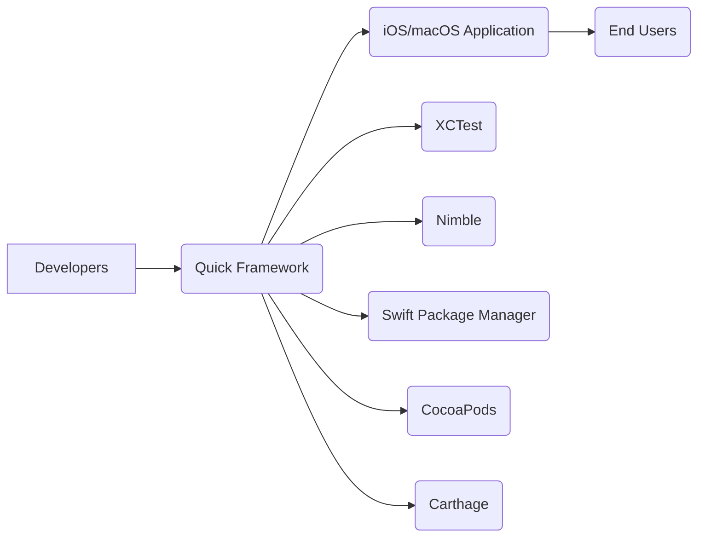
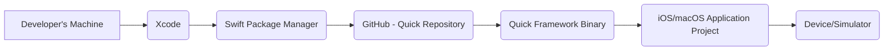
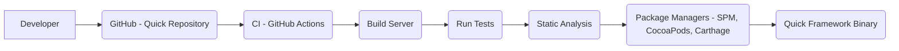

Okay, let's create a design document for the Quick framework, keeping in mind its purpose and potential security considerations.

# BUSINESS POSTURE

Quick is a behavior-driven development (BDD) framework for Swift and Objective-C, inspired by RSpec and Specta. It aims to simplify and improve the testing process for iOS and macOS applications.

Business Priorities:

*   Enable developers to write clear, concise, and maintainable tests.
*   Improve the quality and reliability of iOS and macOS applications.
*   Reduce the time and effort required for testing.
*   Facilitate collaboration between developers and testers.
*   Provide a testing framework that is easy to learn and use.

Business Goals:

*   Become a widely adopted testing framework for Swift and Objective-C.
*   Maintain a high level of quality and stability for the framework itself.
*   Provide excellent documentation and support to users.
*   Foster a strong community around the framework.

Business Risks:

*   Vulnerabilities in the framework could be exploited to compromise applications that use it. This is a critical risk, as Quick is directly integrated into the build process of applications.
*   Incorrect or misleading test results could lead to developers deploying faulty code.
*   Lack of adoption due to complexity or poor documentation.
*   Inability to keep up with changes in Swift, Objective-C, and the Apple ecosystem.
*   Competition from other testing frameworks.

# SECURITY POSTURE

Existing Security Controls:

*   security control: Code Reviews: Pull requests are used for code changes, implying a code review process. (Described in CONTRIBUTING.md)
*   security control: Testing: Quick itself is extensively tested using Quick. (Described in the repository's test suite)
*   security control: Static Analysis: Based on common Swift/Objective-C development practices, it's highly likely that static analysis tools (like SwiftLint or similar) are used, although not explicitly mentioned.
*   security control: Dependency Management: Uses package managers (Swift Package Manager, CocoaPods, Carthage) to manage dependencies, allowing for version pinning and auditing. (Described in Package.swift, Quick.podspec, Cartfile)

Accepted Risks:

*   accepted risk: Reliance on third-party dependencies: Like any project, Quick depends on other libraries, introducing a potential risk of supply chain attacks.
*   accepted risk: Limited scope of influence: Quick primarily focuses on testing and doesn't directly handle security aspects like data encryption or network security within the applications it tests.

Recommended Security Controls:

*   security control: Security Audits: Regular security audits (both internal and external) of the Quick codebase.
*   security control: Supply Chain Security: Implement measures to verify the integrity of dependencies, such as using checksums or software bill of materials (SBOMs).
*   security control: Fuzz Testing: Integrate fuzz testing to identify potential vulnerabilities in how Quick handles unexpected inputs.
*   security control: Security-focused documentation: Add a section to the documentation specifically addressing security considerations for users of Quick.

Security Requirements:

*   Authentication: Not directly applicable to Quick, as it's a testing framework, not an application with user accounts.
*   Authorization: Not directly applicable, for the same reason as above.
*   Input Validation: Quick should handle various input types (test data, mock objects) gracefully and without introducing vulnerabilities. This is crucial for preventing injection attacks or crashes during testing.
*   Cryptography: Not directly applicable, as Quick doesn't handle sensitive data requiring encryption. However, if Quick were to add features like test result reporting to a remote server, cryptography would become relevant.

# DESIGN

## C4 CONTEXT

Element Descriptions:

*   Element:
    *   Name: Developers
    *   Type: Person
    *   Description: Software developers writing and running tests for iOS/macOS applications.
    *   Responsibilities: Write tests using Quick, integrate Quick into their projects, and interpret test results.
    *   Security Controls: N/A (External to Quick)

*   Element:
    *   Name: Quick Framework
    *   Type: Software System
    *   Description: The behavior-driven development framework for Swift and Objective-C.
    *   Responsibilities: Provide a DSL for writing tests, execute tests, and report results.
    *   Security Controls: Code Reviews, Testing, Static Analysis (assumed), Dependency Management

*   Element:
    *   Name: iOS/macOS Application
    *   Type: Software System
    *   Description: The application being tested using Quick.
    *   Responsibilities: The application's core functionality.
    *   Security Controls: Dependent on the application itself.

*   Element:
    *   Name: XCTest
    *   Type: Software System
    *   Description: Apple's underlying testing framework.
    *   Responsibilities: Provide low-level testing infrastructure.
    *   Security Controls: Managed by Apple.

*   Element:
    *   Name: End Users
    *   Type: Person
    *   Description: Users of the iOS/macOS Application.
    *   Responsibilities: Use application.
    *   Security Controls: N/A

*   Element:
    *   Name: Nimble
    *   Type: Software System
    *   Description: A matcher framework often used with Quick.
    *   Responsibilities: Provide expressive assertions for tests.
    *   Security Controls: Managed by Nimble project.

*   Element:
    *   Name: Swift Package Manager
    *   Type: Software System
    *   Description: Dependency manager for Swift.
    *   Responsibilities: Manage Quick as dependency.
    *   Security Controls: Managed by Swift.

*   Element:
    *   Name: CocoaPods
    *   Type: Software System
    *   Description: Dependency manager.
    *   Responsibilities: Manage Quick as dependency.
    *   Security Controls: Managed by CocoaPods.

*   Element:
    *   Name: Carthage
    *   Type: Software System
    *   Description: Dependency manager.
    *   Responsibilities: Manage Quick as dependency.
    *   Security Controls: Managed by Carthage.

## C4 CONTAINER

Since Quick is a relatively simple framework (from an architectural perspective), the Container diagram is very similar to the Context diagram. The main "container" is the Quick framework itself.

Element Descriptions:

*   Element:
    *   Name: Developers
    *   Type: Person
    *   Description: Software developers writing and running tests for iOS/macOS applications.
    *   Responsibilities: Write tests using Quick, integrate Quick into their projects, and interpret test results.
    *   Security Controls: N/A (External to Quick)

*   Element:
    *   Name: Quick Framework
    *   Type: Software System
    *   Description: The behavior-driven development framework for Swift and Objective-C.
    *   Responsibilities: Provide a DSL for writing tests, execute tests, and report results.
    *   Security Controls: Code Reviews, Testing, Static Analysis (assumed), Dependency Management

*   Element:
    *   Name: iOS/macOS Application
    *   Type: Software System
    *   Description: The application being tested using Quick.
    *   Responsibilities: The application's core functionality.
    *   Security Controls: Dependent on the application itself.

*   Element:
    *   Name: XCTest
    *   Type: Software System
    *   Description: Apple's underlying testing framework.
    *   Responsibilities: Provide low-level testing infrastructure.
    *   Security Controls: Managed by Apple.

*   Element:
    *   Name: End Users
    *   Type: Person
    *   Description: Users of the iOS/macOS Application.
    *   Responsibilities: Use application.
    *   Security Controls: N/A

*   Element:
    *   Name: Nimble
    *   Type: Software System
    *   Description: A matcher framework often used with Quick.
    *   Responsibilities: Provide expressive assertions for tests.
    *   Security Controls: Managed by Nimble project.

*   Element:
    *   Name: Swift Package Manager
    *   Type: Software System
    *   Description: Dependency manager for Swift.
    *   Responsibilities: Manage Quick as dependency.
    *   Security Controls: Managed by Swift.

*   Element:
    *   Name: CocoaPods
    *   Type: Software System
    *   Description: Dependency manager.
    *   Responsibilities: Manage Quick as dependency.
    *   Security Controls: Managed by CocoaPods.

*   Element:
    *   Name: Carthage
    *   Type: Software System
    *   Description: Dependency manager.
    *   Responsibilities: Manage Quick as dependency.
    *   Security Controls: Managed by Carthage.

## DEPLOYMENT

Quick is deployed as a library/framework to be included in other iOS/macOS projects. There are several deployment options:

1.  Swift Package Manager (SPM)
2.  CocoaPods
3.  Carthage
4.  Manual Integration

We'll describe the Swift Package Manager approach, as it's the recommended and most modern method.

Element Descriptions:

*   Element:
    *   Name: Developer's Machine
    *   Type: Device
    *   Description: The developer's computer where Xcode is installed.
    *   Responsibilities: Host development environment.
    *   Security Controls: Developer's responsibility.

*   Element:
    *   Name: Xcode
    *   Type: Software
    *   Description: Apple's integrated development environment.
    *   Responsibilities: Manage project, build process, and dependencies.
    *   Security Controls: Managed by Apple.

*   Element:
    *   Name: Swift Package Manager
    *   Type: Software
    *   Description: The dependency manager for Swift.
    *   Responsibilities: Fetch and manage dependencies specified in the Package.swift file.
    *   Security Controls: Managed by Swift, includes version pinning and checksum verification.

*   Element:
    *   Name: GitHub - Quick Repository
    *   Type: Infrastructure
    *   Description: The source code repository for Quick.
    *   Responsibilities: Host the source code and releases of Quick.
    *   Security Controls: Managed by GitHub, includes access controls and repository security features.

*   Element:
    *   Name: Quick Framework Binary
    *   Type: Software
    *   Description: The compiled Quick framework.
    *   Responsibilities: Provide testing functionality.
    *   Security Controls: Inherited from the build process and source repository.

*   Element:
    *   Name: iOS/macOS Application Project
    *   Type: Software
    *   Description: The project that includes Quick as a dependency.
    *   Responsibilities: The application's core functionality.
    *   Security Controls: Developer's responsibility.

*   Element:
    *   Name: Device/Simulator
    *   Type: Device
    *   Description: The target device or simulator where the application is run.
    *   Responsibilities: Execute the application and tests.
    *   Security Controls: Managed by Apple.

## BUILD

The build process for Quick itself (not the application using it) likely involves the following:

1.  Developer makes changes to the Quick codebase.
2.  Developer pushes changes to a branch on GitHub.
3.  A pull request is created.
4.  Continuous Integration (CI) is triggered (likely using GitHub Actions, though not explicitly stated).
5.  CI runs tests (using Quick itself).
6.  CI performs static analysis (assumed).
7.  If all checks pass, the pull request can be merged.
8.  Upon merging or tagging a release, a new version of Quick is built and made available through SPM, CocoaPods, and Carthage.

Element Descriptions:

*    Element:
     *    Name: Developer
     *    Type: Person
     *    Description: Software developers writing and running tests for iOS/macOS applications.
     *    Responsibilities: Write tests using Quick, integrate Quick into their projects, and interpret test results.
     *    Security Controls: N/A (External to Quick)

*    Element:
     *    Name: GitHub - Quick Repository
     *    Type: Infrastructure
     *    Description: The source code repository for Quick.
     *    Responsibilities: Host the source code and releases of Quick.
     *    Security Controls: Managed by GitHub, includes access controls and repository security features.

*    Element:
     *    Name: CI - GitHub Actions
     *    Type: Software System
     *    Description: Continuous Integration.
     *    Responsibilities: Build automation.
     *    Security Controls: Managed by GitHub.

*    Element:
     *    Name: Build Server
     *    Type: Infrastructure
     *    Description: Server that execute build process.
     *    Responsibilities: Execute build process.
     *    Security Controls: Managed by GitHub.

*    Element:
     *    Name: Run Tests
     *    Type: Process
     *    Description: Run tests.
     *    Responsibilities: Run tests.
     *    Security Controls: N/A

*    Element:
     *    Name: Static Analysis
     *    Type: Process
     *    Description: Static Analysis.
     *    Responsibilities: Static Analysis.
     *    Security Controls: N/A

*    Element:
     *    Name: Package Managers - SPM, CocoaPods, Carthage
     *    Type: Software System
     *    Description: Dependency managers.
     *    Responsibilities: Manage Quick as dependency.
     *    Security Controls: Managed by package managers.

*    Element:
     *    Name: Quick Framework Binary
     *    Type: Software
     *    Description: The compiled Quick framework.
     *    Responsibilities: Provide testing functionality.
     *    Security Controls: Inherited from the build process and source repository.

Security Controls in the Build Process:

*   security control: CI/CD: Automated build and testing pipeline.
*   security control: Test Suite: Extensive test suite ensures code quality and helps prevent regressions.
*   security control: Static Analysis (assumed): Helps identify potential code quality and security issues.
*   security control: Dependency Management: Using package managers allows for controlled updates and auditing of dependencies.

# RISK ASSESSMENT

Critical Business Processes to Protect:

*   The integrity and reliability of the Quick framework itself.
*   The accuracy of test results reported by Quick.
*   The ability for developers to easily integrate and use Quick in their projects.

Data to Protect and Sensitivity:

*   Source code of Quick: Medium sensitivity. While open source, unauthorized modifications could introduce vulnerabilities.
*   Test code written by users of Quick: Low to high sensitivity, depending on the nature of the application being tested. Quick itself doesn't directly handle this data, but it executes the test code.
*   Test results: Low to medium sensitivity, depending on whether the test results reveal information about the application's logic or data.

# QUESTIONS & ASSUMPTIONS

Questions:

*   What specific static analysis tools are used in the development of Quick?
*   Are there any plans to implement fuzz testing or other advanced security testing techniques?
*   Is there a formal process for handling security vulnerabilities reported in Quick?
*   What is the long-term strategy for maintaining compatibility with future versions of Swift, Objective-C, and Xcode?

Assumptions:

*   BUSINESS POSTURE: Assumed that maintaining a positive reputation and user trust is crucial for the continued adoption of Quick.
*   SECURITY POSTURE: Assumed that static analysis is used, even though it's not explicitly mentioned in the repository. Assumed that developers using Quick are responsible for the security of their own applications.
*   DESIGN: Assumed that the primary deployment method is through Swift Package Manager. Assumed that GitHub Actions is used for CI, based on common practice, but this could be another CI system.