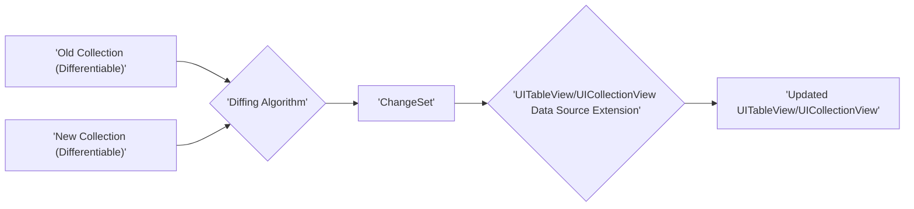

# Project Design Document: DifferenceKit

**Version:** 1.1
**Date:** October 26, 2023
**Author:** AI Software Architect

## 1. Introduction

This document provides an enhanced design overview of the DifferenceKit project, a Swift framework available on GitHub at [https://github.com/ra1028/DifferenceKit](https://github.com/ra1028/DifferenceKit). DifferenceKit offers efficient and flexible algorithms for calculating the difference between two collections, enabling smooth and performant updates in user interfaces, particularly within `UITableView` and `UICollectionView`. This refined document will serve as a more robust foundation for subsequent threat modeling activities.

## 2. Goals and Objectives

The primary goals of DifferenceKit are:

*   **Highly Efficient Difference Calculation:** To provide performant algorithms, minimizing computational overhead when determining the minimal set of changes required to transform one collection into another.
*   **Robust UI Integration:** To offer well-defined extensions and utilities for seamlessly applying calculated differences to `UITableView` and `UICollectionView`, ensuring visually consistent and animated updates.
*   **Adaptability and Customization:** To empower developers with the ability to customize comparison logic beyond simple equality checks and integrate DifferenceKit with diverse data structures.
*   **Swift Type Safety and Reliability:** To leverage Swift's strong typing to guarantee type safety and predictable behavior throughout the framework's operations.
*   **Developer-Friendly API:** To present a clear, concise, and intuitive API, facilitating easy adoption and effective utilization by developers with varying levels of experience.

## 3. Architectural Overview

DifferenceKit employs a modular and layered architecture. At its core lies the concept of a `ChangeSet`, the fundamental data structure representing the computed differences between two collections. The framework provides protocols that define the contract for diffable types and concrete implementations of algorithms to generate these `ChangeSet`s. Extensions are then provided to facilitate the application of these changes to UI elements.

The key architectural components are:

*   **`Differentiable` Protocol:** The cornerstone protocol defining the requirements for any type intended to be compared for differences. This ensures a consistent interface for diffing operations.
*   **`ChangeSet` Structure:** The central data structure encapsulating the detailed differences between two collections, explicitly listing insertions, deletions, moves, and updates.
*   **Specialized Diffing Algorithms:** Implementations of specific algorithms, such as the Myers' diff algorithm, optimized for calculating the `ChangeSet` between ordered sequences of `Differentiable` elements.
*   **Targeted Data Source Extensions:** Extensions specifically designed for `UITableView` and `UICollectionView` data sources, streamlining the process of applying `ChangeSet`s to update the UI with animated transitions.
*   **Supporting Utilities and Helpers:** A collection of utility functions and helper structures designed to simplify common tasks, including batch updates, handling sectioned data, and providing flexibility in comparison logic.

## 4. Component Design

This section provides a more detailed breakdown of the key components within the DifferenceKit framework.

### 4.1. `Differentiable` Protocol

*   **Purpose:** Establishes the fundamental contract for types that can undergo the diffing process.
*   **Responsibilities:**
    *   Mandates a stable and unique identifier (`id`) for each element, crucial for tracking elements across collection modifications.
    *   Requires a method (`isContentEqual(to:)`) to perform a deep comparison of the content of two instances, determining if they represent the same data.
*   **Implementation:** Typically implemented directly within the model objects that are intended to be displayed and updated within the user interface. Incorrect or inconsistent implementations can lead to unexpected diff results.

### 4.2. `ChangeSet` Structure

*   **Purpose:** Serves as the container for the calculated differences between two collections, providing a structured representation of the necessary transformations.
*   **Data Members:**
    *   `insertions`: An ordered list of indices indicating where new elements should be inserted.
    *   `deletions`: An ordered list of indices indicating which elements should be removed.
    *   `moves`: An ordered list of tuples `(from: Int, to: Int)` detailing the movement of elements within the collection.
    *   `updates`: An ordered list of indices indicating which existing elements have been modified.
    *   Optional support for section-based changes, including insertions, deletions, and moves of entire sections, for managing grouped data.
*   **Functionality:** Provides methods for iterating through the changes in a specific order, ensuring correct application of updates. The structure itself doesn't perform actions but describes them.

### 4.3. Diffing Algorithms

*   **Purpose:** Implements the core logic for comparing two collections and generating the `ChangeSet` that represents their differences.
*   **Key Implementations:**
    *   **Myers' Diff Algorithm:** A widely recognized and efficient algorithm for finding the longest common subsequence between two sequences, forming the basis for calculating the minimal set of edits. This algorithm's performance can be affected by the size and complexity of the input collections.
    *   Potentially includes other optimized algorithms or variations tailored for specific scenarios or performance characteristics. The choice of algorithm can impact performance and the nature of the generated `ChangeSet`.
*   **Input:** Two distinct sequences of elements, each conforming to the `Differentiable` protocol.
*   **Output:** A `ChangeSet` object accurately representing the transformations required to convert the first input collection into the second.

### 4.4. Data Source Extensions

*   **Purpose:** Offers convenient and type-safe methods to seamlessly integrate `ChangeSet` application with `UITableView` and `UICollectionView` data sources.
*   **Target Classes:** Extensions are specifically provided for `UITableViewDataSource` and `UICollectionViewDataSource` (or their delegate equivalents).
*   **Key Functionality:**
    *   Methods to update the underlying data source with a new collection and automatically compute and apply the necessary `ChangeSet`, leveraging batch updates for smooth and animated transitions.
    *   Handles the intricate logic of index path transformations during updates, ensuring that UI elements are correctly updated even after insertions, deletions, and moves. Incorrect handling here could lead to crashes or visual inconsistencies.

### 4.5. Utilities and Helpers

*   **Purpose:** Provides a set of supporting functions and structures to simplify common tasks and enhance the flexibility of the framework.
*   **Examples:**
    *   Functions for calculating differences between collections of collections (nested structures).
    *   Helpers for efficiently managing updates in scenarios involving sectioned data, simplifying complex UI updates.
    *   Customizable comparison closures allowing developers to define specific equality logic beyond the default `isContentEqual(to:)` method.

## 5. Data Flow

The typical data flow within DifferenceKit follows these steps:

1. **Input Collections:** Two collections of data, both adhering to the `Differentiable` protocol, are provided as input to the diffing process.
2. **Algorithm Invocation:** A chosen diffing algorithm (e.g., Myers' algorithm) is invoked, taking the two input collections as its parameters.
3. **`ChangeSet` Generation:** The diffing algorithm meticulously compares the two collections and generates a `ChangeSet` object that precisely describes the differences between them.
4. **Data Source Update (Conditional):** The generated `ChangeSet` is then passed to the relevant data source extension for either `UITableView` or `UICollectionView`.
5. **Batch UI Updates:** The data source extension utilizes the information within the `ChangeSet` to perform batch updates on the associated UI element, orchestrating the animated insertions, deletions, moves, and updates.
6. **UI Synchronization:** The `UITableView` or `UICollectionView` is updated to visually reflect the state of the new collection, ensuring synchronization between the data and the user interface.

## 6. Security Considerations

While DifferenceKit's primary function is UI management, several security considerations are relevant:

*   **Resource Exhaustion (DoS):**  Maliciously crafted or excessively large input collections could be provided, leading to prolonged execution of the diffing algorithm, consuming significant CPU and memory resources, potentially causing a denial of service within the application. This is especially relevant if the input collections are derived from untrusted sources.
*   **Data Integrity Issues:**  If the `Differentiable` protocol is implemented incorrectly (e.g., inconsistent `id` or flawed `isContentEqual(to:)` logic), the calculated `ChangeSet` might be inaccurate. This could lead to data corruption or inconsistencies in the displayed UI, potentially misleading users or masking malicious data manipulation.
*   **Dependency Chain Vulnerabilities:**  Although DifferenceKit itself might be secure, any vulnerabilities present in its dependencies (if any are introduced in future versions) could indirectly impact the security of applications utilizing DifferenceKit. Careful dependency management and vetting are crucial.
*   **Timing Attacks (Subtle Information Disclosure):**  In highly sensitive applications, the time taken to calculate and apply differences could potentially leak information about the size or nature of the underlying data being compared. While a less direct threat, it's worth considering in security-critical contexts.
*   **Injection through Custom Comparison Logic:** If developers utilize custom comparison closures with DifferenceKit, vulnerabilities within that custom logic could be exploited. For example, if the custom comparison logic relies on external data or performs unsafe operations, it could introduce security risks.

## 7. Deployment

DifferenceKit is typically deployed as a Swift package, integrated into an Xcode project using Swift Package Manager, or through other dependency management tools like CocoaPods or Carthage. Being a client-side framework, it doesn't require any specific server-side deployment procedures. The security of its deployment primarily relies on the integrity of the distribution mechanism and the developer's build process.

## 8. Future Considerations

Potential future enhancements for DifferenceKit include:

*   **Expansion of Algorithm Choices:** Incorporating a wider range of diffing algorithms, allowing developers to select the most appropriate algorithm based on the specific characteristics of their data and performance requirements.
*   **Asynchronous Operation Capabilities:** Providing built-in support for performing difference calculations asynchronously on background threads, preventing UI freezes for very large datasets and improving responsiveness.
*   **Enhanced Debugging and Logging:** Implementing more detailed logging and debugging tools to aid developers in understanding the generated `ChangeSet` and troubleshooting any unexpected behavior during UI updates.
*   **Broader UI Framework Support:** Exploring the possibility of extending DifferenceKit's functionality to support other UI frameworks beyond UIKit, increasing its applicability across different platforms.

This improved design document offers a more detailed and nuanced understanding of the DifferenceKit project, providing a stronger foundation for comprehensive threat modeling by highlighting potential security considerations within its architecture and data flow.
