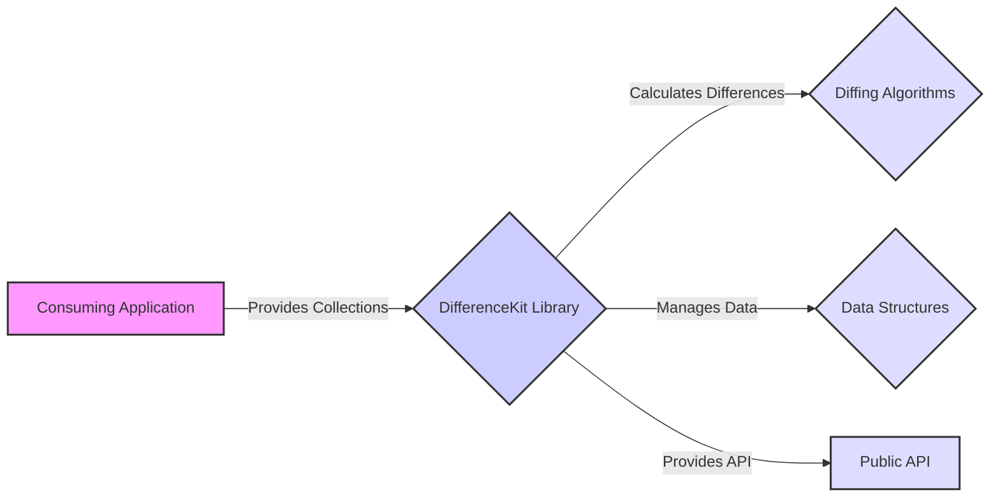
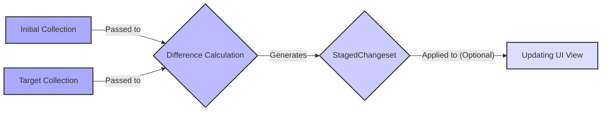

## Project Design Document: DifferenceKit (Improved)

**1. Introduction**

This document provides an enhanced design overview of the DifferenceKit Swift library, specifically tailored for threat modeling purposes. It details the architecture, components, and data flow of DifferenceKit to facilitate the identification and analysis of potential security vulnerabilities. This document serves as a foundation for subsequent threat modeling activities.

**2. Goals and Objectives**

The primary goals of DifferenceKit are:

* **Efficient Difference Calculation:** To provide highly performant algorithms for computing the minimal set of changes (insertions, deletions, moves, and updates) required to transform one collection into another.
* **Platform Agnostic Implementation:** To ensure usability across various Apple platforms, including iOS, macOS, watchOS, and tvOS, as well as server-side Swift environments.
* **Simplified Integration for Developers:** To offer an intuitive and easy-to-use API, enabling seamless integration of difference calculation into existing Swift projects.
* **Flexible Comparison Logic:** To empower developers to define custom comparison logic for elements within collections, accommodating diverse data structures and comparison needs.
* **Strong Type Safety Guarantees:** To leverage Swift's robust type system, ensuring safe and predictable operations and reducing the likelihood of runtime errors.

**3. System Architecture**

DifferenceKit operates as an embedded library within a consuming application. Its architecture centers on the interaction between the application and the library's core diffing functionalities.

* **Consuming Application:** The Swift application that integrates and utilizes the DifferenceKit library to determine and apply changes between its data collections. This is the primary context where potential vulnerabilities related to DifferenceKit might manifest.
* **DifferenceKit Library:** The core library providing the algorithms and data structures necessary for calculating and representing differences between collections. This component is the focus of the threat model.
* **Diffing Algorithms:**  The set of algorithms implemented within DifferenceKit responsible for the core difference calculation logic. Examples include variations of the Myers algorithm or other optimized sequence alignment algorithms. The efficiency and correctness of these algorithms are critical.
* **Data Structures:** The internal data structures used by DifferenceKit to represent collections, individual elements, and the calculated differences. These structures include representations of insertions, deletions, moves, and updates, often leveraging `IndexPath` for ordered collections.
* **Public API:** The set of publicly accessible interfaces (protocols, structs, and methods) that the consuming application interacts with to utilize DifferenceKit's functionality. This is the primary entry point for using the library.

**4. Component Details**

* **`Differentiable` Protocol:**
    * **Purpose:**  Defines the contract for types that can have their differences calculated by DifferenceKit.
    * **Key Requirements:**
        * `DifferenceIdentifier`: An associated type used to uniquely identify elements within a collection. This identifier should be stable and consistent.
        * `Content`: An associated type representing the actual content of an element.
        * `differenceIdentifier` property: Returns a unique identifier for the instance.
        * `isContentEqual(to:)` method:  Determines if the content of two instances is considered equal. Incorrect or inefficient implementations can lead to incorrect diff calculations or performance issues.
    * **Threat Relevance:**  A poorly implemented `isContentEqual(to:)` could lead to incorrect identification of changes, potentially causing unexpected behavior or data inconsistencies in the consuming application.

* **`StagedChangeset` Structure:**
    * **Purpose:** Represents the calculated differences between two collections as a series of distinct stages (insertions, deletions, moves, updates).
    * **Content:** Contains arrays of `Collection.Index` for insertions and deletions, and tuples of `(Collection.Index, Collection.Index)` for moves, and `(Collection.Index, Element)` for updates.
    * **Functionality:** Provides methods for applying these changes to a mutable collection.
    * **Threat Relevance:** If the `StagedChangeset` is manipulated or corrupted after calculation, applying it could lead to data corruption or unexpected state changes in the consuming application's data.

* **Diffing Algorithms (Internal Implementation):**
    * **Examples:**  Likely includes implementations or variations of the Myers diff algorithm or other algorithms optimized for collection diffing.
    * **Performance Characteristics:** The performance (time and space complexity) of these algorithms is crucial, especially for large collections.
    * **Threat Relevance:**  Algorithmic complexity vulnerabilities could be exploited by providing very large or specifically crafted input collections that cause excessive CPU or memory usage, leading to denial-of-service within the consuming application.

* **`CollectionView.apply(_:)` and `TableView.apply(_:)` Extensions:**
    * **Purpose:** Convenience extensions for `UICollectionView` and `UITableView` (and their macOS equivalents) to directly apply a `StagedChangeset` and animate the corresponding view updates.
    * **Functionality:** Translates the abstract changes in the `StagedChangeset` into concrete view modifications (inserting, deleting, moving, and reloading cells/rows).
    * **Threat Relevance:** While primarily UI-focused, vulnerabilities in these extensions could potentially lead to UI inconsistencies or crashes if the `StagedChangeset` is invalid or maliciously crafted.

**5. Data Flow**

The typical data flow when using DifferenceKit involves the following sequence of operations:

1. **Initial Collection:** The original state of the data collection before any changes. This is an input to the DifferenceKit library.
2. **Target Collection:** The desired state of the data collection after the changes. This is the second input to the DifferenceKit library.
3. **Difference Calculation:** The core process within DifferenceKit where the diffing algorithms compare the initial and target collections, leveraging the `Differentiable` conformance of the elements.
4. **`StagedChangeset`:** The output of the difference calculation. It represents the calculated sequence of changes (insertions, deletions, moves, updates) needed to transform the initial collection into the target collection. This is the primary output of the library.
5. **Updating UI View:** An optional step where the `StagedChangeset` is used to update a user interface element (e.g., `UITableView`, `UICollectionView`) to reflect the changes in the data.

**6. Security Considerations**

As an embedded library, DifferenceKit's security posture is primarily influenced by how it's used within the consuming application. However, several potential security considerations exist:

* **Input Validation and Data Integrity:**
    * **Threat:** The consuming application should validate the integrity and size of the `Initial Collection` and `Target Collection` before passing them to DifferenceKit. Maliciously crafted or excessively large collections could lead to performance degradation or crashes.
    * **Mitigation:** Implement robust input validation within the consuming application to sanitize and limit the size of input collections.

* **Algorithmic Complexity Exploitation:**
    * **Threat:**  Attackers might attempt to craft specific input collections that trigger worst-case performance scenarios in the diffing algorithms, leading to denial-of-service.
    * **Mitigation:**  While DifferenceKit likely employs efficient algorithms, understanding their complexity and potential bottlenecks is important. Consider implementing timeouts or resource limits in the consuming application if processing very large collections.

* **Memory Management Vulnerabilities:**
    * **Threat:**  Bugs in the internal diffing algorithms or data structures could lead to memory leaks or excessive memory consumption, potentially crashing the consuming application.
    * **Mitigation:**  Regularly review and test DifferenceKit for memory management issues. Utilize memory analysis tools during development.

* **Incorrect `Differentiable` Implementation:**
    * **Threat:** If the consuming application incorrectly implements the `Differentiable` protocol (e.g., an inconsistent `differenceIdentifier` or a flawed `isContentEqual(to:)`), DifferenceKit might calculate incorrect differences, leading to data inconsistencies or unexpected behavior.
    * **Mitigation:**  Provide clear guidelines and examples for implementing the `Differentiable` protocol. Implement unit tests to verify the correctness of `Differentiable` implementations.

* **`StagedChangeset` Manipulation:**
    * **Threat:** If the `StagedChangeset` is intercepted or manipulated after calculation but before being applied, it could lead to the application of incorrect changes, potentially causing data corruption or security vulnerabilities.
    * **Mitigation:** Ensure secure handling and transmission of the `StagedChangeset` if it needs to be passed between different parts of the application.

* **Dependency Chain Security:**
    * **Threat:** While DifferenceKit has minimal dependencies, any transitive dependencies could introduce vulnerabilities.
    * **Mitigation:** Regularly audit and update dependencies to address known security vulnerabilities.

**7. Deployment**

DifferenceKit is typically deployed as a Swift Package Manager (SPM) dependency or through other dependency management tools like CocoaPods or Carthage. It is integrated directly into the consuming application's build process.

**8. Future Considerations**

* **Algorithm Customization:**  Allowing developers to select specific diffing algorithms based on their needs (e.g., trading off performance for accuracy in certain scenarios).
* **Asynchronous Operations:**  Providing built-in support for performing difference calculations asynchronously to prevent blocking the main thread for large datasets.
* **Enhanced Update Information:**  Potentially providing more granular details about updates, such as the specific properties that have changed within an element, which could be relevant for certain application logic.

This improved design document provides a more detailed and security-focused overview of the DifferenceKit library, serving as a stronger foundation for subsequent threat modeling efforts.