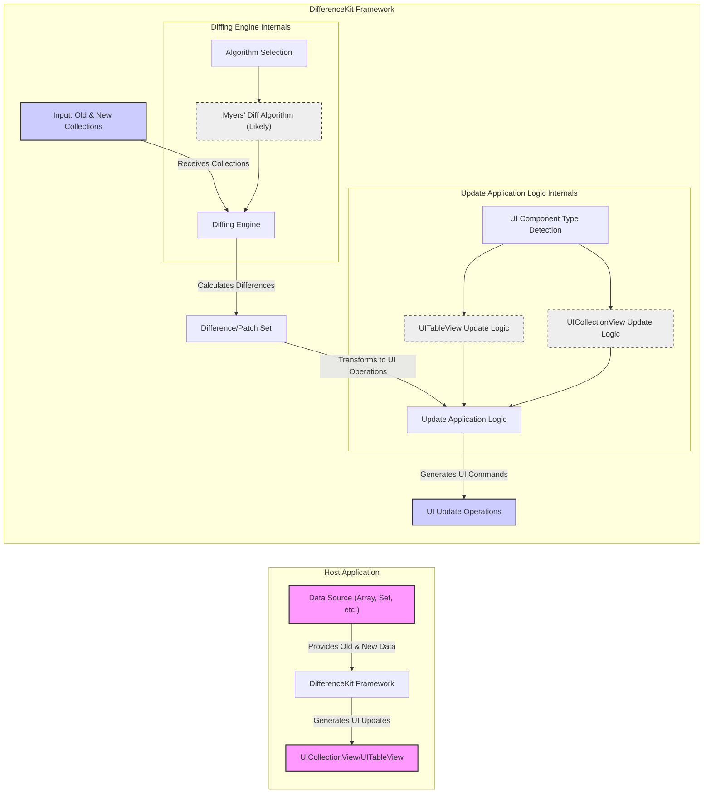

# Project Design Document: DifferenceKit (Improved)

**Project Name:** DifferenceKit

**Project Repository:** [https://github.com/ra1028/differencekit](https://github.com/ra1028/differencekit)

**Version:** 1.1 (Improved Design Document)

**Date:** 2023-10-27

**Author:** AI Software Architect

## 1. Introduction

This document provides an enhanced design overview of the DifferenceKit project, a Swift framework for efficient collection diffing and UI updates. This document builds upon the initial design and provides more detail for threat modeling and security analysis. It elaborates on the system architecture, component functionalities, data flow, and potential security considerations, offering a more robust foundation for security assessments.

## 2. Project Overview and Goals

### 2.1. Project Description

DifferenceKit is a Swift framework meticulously crafted to compute and apply differences between two collections with optimal efficiency. It is specifically designed to streamline UI updates in iOS and macOS applications, particularly for `UITableView`, `UICollectionView`, and similar UI elements. By providing a performant and reliable mechanism for calculating and applying changes, DifferenceKit significantly simplifies the process of animating UI updates when the underlying data model evolves, leading to improved application responsiveness and a smoother user experience.

### 2.2. Project Goals

*   **Highly Efficient Diffing Algorithms:** Implement and utilize state-of-the-art algorithms (likely variations of Myers' diff algorithm) to minimize the computational cost of difference calculation.
*   **Seamless UIKit and AppKit Integration:** Provide a straightforward and intuitive API for integrating with standard UI components like `UICollectionView` and `UITableView` in both UIKit (iOS, tvOS) and AppKit (macOS).
*   **Versatile Collection Support:**  Accommodate a wide range of Swift collection types (Arrays, Sets, Ordered Sets, etc.) and custom collections, as long as elements conform to necessary protocols (e.g., `Hashable`, `Identifiable`).
*   **Performance-Centric Design:** Prioritize performance at every level, from algorithm selection to implementation details, ensuring minimal overhead and optimal UI update speeds, even with large and complex datasets.
*   **Developer-Friendly API:** Offer a clear, concise, and well-documented API that is easy for developers to understand and use, reducing the learning curve and promoting adoption.
*   **Extensibility and Customization:**  Provide extension points and customization options to allow developers to tailor the diffing behavior to their specific needs, such as custom equality checks or diffing strategies.

### 2.3. Target Users

The target audience for DifferenceKit remains iOS and macOS developers who are actively engaged in building data-driven applications. These developers typically face the challenge of efficiently updating list-based UIs when the underlying data changes. Specific user profiles include:

*   Developers building applications with dynamic, frequently changing content, such as social media feeds, news aggregators, or real-time data dashboards.
*   Developers working on applications that heavily rely on lists, tables, grids, or collection views to display information.
*   Developers who prioritize smooth, animated UI transitions and seek to enhance the visual appeal and user experience of their applications during data updates.
*   Developers aiming to optimize application performance and reduce UI update overhead, especially when dealing with large datasets or frequent data modifications.

## 3. System Architecture

### 3.1. Component Diagram



**Detailed Description of Components:**

*   **"Host Application"**: Represents the encompassing iOS or macOS application that integrates and leverages the DifferenceKit framework to manage UI updates.
    *   **"Data Source (Array, Set, etc.)"**:  The application's core data model, typically implemented using Swift collections such as arrays, sets, or custom data structures. This component holds the data that needs to be displayed and kept synchronized with the UI.
    *   **"UICollectionView/UITableView"**: Standard UIKit/AppKit components responsible for visually presenting data in a list or grid format. These components are the targets for UI updates driven by DifferenceKit.
    *   **"DifferenceKit Framework"**: The external Swift library that provides the core diffing and UI update functionalities. It acts as an intermediary between the data source and the UI components.

*   **"DifferenceKit Framework"**:  Represents the internal modular structure of the DifferenceKit library, detailing its key functional units.
    *   **"Input: Old & New Collections"**: The initial entry point of the framework. It receives two versions of the data collections – the previous state and the new state – from the host application. These collections serve as the basis for difference calculation.
    *   **"Diffing Engine"**: The central processing unit of DifferenceKit. It houses the diffing algorithms responsible for comparing the "Old & New Collections" and identifying the minimal set of changes required to transform one into the other.
        *   **"Diffing Engine Internals"**: Sub-components within the Diffing Engine.
            *   **"Algorithm Selection"**:  A logical component that might be responsible for choosing the most appropriate diffing algorithm based on input characteristics or configuration (though likely fixed to a high-performance algorithm like Myers' diff).
            *   **"Myers' Diff Algorithm (Likely)"**:  Represents the core diffing algorithm implementation. Myers' diff algorithm or a highly optimized variant is the most probable choice due to its efficiency in finding the longest common subsequence and generating minimal edit scripts.
        *   **"Difference/Patch Set"**: The structured output from the "Diffing Engine". It represents the calculated differences as a set of operations (insertions, deletions, moves, updates) needed to transform the old collection into the new one. This set is often represented as a `Changeset` data structure.
    *   **"Update Application Logic"**:  This component bridges the gap between the abstract "Difference/Patch Set" and concrete UI update commands. It interprets the changeset and translates it into specific actions for `UICollectionView` or `UITableView`.
        *   **"Update Application Logic Internals"**: Sub-components within the Update Application Logic.
            *   **"UI Component Type Detection"**:  Responsible for identifying the type of UI component being updated (`UITableView` or `UICollectionView`) to apply the correct update logic.
            *   **"UITableView Update Logic"**: Contains the specific logic for generating UI update operations tailored for `UITableView`, using methods like `insertRows(at:)`, `deleteRows(at:)`, `moveRow(at:to:)`, `reloadRows(at:)`.
            *   **"UICollectionView Update Logic"**: Contains the specific logic for generating UI update operations tailored for `UICollectionView`, using methods like `insertItems(at:)`, `deleteItems(at:)`, `moveItem(at:to:)`, `reloadItems(at:)`.
        *   **"UI Update Operations"**: The final output of the framework. This is a sequence of concrete commands (method calls) directed at the `UICollectionView` or `UITableView` instance to perform the actual UI updates. These operations are typically batched and animated for a smooth visual transition.

### 3.2. Data Flow (Detailed)

1.  **Data Change Notification:** The host application's data model (represented by **"Data Source (Array, Set, etc.)"**) undergoes a change. This could be due to user interaction, network updates, or internal application logic.
2.  **Collection Preparation:** The host application retrieves both the *previous* version (old data) and the *current* version (new data) of the data collection. These collections are prepared to be passed to DifferenceKit.
3.  **Difference Calculation Request:** The host application invokes DifferenceKit's API, providing the **"Input: Old & New Collections"**. This typically involves calling a function or method within DifferenceKit, passing the old and new data collections as arguments.
4.  **Diffing Engine Processing:** The **"Diffing Engine"** receives the input collections.
    *   **Algorithm Execution:** The engine executes the chosen diffing algorithm (likely **"Myers' Diff Algorithm (Likely)"**) to compare the two collections element by element.
    *   **Difference Set Generation:** The algorithm computes the **"Difference/Patch Set"**, which is a structured representation of the changes (insertions, deletions, moves, updates) required to transform the old collection into the new one.
5.  **Update Logic Application:** The **"Update Application Logic"** component receives the **"Difference/Patch Set"**.
    *   **UI Component Type Detection:** It identifies the target UI component (e.g., by inspecting the provided UI element or through API parameters).
    *   **Operation Mapping:** Based on the UI component type and the "Difference/Patch Set", it maps the abstract difference operations to concrete UI update methods. For example, an "insert" operation in the changeset might be translated to `insertRows(at:)` for `UITableView` or `insertItems(at:)` for `UICollectionView`.
    *   **Batching and Animation Configuration:** The logic might batch multiple UI update operations together for efficiency and configure animations to provide smooth transitions during UI updates.
6.  **UI Update Execution:** The **"UI Update Operations"** are executed on the target **"UICollectionView/UITableView"**. This involves calling the appropriate methods on the UI component to insert, delete, move, and reload items or rows, effectively updating the UI to reflect the changes in the data source.
7.  **UI Synchronization:** After the UI update operations are applied, the **"UICollectionView/UITableView"** is synchronized with the new data state, visually reflecting the changes to the user.

## 4. Technology Stack

*   **Primary Programming Language:** Swift (Leveraging Swift's features for performance, safety, and modern iOS/macOS development)
*   **Target Platforms:** iOS, macOS, tvOS, watchOS (Cross-platform support within the Apple ecosystem)
*   **Core Framework Dependencies:**
    *   UIKit (iOS, tvOS): For UI components and related functionalities on iOS and tvOS platforms.
    *   AppKit (macOS): For UI components and related functionalities on macOS.
    *   WatchKit (watchOS): For UI components and related functionalities on watchOS.
    *   Foundation Framework (Swift Standard Library):  Utilized for core data structures, algorithms, and utilities in Swift.
*   **Build System and Package Management:**
    *   Swift Package Manager (SPM): Likely used for dependency management and building the DifferenceKit framework, as it is the standard package manager for Swift projects.
*   **Possible Internal Libraries/Algorithms:**
    *   Optimized implementation of Myers' diff algorithm or a similar algorithm for efficient difference calculation.
    *   Potentially uses Swift's standard library collections and algorithms extensively for performance.

## 5. Key Features and Functionality (Detailed)

*   **High-Performance Collection Diffing:**
    *   Employs optimized algorithms, likely based on Myers' diff algorithm or its variations, to ensure fast and efficient calculation of differences between collections.
    *   Designed to handle large datasets and complex collection structures without significant performance degradation.
*   **Animated UI Updates for Collection Views and Table Views:**
    *   Automatically generates the necessary UI update operations (insertions, deletions, moves, reloads) for `UICollectionView` and `UITableView`.
    *   Applies these updates with smooth animations, enhancing the user experience and providing visual feedback for data changes.
    *   Supports batch updates to minimize UI redraws and optimize performance, especially for large changesets.
*   **Support for Various Collection Types:**
    *   Works seamlessly with standard Swift collection types like `Array`, `Set`, `OrderedSet`, and potentially custom collections.
    *   Requires elements in the collections to conform to `Hashable` (for basic diffing) and potentially `Identifiable` (for more advanced features like move detection and efficient updates).
*   **Customizable Diffing and Equality:**
    *   Likely provides options to customize the diffing behavior, such as:
        *   Providing custom equality closures or functions for comparing complex objects based on specific criteria.
        *   Potentially allowing developers to influence the diffing algorithm or strategy in advanced scenarios.
*   **Data Source Abstraction through Protocols:**
    *   May utilize protocols to abstract away the underlying data source, allowing DifferenceKit to work with various data models beyond simple arrays.
    *   This could enable integration with more complex data management architectures and patterns.
*   **Batch Update Optimization:**
    *   Groups multiple UI update operations into atomic batches to minimize the number of UI redraw cycles.
    *   This significantly improves performance, especially when dealing with large changesets that would otherwise trigger numerous individual UI updates.
*   **Asynchronous Operations (Potentially):**
    *   For very large datasets or computationally intensive diffing operations, DifferenceKit might perform diffing calculations asynchronously in the background to avoid blocking the main thread and maintain UI responsiveness.
*   **Comprehensive Error Handling and Logging:**
    *   Includes robust error handling to gracefully manage unexpected situations during diffing or UI updates.
    *   May provide logging or debugging capabilities to aid developers in troubleshooting integration issues or performance bottlenecks.

## 6. User Interactions (Developer API)

Developers interact with DifferenceKit primarily through its Swift API. The typical workflow involves these steps:

1.  **Import DifferenceKit Module:**  `import DifferenceKit` at the beginning of Swift files where DifferenceKit functionality is used.
2.  **Prepare Old and New Data:** Obtain the previous and updated versions of the data collections that need to be diffed.
3.  **Create a `Changeset`:** Instantiate a `Changeset` object (or similar data structure provided by DifferenceKit) by providing the old and new collections. This is the core API call that triggers the diffing process. Example (conceptual):
    ```swift
    let changeset = StagedChangeset(source: oldDataArray, target: newDataArray)
    ```
4.  **Apply Changeset to UI Component:** Use an extension or API provided by DifferenceKit to apply the calculated `Changeset` to a `UICollectionView` or `UITableView` instance. This typically involves calling a `reload(using:)` method or similar. Example (conceptual):
    ```swift
    collectionView.reload(using: changeset) { updatedData in
        // Optional completion handler, e.g., update local data source
        self.currentData = updatedData
    }
    ```
5.  **Configuration Options (Potentially):**  DifferenceKit might offer configuration options to customize diffing behavior, animation styles, or other aspects. These options would likely be passed as parameters to the `Changeset` initializer or the `reload(using:)` method. Examples of potential configurations:
    *   Custom equality closures.
    *   Animation settings (duration, style).
    *   Diffing algorithm variations (if supported).

## 7. Data Handling and Storage

DifferenceKit is a stateless, computational library. It does not persist data itself.

*   **Input Data Handling:** DifferenceKit operates on in-memory Swift collections provided as input. It processes these collections to calculate differences but does not modify or store the original input data persistently.
*   **Intermediate Data Structures:** During the diffing process, DifferenceKit creates temporary data structures (like the `Changeset` object and internal representations of differences). These structures are transient and exist only for the duration of the diffing and UI update operations. They are garbage collected by Swift's memory management system after use.
*   **Output Data (UI Updates):** The output of DifferenceKit is a series of UI update commands that are directly applied to the provided `UICollectionView` or `UITableView`. These commands modify the *visual representation* of data in the UI but do not inherently store or persist the underlying data itself.
*   **No Persistent Storage:** DifferenceKit does not utilize any persistent storage mechanisms (disk, database, etc.) internally. All data processing is in-memory and transient.

**Data Sensitivity Considerations:**

The sensitivity of data handled by DifferenceKit is entirely dependent on the *host application* and the *type of data* being managed and displayed in the UI. DifferenceKit itself does not introduce new data sensitivity concerns. However, if the data being diffed contains sensitive personal information (PII), financial data, or other confidential data, the host application must adhere to all relevant data privacy and security best practices, regardless of using DifferenceKit. This includes:

*   Data encryption at rest and in transit (if applicable to the data being handled).
*   Access control and authorization mechanisms to protect sensitive data.
*   Compliance with relevant data privacy regulations (e.g., GDPR, CCPA).
*   Secure logging and monitoring practices to prevent accidental data leakage.

## 8. Security Considerations (Enhanced for Threat Modeling)

This section expands on the initial security considerations, providing more specific threats, potential vulnerabilities, and mitigation strategies for threat modeling.

*   **Input Validation and Denial of Service (DoS):**
    *   **Threat:**  Malicious or unintentionally crafted excessively large or deeply nested input collections could be provided to DifferenceKit, leading to excessive CPU and memory consumption during diffing. This could result in a Denial of Service (DoS) condition, making the application unresponsive or crashing it.
    *   **Vulnerability:**  If DifferenceKit does not implement sufficient input validation or resource management, it could be susceptible to DoS attacks.
    *   **Attack Scenario:** An attacker might intentionally send extremely large or complex datasets to an application using DifferenceKit, aiming to overload the diffing process and disrupt application availability.
    *   **Mitigation:**
        *   **Input Size Limits:** Implement reasonable limits on the size (number of elements) and complexity (nesting depth) of input collections accepted by DifferenceKit's API.
        *   **Resource Monitoring:** Monitor CPU and memory usage during diffing operations. Implement safeguards to prevent runaway resource consumption, such as timeouts or resource limits.
        *   **Rate Limiting (Application Level):** At the application level, implement rate limiting on data update requests to prevent malicious actors from flooding the system with excessive update requests.

*   **Algorithm Complexity Exploitation and Performance Degradation:**
    *   **Threat:**  While Myers' diff algorithm is generally efficient, certain input patterns or pathological cases might exist that could lead to worst-case time complexity, causing performance degradation and UI unresponsiveness.
    *   **Vulnerability:**  If the chosen diffing algorithm or its implementation has exploitable worst-case scenarios, attackers could craft specific input data to trigger these scenarios and degrade application performance.
    *   **Attack Scenario:** An attacker might analyze the diffing algorithm's behavior and identify input data patterns that cause it to perform poorly. They could then send data updates conforming to these patterns to slow down the application.
    *   **Mitigation:**
        *   **Algorithm Choice and Optimization:**  Thoroughly analyze the chosen diffing algorithm for potential worst-case scenarios. Implement optimizations and safeguards to mitigate these scenarios. Consider using algorithms with more predictable performance characteristics if necessary.
        *   **Performance Benchmarking and Testing:**  Conduct extensive performance benchmarking and testing with various input data sizes and patterns, including edge cases and potentially malicious inputs, to identify and address performance bottlenecks.
        *   **Timeouts:** Implement timeouts for diffing operations to prevent them from running indefinitely in case of unexpected performance issues.

*   **Dependency Vulnerabilities and Supply Chain Risks:**
    *   **Threat:**  DifferenceKit, as a Swift package, depends on other Swift packages and system libraries. Vulnerabilities in these dependencies could indirectly affect DifferenceKit and applications that use it. This represents a supply chain risk.
    *   **Vulnerability:**  Outdated or vulnerable dependencies could introduce security flaws into DifferenceKit and downstream applications.
    *   **Attack Scenario:** An attacker could exploit a known vulnerability in a dependency of DifferenceKit to compromise applications using the framework.
    *   **Mitigation:**
        *   **Dependency Management and Updates:**  Utilize Swift Package Manager for robust dependency management. Regularly update dependencies to their latest secure versions to patch known vulnerabilities.
        *   **Dependency Scanning:**  Implement automated dependency scanning tools (e.g., using vulnerability databases and scanners integrated into CI/CD pipelines) to proactively identify and address known vulnerabilities in dependencies.
        *   **Software Bill of Materials (SBOM):** Consider generating and maintaining a Software Bill of Materials (SBOM) for DifferenceKit to track dependencies and facilitate vulnerability management.

*   **Information Disclosure through Logging and Error Handling:**
    *   **Threat:**  In error conditions or during debugging, DifferenceKit or the host application might inadvertently log or expose sensitive information from the data being diffed in logs, error messages, or debugging outputs.
    *   **Vulnerability:**  Insecure logging practices or overly verbose error reporting could lead to unintentional information disclosure.
    *   **Attack Scenario:** An attacker gaining access to application logs or error outputs might be able to extract sensitive data that was unintentionally logged during diffing operations.
    *   **Mitigation:**
        *   **Secure Logging Practices:** Implement secure logging practices. Avoid logging sensitive data in production environments. Sanitize or redact sensitive information before logging.
        *   **Error Handling and Reporting:**  Design error handling to prevent the exposure of sensitive data in error messages. Provide generic error messages to users and more detailed, but sanitized, error information for developers in controlled environments.
        *   **Log Access Control:** Restrict access to application logs to authorized personnel only.

*   **UI Update Logic Bugs and Data Integrity Issues:**
    *   **Threat:**  Bugs in the "Update Application Logic" component of DifferenceKit could potentially lead to incorrect UI updates, data corruption in the UI (visual inconsistencies), or unexpected application behavior. While not directly a security vulnerability in the traditional sense, UI inconsistencies could be exploited in social engineering or phishing attacks if they create misleading UI representations.
    *   **Vulnerability:**  Logic errors in the code that translates diff operations into UI commands could result in incorrect UI state.
    *   **Attack Scenario (Indirect):**  While unlikely to be a direct attack vector, UI inconsistencies caused by bugs could be leveraged in social engineering attacks if they mislead users into taking unintended actions based on a corrupted UI.
    *   **Mitigation:**
        *   **Comprehensive Unit and Integration Testing:**  Implement thorough unit and integration tests for the "Update Application Logic" component. Cover a wide range of diff scenarios, edge cases, and interactions with `UICollectionView` and `UITableView`.
        *   **UI Testing and Visual Regression Testing:**  Incorporate UI testing and visual regression testing to automatically detect UI inconsistencies and ensure that UI updates are rendered correctly across different data changes.
        *   **Code Reviews and Static Analysis:**  Conduct rigorous code reviews and utilize static analysis tools to identify potential logic errors and bugs in the UI update logic.

## 9. Deployment Environment

DifferenceKit is designed for deployment within the application runtime environment of Apple platforms.

*   **Deployment Context:** DifferenceKit code executes directly within the process space of the host iOS, macOS, tvOS, or watchOS application. It runs on the target device (user's iPhone, iPad, Mac, Apple TV, Apple Watch).
*   **Security Boundaries:** DifferenceKit operates within the security sandbox and permissions of the host application. It does not introduce new security boundaries. The security posture of DifferenceKit is intrinsically linked to the overall security of the host application and the underlying operating system.
*   **Distribution Mechanism:** DifferenceKit is typically distributed as a Swift Package Manager (SPM) package. Developers integrate it into their applications by adding it as a dependency in their `Package.swift` file. The Swift Package Manager handles downloading, building, and linking DifferenceKit into the application during the build process.
*   **Runtime Environment:**  DifferenceKit relies on the standard Swift runtime environment and the platform-specific frameworks (UIKit, AppKit, WatchKit) available on Apple platforms. It benefits from the security features and protections provided by these environments, such as memory safety, sandboxing, and code signing.

This improved design document provides a more detailed and comprehensive foundation for threat modeling DifferenceKit. It highlights potential security considerations and offers actionable mitigation strategies. Further in-depth code analysis and security testing are recommended to identify and address any specific vulnerabilities within the framework.