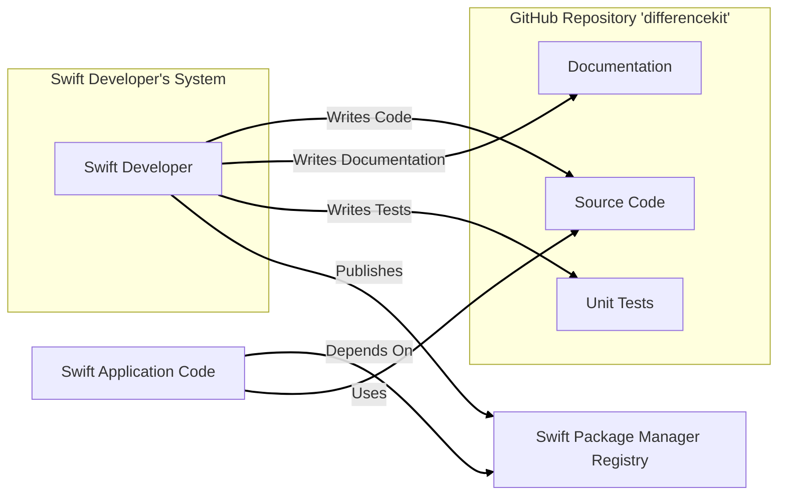
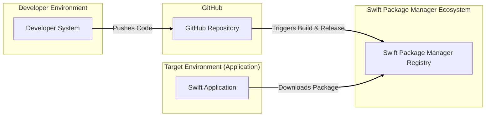
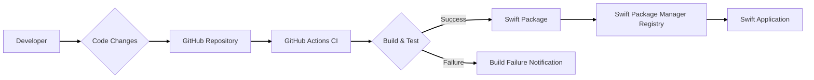

# BUSINESS POSTURE

This project, `differencekit`, is a Swift library focused on providing efficient and correct algorithms for calculating differences between collections and applying those differences as patches.

*   Business Priorities:
    *   Improve developer productivity by providing a reusable and reliable solution for diffing and patching collections in Swift applications.
    *   Enhance the performance and user experience of Swift applications by enabling efficient UI updates based on data changes.
    *   Reduce development costs and time associated with implementing custom diffing logic.

*   Business Goals:
    *   Establish `differencekit` as a widely adopted and trusted library within the Swift development community.
    *   Provide a robust and well-documented API that is easy to integrate into various Swift projects.
    *   Maintain and improve the library based on community feedback and evolving needs of Swift developers.

*   Business Risks:
    *   Risk of bugs or performance issues in the library impacting the stability and performance of applications that depend on it.
    *   Risk of security vulnerabilities in the library that could be exploited by malicious actors through applications using the library.
    *   Risk of lack of adoption if the library is not perceived as reliable, performant, or easy to use compared to alternative solutions.

# SECURITY POSTURE

*   Security Controls:
    *   security control: Open Source Code - The source code is publicly available on GitHub, allowing for community review and scrutiny. Implemented: GitHub repository.
    *   security control: Unit Tests - The repository includes unit tests to verify the correctness of the algorithms. Implemented: `Tests` directory in the GitHub repository.

*   Accepted Risks:
    *   accepted risk: Reliance on community contributions for security vulnerability identification and patching.
    *   accepted risk: Potential for undiscovered vulnerabilities in the code due to the complexity of diffing algorithms.

*   Recommended Security Controls:
    *   security control: Static Analysis - Implement static code analysis tools in the CI/CD pipeline to automatically detect potential code quality and security issues.
    *   security control: Dependency Scanning - If the project introduces external dependencies, implement dependency scanning to identify and manage known vulnerabilities in those dependencies.
    *   security control: Code Signing for Releases - Sign the released artifacts (e.g., Swift packages) to ensure integrity and authenticity.
    *   security control: Security Audits - Consider periodic security audits by external experts to identify potential vulnerabilities that might be missed by standard development practices.

*   Security Requirements:
    *   Authentication: Not directly applicable to a library. Authentication is the responsibility of the applications that use this library.
    *   Authorization: Not directly applicable to a library. Authorization is the responsibility of the applications that use this library.
    *   Input Validation: The library should perform input validation to ensure that the collections provided for diffing are in the expected format and within reasonable size limits to prevent potential denial-of-service attacks or unexpected behavior. Input validation should be implemented within the library's algorithms.
    *   Cryptography: Cryptography is not a core requirement for this library as it primarily deals with diffing and patching data structures. However, if the library were to be extended to handle sensitive data in the future, cryptographic considerations would become relevant in the applications using it, not necessarily within the library itself.

# DESIGN

## C4 CONTEXT

```mermaid
flowchart LR
    subgraph Internet
    end

    subgraph "Swift Developer's System"
        A[Swift Developer]
    end

    subgraph GitHub
        B[GitHub Repository "differencekit"]
    end

    C[Swift Package Manager]

    D[Swift Application]

    A -- Uses --> B
    A -- Uses --> C
    C -- Downloads --> B
    D -- Uses --> C
    D -- Uses --> B

    linkStyle 0,1,2,3,4 stroke-width:2px,stroke:black;
```

*   Context Diagram Elements:
    *   Element:
        *   Name: Swift Developer
        *   Type: Person
        *   Description: Software developers who use the `differencekit` library to implement collection diffing and patching in their Swift applications.
        *   Responsibilities: Integrate the `differencekit` library into their Swift projects, use the API correctly, and report issues or contribute improvements.
        *   Security controls: Follow secure coding practices in their applications, properly handle data used with the library.
    *   Element:
        *   Name: GitHub Repository "differencekit"
        *   Type: Software System
        *   Description: The public GitHub repository hosting the source code, documentation, and releases of the `differencekit` library.
        *   Responsibilities: Store and version control the library's code, manage issues and pull requests, distribute releases.
        *   Security controls: GitHub's security controls for repository access, code integrity, and vulnerability scanning.
    *   Element:
        *   Name: Swift Package Manager
        *   Type: Software System
        *   Description: Apple's dependency management tool for Swift projects, used to distribute and integrate the `differencekit` library into Swift applications.
        *   Responsibilities: Package and distribute the library, manage dependencies, facilitate integration into Swift projects.
        *   Security controls: Swift Package Manager's mechanisms for package integrity and security.
    *   Element:
        *   Name: Swift Application
        *   Type: Software System
        *   Description: Applications developed in Swift that utilize the `differencekit` library to perform collection diffing and patching, typically for UI updates.
        *   Responsibilities: Utilize the library to efficiently update UI based on data changes, handle data securely, provide user functionality.
        *   Security controls: Security controls implemented within the Swift application itself, including authentication, authorization, input validation, and data protection.

## C4 CONTAINER



*   Container Diagram Elements:
    *   Element:
        *   Name: Source Code
        *   Type: Container (Code Repository)
        *   Description: The Swift source code of the `differencekit` library, including the implementation of diffing and patching algorithms.
        *   Responsibilities: Implement the core functionality of the library, be well-structured and maintainable, and adhere to coding standards.
        *   Security controls: Code review process, static analysis tools, unit tests to ensure code quality and prevent vulnerabilities.
    *   Element:
        *   Name: Documentation
        *   Type: Container (Documentation Files)
        *   Description: Documentation for the `differencekit` library, including API documentation, usage guides, and examples.
        *   Responsibilities: Provide clear and accurate documentation for developers to understand and use the library effectively.
        *   Security controls: Version control of documentation, review process to ensure accuracy and prevent misleading information.
    *   Element:
        *   Name: Unit Tests
        *   Type: Container (Test Code)
        *   Description: Unit tests for the `differencekit` library, designed to verify the correctness and robustness of the algorithms.
        *   Responsibilities: Ensure the quality and reliability of the library, detect regressions, and provide confidence in the library's functionality.
        *   Security controls: Regular execution of unit tests in CI/CD pipeline, code coverage analysis to ensure comprehensive testing.
    *   Element:
        *   Name: Swift Package Manager Registry
        *   Type: Container (Package Registry)
        *   Description: The Swift Package Manager registry where the `differencekit` library is published and made available for download by Swift applications.
        *   Responsibilities: Host and distribute the library packages, ensure package integrity and availability.
        *   Security controls: Swift Package Manager's security mechanisms for package integrity and authenticity.

## DEPLOYMENT

For a Swift library, "deployment" primarily refers to its distribution and integration into Swift applications. The library is not deployed as a standalone service but is rather included as a dependency in other projects. The deployment diagram below illustrates the distribution via Swift Package Manager.



*   Deployment Diagram Elements:
    *   Element:
        *   Name: Developer System
        *   Type: Infrastructure (Developer Machine)
        *   Description: The development environment used by library developers to write code, run tests, and build releases.
        *   Responsibilities: Development, testing, and building of the library.
        *   Security controls: Developer workstation security practices, code signing keys management.
    *   Element:
        *   Name: GitHub Repository
        *   Type: Infrastructure (Code Repository)
        *   Description: The GitHub repository hosting the `differencekit` source code and build configurations.
        *   Responsibilities: Version control, source code management, triggering CI/CD pipelines.
        *   Security controls: GitHub's security features, access control, branch protection.
    *   Element:
        *   Name: Swift Package Manager Registry
        *   Type: Infrastructure (Package Registry)
        *   Description: The Swift Package Manager registry that hosts and distributes the `differencekit` package.
        *   Responsibilities: Package hosting, distribution, and availability.
        *   Security controls: Swift Package Manager's security infrastructure, package integrity checks.
    *   Element:
        *   Name: Swift Application
        *   Type: Infrastructure (Application Environment)
        *   Description: The environment where Swift applications that depend on `differencekit` are deployed and run. This could be iOS devices, macOS systems, etc.
        *   Responsibilities: Running the Swift application, utilizing the `differencekit` library.
        *   Security controls: Security controls of the target application environment, application-level security measures.

## BUILD

The build process for `differencekit` likely involves using Swift Package Manager and potentially GitHub Actions for CI/CD.



*   Build Process Elements:
    *   Element:
        *   Name: Developer
        *   Type: Person
        *   Description: A developer contributing to the `differencekit` project.
        *   Responsibilities: Writing code, committing changes, and initiating the build process through code pushes.
        *   Security controls: Developer authentication and authorization to the GitHub repository.
    *   Element:
        *   Name: GitHub Repository
        *   Type: System (Code Repository)
        *   Description: The GitHub repository hosting the source code.
        *   Responsibilities: Storing code, triggering CI workflows on code changes.
        *   Security controls: GitHub's repository security features, branch protection, access control.
    *   Element:
        *   Name: GitHub Actions CI
        *   Type: System (CI/CD)
        *   Description: GitHub Actions workflows configured to automatically build, test, and potentially release the library upon code changes.
        *   Responsibilities: Automating the build, test, and release process, running security checks (if configured).
        *   Security controls: Secure configuration of CI workflows, secrets management for build and release processes, potentially SAST/dependency scanning integration.
    *   Element:
        *   Name: Build & Test
        *   Type: Process (Build Stage)
        *   Description: The stage where the Swift code is compiled, and unit tests are executed.
        *   Responsibilities: Compiling the code, running tests, generating build artifacts.
        *   Security controls: Use of trusted build environments, secure build configurations, logging and monitoring of build processes.
    *   Element:
        *   Name: Swift Package
        *   Type: Artifact (Package File)
        *   Description: The packaged `differencekit` library, ready for distribution via Swift Package Manager.
        *   Responsibilities: Distributable artifact of the library.
        *   Security controls: Code signing of the package to ensure integrity and authenticity.
    *   Element:
        *   Name: Swift Package Manager Registry
        *   Type: System (Package Registry)
        *   Description: The Swift Package Manager registry where the built package is published.
        *   Responsibilities: Hosting and distributing the package to Swift developers.
        *   Security controls: Swift Package Manager's security controls for package integrity and distribution.
    *   Element:
        *   Name: Swift Application
        *   Type: System (Application)
        *   Description: Swift applications that consume the `differencekit` library.
        *   Responsibilities: Utilizing the library as a dependency.
        *   Security controls: Application-level security controls, dependency management practices.

# RISK ASSESSMENT

*   Critical Business Processes:
    *   For the `differencekit` library itself, the critical process is maintaining the integrity and availability of the library for Swift developers.
    *   For applications using `differencekit`, the critical processes are those that rely on correct and efficient UI updates driven by the library. Incorrect diffing or patching could lead to data corruption or UI inconsistencies, impacting user experience and potentially application functionality.

*   Data Sensitivity:
    *   The `differencekit` library itself does not directly handle sensitive data. It operates on collections provided by the applications using it.
    *   The sensitivity of the data being processed depends entirely on the applications that integrate `differencekit`. If an application uses `differencekit` to update UI elements displaying sensitive user data, then that data is considered sensitive in the context of that application.
    *   The primary data to protect in the context of the library itself is the source code and the integrity of the released packages to prevent supply chain attacks.

# QUESTIONS & ASSUMPTIONS

*   Questions:
    *   Are there any specific performance benchmarks or scalability requirements for the `differencekit` library?
    *   Are there any known vulnerabilities or security concerns reported for similar diffing and patching libraries that should be considered?
    *   What is the intended scope of input data sizes and complexity for the library? Are there any limits or recommendations?
    *   Are there plans for formal security audits or penetration testing of the library?

*   Assumptions:
    *   The primary use case for `differencekit` is to improve the efficiency of UI updates in Swift applications.
    *   The library is intended to be used with various types of collections and data structures.
    *   Security is a concern, but the primary focus is on correctness and performance of the diffing algorithms.
    *   The library is distributed via Swift Package Manager and intended for integration into other Swift projects as a dependency.
    *   The development team is responsive to community feedback and will address reported issues and vulnerabilities in a timely manner.