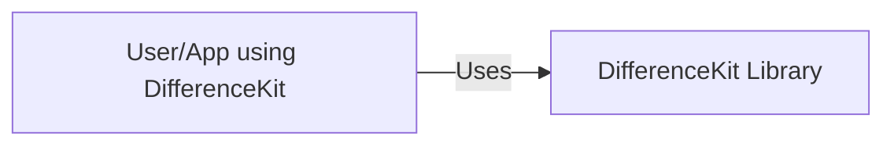
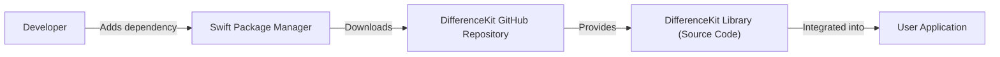
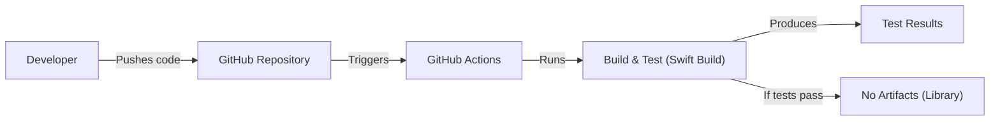

Okay, let's create a design document for the DifferenceKit project.

# BUSINESS POSTURE

DifferenceKit is a library, not a standalone application or service. Therefore, the business context is indirect and relates to the applications that *use* DifferenceKit. It's a foundational component, and its "business goals" are to enable other applications to function correctly and efficiently.

Priorities:

-   Correctness: The diffing algorithm must produce accurate results. Incorrect diffs could lead to UI glitches, data corruption, or other application-specific problems.
-   Performance: The algorithm should be efficient, especially for large datasets. Slow performance can lead to UI lag and a poor user experience.
-   Maintainability: The library should be easy to understand, modify, and extend. This is crucial for long-term viability and community contributions.
-   Testability: The library should be thoroughly tested to ensure correctness and prevent regressions.
-   Adoption: Encourage developers to use the library by providing clear documentation, examples, and a permissive license.

Business Risks:

-   Incorrect Diffs: The highest risk is that the library produces incorrect diffs, leading to downstream application errors. This is more critical than performance issues.
-   Performance Bottlenecks: While correctness is paramount, significant performance issues could make the library unusable in real-world applications, particularly those with large datasets or frequent updates.
-   Security Vulnerabilities: While less direct than in an application, vulnerabilities in the library (e.g., denial-of-service via crafted input) could be exploited through applications that use it. This is a lower risk, but still important.
-   Lack of Adoption: If the library is not adopted, it will not fulfill its purpose. This is a business risk in the sense that it represents wasted effort.
-   Maintenance Burden: If the library is poorly designed or documented, it may become difficult to maintain, leading to bugs and hindering future development.

# SECURITY POSTURE

The library itself has a limited security surface area because it's not a network-facing service. However, it's crucial to consider how it might be *used* in a larger application context. The primary focus is on secure development practices to prevent vulnerabilities that could be exploited through consuming applications.

Existing Security Controls:

-   security control: Extensive Test Suite: The project has a comprehensive test suite, including unit tests and performance tests. This helps ensure correctness and prevent regressions. (Described in test files and CI configuration).
-   security control: Continuous Integration (CI): The project uses GitHub Actions for CI, which automatically runs tests on every push and pull request. This helps catch bugs early. (Described in .github/workflows).
-   security control: Permissive License (MIT): This encourages adoption and allows for scrutiny of the code by a wider audience.
-   security control: Static Analysis: The project uses Swift's built-in type safety and memory management features, which help prevent common vulnerabilities.
-   security control: Code Reviews: Pull requests are used for code reviews, providing an opportunity to identify potential security issues before they are merged.

Accepted Risks:

-   accepted risk: Denial of Service (DoS) via Crafted Input: While unlikely, it's theoretically possible that a specially crafted input could cause excessive resource consumption. This is mitigated by the library's focus on performance and the use of efficient algorithms, but not explicitly addressed.
-   accepted risk: Third-Party Dependencies: The project has minimal external dependencies, reducing the risk of supply chain attacks. However, there's always some inherent risk in using any third-party code.

Recommended Security Controls:

-   security control: Fuzz Testing: Implement fuzz testing to automatically generate a wide range of inputs and test the library's behavior under unexpected conditions. This can help identify edge cases and potential vulnerabilities.
-   security control: Regular Dependency Audits: Even with minimal dependencies, regularly check for known vulnerabilities in those dependencies.
-   security control: Security Documentation: Add a SECURITY.md file to the repository to provide guidance on reporting security vulnerabilities.

Security Requirements:

-   Authentication: Not applicable (library).
-   Authorization: Not applicable (library).
-   Input Validation: The library should handle a wide range of inputs gracefully, including invalid or unexpected data. It should not crash or exhibit undefined behavior. Fuzz testing is highly recommended.
-   Cryptography: Not applicable (library).

# DESIGN

## C4 CONTEXT

-   User/App using DifferenceKit
    -   Name: User/App using DifferenceKit
    -   Type: External System (Application)
    -   Description: Any application that integrates the DifferenceKit library to calculate differences between data collections.
    -   Responsibilities:
        -   Provides input data to DifferenceKit.
        -   Receives and processes the diff output from DifferenceKit.
        -   Updates its UI or data structures based on the diff.
    -   Security Controls:
        -   Application-specific security controls. DifferenceKit itself does not handle security in the application context.

-   DifferenceKit
    -   Name: DifferenceKit Library
    -   Type: Library
    -   Description: A Swift library for calculating differences between collections.
    -   Responsibilities:
        -   Provides algorithms for calculating diffs (e.g., differences, changesets).
        -   Offers efficient and correct diffing implementations.
    -   Security Controls:
        -   Extensive Test Suite
        -   Continuous Integration (CI)
        -   Static Analysis (Swift's type system)

## C4 CONTAINER

Since DifferenceKit is a single library, the container diagram is essentially the same as the context diagram. It doesn't have multiple containers in the traditional sense.

-   User/App using DifferenceKit
    -   Name: User/App using DifferenceKit
    -   Type: External System (Application)
    -   Description: Any application that integrates the DifferenceKit library to calculate differences between data collections.
    -   Responsibilities:
        -   Provides input data to DifferenceKit.
        -   Receives and processes the diff output from DifferenceKit.
        -   Updates its UI or data structures based on the diff.
    -   Security Controls:
        -   Application-specific security controls. DifferenceKit itself does not handle security in the application context.

-   DifferenceKit
    -   Name: DifferenceKit Library
    -   Type: Library
    -   Description: A Swift library for calculating differences between collections.
    -   Responsibilities:
        -   Provides algorithms for calculating diffs (e.g., differences, changesets).
        -   Offers efficient and correct diffing implementations.
    -   Security Controls:
        -   Extensive Test Suite
        -   Continuous Integration (CI)
        -   Static Analysis (Swift's type system)

## DEPLOYMENT

DifferenceKit is distributed as a Swift package.  There are several ways developers can integrate it:

1.  Swift Package Manager (SPM):  This is the primary and recommended method.
2.  CocoaPods:  A dependency manager for Cocoa projects.
3.  Carthage:  A decentralized dependency manager for Cocoa.

We'll focus on SPM, as it's the most modern and integrated approach.

-   Developer
    -   Name: Developer
    -   Type: Person
    -   Description: The developer integrating DifferenceKit into their application.
    -   Responsibilities:
        -   Adds DifferenceKit as a dependency in their project's Package.swift file.
    -   Security Controls: N/A

-   Swift Package Manager
    -   Name: Swift Package Manager
    -   Type: Tool
    -   Description: The built-in package manager for Swift.
    -   Responsibilities:
        -   Resolves and downloads dependencies specified in Package.swift.
        -   Builds the dependencies.
    -   Security Controls:
        -   Uses HTTPS for downloading packages.
        -   Verifies package integrity (checksums).

-   DifferenceKit GitHub Repository
    -   Name: DifferenceKit GitHub Repository
    -   Type: Source Code Repository
    -   Description: The public Git repository hosting the DifferenceKit source code.
    -   Responsibilities:
        -   Provides access to the source code, releases, and issues.
    -   Security Controls:
        -   GitHub's built-in security features (e.g., access controls, vulnerability scanning).

-   DifferenceKit Library (Source Code)
    -   Name: DifferenceKit Library (Source Code)
    -   Type: Library Source Code
    -   Description: The actual Swift source code of the DifferenceKit library.
    -   Responsibilities:
        -   Provides the diffing algorithms.
    -   Security Controls:
        -   Code Reviews
        -   Static Analysis

-   User Application
    -   Name: User Application
    -   Type: Application
    -   Description: The application that uses DifferenceKit.
    -   Responsibilities:
        -   Uses DifferenceKit to calculate diffs.
    -   Security Controls:
        -   Application-specific security controls.

## BUILD

DifferenceKit uses GitHub Actions for its build and CI process.

-   Developer
    -   Name: Developer
    -   Type: Person
    -   Description: A contributor to the DifferenceKit project.
    -   Responsibilities:
        -   Writes code, tests, and documentation.
        -   Pushes changes to the GitHub repository.
    -   Security Controls: N/A

-   GitHub Repository
    -   Name: GitHub Repository
    -   Type: Source Code Repository
    -   Description: The Git repository hosting the DifferenceKit source code.
    -   Responsibilities:
        -   Stores the code, tracks changes, and manages pull requests.
    -   Security Controls:
        -   GitHub's built-in security features.

-   GitHub Actions
    -   Name: GitHub Actions
    -   Type: CI/CD Service
    -   Description: GitHub's integrated CI/CD service.
    -   Responsibilities:
        -   Automates the build, test, and (potentially) release process.
    -   Security Controls:
        -   Runs in isolated environments.
        -   Uses secure access tokens.

-   Build & Test (Swift Build)
    -   Name: Build & Test (Swift Build)
    -   Type: Process
    -   Description: The process of building the Swift code and running the test suite.
    -   Responsibilities:
        -   Compiles the code.
        -   Executes unit and performance tests.
    -   Security Controls:
        -   Runs in a clean, isolated environment.
        -   Uses Swift's built-in security features (type safety, memory management).

-   Test Results
    -   Name: Test Results
    -   Type: Data
    -   Description: The output of the test suite.
    -   Responsibilities:
        -   Indicates whether the tests passed or failed.
    -   Security Controls: N/A

-   No Artifacts (Library)
    -   Name: No Artifacts (Library)
    -   Type: N/A
    -   Description: DifferenceKit is a library, and its build process doesn't produce traditional deployable artifacts like binaries or packages. The "artifact" is the source code itself, managed by SPM.
    -   Responsibilities: N/A
    -   Security Controls: N/A

Security Controls in the Build Process:

-   Automated Testing: The CI pipeline automatically runs the test suite on every push and pull request.
-   Clean Build Environment: GitHub Actions provides a clean, isolated environment for each build, preventing contamination from previous builds or the host system.
-   Code Review: Pull requests enforce code review before merging changes, allowing for manual inspection of the code.

# RISK ASSESSMENT

-   Critical Business Process: The critical business process being protected is the *correct and efficient operation of applications that use DifferenceKit*.  The library itself doesn't have a direct business process, but it's a critical dependency for other applications.

-   Data We Are Trying to Protect: DifferenceKit doesn't directly handle sensitive data.  It operates on generic collections of data.  The *sensitivity* of the data depends entirely on the application using DifferenceKit.  However, incorrect diffs could lead to:
    -   Data Corruption: If the diffs are applied incorrectly, the application's data could be corrupted.
    -   Data Loss:  Incorrect diffs could lead to data being unintentionally deleted.
    -   UI Errors: Incorrect diffs could lead to UI glitches or incorrect display of data.

    The sensitivity levels could range from:
    -   Low:  UI glitches in a non-critical application.
    -   Medium:  Incorrect display of data that could lead to user confusion.
    -   High:  Data corruption or loss in a critical application (e.g., financial data, medical records).

# QUESTIONS & ASSUMPTIONS

-   Questions:
    -   Are there any specific performance targets or benchmarks that DifferenceKit should meet?
    -   Are there any plans to support other platforms or languages beyond Swift?
    -   Are there any known edge cases or limitations of the current algorithms?
    -   What is the expected frequency of updates and releases?

-   Assumptions:
    -   BUSINESS POSTURE: The primary users of DifferenceKit are developers building Swift applications. The library's success is tied to its adoption and use within other projects.
    -   SECURITY POSTURE: The library is not directly exposed to network traffic. The main security concerns are related to the correctness of the algorithm and preventing vulnerabilities that could be exploited through consuming applications.
    -   DESIGN: The library will continue to be distributed primarily through Swift Package Manager. The build process will remain automated using GitHub Actions. The library's design will prioritize correctness, performance, and maintainability.