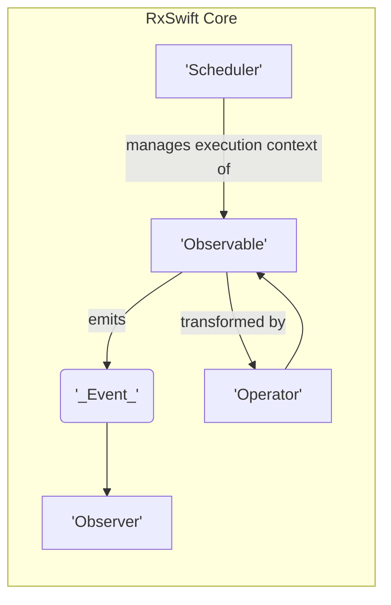
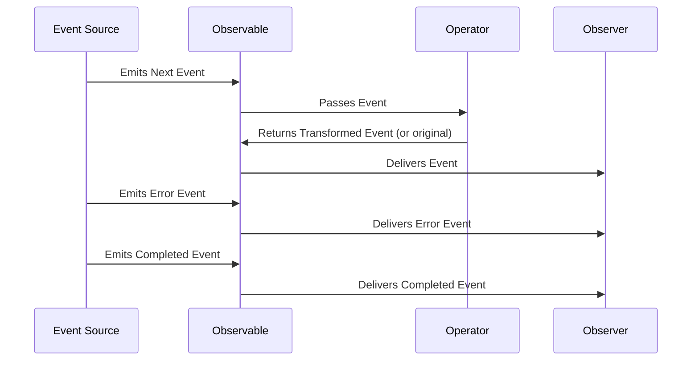

# Project Design Document: RxSwift

**Version:** 1.1
**Date:** October 26, 2023
**Author:** AI Software Architect

## 1. Introduction

This document provides a comprehensive design overview of the RxSwift project, a library for composing asynchronous and event-based programs using observable sequences for Swift. This document aims to clearly articulate the architecture, key components, and data flow within RxSwift, serving as a foundation for subsequent threat modeling activities. This revision expands upon the initial design, providing more detail and clarity in certain areas.

## 2. Goals and Objectives

The primary goals of RxSwift are:

* **Abstraction of Asynchrony:** To provide a unified and declarative way to handle asynchronous operations and event streams, simplifying complex asynchronous logic.
* **Composition and Transformation:** To enable easy composition and transformation of asynchronous data streams using a rich set of operators, allowing for flexible data manipulation.
* **Error Handling:** To offer robust mechanisms for handling errors within asynchronous sequences, ensuring graceful degradation and preventing application crashes.
* **Resource Management:** To facilitate proper resource management, particularly concerning the lifecycle of asynchronous operations, preventing memory leaks and improving application stability.
* **Cross-Platform Compatibility (Conceptual):** While primarily for Swift, the Reactive Extensions pattern aims for similar implementations across different platforms, fostering a consistent approach to asynchronous programming.

The objective of this design document is to provide a clear and detailed understanding of RxSwift's internal structure and behavior, enabling effective identification of potential security vulnerabilities during threat modeling. This improved version aims to provide more specific details relevant to security considerations.

## 3. Architectural Overview

RxSwift follows the Reactive Extensions (ReactiveX) pattern. At its core, it revolves around the concept of **Observables** emitting a sequence of **Events** that are consumed by **Observers**. Operators are used to transform and combine these observable sequences. Schedulers manage the execution context of these operations, controlling where and when the work is performed.

Here's a high-level architectural diagram:

**Key Architectural Principles:**

* **Declarative Programming:** Focus on describing the data flow and transformations rather than imperative control flow, leading to more readable and maintainable code.
* **Immutability:** Data within the observable sequences is generally treated as immutable, reducing the risk of unintended side effects and improving predictability.
* **Functional Programming:** Operators are often implemented as pure functions, promoting predictability, testability, and easier reasoning about code behavior.

## 4. Data Flow

The fundamental data flow in RxSwift involves an Observable emitting events that are then processed and consumed. Understanding this flow is critical for identifying potential points of interception or manipulation.

**Detailed Data Flow Description:**

1. **Event Production:** An external source (e.g., network request completion, user interaction, timer firing, sensor data) produces an event.
2. **Observable Emission:** The `Observable` encapsulates this event and emits it to all its subscribed Observers.
3. **Operator Transformation (Optional):** If operators are chained in the observable sequence, the emitted event passes through one or more operators. Each operator performs a specific transformation on the event. For example:
    * **`map`:** Transforms the data within the event.
    * **`filter`:** Allows only certain events to pass through based on a condition.
    * **`debounce`:**  Emits an event only after a certain time has passed without another emission.
4. **Observer Consumption:** The `Observer` subscribes to the `Observable` and receives the emitted events (either original or transformed). The observer defines how to handle `Next`, `Error`, and `Completed` events.
5. **Event Types:** Events can be of three distinct types, signaling different stages in the observable sequence:
    * **Next:** Represents a new data element in the sequence. Multiple `Next` events can be emitted.
    * **Error:** Indicates that an error occurred during the processing of the sequence. This terminates the sequence for that specific observer, and no further events will be emitted. The error object typically contains information about the failure.
    * **Completed:** Signals the successful end of the sequence. Once a `Completed` event is emitted, no further `Next` or `Error` events will be emitted for that observer.
6. **Subscription Management:** Observers maintain a subscription to the Observable. This subscription allows them to receive events. Importantly, it also provides a mechanism to unsubscribe using the `dispose()` method, which stops the observer from receiving further events and can release resources held by the observable.
7. **Scheduler Involvement:** The `Scheduler` determines on which thread or queue the emission of events and the execution of operators occur. This allows for managing concurrency and ensuring operations happen on the appropriate threads (e.g., UI updates on the main thread, background processing on a background thread).

## 5. Key Components

This section details the core components of RxSwift, providing a deeper understanding of their roles and functionalities:

* **Observable:**
    * Represents a sequence of events that can be observed over time. It's the source of asynchronous data.
    * Emits `Next`, `Error`, and `Completed` events to its subscribers.
    * Can be created from various sources using factory methods like `just`, `from`, `timer`, `create`, and more.
    * Implements the `subscribe()` method, which returns a `Disposable` object. This allows Observers to attach and receive events, and to later unsubscribe.

* **Observer:**
    * Receives events emitted by an Observable. It defines how to react to the data stream.
    * Implements methods to handle `Next`, `Error`, and `Completed` events. These methods are typically provided as closures within the `subscribe()` call.
    * Can be represented by concrete implementations conforming to the `ObserverType` protocol, allowing for more complex observer logic.

* **Operators:**
    * Functions that operate on Observables to transform, filter, combine, or otherwise manipulate the sequence of events. They are the building blocks for complex asynchronous workflows.
    * A vast library of operators is provided, categorized for different purposes:
        * **Transforming Operators:** (`map`, `flatMap`, `scan`, `buffer`) - Modify the data emitted by the Observable.
        * **Filtering Operators:** (`filter`, `take`, `skip`, `distinctUntilChanged`) - Selectively allow events to pass through.
        * **Combining Operators:** (`merge`, `concat`, `zip`, `combineLatest`) - Merge or combine multiple Observables.
        * **Error Handling Operators:** (`catch`, `retry`) - Manage errors within the observable sequence.
        * **Utility Operators:** (`delay`, `timeout`, `do`) - Provide additional control and side-effect capabilities.
    * Operators often return a new Observable based on the input Observable, allowing for chaining and declarative composition.

* **Subjects:**
    * Act as both an Observable and an Observer. This dual nature makes them useful for bridging non-reactive code with reactive streams or for multicasting events.
    * Can emit new events using methods like `onNext()`, `onError()`, and `onCompleted()`.
    * Can also subscribe to other Observables and re-emit their events.
    * Different types of Subjects exist, each with specific behavior regarding event buffering and initial values:
        * **`PublishSubject`:**  Starts emitting events to subscribers only from the point of subscription.
        * **`BehaviorSubject`:** Emits the most recent item it has emitted and all subsequent items to each subscriber. Requires an initial value.
        * **`ReplaySubject`:**  Buffers a specified number of the most recent events and replays them to new subscribers.
        * **`AsyncSubject`:** Emits only the last `Next` event received, and only when the source Observable completes.

* **Schedulers:**
    * Control the concurrency and timing of event emissions and operator execution. They abstract away the complexities of thread management.
    * Abstract away the underlying threading mechanisms (e.g., `DispatchQueue`, `OperationQueue`, threads).
    * Predefined schedulers are available for common scenarios:
        * **`MainScheduler`:**  Executes tasks on the main thread, essential for UI updates.
        * **`BackgroundScheduler`:**  Executes tasks on a background thread.
        * **`ConcurrentDispatchQueueScheduler`:**  Uses a `DispatchQueue` for concurrent execution.
        * **`SerialDispatchQueueScheduler`:** Uses a `DispatchQueue` for serial execution.
        * **`OperationQueueScheduler`:** Uses an `OperationQueue`.
    * Operators like `subscribe(on:)` and `observe(on:)` allow specifying the scheduler for different parts of the observable chain.

* **Disposables:**
    * Represent the resource held by a subscription to an Observable. They are crucial for managing the lifecycle of subscriptions and preventing resource leaks.
    * Provide a `dispose()` method to release resources and stop receiving events. Calling `dispose()` breaks the connection between the Observable and the Observer.
    * Crucial for preventing memory leaks, especially with long-lived Observables or those that continue emitting events indefinitely.
    * `CompositeDisposable` allows managing multiple disposables together, simplifying the process of disposing of multiple subscriptions at once.

* **Traits (Single, Maybe, Completable):**
    * Specialized versions of Observable designed for specific asynchronous scenarios, offering semantic clarity and type safety:
        * **Single:** Emits either a single value on success or an error on failure. Ideal for representing one-time asynchronous operations like network requests that should return a single result.
        * **Maybe:** Emits either a single value on success, completes without emitting a value, or emits an error. Useful for operations that might or might not produce a result.
        * **Completable:** Emits either a completion event on success or an error on failure. Represents an action that completes without returning a value, like saving data to disk.

## 6. Security Considerations (Preliminary)

While RxSwift itself is a library focused on managing asynchronous operations, its usage within an application can introduce security considerations. These will be explored in detail during threat modeling, but some initial points include:

* **Data Exposure through Logging/Debugging:**  Care must be taken to avoid logging sensitive data emitted through Observables, especially in production environments. For instance, logging the contents of a `BehaviorSubject` holding user credentials could be a vulnerability.
* **Error Handling and Information Disclosure:**  Detailed error messages propagated through `Error` events might inadvertently leak sensitive information about the system or application state to potential attackers. Generic error messages should be used in production.
* **Uncontrolled Resource Consumption:**  Improper disposal of subscriptions can lead to resource leaks (e.g., memory, file handles, network connections), potentially leading to denial-of-service or allowing attackers to exploit resource exhaustion. Failing to dispose of a subscription to a continuously emitting Observable can be problematic.
* **Side Effects in Operators:**  Operators with side effects (e.g., writing to disk, making network calls, modifying shared state) need careful consideration to prevent unintended consequences or vulnerabilities. For example, an operator that writes user input directly to a file without sanitization could be a vulnerability.
* **Concurrency Issues:**  Incorrect use of Schedulers or improper synchronization within custom operators can lead to race conditions or other concurrency-related vulnerabilities, potentially leading to inconsistent data or unexpected behavior that could be exploited.
* **Third-Party Operator Libraries:** If using external RxSwift operator libraries, their security should be evaluated. Malicious or poorly written operators could introduce vulnerabilities. Verify the source and integrity of such libraries.
* **Injection through Data Streams:** If data flowing through Observables originates from untrusted sources (e.g., user input, external APIs), it could be a vector for injection attacks (like cross-site scripting or SQL injection) if not properly sanitized and validated before being used or displayed.
* **Timing Attacks:** In certain scenarios, the timing of events and the use of operators like `debounce` or `throttle` could inadvertently reveal information that could be exploited in timing attacks.
* **Denial of Service through Resource Exhaustion:**  Creating Observables that emit an unbounded number of events or subscribe to external resources without proper limits can lead to resource exhaustion and denial of service.

## 7. Deployment Considerations

RxSwift is a Swift library typically integrated into iOS, macOS, watchOS, and tvOS applications. Deployment considerations relevant to security include:

* **Dependency Management:** RxSwift is usually managed through dependency managers like CocoaPods or Swift Package Manager. Ensuring the integrity and authenticity of these dependencies is crucial to prevent supply chain attacks. Use checksum verification and trusted sources for dependencies.
* **Code Obfuscation:** For sensitive applications, code obfuscation can make reverse engineering and analysis more difficult, hindering attackers from understanding the application's logic and potential vulnerabilities.
* **Secure Storage of Data:** If RxSwift is used to handle sensitive data, proper secure storage mechanisms should be employed at the application level. RxSwift itself doesn't provide storage, but the data it manages might need secure persistence.
* **Network Communication:** If RxSwift handles network requests (e.g., using operators with networking libraries), standard secure communication practices (e.g., HTTPS, TLS with proper certificate validation) must be followed to protect data in transit.
* **Sandboxing:** On platforms like iOS and macOS, the application sandbox provides a level of security by limiting the application's access to system resources. Ensure RxSwift usage aligns with sandbox restrictions.

## 8. Dependencies

RxSwift has minimal direct dependencies, which reduces the potential attack surface compared to libraries with numerous transitive dependencies. However, its usage often implies dependencies on other libraries or frameworks within the application, such as networking libraries, UI frameworks, or data storage solutions. The security of these dependencies should also be considered.

## 9. Future Considerations

Potential future developments in RxSwift that could impact its design and security include:

* **Performance Optimizations:** Changes to improve performance might introduce new concurrency patterns or memory management techniques that could have security implications if not carefully implemented.
* **New Operators and Traits:** The addition of new operators could introduce new functionalities and potential security implications if they are not designed with security in mind or if they introduce unexpected side effects.
* **Integration with New Swift Features:** Adoption of new Swift language features might lead to architectural changes that require re-evaluation of security considerations.
* **Evolution of the Reactive Extensions Standard:** Changes in the broader ReactiveX specification could influence RxSwift's design and potentially introduce new security paradigms.

## 10. Conclusion

This document provides a detailed design overview of the RxSwift project, focusing on its architecture, data flow, and key components. This improved version provides more specific details relevant to security considerations. This information serves as a crucial foundation for conducting thorough threat modeling to identify and mitigate potential security vulnerabilities within applications utilizing RxSwift. The preliminary security considerations outlined here will be further explored and expanded upon during the threat modeling process. Understanding the nuances of RxSwift's asynchronous nature and its powerful operators is key to building secure and robust applications.
