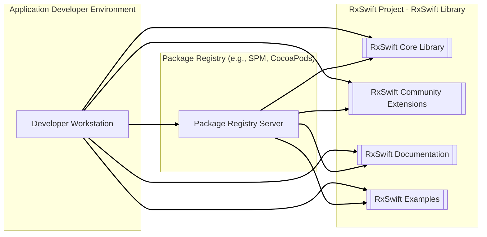

# BUSINESS POSTURE

This project is focused on providing and maintaining the RxSwift library, an open-source project for reactive programming in Swift.

- Business Priorities and Goals:
  - Provide a stable, performant, and well-documented reactive programming library for Swift developers.
  - Foster a strong community around the library to encourage adoption and contribution.
  - Ensure the library remains compatible with evolving Swift language and platform changes.
  - Maintain the library's quality and reliability to support developers building robust applications.

- Business Risks:
  - Risk of vulnerabilities in the library code that could be exploited by malicious actors in applications using RxSwift.
  - Risk of performance regressions or instability introduced in new versions, impacting applications relying on RxSwift.
  - Risk of decreased developer trust and adoption if the library is perceived as unreliable or insecure.
  - Risk of community fragmentation or lack of contributions, hindering the library's development and maintenance.

# SECURITY POSTURE

- Existing Security Controls:
  - security control: Code reviews are performed by maintainers before merging pull requests. (Observed in typical open-source project workflows and contribution guidelines).
  - security control: Unit and integration tests are in place to ensure code quality and prevent regressions. (Inferred from standard software development practices and project structure).
  - security control: Public vulnerability reporting process via GitHub issues. (Standard practice for open-source projects).
  - accepted risk: Reliance on community contributions, which may introduce vulnerabilities if not thoroughly vetted.
  - accepted risk: Open-source nature means the codebase is publicly accessible, potentially revealing vulnerabilities to attackers.

- Recommended Security Controls:
  - security control: Implement automated static application security testing (SAST) in the CI/CD pipeline to identify potential vulnerabilities in code changes.
  - security control: Integrate dependency scanning to identify and manage vulnerabilities in third-party dependencies.
  - security control: Conduct periodic security audits or penetration testing, especially before major releases.
  - security control: Establish a clear security policy and incident response plan for handling reported vulnerabilities.

- Security Requirements:
  - Authentication: Not directly applicable to a library. However, authentication is relevant for:
    - Access to the GitHub repository for maintainers and contributors (GitHub authentication).
    - Access to package registries (e.g., Swift Package Registry, CocoaPods) for publishing and downloading the library (Registry authentication).
  - Authorization: Not directly applicable to the library's runtime. However, authorization is relevant for:
    - Access control within the GitHub repository to manage code changes and releases (GitHub permissions).
    - Permissions for publishing to package registries (Registry permissions).
  - Input Validation: While RxSwift itself doesn't directly handle user input in the traditional sense, it processes events and data streams. Input validation should be considered in the context of:
    - Validating the structure and types of events and data streams processed by RxSwift operators to prevent unexpected behavior or crashes in applications using the library.
    - Ensuring operators handle edge cases and potentially malicious data within streams gracefully without causing vulnerabilities in consuming applications.
  - Cryptography: Not a primary requirement for RxSwift as a reactive programming library. However, consider if cryptography is relevant for:
    - Secure communication if RxSwift is extended to handle network events or data streams (e.g., using HTTPS for network requests within reactive streams).
    - Secure storage of any configuration or sensitive data, if applicable in future extensions of the library (though unlikely for a core reactive library).

# DESIGN

## C4 CONTEXT

```mermaid
flowchart LR
    subgraph "Application Developer"
        A[Application Developer]
    end
    subgraph "Swift Ecosystem"
        B[Swift Language]
        C[Swift Standard Library]
        D[Apple Platforms (iOS, macOS, etc.)]
        E[Package Managers (SPM, CocoaPods)]
    end
    subgraph "RxSwift Project"
        Z[["RxSwift Library"]]
    end

    A --> Z
    Z --> B
    Z --> C
    Z --> D
    Z --> E

    linkStyle 0,1,2,3,4 stroke-width:2px,stroke:black;
```

- Context Diagram Elements:
  - - Name: Application Developer
    - Type: Person
    - Description: Software developers who use RxSwift to build applications.
    - Responsibilities: Develop applications using RxSwift, integrate RxSwift into their projects, report issues and contribute to the library.
    - Security controls: Secure development practices in their own applications, secure handling of dependencies.
  - - Name: RxSwift Library
    - Type: Software System
    - Description: The RxSwift reactive programming library itself, providing APIs and functionalities for reactive programming in Swift.
    - Responsibilities: Provide reactive programming abstractions, handle asynchronous events and data streams, offer operators for data transformation and manipulation.
    - Security controls: Code reviews, testing, vulnerability scanning, secure build and release process.
  - - Name: Swift Language
    - Type: Technology
    - Description: The Swift programming language in which RxSwift is written.
    - Responsibilities: Provide the language foundation for RxSwift, ensure language security and stability.
    - Security controls: Swift language security features, compiler security checks.
  - - Name: Swift Standard Library
    - Type: Software System
    - Description: The standard library for Swift, providing core functionalities used by RxSwift.
    - Responsibilities: Provide fundamental data structures and algorithms, ensure standard library security and stability.
    - Security controls: Standard library security measures, vulnerability management.
  - - Name: Apple Platforms (iOS, macOS, etc.)
    - Type: Environment
    - Description: The operating systems and platforms where applications using RxSwift are deployed and run.
    - Responsibilities: Provide the runtime environment for RxSwift applications, ensure platform security.
    - Security controls: Platform security features, operating system security updates.
  - - Name: Package Managers (SPM, CocoaPods)
    - Type: Software System
    - Description: Package managers used to distribute and integrate RxSwift into Swift projects.
    - Responsibilities: Distribute RxSwift library packages, manage dependencies, ensure package integrity.
    - Security controls: Package registry security, secure package distribution mechanisms, package verification.

## C4 CONTAINER



- Container Diagram Elements:
  - - Name: Developer Workstation
    - Type: Environment
    - Description: The development environment used by application developers to build applications using RxSwift.
    - Responsibilities: Code development, dependency management, building and testing applications.
    - Security controls: Developer workstation security practices, code editor security, local security tools.
  - - Name: Package Registry Server
    - Type: Software System
    - Description: Servers hosting package registries like Swift Package Manager Registry or CocoaPods, used to distribute RxSwift packages.
    - Responsibilities: Store and serve RxSwift library packages, manage package versions, handle package downloads.
    - Security controls: Registry server security hardening, access control, package integrity checks, vulnerability scanning.
  - - Name: RxSwift Core Library
    - Type: Library
    - Description: The core RxSwift library components providing the fundamental reactive programming functionalities.
    - Responsibilities: Implement core reactive operators, manage event streams, provide base abstractions.
    - Security controls: Code reviews, unit and integration testing, SAST, dependency scanning.
  - - Name: RxSwift Community Extensions
    - Type: Library
    - Description: Community-contributed extensions and modules that expand the functionality of RxSwift.
    - Responsibilities: Provide additional operators and utilities, integrate with other libraries and frameworks.
    - Security controls: Code reviews, community vetting, testing, SAST.
  - - Name: RxSwift Documentation
    - Type: Documentation
    - Description: Documentation for RxSwift, including API references, guides, and examples.
    - Responsibilities: Provide comprehensive and accurate documentation for developers.
    - Security controls: Documentation hosting security, protection against defacement.
  - - Name: RxSwift Examples
    - Type: Application
    - Description: Example applications and code snippets demonstrating how to use RxSwift.
    - Responsibilities: Showcase RxSwift usage, provide learning resources for developers.
    - Security controls: Example code review, avoid including vulnerable practices in examples.

## DEPLOYMENT

For RxSwift, deployment primarily refers to the distribution of the library to developers and its integration into their applications. A typical deployment scenario involves using package managers.

```mermaid
flowchart LR
    subgraph "Developer Infrastructure"
        A[Developer Workstation]
        B[Local Package Cache]
    end
    subgraph "Package Registry Infrastructure"
        C[Package Registry Server]
        D[Package Storage (Artifact Repository)]
    end

    A --> B
    A -- "Download Package" --> C
    C --> D
    C -- "Provide Package Metadata" --> A
    D -- "Serve Package Artifact" --> A

    linkStyle 0,1,2,3 stroke-width:2px,stroke:black;
```

- Deployment Diagram Elements:
  - - Name: Developer Workstation
    - Type: Environment
    - Description: The developer's local machine where they develop applications and manage dependencies.
    - Responsibilities: Application development, dependency management, building and running applications locally.
    - Security controls: Workstation security practices, local security tools, secure development environment.
  - - Name: Local Package Cache
    - Type: Data Store
    - Description: A local cache on the developer's machine where downloaded packages are stored to speed up subsequent project setups.
    - Responsibilities: Store downloaded packages, provide faster access to packages.
    - Security controls: File system permissions, integrity checks of cached packages.
  - - Name: Package Registry Server
    - Type: Server
    - Description: The server hosting the package registry (e.g., Swift Package Manager Registry, CocoaPods server).
    - Responsibilities: Manage package metadata, handle package download requests, authenticate package publishers.
    - Security controls: Server hardening, access control, authentication and authorization, rate limiting, DDoS protection.
  - - Name: Package Storage (Artifact Repository)
    - Type: Storage
    - Description: Storage backend for the package registry, holding the actual RxSwift library package files.
    - Responsibilities: Store package artifacts, provide access to package files for download.
    - Security controls: Storage access control, data encryption at rest, integrity checks, backup and recovery.

## BUILD

```mermaid
flowchart LR
    subgraph "Developer"
        A[Developer Workstation]
    end
    subgraph "Version Control System (GitHub)"
        B[GitHub Repository]
    end
    subgraph "CI/CD System (GitHub Actions)"
        C[CI Server (GitHub Actions Runners)]
        D[Build Environment]
        E[Test Environment]
        F[SAST Scanner]
        G[Dependency Scanner]
    end
    subgraph "Package Registry"
        H[Package Registry Server]
    end
    subgraph "Artifact Storage"
        I[Package Artifacts]
    end

    A -- "Code Commit" --> B
    B -- "Webhook Trigger" --> C
    C --> D
    D -- "Build & Compile" --> E
    E -- "Run Tests" --> F
    D -- "Run SAST" --> F
    D -- "Run Dependency Scan" --> G
    E -- "Publish Artifacts" --> H
    H --> I

    linkStyle 0,1,2,3,4,5,6,7,8,9 stroke-width:2px,stroke:black;
```

- Build Process Elements:
  - - Name: Developer Workstation
    - Type: Environment
    - Description: Developer's local machine where code changes are made and committed.
    - Responsibilities: Code development, local testing, committing changes to VCS.
    - Security controls: Developer workstation security, code editor security, pre-commit hooks for basic checks.
  - - Name: GitHub Repository
    - Type: Version Control System
    - Description: The GitHub repository hosting the RxSwift source code.
    - Responsibilities: Version control, code collaboration, trigger CI/CD pipelines.
    - Security controls: Access control, branch protection, audit logs, vulnerability scanning of repository settings.
  - - Name: CI Server (GitHub Actions Runners)
    - Type: Automation Server
    - Description: GitHub Actions runners executing the CI/CD pipeline.
    - Responsibilities: Automate build, test, and release processes, execute CI/CD workflows.
    - Security controls: Runner security hardening, secure execution environment, access control to secrets and credentials.
  - - Name: Build Environment
    - Type: Environment
    - Description: Environment where the RxSwift library is compiled and built.
    - Responsibilities: Compile source code, generate build artifacts.
    - Security controls: Secure build environment, isolated build processes, dependency management.
  - - Name: Test Environment
    - Type: Environment
    - Description: Environment where automated tests are executed against the built library.
    - Responsibilities: Run unit tests, integration tests, and other automated tests.
    - Security controls: Isolated test environment, secure test data management.
  - - Name: SAST Scanner
    - Type: Security Tool
    - Description: Static Application Security Testing tool integrated into the CI/CD pipeline to scan code for vulnerabilities.
    - Responsibilities: Identify potential security vulnerabilities in the codebase.
    - Security controls: SAST tool configuration, vulnerability reporting and tracking.
  - - Name: Dependency Scanner
    - Type: Security Tool
    - Description: Tool to scan project dependencies for known vulnerabilities.
    - Responsibilities: Identify vulnerable dependencies used by RxSwift.
    - Security controls: Dependency scanner configuration, vulnerability reporting and remediation process.
  - - Name: Package Registry Server
    - Type: Server
    - Description: Server hosting the package registry where RxSwift packages are published.
    - Responsibilities: Store and distribute RxSwift packages, manage package versions.
    - Security controls: Registry server security, access control, secure package upload process, package signing.
  - - Name: Package Artifacts
    - Type: Data Store
    - Description: Storage location for the built RxSwift library packages.
    - Responsibilities: Store and provide access to package artifacts.
    - Security controls: Artifact storage security, access control, integrity checks, versioning.

# RISK ASSESSMENT

- Critical Business Processes:
  - Providing a reliable and secure RxSwift library to the developer community.
  - Maintaining the integrity and availability of the RxSwift library packages in package registries.
  - Ensuring the ongoing development and maintenance of the library.

- Data to Protect and Sensitivity:
  - RxSwift source code: High sensitivity - Integrity and confidentiality are crucial to prevent malicious modifications and maintain trust.
  - RxSwift library packages: High sensitivity - Integrity is paramount to ensure developers download and use untampered libraries.
  - Build and release infrastructure credentials: High sensitivity - Confidentiality is critical to prevent unauthorized access and malicious releases.
  - Community contributions (pull requests): Medium sensitivity - Integrity is important to ensure contributions are vetted and safe to merge.
  - Documentation and examples: Low to Medium sensitivity - Integrity is important to ensure accurate and safe guidance for developers.

# QUESTIONS & ASSUMPTIONS

- Questions:
  - What is the specific risk appetite of the organization or community maintaining RxSwift? (This document assumes a moderate to high risk appetite given it's an open-source library, but this could vary).
  - Are there specific compliance requirements or industry standards that RxSwift needs to adhere to? (Assumed to be general best practices for open-source software).
  - What is the process for handling security vulnerability reports and incident response for RxSwift? (Assumed to be standard open-source vulnerability reporting via GitHub issues and maintainer response).
  - Are there any specific third-party dependencies that are considered high risk or require special attention? (Assumed to be standard dependency management practices are followed).

- Assumptions:
  - RxSwift is maintained by a responsible community or organization committed to security best practices.
  - Standard open-source development practices are followed, including code reviews and testing.
  - GitHub and package registries provide a reasonable level of security for hosting and distributing the library.
  - Developers using RxSwift are responsible for the security of their own applications and how they integrate RxSwift.
  - The focus of security for RxSwift is primarily on preventing vulnerabilities in the library code itself and ensuring the integrity of its distribution.