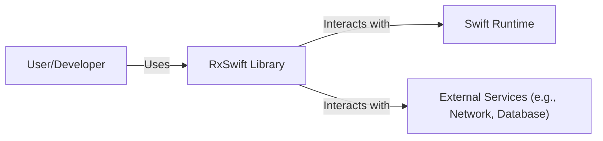
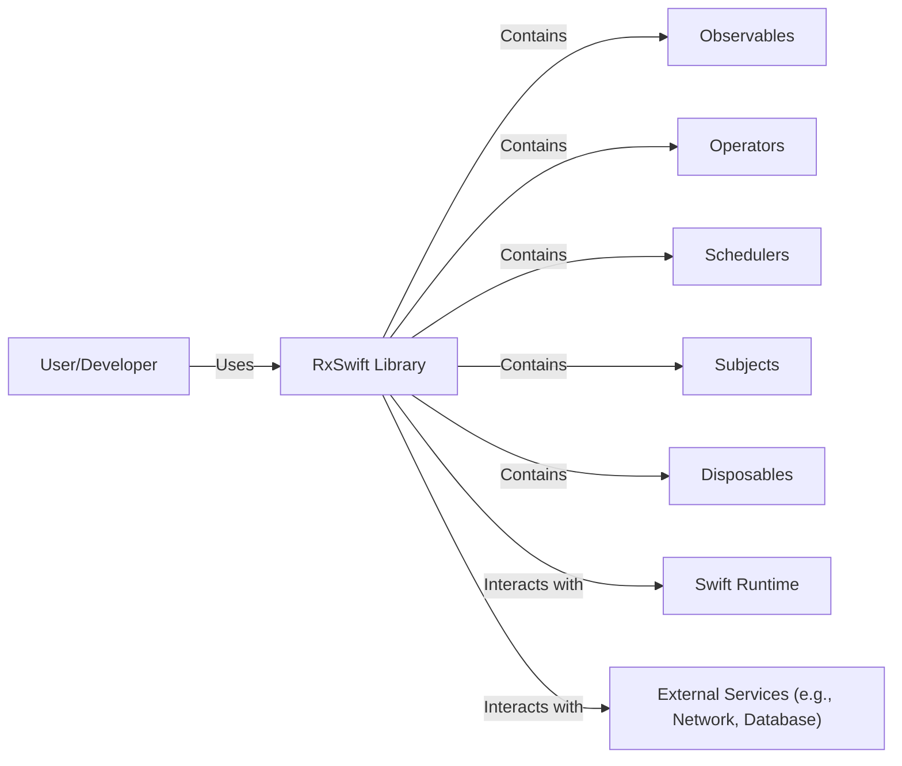
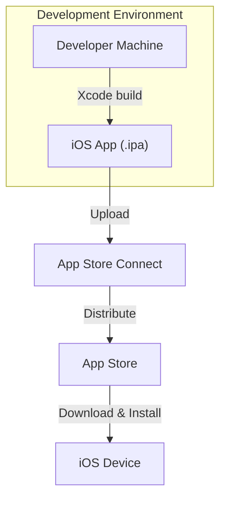
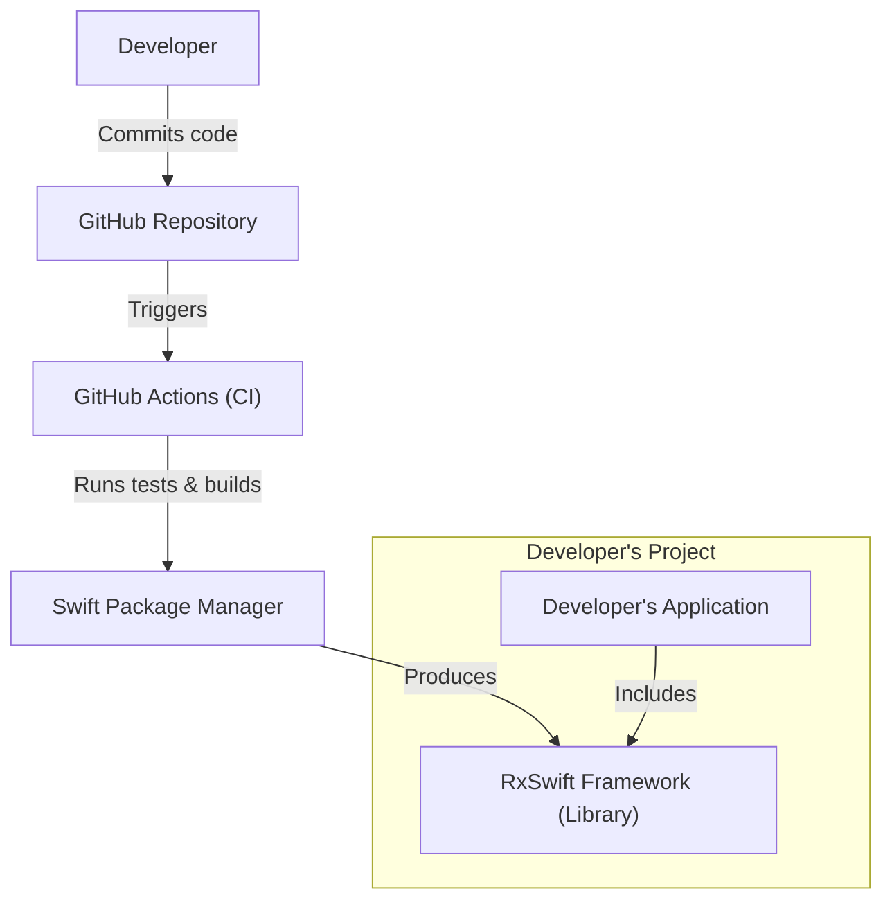

# BUSINESS POSTURE

RxSwift is a library for composing asynchronous and event-based code using observable sequences and functional style operators in Swift. It aims to simplify development of complex, reactive applications.

Business Priorities:

*   Enable developers to write cleaner, more maintainable asynchronous code.
*   Reduce complexity in handling events and data streams.
*   Improve application responsiveness and user experience.
*   Provide a consistent and predictable way to manage concurrency.
*   Facilitate easier testing of asynchronous operations.

Business Goals:

*   Increase developer productivity by simplifying asynchronous programming.
*   Enhance application performance and scalability.
*   Reduce the likelihood of bugs related to concurrency and state management.
*   Promote code reuse and modularity.

Most Important Business Risks:

*   Introduction of subtle concurrency bugs due to incorrect usage of RxSwift operators.
*   Performance bottlenecks if observables are not managed efficiently.
*   Steep learning curve for developers unfamiliar with reactive programming concepts.
*   Dependency on a third-party library (RxSwift itself), creating potential maintenance and compatibility issues.
*   Over-engineering simple scenarios, leading to unnecessary complexity.

# SECURITY POSTURE

Existing Security Controls:

*   security control: Code Reviews: RxSwift is an open-source project with a community-driven development process, which includes code reviews before merging changes. (Described in contribution guidelines and pull request process on GitHub).
*   security control: Community Scrutiny: Being a widely used open-source library, RxSwift benefits from scrutiny by a large community of developers, increasing the likelihood of identifying and addressing security vulnerabilities. (Implicit in the open-source nature of the project).
*   security control: Static Analysis: While not explicitly mentioned, it's highly probable that static analysis tools are used during development to identify potential code quality and security issues. (Common practice in modern software development).
*   security control: Issue Tracking: GitHub Issues are used to track and manage bug reports, feature requests, and potential security vulnerabilities. (Visible on the GitHub repository).

Accepted Risks:

*   accepted risk: Reliance on Community Vigilance: The project relies heavily on the community to identify and report security issues. There's no dedicated security team mentioned.
*   accepted risk: Potential for Misuse: RxSwift provides powerful tools for managing concurrency, but incorrect usage can lead to vulnerabilities or performance issues.
*   accepted risk: Third-Party Dependency Risk: While RxSwift itself might be secure, vulnerabilities in its dependencies (though it has minimal external dependencies) could impact applications using it.

Recommended Security Controls:

*   security control: Fuzz Testing: Implement fuzz testing to proactively discover edge cases and potential vulnerabilities related to unexpected input or operator combinations.
*   security control: Regular Security Audits: Conduct periodic security audits, either internally or by external experts, to identify potential vulnerabilities.
*   security control: Dependency Scanning: Integrate automated dependency scanning tools to detect and address vulnerabilities in RxSwift's dependencies (if any).
*   security control: Security-Focused Documentation: Enhance documentation with specific guidance on secure usage of RxSwift, highlighting potential pitfalls and best practices.

Security Requirements:

*   Authentication: Not directly applicable to RxSwift, as it's a library for reactive programming, not an authentication system. Authentication should be handled by the application using RxSwift.
*   Authorization: Not directly applicable to RxSwift. Authorization logic should be implemented within the application logic, potentially using RxSwift to manage asynchronous authorization checks.
*   Input Validation: RxSwift itself doesn't handle input validation directly. However, it can be used to create pipelines that include validation steps. Input validation is crucial in the application logic using RxSwift to prevent injection attacks and ensure data integrity.
*   Cryptography: Not directly applicable to RxSwift. Cryptographic operations, if needed, should be handled by dedicated libraries and integrated into the application logic. RxSwift can be used to manage the asynchronous flow of cryptographic operations.

# DESIGN

## C4 CONTEXT

Element Descriptions:

*   Element:
    *   Name: User/Developer
    *   Type: Person
    *   Description: A developer who uses RxSwift to build reactive applications, or an end-user interacting with an application built using RxSwift.
    *   Responsibilities: Writes code using RxSwift, handles events, manages subscriptions, interacts with the application.
    *   Security controls: Not directly applicable at the library level. Security controls are the responsibility of the developer implementing the application.

*   Element:
    *   Name: RxSwift Library
    *   Type: Software System
    *   Description: The core library providing reactive programming capabilities in Swift.
    *   Responsibilities: Provides observable sequences, operators, schedulers, and other components for building reactive applications.
    *   Security controls: Code Reviews, Community Scrutiny, Issue Tracking, (Likely) Static Analysis.

*   Element:
    *   Name: Swift Runtime
    *   Type: Software System
    *   Description: The underlying runtime environment for Swift applications.
    *   Responsibilities: Executes Swift code, manages memory, handles threading.
    *   Security controls: Security features built into the Swift language and runtime (e.g., memory safety features).

*   Element:
    *   Name: External Services (e.g., Network, Database)
    *   Type: Software System
    *   Description: External systems that the application interacts with, such as network services, databases, or other APIs.
    *   Responsibilities: Varies depending on the specific service.
    *   Security controls: Dependent on the specific external service. RxSwift applications should implement appropriate security measures when interacting with these services (e.g., TLS for network communication, parameterized queries for databases).

## C4 CONTAINER

Since RxSwift is a library, the container diagram is essentially an extension of the context diagram. It doesn't have separate deployable units in the traditional sense.

Element Descriptions:

*   Element:
    *   Name: Observables
    *   Type: Component
    *   Description: Represents a sequence of events or data over time.
    *   Responsibilities: Emits values, errors, and completion signals.
    *   Security controls: Indirectly related to security through proper handling of data and errors within the observable stream.

*   Element:
    *   Name: Operators
    *   Type: Component
    *   Description: Functions that transform, filter, and combine observables.
    *   Responsibilities: Manipulate data streams, handle errors, control flow.
    *   Security controls: Indirectly related to security. Incorrect use of operators could lead to vulnerabilities (e.g., improper error handling).

*   Element:
    *   Name: Schedulers
    *   Type: Component
    *   Description: Control the execution context of observable operations (e.g., main thread, background thread).
    *   Responsibilities: Manage concurrency and threading.
    *   Security controls: Indirectly related to security. Improper use of schedulers could lead to concurrency issues.

*   Element:
    *   Name: Subjects
    *   Type: Component
    *   Description: Act as both an observable and an observer, allowing manual emission of events.
    *   Responsibilities: Bridge between non-reactive and reactive code.
    *   Security controls: Indirectly related to security. Misuse of subjects could lead to vulnerabilities if not handled carefully.

*   Element:
    *   Name: Disposables
    *   Type: Component
    *   Description: Represents a resource that needs to be disposed of when an observable subscription is no longer needed.
    *   Responsibilities: Prevent memory leaks and resource exhaustion.
    *   Security controls: Indirectly related to security by preventing resource exhaustion vulnerabilities.

*   All other elements are the same as in the C4 Context diagram.

## DEPLOYMENT

RxSwift, being a library, is not "deployed" in the traditional sense like a server application. It is *integrated* into an application, which is then deployed.  Here are a few possible deployment scenarios, with one described in detail:

Possible Deployment Solutions:

1.  **iOS Application:** RxSwift is embedded within an iOS application, which is packaged and deployed to the App Store.
2.  **macOS Application:** Similar to iOS, RxSwift is embedded within a macOS application and distributed through the App Store or other means.
3.  **Swift Package Manager (SPM):** RxSwift can be included as a dependency in other Swift packages, which are then deployed as part of larger applications or libraries.
4.  **CocoaPods/Carthage:**  RxSwift can be integrated via dependency managers and then deployed as part of a larger application.

Chosen Deployment Solution (iOS Application):

Element Descriptions:

*   Element:
    *   Name: Developer Machine
    *   Type: Infrastructure Node
    *   Description: The developer's computer where the iOS application code (including RxSwift) is written and built.
    *   Responsibilities: Code development, building, testing.
    *   Security controls: Standard development environment security practices (e.g., secure coding practices, access controls).

*   Element:
    *   Name: iOS App (.ipa)
    *   Type: Software Artifact
    *   Description: The compiled iOS application package, containing the application code and RxSwift library.
    *   Responsibilities: Runs the application on the iOS device.
    *   Security controls: Code signing, App Store review process.

*   Element:
    *   Name: App Store Connect
    *   Type: Platform
    *   Description: Apple's platform for managing and distributing iOS applications.
    *   Responsibilities: App submission, review, distribution.
    *   Security controls: Apple's security measures for App Store Connect and the App Store.

*   Element:
    *   Name: App Store
    *   Type: Platform
    *   Description: Apple's platform for users to download and install iOS applications.
    *   Responsibilities: Distributes applications to users.
    *   Security controls: Apple's security measures for the App Store.

*   Element:
    *   Name: iOS Device
    *   Type: Device
    *   Description: The user's iPhone or iPad.
    *   Responsibilities: Runs the iOS application.
    *   Security controls: iOS operating system security features (e.g., sandboxing, code signing verification).

## BUILD

RxSwift uses Swift Package Manager, Carthage, and CocoaPods for dependency management and building. The primary build process is through Swift Package Manager.

Build Process Description:

1.  **Code Commit:** A developer commits code changes to the RxSwift repository on GitHub.
2.  **CI Trigger:** GitHub Actions, the CI/CD system used by RxSwift, is triggered by the commit.
3.  **Build and Test:** The GitHub Actions workflow executes, which includes:
    *   **Checkout Code:** Retrieves the latest code from the repository.
    *   **Dependency Resolution:** Swift Package Manager (or Carthage/CocoaPods) resolves and fetches dependencies.
    *   **Compilation:** The RxSwift source code is compiled into a framework/library.
    *   **Testing:** Unit tests and potentially other tests (e.g., integration tests) are executed.
    *   **Linting:** (Likely, but not explicitly mentioned) Code style and quality checks are performed.
4.  **Artifact Creation:** If all steps are successful, the RxSwift framework (library) is built.
5.  **Integration:** Developers integrate the built RxSwift framework into their applications using Swift Package Manager, CocoaPods, or Carthage.

Security Controls in Build Process:

*   security control: **CI/CD Pipeline:** GitHub Actions provides an automated and consistent build process, reducing the risk of manual errors.
*   security control: **Automated Testing:** Unit tests and other tests help ensure code quality and identify potential issues early.
*   security control: **Dependency Management:** Swift Package Manager, CocoaPods, and Carthage manage dependencies, although they require careful monitoring for vulnerabilities in those dependencies.
*   security control: **Code Review (on GitHub):** All code changes go through a pull request process, which includes code review by other contributors.

# RISK ASSESSMENT

*   **Critical Business Processes:**
    *   Reliable asynchronous event handling in applications.
    *   Efficient management of data streams.
    *   Maintaining application responsiveness and performance.

*   **Data Protection:**
    *   RxSwift itself doesn't directly handle sensitive data. It's a framework for managing data flow. The *sensitivity of the data depends entirely on the application* using RxSwift.
    *   If an application using RxSwift processes Personally Identifiable Information (PII), financial data, or other sensitive information, then RxSwift's correct and secure usage becomes critical to protecting that data.  The application logic is responsible for data security, but RxSwift provides the tools to manage the *flow* of that data.  Improper use of RxSwift could lead to data leaks or corruption *if* the application itself handles sensitive data.

# QUESTIONS & ASSUMPTIONS

*   **Questions:**
    *   Are there any specific security audits or certifications that RxSwift has undergone?
    *   What is the process for reporting security vulnerabilities in RxSwift?
    *   Are there any plans to implement more formal security testing (e.g., fuzzing) in the CI/CD pipeline?
    *   Does RxSwift have any dependencies that require regular security monitoring?
    *   What specific static analysis tools are used, if any?

*   **Assumptions:**
    *   *BUSINESS POSTURE:* It is assumed that the primary business goal is to provide a robust and reliable reactive programming library for the Swift ecosystem.
    *   *SECURITY POSTURE:* It is assumed that standard secure coding practices are followed by RxSwift contributors. It is also assumed that the community actively participates in identifying and reporting security issues.
    *   *DESIGN:* It is assumed that the core design principles of RxSwift prioritize correctness, performance, and maintainability. The deployment model is assumed to be primarily through integration into iOS/macOS applications or other Swift packages. The build process is assumed to be automated via GitHub Actions and Swift Package Manager.