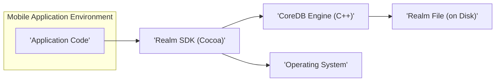
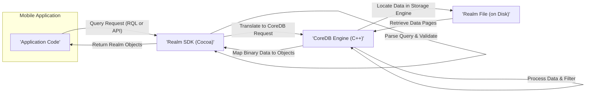
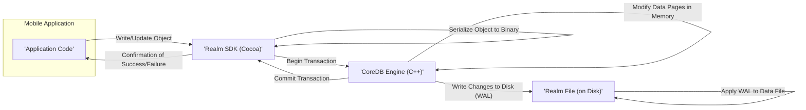
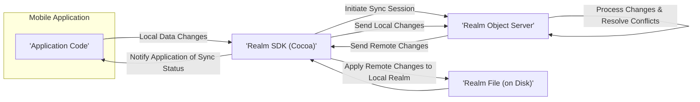

# Project Design Document: Realm Cocoa

**Version:** 1.1
**Date:** October 26, 2023
**Prepared By:** AI Software Architect

## 1. Introduction

This document provides an enhanced and more detailed architectural design overview of the Realm Cocoa project, an open-source mobile database. This document serves as a robust foundation for understanding the system's intricate components, interactions, and data flow, which is crucial for subsequent and effective threat modeling activities.

## 2. Goals and Objectives

The primary goals of this design document are to:

*   Present a comprehensive and in-depth architectural overview of the Realm Cocoa project.
*   Clearly identify key components, detailing their specific responsibilities and functionalities.
*   Thoroughly describe the data flow within the system, covering various operational scenarios.
*   Highlight potential areas of security concern from a detailed architectural perspective, providing specific examples.
*   Serve as a precise and informative basis for future threat modeling exercises, enabling accurate risk assessment.

## 3. Target Audience

This document is intended for:

*   Security engineers tasked with performing threat modeling, security assessments, and penetration testing.
*   Developers actively working with or planning to contribute to the Realm Cocoa project, requiring a deep understanding of its architecture.
*   Software and cloud architects needing a detailed understanding of the system's design for integration or evaluation purposes.

## 4. Scope

This document comprehensively covers the core architectural aspects of the Realm Cocoa library, with a strong focus on elements relevant to security analysis. The scope includes:

*   The internal structure and detailed functionalities of the key components within the library.
*   Mechanisms for data storage, retrieval, and manipulation at a lower level.
*   Synchronization features, including the interaction with the Realm Object Server and the synchronization protocol.
*   Interactions with the underlying operating system and hardware resources, highlighting potential security implications.
*   The public API exposed to developers, including potential misuse scenarios.

This document intentionally excludes:

*   Fine-grained implementation details of individual functions, methods, or classes within the codebase.
*   Detailed performance benchmarks, optimization strategies, or resource utilization metrics.
*   The historical evolution of the project, specific release notes, or past bug fixes.
*   An exhaustive deep dive into the Realm Object Server's internal architecture, unless directly impacting the Cocoa SDK's behavior and security.

## 5. High-Level Architecture

The Realm Cocoa architecture can be broadly represented as follows, illustrating the main interacting entities:

**Description:**

*   **Mobile Application Environment:** This encapsulates the developer's application code that utilizes the Realm Cocoa SDK.
*   **Realm SDK (Cocoa):** This is the primary interface developers interact with, providing high-level APIs in Swift and Objective-C for seamless Realm database management.
*   **CoreDB Engine (C++):** This represents the foundational C++ engine responsible for the core database functionalities, including robust data storage, efficient querying, and reliable transaction management.
*   **Realm File (on Disk):** This signifies the persistent storage location of the Realm database on the device's local file system, containing the actual data.
*   **Operating System:** The underlying operating system (iOS, macOS, tvOS, watchOS) provides essential services such as file system access, memory management, and security features.

## 6. Component Details

This section provides a more granular description of the key components and their specific responsibilities:

*   **Realm SDK (Cocoa):**
    *   **Language Bindings (Swift/Objective-C):** Exposes developer-friendly and idiomatic APIs for interacting with the underlying Realm database engine. This includes methods for creating, reading, updating, and deleting objects.
    *   **Object Mapping Layer:**  Handles the crucial translation between application-specific model objects and the underlying binary representation stored by the CoreDB Engine. This layer manages serialization and deserialization.
    *   **Query Engine Interface:** Provides a powerful and expressive query language (Realm Query Language) allowing developers to efficiently retrieve specific data subsets based on various criteria.
    *   **Transaction Management:** Enforces ACID (Atomicity, Consistency, Isolation, Durability) properties for all database operations, ensuring data integrity even in the face of errors or concurrency.
    *   **Schema Management:**  Defines and manages the structure (classes, properties, relationships) of the Realm database. Schema migrations are handled by this component.
    *   **Encryption Layer (Optional):** Offers functionality to encrypt the Realm database file on disk using strong encryption algorithms (e.g., AES-256), protecting data at rest. Key management is a critical aspect here.
    *   **Synchronization Client (Optional):**  Manages communication with the Realm Object Server, handling data synchronization, conflict resolution, and user authentication. This involves a specific synchronization protocol.

*   **CoreDB Engine (C++):**
    *   **Storage Engine:**  Manages the on-disk storage format of the Realm file, including data layout, indexing structures, and efficient data access mechanisms. This component is responsible for reading and writing data pages.
    *   **Query Processing Engine:**  Optimizes and executes queries efficiently, leveraging indexes and other techniques to minimize data access time.
    *   **Transaction Manager:**  Implements the core transaction logic, ensuring atomicity (all or nothing) and isolation (concurrent transactions don't interfere with each other).
    *   **Memory Management:**  Handles memory allocation and deallocation for database operations, requiring careful management to prevent memory leaks or corruption.
    *   **Concurrency Control:**  Manages concurrent access to the database from multiple threads or processes, preventing data corruption and ensuring data consistency. This often involves locking mechanisms.

*   **Realm File (on Disk):**
    *   **Binary File Format:**  A custom, efficient binary format specifically designed for storing object data, indexes, and metadata. The format is versioned and may evolve over time.
    *   **Data Pages:**  The file is segmented into pages, which are the fundamental units of storage and retrieval. These pages contain object data, index information, and internal metadata.
    *   **Version History:**  Maintains a history of changes to the database, enabling features like object versioning, conflict resolution during synchronization, and potential rollback capabilities.

*   **Operating System:**
    *   **File System:** Provides the fundamental interface for reading, writing, and managing the Realm file on the device's storage. File permissions and access control lists are managed by the OS.
    *   **Memory Management:**  The OS manages the memory allocated to the application and the Realm SDK. Memory pressure and resource limits imposed by the OS can impact Realm's performance.
    *   **Security Features:**  The OS provides security features such as file encryption, sandboxing, and code signing, which can directly impact the security posture of applications using Realm.

## 7. Data Flow

The following diagrams illustrate the typical data flow scenarios within Realm Cocoa, providing a more detailed view of the interactions:

### 7.1. Local Data Read (Detailed)

**Description:**

1. The application code initiates a data retrieval operation using either the Realm Query Language (RQL) or the SDK's API.
2. The Realm SDK receives the query request, parses it, and performs validation checks.
3. The SDK translates the high-level query into a lower-level request understood by the CoreDB Engine.
4. The CoreDB Engine's storage engine locates the relevant data pages within the Realm file on disk.
5. The required data pages are retrieved from the disk.
6. The CoreDB Engine processes the retrieved data, applies any necessary filtering, and potentially joins data from multiple locations.
7. The CoreDB Engine maps the raw binary data into Realm objects.
8. The Realm SDK returns the populated Realm objects to the application code.

### 7.2. Local Data Write (Detailed)

**Description:**

1. The application code requests to create, update, or delete a Realm object.
2. The Realm SDK initiates a transaction with the CoreDB Engine to ensure atomicity.
3. The SDK serializes the object into its binary representation.
4. The CoreDB Engine validates the data against the defined schema.
5. The CoreDB Engine modifies the relevant data pages in memory.
6. Changes are written to a Write-Ahead Log (WAL) on disk for durability.
7. The CoreDB Engine commits the transaction, making the changes visible.
8. The WAL is eventually applied to the main data file.
9. The Realm SDK confirms the success or reports any failure of the write operation to the application code.

### 7.3. Data Synchronization (Simplified with Focus on SDK)

**Description:**

1. The application code performs local data modifications within the Realm database.
2. The Realm SDK initiates a synchronization session with the Realm Object Server. This involves authentication and establishing a connection.
3. The SDK sends the local changes (commits) to the Realm Object Server.
4. The Realm Object Server processes these changes, potentially resolving conflicts with changes from other clients.
5. The server sends any remote changes made by other clients back to the SDK.
6. The SDK applies these remote changes to the local Realm file, updating the local database.
7. The local Realm file is updated with the synchronized data.
8. The SDK notifies the application code about the status of the synchronization process (success, failure, conflicts, etc.).

## 8. Security Considerations (Detailed Architectural Level)

Based on the architecture, potential security considerations that warrant further investigation during threat modeling include:

*   **Data at Rest Encryption Vulnerabilities:**
    *   **Missing Encryption:** If encryption is not enabled, the Realm file is stored in plaintext, making it vulnerable to unauthorized access if the device is compromised (lost, stolen, or malware-infected).
    *   **Weak Encryption:**  Using outdated or weak encryption algorithms could be susceptible to brute-force or cryptanalysis attacks.
    *   **Key Management Issues:** Insecure storage or handling of the encryption key (e.g., hardcoding, storing in shared preferences without proper protection) can negate the benefits of encryption.
*   **Data in Transit Encryption (Synchronization) Weaknesses:**
    *   **Lack of TLS/SSL:**  If communication with the Realm Object Server is not encrypted using TLS/SSL, sensitive data transmitted during synchronization could be intercepted (man-in-the-middle attacks).
    *   **Weak Cipher Suites:** Using weak or outdated cipher suites for TLS/SSL can make the connection vulnerable to attacks.
    *   **Certificate Pinning Issues:**  Failure to implement certificate pinning can allow attackers to impersonate the Realm Object Server.
*   **Access Control Deficiencies:**
    *   **Lack of Granular Local Access Control:** Realm Cocoa itself doesn't offer fine-grained user-level access control within a single local database. This means all data within a Realm file is accessible to the application.
    *   **Reliance on OS File Permissions:** Security relies heavily on the underlying operating system's file permissions, which might be misconfigured or bypassed on rooted/jailbroken devices.
    *   **Server-Side Access Control Bypass:** Vulnerabilities in the Realm Object Server's access control mechanisms could allow unauthorized access to data.
*   **Data Validation and Input Sanitization Flaws:**
    *   **Injection Attacks:**  If application code doesn't properly sanitize user inputs before storing them in Realm, it could be vulnerable to injection attacks (though less common in NoSQL databases).
    *   **Schema Validation Bypass:**  Circumventing or misconfiguring schema validation could lead to data corruption or unexpected behavior.
*   **Memory Safety Vulnerabilities in CoreDB Engine:**
    *   **Buffer Overflows:**  Being written in C++, the CoreDB Engine is potentially susceptible to memory safety issues like buffer overflows if not carefully coded.
    *   **Use-After-Free Errors:**  Improper memory management could lead to use-after-free vulnerabilities.
    *   **Integer Overflows:**  Integer overflows in calculations could lead to unexpected behavior or security vulnerabilities.
*   **Integrity of the Realm File Concerns:**
    *   **Data Corruption:**  Unexpected application termination or system crashes during write operations could lead to data corruption in the Realm file.
    *   **Tampering:**  Without proper integrity checks, a compromised device could allow malicious modification of the Realm file.
*   **Vulnerabilities in Dependencies:**
    *   **Third-Party Library Vulnerabilities:**  If Realm Cocoa relies on other third-party libraries, vulnerabilities in those libraries could indirectly affect Realm's security.
    *   **Operating System Vulnerabilities:**  Bugs or vulnerabilities in the underlying operating system could be exploited to compromise Realm's security.
*   **Secure Key Management Weaknesses (Encryption):**
    *   **Storage in SharedPreferences/UserDefaults:** Storing encryption keys in easily accessible locations like SharedPreferences (Android) or UserDefaults (iOS) without additional protection is a major security risk.
    *   **Hardcoding Keys:**  Embedding encryption keys directly in the application code is highly insecure.
    *   **Insufficient Entropy in Key Generation:**  Using weak random number generators for key generation can result in predictable keys.

## 9. Deployment

Realm Cocoa is typically deployed as a tightly integrated library within a mobile application. The application directly links and interacts with the Realm SDK. In scenarios involving data synchronization, the application also establishes communication with a dedicated Realm Object Server instance, which can be self-hosted or provided as a managed service.

## 10. Future Considerations

Potential future architectural enhancements or considerations with security implications include:

*   **Enhanced Access Control Mechanisms:**  Exploring and implementing more granular access control features within local Realm databases, potentially based on roles or permissions.
*   **Improved Security Auditing Capabilities:**  Introducing mechanisms for logging and auditing data access and modification events within the local database for forensic analysis.
*   **Integration with Hardware Security Modules (HSMs):**  Providing options for leveraging HSMs for more secure generation, storage, and management of encryption keys, especially for sensitive applications.
*   **Further Optimization of the Storage Engine with Security in Mind:**  Continuously improving the storage engine's performance and security, potentially incorporating features like data checksums for integrity verification.
*   **Formal Security Audits and Penetration Testing:**  Regularly conducting independent security audits and penetration testing to identify and address potential vulnerabilities proactively.

This enhanced document provides a more detailed and security-focused understanding of the Realm Cocoa architecture. This information is crucial for conducting thorough and effective threat modeling exercises to identify, assess, and mitigate potential security risks associated with the project.
