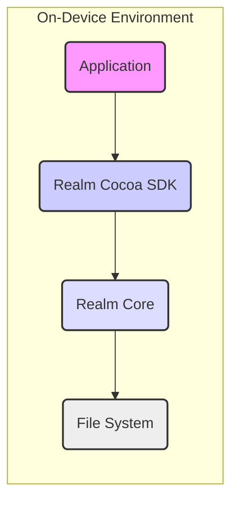
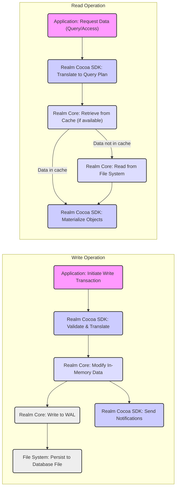

## Project Design Document: Realm Cocoa (Improved)

**1. Introduction**

This document provides an enhanced design overview of the Realm Cocoa project, an open-source mobile database, specifically tailored for threat modeling. It builds upon the previous version by offering more detailed descriptions, refined architecture diagrams, and a deeper dive into security considerations. The goal is to provide a comprehensive resource for identifying potential security vulnerabilities and attack vectors.

**Project Overview:**

Realm Cocoa is a robust mobile database solution designed for building offline-first applications on Apple platforms (iOS, macOS, tvOS, and watchOS). It empowers developers with an intuitive API for local data persistence and querying. Key features include object-relational mapping (ORM), reactive data updates, and support for a wide range of data types.

**Goals of this Document:**

* Provide a clear and detailed explanation of Realm Cocoa's architecture and components.
* Illustrate the data flow within the system with greater precision.
* Thoroughly identify and elaborate on potential security-relevant areas, threats, and vulnerabilities.
* Serve as a comprehensive and actionable resource for effective threat modeling activities.

**Scope:**

This document focuses on the core, on-device functionality of the Realm Cocoa database library. The scope includes:

* Local data persistence mechanisms and management.
* The inner workings of the Realm Core engine (the foundational C++ database).
* The public-facing Cocoa SDK (Swift and Objective-C APIs).
* The conceptual framework of data synchronization (acknowledging its role but excluding implementation specifics).

This document explicitly excludes:

* Specific implementation details of applications built with Realm Cocoa.
* The intricate implementation of the Realm Object Server (the backend synchronization service).
* Interactions with external services or libraries beyond the core SDK and Core engine.

**2. System Architecture**

The Realm Cocoa architecture is structured in distinct layers, each with specific responsibilities:

* **Application Layer:** The custom application code developed by users of the Realm Cocoa SDK. This layer defines the application's data models and business logic.
* **Realm Cocoa SDK (Swift/Objective-C):** The developer-facing libraries providing the API for interacting with the Realm database. This layer acts as an intermediary between the application and the underlying database engine.
* **Realm Core (C++ Engine):** The fundamental C++ database engine responsible for all low-level database operations, including data storage, querying, and transaction management.
* **Operating System:** The underlying Apple operating system (iOS, macOS, etc.) that provides essential services like file system access, memory management, and security features.

**2.1. Component Details**

* **Application:**
    *  The custom-built application code that integrates the Realm Cocoa SDK to manage and interact with local data.
    *  Responsible for defining Realm object schemas, initiating database operations (read, write, delete), and handling data changes.
    *  Typically manages user authentication, authorization, and data access policies *outside* of Realm's core database functionalities.

* **Realm Cocoa SDK (Swift/Objective-C):**
    *  Presents a developer-friendly, high-level API for interacting with the Realm database.
    *  Provides object mapping capabilities, translating between application-specific objects and the underlying database representation managed by Realm Core.
    *  Key functionalities include:
        *  **Realm Object Model Definition:** Allows developers to define the structure (schema) of their data using familiar object-oriented paradigms.
        *  **Realm Instance Management:** Provides access to specific versions of the Realm database, enabling transactional operations.
        *  **Transaction Management:** Ensures ACID properties (Atomicity, Consistency, Isolation, Durability) for all database modifications.
        *  **Querying Engine:** Offers a powerful and expressive query language for filtering and retrieving data based on defined criteria.
        *  **Change Notifications:** Enables applications to observe and react to changes in Realm objects and collections in real-time.
        *  **Encryption API:** Provides methods for encrypting the local database file, protecting sensitive data at rest.
        *  **Schema Migration Tools:** Facilitates the process of updating the database schema as the application's data model evolves.

* **Realm Core (C++ Engine):**
    *  The foundational database engine written in C++, responsible for the core functionalities of data storage and retrieval.
    *  Manages the specifics of the database file format, indexing strategies, and memory management.
    *  Handles concurrency control to ensure data integrity when multiple threads or processes access the database.
    *  Provides the low-level building blocks upon which the Cocoa SDK is built.

* **File System:**
    *  The underlying operating system's file system where the persistent Realm database file is stored.
    *  Responsible for the physical storage and retrieval of the database file.
    *  Subject to the security policies and permissions enforced by the operating system.

**2.2. Data Flow (Detailed)**

A more granular look at the data flow for common operations:

* **Writing Data (Detailed Flow):**
    1. The application initiates a write transaction by calling methods within the Realm Cocoa SDK.
    2. The SDK validates the operation and translates the object changes into a series of low-level commands understood by Realm Core.
    3. Realm Core receives these commands and performs the necessary modifications to its in-memory representation of the database.
    4. To ensure durability, Realm Core writes these changes to a write-ahead log (WAL).
    5. Periodically, or at transaction commit, the changes from the WAL are applied to the main database file on the file system.
    6. The SDK sends notifications to registered listeners within the application, informing them of the data changes.

* **Reading Data (Detailed Flow):**
    1. The application requests data by executing a query or accessing specific Realm objects through the Realm Cocoa SDK.
    2. The SDK translates the request into a query plan that Realm Core can execute efficiently.
    3. Realm Core first attempts to retrieve the requested data from its in-memory cache.
    4. If the data is not in the cache, Realm Core reads the data from the database file on the file system.
    5. The SDK materializes the retrieved data into Realm objects and returns them to the application.

**3. Security Considerations (Expanded)**

This section provides a more in-depth analysis of security considerations relevant to Realm Cocoa, highlighting potential threats and vulnerabilities:

* **Data Encryption at Rest:**
    * Realm Cocoa offers database encryption using AES-256. The encryption key is provided by the application.
    * **Threat 1: Weak Key Management:** If the encryption key is hardcoded, stored insecurely (e.g., in shared preferences without additional protection), or easily guessable, the encryption is ineffective.
    * **Threat 2: Key Compromise:** If the device is compromised, and the attacker gains access to the keychain or other secure storage where the key might be stored, the database can be decrypted.
    * **Mitigation:** Emphasize the importance of strong, randomly generated keys and secure key storage mechanisms provided by the operating system (e.g., iOS Keychain).

* **Data Integrity:**
    * Realm Core utilizes transactions and checksums to maintain data integrity.
    * **Threat 1: Data Corruption due to Software Bugs:** Bugs within Realm Core or the application code could lead to inconsistent data states.
    * **Threat 2: Data Corruption due to Hardware Failures:** Although less likely, hardware issues could potentially corrupt the database file.
    * **Mitigation:** Robust testing, proper error handling, and potentially implementing backup and recovery mechanisms at the application level.

* **Access Control (Application Level):**
    * Realm Cocoa itself does not enforce user-level access control within the database. This is the responsibility of the application developer.
    * **Threat 1: Unauthorized Data Access:** If the application does not implement proper authentication and authorization, malicious actors could potentially access or modify sensitive data.
    * **Threat 2: Privilege Escalation:** Vulnerabilities in the application's access control logic could allow users to perform actions beyond their intended privileges.
    * **Mitigation:** Implement robust authentication and authorization mechanisms, following the principle of least privilege.

* **Code Injection Vulnerabilities:**
    * While Realm's query language is designed to be type-safe, vulnerabilities can arise from how the application constructs and executes queries.
    * **Threat 1: Malicious Query Construction:** If user input is directly incorporated into query strings without proper sanitization, it could lead to unintended data retrieval or modification.
    * **Mitigation:** Use parameterized queries or Realm's query builder API to avoid directly embedding user input into query strings.

* **Memory Management Issues:**
    * As Realm Core is written in C++, manual memory management is involved, which can introduce vulnerabilities.
    * **Threat 1: Memory Leaks:** Failure to properly release allocated memory can lead to resource exhaustion and application instability.
    * **Threat 2: Buffer Overflows:** Writing beyond the bounds of allocated memory can lead to crashes or potentially allow attackers to execute arbitrary code.
    * **Mitigation:** Rely on Realm's internal memory management practices and report any suspected memory-related issues to the Realm development team.

* **Secure Defaults and Configuration:**
    * The default configuration of Realm Cocoa should prioritize security.
    * **Consideration:** Ensure that encryption is not enabled by default to avoid accidental data exposure if developers are unaware of the feature or its implications. Guide developers towards secure configuration practices.

* **Third-Party Dependencies (Within Realm Core):**
    * Realm Core may rely on other internal or external C++ libraries.
    * **Threat 1: Vulnerabilities in Dependencies:** Security flaws in these dependencies could potentially be exploited to compromise Realm Core.
    * **Mitigation:** Regularly update and audit the dependencies used by Realm Core.

* **Synchronization Security (If Applicable):**
    * When using Realm Object Server for synchronization, the security of the communication channel and the server infrastructure becomes paramount.
    * **Threat 1: Man-in-the-Middle Attacks:** If communication between the client and server is not properly encrypted (e.g., using TLS/SSL), attackers could intercept and potentially modify data.
    * **Threat 2: Server-Side Vulnerabilities:** Security flaws in the Realm Object Server itself could be exploited to gain unauthorized access to data.
    * **Mitigation:** Ensure secure communication channels (HTTPS), implement strong server-side authentication and authorization, and keep the Realm Object Server updated with the latest security patches.

**4. Deployment**

Realm Cocoa is deployed as a library directly integrated into the mobile application's bundle.

* **Integration Methods:** Developers typically integrate the Realm Cocoa SDK using dependency management tools like Swift Package Manager, CocoaPods, or Carthage.
* **Local Database Location:** The Realm database file is stored within the application's sandbox on the device's file system, adhering to the operating system's security restrictions.
* **No Separate Server Requirement (for core functionality):** The core, on-device functionality of Realm Cocoa does not necessitate a separate server deployment.

**5. Dependencies**

* **Core Foundation and other Apple System Frameworks:** Realm Cocoa relies on standard Apple operating system frameworks for essential functionalities.
* **Realm Core (C++):** The fundamental database engine.
* **Potentially other internal C++ libraries within the Realm Core project for specific functionalities.**

**6. Future Considerations (Security Enhancements)**

* **Granular Access Control within Realm:** Exploring the possibility of implementing more fine-grained access control mechanisms directly within the Realm database.
* **Enhanced Encryption Options:** Investigating support for more advanced encryption algorithms or key rotation strategies.
* **Built-in Auditing Capabilities:** Providing mechanisms for logging and tracking database access and modifications for security monitoring.
* **Integration with Device Security Features:** Exploring tighter integration with device-level security features like Secure Enclave for enhanced key management.

This enhanced design document provides a more comprehensive and detailed understanding of the Realm Cocoa project, specifically tailored for threat modeling activities. It highlights potential security considerations and serves as a valuable resource for identifying and mitigating potential vulnerabilities.