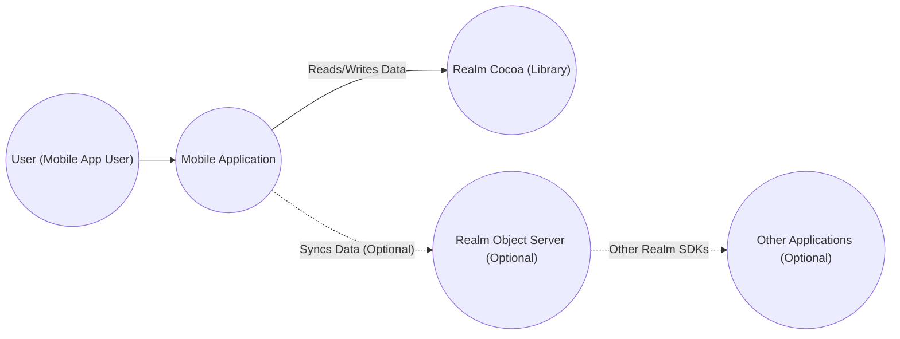
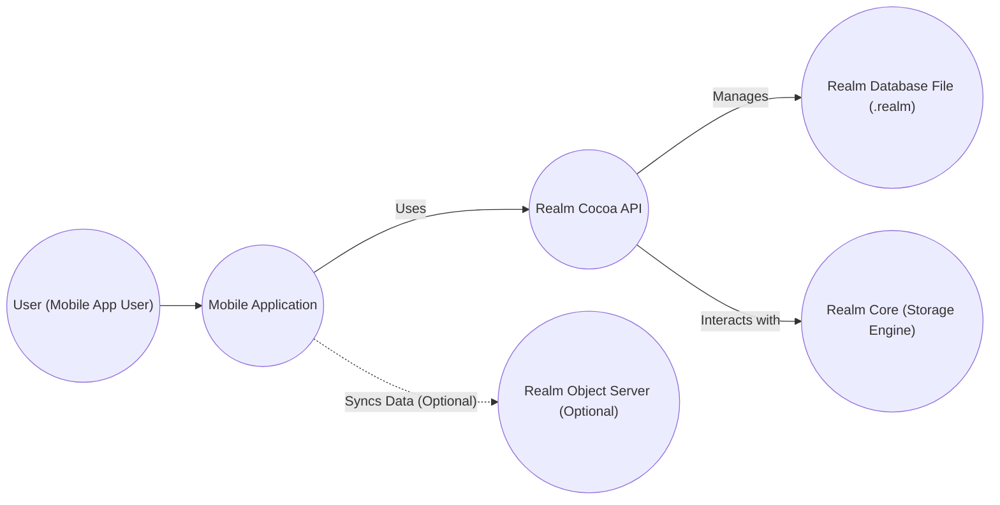
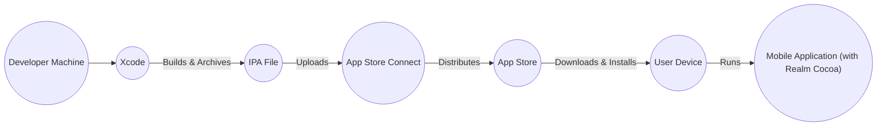
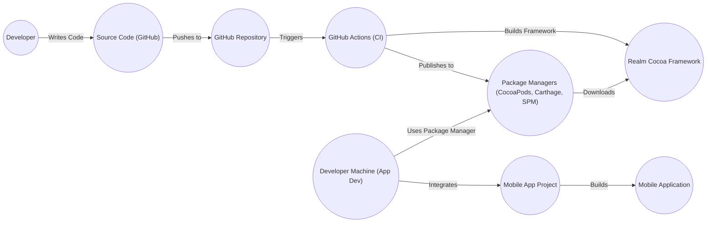

# Project Design Document: Realm Cocoa

## BUSINESS POSTURE

Realm Cocoa is a mobile database solution designed as an alternative to SQLite and Core Data. It's used by mobile application developers to store and manage data locally on iOS and macOS devices. Given its nature, the business priorities and goals revolve around:

*   Priorities:
    *   Performance: Providing fast data access and manipulation for smooth user experiences.
    *   Ease of Use: Offering a simple and intuitive API for developers.
    *   Reliability: Ensuring data integrity and consistency.
    *   Cross-Platform Compatibility (with other Realm SDKs): Allowing data synchronization across different platforms (Android, JavaScript, .NET, etc.) when used with Realm Sync.
    *   Security: Protecting sensitive user data stored within the database.

*   Goals:
    *   Become the preferred mobile database solution for iOS and macOS developers.
    *   Maintain a high level of developer satisfaction.
    *   Ensure the database is robust and reliable for production use.
    *   Provide a secure environment for storing application data.

*   Business Risks:
    *   Data breaches: Unauthorized access to sensitive data stored in Realm databases.
    *   Data corruption: Loss or corruption of user data due to bugs or errors.
    *   Performance bottlenecks: Slow database operations leading to poor application performance.
    *   Compatibility issues: Inconsistencies or errors when syncing data with other platforms or versions.
    *   Vulnerabilities: Security flaws that could be exploited by attackers.

## SECURITY POSTURE

*   Existing Security Controls:
    *   security control: Encryption at rest: Realm provides optional encryption at rest using AES-256 + SHA-2. The encryption key is managed by the iOS Keychain. Described in documentation and implemented in the core database engine.
    *   security control: Access control: Realm's object-level permissions allow developers to control which users or roles can access specific objects within the database (when used with Realm Sync). Described in documentation and implemented in the Realm Object Server and SDK.
    *   security control: Secure communication: When used with Realm Sync, data is transmitted over a TLS-encrypted connection. Described in documentation and implemented in the Realm Object Server and SDK.

*   Accepted Risks:
    *   accepted risk: Without enabling encryption, data is stored unencrypted on the device. This is acceptable for applications that do not store sensitive data.
    *   accepted risk: Reliance on the iOS Keychain for key management. If the device's Keychain is compromised, the encryption key could be exposed.
    *   accepted risk: The security of Realm Sync relies on the security of the Realm Object Server and the network connection.

*   Recommended Security Controls:
    *   security control: Implement robust input validation to prevent injection attacks.
    *   security control: Regularly update the Realm SDK to the latest version to benefit from security patches.
    *   security control: Conduct regular security audits and penetration testing of applications using Realm.
    *   security control: Consider implementing additional security measures, such as obfuscation, to protect against reverse engineering.

*   Security Requirements:
    *   Authentication: Not directly applicable to the Realm Cocoa library itself, as it's a local database. Authentication is handled at the application level or by the Realm Object Server when using Realm Sync.
    *   Authorization: Realm provides object-level permissions (when used with Realm Sync) to control access to data based on user roles or identities. This should be used to enforce the principle of least privilege.
    *   Input Validation: Developers should implement thorough input validation in their applications to prevent injection attacks and ensure data integrity.
    *   Cryptography: Realm supports AES-256 encryption at rest. Developers should enable encryption for applications that store sensitive data. Key management should follow best practices, leveraging the iOS Keychain securely.

## DESIGN

### C4 CONTEXT

*   Elements:
    *   Element:
        *   Name: User (Mobile App User)
        *   Type: Person
        *   Description: The end-user of the mobile application that utilizes Realm Cocoa.
        *   Responsibilities: Interacts with the mobile application, triggering data reads and writes.
        *   Security controls: Relies on application-level security controls.
    *   Element:
        *   Name: Mobile Application
        *   Type: Software System
        *   Description: The iOS or macOS application that uses Realm Cocoa for local data storage.
        *   Responsibilities: Manages the user interface, handles user input, and interacts with the Realm Cocoa library.
        *   Security controls: Application-level security controls, input validation, secure coding practices.
    *   Element:
        *   Name: Realm Cocoa (Library)
        *   Type: Library
        *   Description: The Realm Cocoa library embedded within the mobile application.
        *   Responsibilities: Provides an API for interacting with the local Realm database, handles data persistence, and manages data access.
        *   Security controls: Encryption at rest (optional), access control (with Realm Sync).
    *   Element:
        *   Name: Realm Object Server (Optional)
        *   Type: Software System
        *   Description: The server-side component of Realm, used for data synchronization and user authentication (optional).
        *   Responsibilities: Synchronizes data between multiple Realm instances, manages user accounts, and enforces access control rules.
        *   Security controls: TLS encryption, authentication, authorization, access control.
    *   Element:
        *   Name: Other Applications (Optional)
        *   Type: Software System
        *   Description: Other applications (mobile, web, server) that use Realm and synchronize data with the Realm Object Server.
        *   Responsibilities: Varies depending on the application.
        *   Security controls: Varies depending on the application and platform.

### C4 CONTAINER

*   Elements:
    *   Element:
        *   Name: User (Mobile App User)
        *   Type: Person
        *   Description: The end-user of the mobile application.
        *   Responsibilities: Interacts with the mobile application.
        *   Security controls: Relies on application-level security controls.
    *   Element:
        *   Name: Mobile Application
        *   Type: Software System
        *   Description: The iOS or macOS application.
        *   Responsibilities: Manages the user interface, handles user input, and interacts with the Realm Cocoa API.
        *   Security controls: Application-level security controls, input validation, secure coding practices.
    *   Element:
        *   Name: Realm Cocoa API
        *   Type: API
        *   Description: The public API of the Realm Cocoa library.
        *   Responsibilities: Provides methods for developers to interact with the Realm database (create, read, update, delete objects, perform queries, etc.).
        *   Security controls: Input validation (to some extent), API access control.
    *   Element:
        *   Name: Realm Database File (.realm)
        *   Type: File
        *   Description: The file on the device's storage that contains the Realm database.
        *   Responsibilities: Stores the application's data.
        *   Security controls: Encryption at rest (optional).
    *   Element:
        *   Name: Realm Core (Storage Engine)
        *   Type: Library
        *   Description: The underlying storage engine that manages data persistence and access.
        *   Responsibilities: Handles low-level database operations, manages transactions, and ensures data consistency.
        *   Security controls: Encryption at rest (implementation), data integrity checks.
    *   Element:
        *   Name: Realm Object Server (Optional)
        *   Type: Software System
        *   Description: The server-side component for synchronization.
        *   Responsibilities: Synchronizes data, manages user accounts, enforces access control.
        *   Security controls: TLS encryption, authentication, authorization, access control.

### DEPLOYMENT

Realm Cocoa is a library that is embedded within a mobile application. Therefore, its deployment is tied to the deployment of the application itself.

*   Possible Deployment Solutions:
    *   App Store Deployment: The most common deployment method for iOS applications.
    *   Enterprise Distribution: For distributing applications within an organization.
    *   Ad Hoc Distribution: For testing on a limited number of devices.
    *   Development Builds: For testing and development purposes.

*   Chosen Deployment Solution (App Store Deployment):

*   Elements:
    *   Element:
        *   Name: Developer Machine
        *   Type: Workstation
        *   Description: The developer's computer used for coding and building the application.
        *   Responsibilities: Hosts the source code, development tools, and build environment.
        *   Security controls: Access controls, disk encryption, secure coding practices.
    *   Element:
        *   Name: Xcode
        *   Type: IDE
        *   Description: Apple's integrated development environment for building iOS and macOS applications.
        *   Responsibilities: Provides tools for coding, building, debugging, and archiving applications.
        *   Security controls: Code signing, sandboxing (to some extent).
    *   Element:
        *   Name: IPA File
        *   Type: File
        *   Description: The iOS application archive file, containing the compiled application code and resources.
        *   Responsibilities: Represents the deployable package of the application.
        *   Security controls: Code signing.
    *   Element:
        *   Name: App Store Connect
        *   Type: Web Service
        *   Description: Apple's platform for managing and distributing applications on the App Store.
        *   Responsibilities: Handles application submission, review, and distribution.
        *   Security controls: Authentication, authorization, Apple's security infrastructure.
    *   Element:
        *   Name: App Store
        *   Type: Platform
        *   Description: Apple's digital distribution platform for iOS applications.
        *   Responsibilities: Provides a marketplace for users to download and install applications.
        *   Security controls: Apple's security infrastructure, application review process.
    *   Element:
        *   Name: User Device
        *   Type: Mobile Device
        *   Description: The user's iPhone or iPad.
        *   Responsibilities: Runs the mobile application.
        *   Security controls: iOS security features (sandboxing, data protection, etc.).
    *   Element:
        *   Name: Mobile Application (with Realm Cocoa)
        *   Type: Software System
        *   Description: The deployed application, including the embedded Realm Cocoa library.
        *   Responsibilities: Provides the application's functionality to the user.
        *   Security controls: Application-level security controls, Realm Cocoa's security features.

### BUILD

The Realm Cocoa library itself is built and distributed as a framework. The build process for applications *using* Realm Cocoa involves integrating this framework.

*   Build Process Description:
    1.  Developers write code for the Realm Cocoa library and push it to the GitHub repository.
    2.  GitHub Actions, the CI/CD system, is triggered by pushes or pull requests.
    3.  GitHub Actions builds the Realm Cocoa framework for various platforms and configurations. This includes running tests (unit tests, integration tests) to ensure code quality and prevent regressions. Static analysis tools (linters, SAST) could also be integrated into this process.
    4.  The built framework is then published to package managers (CocoaPods, Carthage, Swift Package Manager) for easy integration into developer projects.
    5.  Application developers using Realm Cocoa specify the dependency in their project (using CocoaPods, Carthage, or SPM).
    6.  The package manager downloads the appropriate version of the Realm Cocoa framework.
    7.  The developer integrates the framework into their mobile application project.
    8.  The mobile application project is built, linking the Realm Cocoa framework.

*   Security Controls in Build Process:
    *   security control: GitHub Actions: Provides a secure and automated build environment.
    *   security control: Code signing: The Realm Cocoa framework should be code-signed to ensure its authenticity and integrity.
    *   security control: Package managers: Using established package managers helps ensure that developers are downloading the official Realm Cocoa framework.
    *   security control: Testing: Automated tests (unit, integration) help identify and prevent security vulnerabilities.
    *   security control: (Recommended) SAST: Integrate static application security testing tools into the GitHub Actions workflow to scan for potential vulnerabilities.
    *   security control: (Recommended) Dependency scanning: Use tools to scan for known vulnerabilities in third-party dependencies.

## RISK ASSESSMENT

*   Critical Business Processes:
    *   Data storage and retrieval: The core functionality of Realm Cocoa is to store and retrieve data reliably and efficiently.
    *   Data synchronization (when using Realm Sync): Ensuring data consistency across multiple devices and platforms.
    *   Application functionality: Many applications rely on Realm Cocoa for their core functionality; a failure in Realm could render the application unusable.

*   Data Sensitivity:
    *   The sensitivity of data stored in Realm depends entirely on the application using it. Realm Cocoa itself does not inherently know the sensitivity of the data.
    *   Applications can store a wide range of data, from non-sensitive configuration settings to highly sensitive personal information (PII), financial data, or health data.
    *   Developers are responsible for assessing the sensitivity of the data their application stores and implementing appropriate security measures (e.g., enabling encryption).

## QUESTIONS & ASSUMPTIONS

*   Questions:
    *   What specific types of data will be stored in Realm databases by applications using this library? (This is crucial for determining the appropriate security measures.)
    *   What is the expected scale of usage (number of users, data volume)?
    *   Are there any specific compliance requirements (e.g., GDPR, HIPAA) that need to be considered?
    *   What is the threat model for typical applications using Realm Cocoa? (Who are the potential attackers, and what are their motivations?)

*   Assumptions:
    *   BUSINESS POSTURE: We assume that developers using Realm Cocoa have a basic understanding of security best practices.
    *   SECURITY POSTURE: We assume that encryption at rest will be enabled for applications storing sensitive data. We assume that developers will keep the Realm SDK updated.
    *   DESIGN: We assume that the Realm Object Server, if used, is properly secured and configured. We assume that developers will implement appropriate input validation in their applications.