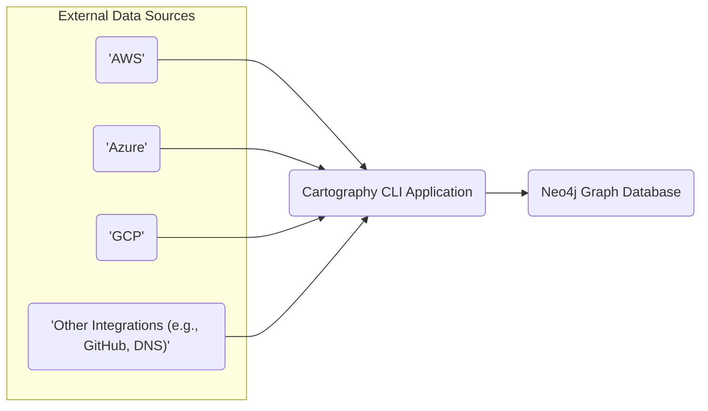
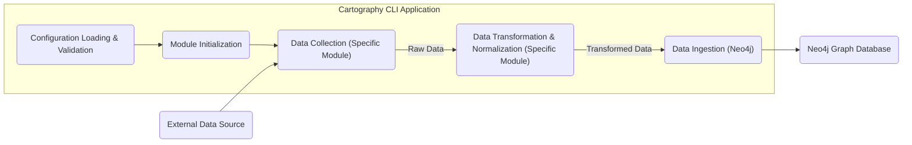

# Project Design Document: Cartography

**Version:** 1.1
**Date:** October 26, 2023
**Author:** AI Software Architect

## 1. Introduction

This document provides a detailed design overview of the Cartography project, an open-source tool available at [https://github.com/robb/cartography](https://github.com/robb/cartography). Cartography is engineered to construct a comprehensive graph of relationships between assets and their configurations spanning diverse cloud providers and enterprise infrastructure. This document aims to deliver a clear and thorough understanding of Cartography's architecture, components, and data flow, which is essential for effective threat modeling and security analysis.

## 2. Goals and Objectives

The core objectives of Cartography are:

* **Automated Asset Discovery:**  To automatically discover and maintain an up-to-date inventory of assets across configured environments.
* **Comprehensive Relationship Mapping:** To identify and map the relationships between discovered assets, providing a holistic view of dependencies and connections.
* **Detailed Configuration Capture:** To collect and store detailed configuration information for each asset, enabling granular analysis.
* **Centralized Security Context:** To create a centralized repository of asset and relationship data, facilitating security analysis, compliance auditing, and vulnerability assessment.
* **Scalable Data Ingestion:** To efficiently ingest and process large volumes of data from multiple sources without significant performance degradation.
* **Flexible Integration:** To provide a modular architecture that allows for the integration of new data sources and functionalities.

## 3. High-Level Architecture

Cartography functions as a command-line interface (CLI) application that interacts with various data sources through specific modules and persists the gathered information in a graph database.

**Key Architectural Elements:**

* **External Data Sources:** The various systems from which Cartography retrieves metadata. These encompass cloud providers (AWS, Azure, GCP), SaaS platforms, and potentially on-premises infrastructure. Each source requires specific authentication and API interaction methods.
* **Cartography CLI Application:** The central application orchestrating the data collection and processing. It manages configuration, module execution, data transformation, and interaction with the Neo4j database.
* **Neo4j Graph Database:** The persistent storage layer optimized for representing interconnected data. Neo4j's graph structure is ideally suited for storing and querying the relationships between infrastructure assets.

## 4. Detailed Component Design

### 4.1. Cartography CLI Application

The Cartography CLI application is the core execution engine. Its operation involves a sequence of steps:

1. **Configuration Loading and Validation:**
    * Reads configuration parameters from a YAML file, environment variables, or command-line arguments.
    * Validates the provided configuration, including:
        * Credentials for accessing external data sources (API keys, access keys, service principals, etc.).
        * Connection details for the Neo4j graph database (URI, username, password).
        * Specification of which modules to execute for data collection.
        * Module-specific configuration settings.
2. **Module Initialization and Execution:**
    * Dynamically loads and initializes the specified data collection modules.
    * Each module is designed to interact with a specific data source API.
    * The CLI orchestrates the execution of these modules.
3. **Data Collection from Sources:**
    * Each module utilizes the configured credentials to authenticate and authorize against its designated data source.
    * Modules make API calls to retrieve metadata about relevant assets and their configurations.
    * Implements error handling, retry mechanisms, and rate limiting strategies to ensure robust data retrieval.
4. **Data Transformation and Normalization:**
    * Raw data retrieved from various data sources is transformed into a consistent and normalized format suitable for the graph database.
    * This involves:
        * Extracting relevant attributes from the raw data.
        * Mapping attributes to a common data model.
        * Standardizing data types and formats.
5. **Data Ingestion into Neo4j:**
    * The transformed data is ingested into the Neo4j graph database.
    * Cartography utilizes Cypher queries to:
        * Create nodes representing individual assets (e.g., EC2 instances, S3 buckets, IAM users).
        * Create relationships representing the connections and dependencies between these assets (e.g., an EC2 instance `RUNS_SERVICE` on a specific port, an IAM role `HAS_PERMISSION_TO` an S3 bucket).
    * Employs upsert operations to ensure that the graph database reflects the latest state of the infrastructure, updating existing nodes and relationships or creating new ones as needed.

### 4.2. Data Collection Modules

Modules are self-contained units responsible for interacting with specific data sources. Key characteristics include:

* **Source-Specific Logic:** Each module encapsulates the logic required to interact with a particular data source's API (e.g., AWS SDK for Python (Boto3), Azure SDK for Python, Google Cloud Client Libraries).
* **Credential Management within Modules:** Modules utilize the credentials provided in the configuration to authenticate with their respective data sources.
* **API Interaction and Data Retrieval:** Implement the specific API calls and logic necessary to retrieve the desired metadata from the source. This often involves pagination, filtering, and handling API-specific data structures.
* **Error Handling and Resilience:** Incorporate error handling, retry mechanisms, and rate limiting to manage potential issues during data retrieval.
* **Data Transformation within Modules:**  Responsible for transforming the raw data from the specific source into a standardized format before sending it to the core Cartography application for Neo4j ingestion.

**Examples of Modules:**

* `'cartography.intel.aws.ec2'`: Collects data related to AWS EC2 instances, AMIs, security groups, VPCs, etc.
* `'cartography.intel.azure.compute'`: Collects data about Azure Virtual Machines, Virtual Networks, Network Security Groups, etc.
* `'cartography.intel.gcp.compute'`: Collects data concerning GCP Compute Engine instances, networks, firewalls, etc.
* `'cartography.intel.github'`: Collects data about GitHub repositories, organizations, users, and their relationships.
* `'cartography.intel.dns'`: Retrieves DNS records for specified domains.

### 4.3. Neo4j Graph Database

Neo4j provides the persistent storage and querying capabilities for Cartography's data.

* **Graph Data Model:** Cartography defines a specific graph data model within Neo4j, comprising various node labels (representing asset types like `'EC2Instance'`, `'S3Bucket'`, `'IAMUser'`) and relationship types (representing connections like `'OWNS'`, `'USES'`, `'HAS_PERMISSION'`, `'CONTAINED_IN'`).
* **Schema Management and Evolution:** Cartography manages the schema within Neo4j, ensuring consistency and allowing for schema evolution as new data sources and asset types are integrated.
* **Cypher Query Language:** The primary means of interacting with the data in Neo4j. Cypher is used by Cartography for data ingestion and can be used by analysts for querying and exploring the relationships between assets.

## 5. Data Flow

The flow of data within Cartography follows a defined sequence:

**Detailed Breakdown:**

1. **Configuration Loading & Validation:** The Cartography CLI starts by loading and validating configuration parameters, including credentials and module specifications.
2. **Module Initialization:** Based on the validated configuration, the specified data collection modules are initialized and prepared for execution.
3. **Data Collection (Specific Module):**  An initialized module connects to its designated external data source using the provided credentials and retrieves raw data via API calls.
4. **Data Transformation & Normalization (Specific Module):** The module processes the raw data, transforming it into a structured and normalized format consistent with Cartography's data model.
5. **Data Ingestion (Neo4j):** The transformed data is sent to the Neo4j database. Cartography uses Cypher queries to create or update nodes and relationships representing the discovered assets and their connections.

## 6. Security Considerations

Security is a critical aspect of Cartography's operation and the protection of the collected data:

* **Secure Credential Management:**
    * Cartography relies on sensitive credentials (API keys, secrets, etc.) to access external data sources.
    * **Recommendation:** Employ secure secrets management solutions like HashiCorp Vault, AWS Secrets Manager, or Azure Key Vault to store and retrieve credentials. Avoid storing credentials directly in configuration files.
    * **Recommendation:** Implement role-based access control (RBAC) for accessing secrets management systems.
* **Authentication and Authorization for Neo4j:**
    * Access to the Neo4j graph database must be secured to prevent unauthorized access to sensitive infrastructure data.
    * **Recommendation:** Configure strong authentication mechanisms for Neo4j, such as username/password authentication or integration with enterprise identity providers (e.g., LDAP, Active Directory).
    * **Recommendation:** Implement granular authorization controls within Neo4j to restrict access to specific data or operations based on user roles or permissions.
* **Data Encryption in Transit:**
    * Communication between Cartography and external data sources, as well as between Cartography and Neo4j, involves the transmission of sensitive data.
    * **Recommendation:** Ensure all network communication utilizes TLS/SSL encryption to protect data in transit.
* **Data Encryption at Rest:**
    * The data stored in the Neo4j graph database contains sensitive information about infrastructure configurations and relationships.
    * **Recommendation:** Enable encryption at rest for the Neo4j database to protect data stored on disk.
* **Input Validation and Sanitization:**
    * Cartography processes data retrieved from external sources, which may be untrusted.
    * **Recommendation:** Implement robust input validation and sanitization techniques to prevent injection attacks (e.g., Cypher injection) and other vulnerabilities.
* **Logging and Auditing:**
    * Comprehensive logging and auditing are essential for monitoring Cartography's operations and detecting potential security incidents.
    * **Recommendation:** Implement detailed logging of Cartography's activities, including data collection attempts, API interactions, and any errors encountered.
    * **Recommendation:** Enable audit logging for the Neo4j database to track access and modifications to the stored data.
* **Principle of Least Privilege:**
    * Cartography and its modules should operate with the minimum necessary permissions to perform their intended tasks.
    * **Recommendation:** Grant Cartography modules only the specific API permissions required to collect the necessary data from each source. Avoid using overly permissive credentials.
* **Dependency Management and Vulnerability Scanning:**
    * Cartography relies on various third-party libraries and dependencies.
    * **Recommendation:** Regularly update dependencies to patch known vulnerabilities.
    * **Recommendation:** Implement automated vulnerability scanning of Cartography's codebase and dependencies.
* **Secure Deployment Practices:**
    * The environment where Cartography is deployed should be secured according to best practices.
    * **Recommendation:** Deploy Cartography in a hardened environment with appropriate network segmentation and access controls.

## 7. Deployment Considerations

Cartography can be deployed in various environments, each with its own considerations:

* **Local Machine (Development/Testing):**
    * Simple setup for experimentation and development.
    * **Consideration:** Ensure local machine is adequately secured, especially when handling sensitive credentials.
* **Dedicated Server (Scheduled Task):**
    * Suitable for automated, periodic data collection.
    * **Consideration:** Secure the server environment, including access controls, patching, and monitoring.
    * **Consideration:** Implement robust scheduling mechanisms (e.g., cron, systemd timers) and error handling for automated runs.
* **Containerized Environment (Docker):**
    * Provides consistent and reproducible deployments.
    * **Consideration:** Secure the Docker image and container runtime environment.
    * **Consideration:** Manage container orchestration and scaling if needed.
* **Cloud Environment (e.g., EC2, Azure VM, GCP Compute Engine):**
    * Leverage cloud infrastructure for scalability and availability.
    * **Consideration:** Utilize cloud-native security services (e.g., security groups, network ACLs, IAM roles).
    * **Consideration:** Consider using managed Neo4j offerings for simplified database management.

**Key Deployment Considerations:**

* **Network Connectivity:** Ensure Cartography has the necessary network access to reach the external data sources and the Neo4j database.
* **Resource Allocation:** Allocate sufficient CPU, memory, and disk resources for Cartography to operate efficiently, especially when processing large datasets.
* **Scheduling and Automation:** Implement a reliable scheduling mechanism to automate data collection runs at desired intervals.
* **Monitoring and Alerting:** Set up monitoring for Cartography's performance and error conditions, and configure alerts for critical issues.

## 8. Future Considerations

Potential future enhancements for Cartography include:

* **Expanded Data Source Integrations:** Adding support for a wider range of cloud providers, SaaS applications, security tools, and on-premises infrastructure components.
* **Real-time or Near Real-time Data Collection:** Exploring mechanisms for more frequent or event-driven data ingestion to provide a more up-to-date view of the environment.
* **Web-Based User Interface (UI):** Developing a user-friendly web interface for visualizing the graph data, running queries, and generating reports.
* **Enhanced Security Analysis Features:** Integrating built-in security analysis capabilities, such as identifying potential misconfigurations, compliance violations, or security risks based on the collected data.
* **Extensible Module Framework:** Further improving the modularity and extensibility of the platform to simplify the development and integration of new data collection modules.
* **Data Enrichment Capabilities:** Adding features to enrich the collected data with information from external threat intelligence feeds or vulnerability databases.
* **Integration with Security Orchestration, Automation, and Response (SOAR) Platforms:** Enabling Cartography to provide valuable context for security automation workflows.

This improved design document provides a more detailed and comprehensive overview of the Cartography project, emphasizing security considerations and providing a solid foundation for subsequent threat modeling activities. The enhanced descriptions of the architecture, components, and data flow offer a clearer understanding of the system's inner workings and potential attack surfaces.