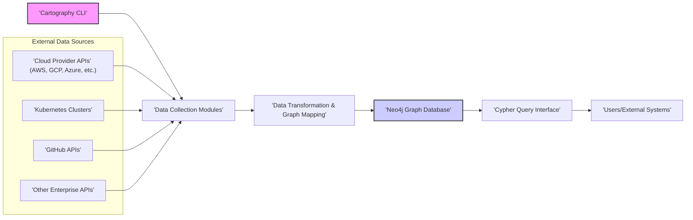

# Project Design Document: Cartography

## 1. Project Overview

### 1.1. Project Goals
- To provide a comprehensive and continuously updated inventory of assets across diverse multi-cloud and enterprise infrastructure environments.
- To automatically discover and map the complex relationships between these assets, constructing a dynamic graph representation of the entire infrastructure landscape.
- To significantly enhance security posture visibility, enabling proactive identification of vulnerabilities, misconfigurations, and potential attack paths by understanding asset interdependencies.
- To empower security engineers, cloud engineers, DevOps engineers, and auditors with actionable insights into their infrastructure, facilitating informed decision-making and improved security management.
- To be extensible and modular, allowing for easy integration of new data sources and functionalities as the infrastructure and threat landscape evolves.

### 1.2. Target Audience
- Security Engineers and Security Architects
- Cloud Engineers and Cloud Architects
- DevOps Engineers and SREs
- Security Auditors and Compliance Teams
- IT Infrastructure Management and Operations Teams
- Security Operations Center (SOC) Analysts

### 1.3. Project Scope
- **Core Functionality**:
    - Automated asset discovery and relationship mapping across:
        - Major Cloud Providers: Amazon Web Services (AWS), Google Cloud Platform (GCP), Microsoft Azure, and potentially others (e.g., Alibaba Cloud, Oracle Cloud).
        - Kubernetes Environments: Managed Kubernetes services (EKS, GKE, AKS) and self-managed clusters.
        - GitHub Organizations and Repositories: Public and private repositories, users, teams, and permissions.
    - Data collection and normalization from various APIs and data sources using modular and extensible collectors.
    - Transformation of collected data into a standardized graph model.
    - Persistent storage of the graph data in a robust graph database (Neo4j).
    - Command-line interface (CLI) for configuration, execution, and management of data collection cycles.
- **Out-of-Scope (For Initial Phase)**:
    - Real-time monitoring and alerting.
    - Advanced vulnerability scanning and correlation.
    - Automated remediation or response actions.
    - Pre-built dashboards and visualizations (focus is on data availability for external tools).
    - Support for legacy on-premise infrastructure beyond cloud and Kubernetes (initially).

## 2. Architecture Overview

### 2.1. High-Level Architecture Diagram

### 2.2. Key Components
- **Cartography CLI**: The primary user interface, providing a command-line tool for configuring and initiating data collection, managing connections, and interacting with Cartography. It acts as the orchestrator for the entire data ingestion process.
- **Data Collection Modules (Intel Modules)**: Independent, pluggable modules dedicated to interacting with specific data sources. Each module is responsible for:
    - Authentication and authorization with the target API.
    - Data retrieval from the API endpoints.
    - Initial parsing and normalization of raw API responses.
    - Basic error handling and logging for data source interactions.
- **Data Transformation & Graph Mapping Engine**:  Located within each Data Collection Module, this component performs:
    - Advanced data transformation and cleaning to ensure data consistency and quality.
    - Mapping of normalized data into a predefined graph schema, defining nodes (assets) and relationships (connections).
    - Creation of Cypher queries for efficient data ingestion into Neo4j.
- **Neo4j Graph Database**: The core data storage and analysis engine. It provides:
    - Persistent storage for the infrastructure graph, optimized for relationship-based data.
    - A powerful query language (Cypher) for traversing and analyzing the graph.
    - Indexing and transaction management for performance and data integrity.
    - An API for programmatic access and integration.
- **Cypher Query Interface**: The mechanism for users and external systems to interact with the data stored in Neo4j. This includes:
    - Direct Cypher query execution via the Neo4j Browser UI.
    - Programmatic access using Neo4j drivers in various programming languages.
    - Potential for future development of a dedicated Cartography API layer for simplified data access.

## 3. Data Flow

### 3.1. Data Sources
- **Cloud Provider Management APIs**: AWS APIs (using boto3), GCP APIs, Azure Resource Manager and Service APIs, etc. - used to discover and retrieve configuration data for cloud resources.
- **Kubernetes API Server**: API access to Kubernetes clusters for discovering pods, services, deployments, namespaces, and other Kubernetes objects.
- **GitHub REST and GraphQL APIs**: APIs for accessing organization, repository, user, and permission data from GitHub.
- **Configuration Files**: User-provided configuration files (e.g., YAML, JSON) for credentials, connection parameters, and module-specific settings.
- **Potentially other APIs**: As Cartography evolves, support for other enterprise APIs (e.g., vulnerability scanners, CMDBs, security tools) can be added through new Data Collection Modules.

### 3.2. Data Ingestion Process
1. **Configuration Loading**: Cartography CLI loads configuration from files and environment variables, including API credentials and data source selections.
2. **Module Initialization**: Based on the configuration, the CLI initializes the necessary Data Collection Modules.
3. **Data Collection Orchestration**: The CLI orchestrates the execution of each Data Collection Module in a defined sequence or in parallel.
4. **API Authentication & Connection**: Each module authenticates and establishes a secure connection to its designated data source API using provided credentials.
5. **Data Retrieval from APIs**: Modules make API calls to retrieve relevant data sets from the data source, respecting API rate limits and best practices.
6. **Raw Data Parsing & Normalization**: Modules parse the raw API responses (typically JSON or XML) and normalize the data into a consistent internal representation.
7. **Graph Transformation & Mapping**: Modules transform the normalized data into nodes and relationships according to the Cartography graph schema, generating Cypher `CREATE` and `MERGE` statements.
8. **Neo4j Data Ingestion**: Modules use the Neo4j driver to connect to the Neo4j database and execute the generated Cypher statements to ingest the data into the graph.
9. **Data Ingestion Logging**: Each module logs the progress and any errors encountered during data collection and ingestion.
10. **Completion and Reporting**: The CLI reports the overall success or failure of the data collection cycle and provides summaries of ingested data.

### 3.3. Data Storage
- **Neo4j Graph Database**: Serves as the central repository for all discovered infrastructure data.
    - **Nodes**: Represent individual assets (e.g., `AWSInstance`, `GCPBucket`, `KubernetesPod`, `GitHubRepository`). Nodes have labels indicating their type and properties storing their attributes (e.g., instance ID, bucket name, pod status, repository URL).
    - **Relationships**: Represent connections and dependencies between assets (e.g., `[:RUNS_ON]`, `[:CONTAINED_IN]`, `[:HAS_PERMISSION]`, `[:CONNECTED_TO]`). Relationships have types describing the nature of the connection and can also have properties (e.g., permission level, connection protocol).
    - **Graph Schema**: Cartography defines a consistent graph schema to represent different asset types and relationships across various data sources, ensuring data consistency and enabling cross-platform analysis.

### 3.4. Data Processing
- **Data Transformation within Modules**: The core data processing logic resides within the Data Collection Modules. This includes:
    - **API Request Construction**: Building API requests based on the data source API specifications and Cartography's needs.
    - **API Response Handling**: Managing API responses, including pagination, error handling, and rate limit management.
    - **Data Cleansing and Validation**: Cleaning and validating data to ensure accuracy and consistency before graph ingestion.
    - **Relationship Inference**: Deriving relationships between assets based on the data retrieved from APIs (e.g., inferring network connections, resource ownership, and dependencies).
    - **Cypher Statement Generation**: Dynamically generating Cypher `CREATE` and `MERGE` statements to represent nodes and relationships in Neo4j.
- **Neo4j Graph Operations**: Neo4j handles graph-specific processing:
    - **Graph Indexing**: Automatically indexes nodes and relationships for efficient query performance.
    - **Transaction Management (ACID)**: Ensures data consistency and integrity during ingestion and updates through ACID transactions.
    - **Cypher Query Execution and Optimization**: Optimizes and executes Cypher queries for data retrieval and analysis.
    - **Graph Algorithms**: Neo4j supports graph algorithms that can be used for advanced analysis (e.g., pathfinding, community detection) in future Cartography extensions.

### 3.5. Data Output
- **Direct Neo4j Access**: The primary output is direct access to the populated Neo4j graph database. Users can leverage:
    - **Neo4j Browser**: A web-based UI for exploring the graph, visualizing data, and executing Cypher queries interactively.
    - **Neo4j Drivers**: Programmatic access using drivers for Python, Java, JavaScript, and other languages to integrate Cartography data into other applications and workflows.
    - **Neo4j APIs**: HTTP API for programmatic interaction with the database.
- **Future Output Enhancements (Potential)**:
    - **Report Generation**: Generation of structured reports (e.g., JSON, CSV, Markdown) based on Cypher queries for specific security or compliance use cases.
    - **Data Export**: Options to export subsets of the graph data in formats like GraphML or Gephi for use with other graph analysis and visualization tools.
    - **Integration with Security Tools**: APIs or plugins to facilitate integration with SIEM, SOAR, vulnerability management, and other security platforms.

## 4. Component Description

### 4.1. Cartography CLI
- **Functionality**:
    - **Command Parsing**: Parses command-line arguments and options to control Cartography's behavior.
    - **Configuration Management**: Loads and validates configuration from files and environment variables.
    - **Module Orchestration**: Manages the execution lifecycle of Data Collection Modules, including initialization, execution, and error handling.
    - **Logging and Reporting**: Provides centralized logging for all Cartography operations and generates reports summarizing data collection runs.
    - **Database Connection Management**: Handles connection to the Neo4j database, including connection pooling and error handling.
    - **User Interface**: Provides a user-friendly command-line interface for interacting with Cartography.
- **Implementation Details**:
    - Implemented in Python for cross-platform compatibility and ease of development.
    - Uses libraries like `argparse` or `click` for command-line argument parsing.
    - Employs a configuration management library (e.g., `PyYAML`, `ConfigParser`) for handling configuration files.
    - Utilizes the Python `logging` module for structured logging.
    - Leverages the Neo4j Python driver (`neo4j`) for database interaction.
    - Includes robust error handling and exception management to ensure stability and provide informative error messages.

### 4.2. Data Collection Modules (Intel Modules)
- **Functionality**:
    - **Data Source Specific Logic**: Encapsulates all logic for interacting with a particular data source API.
    - **Authentication and Authorization**: Handles authentication and authorization with the target API using configured credentials.
    - **API Interaction**: Makes API requests to retrieve data, handling pagination, rate limits, and API errors.
    - **Data Parsing and Normalization**: Parses API responses and normalizes the data into a consistent internal format.
    - **Graph Transformation and Mapping**: Transforms normalized data into nodes and relationships according to the Cartography graph schema.
    - **Cypher Ingestion**: Generates and executes Cypher queries to ingest data into Neo4j.
    - **Module-Specific Logging**: Provides detailed logging of module operations, API interactions, and any module-specific errors.
- **Implementation Details**:
    - Implemented as Python modules, organized under the `cartography.intel` package.
    - Each module is dedicated to a specific data source (e.g., `cartography.intel.aws`, `cartography.intel.gcp`, `cartography.intel.kubernetes`, `cartography.intel.github`).
    - Utilizes SDKs and libraries specific to each data source API (e.g., `boto3` for AWS, `google-cloud-python` for GCP, Kubernetes Python client, GitHub Python client).
    - Implements robust error handling, including retries, backoff strategies, and circuit breakers for API interactions.
    - Follows a consistent interface for data collection and graph ingestion to ensure modularity and extensibility.

### 4.3. Neo4j Graph Database
- **Functionality**:
    - **Graph Data Storage**: Stores infrastructure assets and relationships as nodes and edges in a graph structure.
    - **Graph Querying**: Provides the Cypher query language for efficient graph traversal and data retrieval.
    - **Data Indexing**: Supports indexing of nodes and relationships for optimized query performance.
    - **Transaction Management**: Ensures data consistency and integrity through ACID transactions.
    - **Scalability and Performance**: Designed for handling large graphs and complex queries with good performance.
    - **Security Features**: Offers authentication, authorization, and encryption features to secure the database.
- **Implementation Details**:
    - Uses Neo4j database software (Community or Enterprise Edition), version compatibility should be maintained.
    - Deployment options include:
        - Self-managed Neo4j instance (local, server, or cluster).
        - Managed Neo4j service (e.g., Neo4j AuraDB) for simplified management and scalability.
    - Data model is defined by the Cartography graph schema, which is documented and versioned.
    - Database configuration should be optimized for performance and security based on the deployment environment and scale.
    - Regular backups and maintenance procedures should be implemented to ensure data durability and availability.

### 4.4. Cypher Query Interface
- **Functionality**:
    - **Data Access**: Provides a standardized way to access and query the data stored in Neo4j.
    - **Graph Exploration**: Enables users to explore the infrastructure graph, discover relationships, and identify patterns.
    - **Data Analysis**: Allows for complex data analysis using Cypher queries, including filtering, aggregation, and graph algorithms.
    - **Integration Point**: Serves as the primary integration point for external systems and tools to consume Cartography data.
- **Implementation Details**:
    - Primarily relies on Neo4j's built-in Cypher query language and access mechanisms.
    - Users can interact with the Cypher Query Interface through:
        - **Neo4j Browser UI**: A web-based interface for interactive Cypher query execution and graph visualization.
        - **Neo4j Drivers**: Programmatic access using drivers for various programming languages (Python, Java, JavaScript, etc.).
        - **Neo4j HTTP API**: RESTful API for executing Cypher queries over HTTP.
    - Future enhancements could include a dedicated Cartography API layer to provide a more abstract and user-friendly interface for common data access patterns.

### 4.5. Result Output (Query Results)
- **Functionality**:
    - **Data Presentation**: Presents the results of Cypher queries in a structured and usable format.
    - **Data Transformation**: Allows for transformation of query results into different formats (e.g., JSON, CSV, tabular data).
    - **Integration with External Tools**: Facilitates integration of query results with other tools for reporting, visualization, and analysis.
- **Implementation Details**:
    - Output format is determined by the Cypher query and the client used to execute the query.
    - Neo4j Browser displays results in a tabular or graph visualization format.
    - Neo4j drivers provide methods to access query results as structured data objects (e.g., lists of dictionaries in Python).
    - Future enhancements could include options for exporting query results to different file formats or streaming results to external systems.

## 5. Deployment Model

### 5.1. Deployment Environment
- **Local Development/Testing**: For development, testing, and small-scale personal use. Cartography and Neo4j can be run on a developer's local machine (laptop or workstation).
- **Dedicated Server/VM**: For production deployments and larger infrastructures. Cartography and Neo4j can be deployed on dedicated servers or virtual machines within a network.
- **Cloud-Based Deployment**: For scalable and resilient deployments. Cartography and Neo4j (potentially using a managed Neo4j service) can be deployed within a cloud environment (AWS, GCP, Azure).
- **Containerized Deployment (Docker/Kubernetes)**: For simplified deployment and management, especially in cloud environments. Cartography and Neo4j can be containerized and deployed using Docker and Kubernetes.
- **CI/CD Pipeline Integration**: Cartography can be integrated into CI/CD pipelines to automate infrastructure inventory updates as part of the deployment process.

### 5.2. Deployment Steps
1. **Environment Preparation**:
    - Choose a deployment environment (local, server, cloud).
    - Provision necessary infrastructure (servers, VMs, cloud resources).
    - Install prerequisites: Python (version specified in Cartography documentation), Neo4j (or provision a managed Neo4j service), `pip`, `virtualenv` (recommended).
2. **Cartography Installation**:
    - Clone the Cartography repository from GitHub: `git clone https://github.com/robb/cartography.git`
    - Navigate to the Cartography directory: `cd cartography`
    - Create a virtual environment (recommended): `python3 -m venv venv` and activate it: `source venv/bin/activate` (or `venv\Scripts\activate` on Windows).
    - Install Cartography and dependencies: `pip install .` or `pip install -r requirements.txt`.
3. **Neo4j Setup**:
    - Install and configure Neo4j (if self-managed) or provision a managed Neo4j service (e.g., AuraDB).
    - Configure Neo4j authentication (username and password).
    - Ensure Neo4j is accessible from the Cartography deployment environment.
4. **Configuration**:
    - Create a Cartography configuration file (e.g., `cartography.conf`) or use environment variables to configure:
        - Neo4j connection details (URI, username, password).
        - Credentials for accessing data sources (AWS keys, GCP service account keys, Azure credentials, GitHub tokens, Kubernetes kubeconfig, etc.).
        - Data Collection Modules to enable.
        - Logging level and output.
5. **Execution and Scheduling**:
    - Run Cartography CLI commands to initiate data collection for desired modules (e.g., `cartography aws`, `cartography gcp`, `cartography github`).
    - Schedule Cartography runs using cron jobs, task schedulers, or CI/CD pipelines for periodic and automated updates of the infrastructure graph.
6. **Verification and Monitoring**:
    - Access the Neo4j Browser UI or use a Neo4j driver to connect to the database.
    - Execute Cypher queries to verify data ingestion and explore the infrastructure graph.
    - Set up monitoring for Cartography and Neo4j to track performance, errors, and resource usage.

## 6. Technology Stack

### 6.1. Programming Languages
- **Python**: Primary language for Cartography CLI, Data Collection Modules, and core logic due to its extensive libraries for cloud APIs, data processing, and graph databases.
- **Cypher**: Graph query language for interacting with Neo4j, used for data analysis and retrieval.

### 6.2. Databases
- **Neo4j**: Graph database chosen for its native graph storage, efficient relationship handling, and powerful Cypher query language, making it ideal for representing infrastructure relationships.

### 6.3. Libraries and Frameworks
- **Python Libraries**:
    - **Cloud Provider SDKs**: `boto3` (AWS), `google-cloud-python` (GCP), `azure-sdk-for-python` (Azure) - for interacting with cloud provider APIs.
    - **Kubernetes Python Client**: For interacting with Kubernetes API servers.
    - **GitHub Python Client**: For interacting with GitHub APIs.
    - **Neo4j Python Driver (`neo4j`)**: For connecting to and interacting with Neo4j databases.
    - **Command-line Argument Parsing**: `argparse`, `click` - for building user-friendly command-line interfaces.
    - **Configuration Management**: `PyYAML`, `ConfigParser` - for handling configuration files.
    - **Logging**: `logging` - for structured logging and error reporting.
    - **Requests**: For making HTTP requests to APIs (if needed beyond SDKs).
    - **Potentially other utility libraries**: For data manipulation, JSON/XML processing, and general utility functions.

### 6.4. Infrastructure (Deployment)
- **Neo4j Infrastructure**:
    - Self-managed Neo4j servers or clusters.
    - Managed Neo4j cloud services (e.g., Neo4j AuraDB).
- **Compute Resources**:
    - Servers, virtual machines, or containers to run Cartography CLI and Data Collection Modules.
    - User's local machine for development and testing.
- **Operating System**:
    - Linux-based operating systems are recommended for production deployments due to stability and performance.
    - macOS or Windows can be used for development and testing.

## 7. Security Considerations

### 7.1. Authentication and Authorization
- **Secure Credential Management**:
    - **Dedicated Secrets Management**: Strongly recommend using dedicated secrets management solutions (e.g., HashiCorp Vault, AWS Secrets Manager, Azure Key Vault, GCP Secret Manager) to store and retrieve API keys, access tokens, and database passwords. Avoid storing credentials in plain text configuration files or environment variables directly in production.
    - **Principle of Least Privilege (POLP)**: Grant Cartography service accounts and API credentials the minimum necessary permissions required to collect infrastructure data. Use read-only roles and policies whenever possible to limit potential impact in case of compromise. Regularly review and refine permissions.
    - **Credential Rotation**: Implement a process for regular rotation of API keys, access tokens, and database passwords to limit the window of opportunity for compromised credentials.
- **Neo4j Access Control**:
    - **Strong Authentication**: Enforce strong passwords for Neo4j users and consider multi-factor authentication (MFA) where supported.
    - **Role-Based Access Control (RBAC) in Neo4j**: Leverage Neo4j's RBAC features to control access to data and database operations based on user roles. Define roles with specific permissions and assign users to roles based on their needs.
    - **Network Security**: Restrict network access to the Neo4j database to authorized clients and networks using firewalls and network segmentation.

### 7.2. Data Encryption
- **Data in Transit**:
    - **HTTPS/TLS Everywhere**: Ensure all communication channels, including API requests to data sources, communication with Neo4j (Bolt protocol), and web interfaces (Neo4j Browser), are encrypted using HTTPS/TLS. Enforce TLS 1.2 or higher.
    - **Neo4j Bolt Encryption**: Enable encryption for the Bolt protocol used for communication between Cartography and Neo4j to protect data in transit.
- **Data at Rest**:
    - **Neo4j Encryption at Rest**: Configure Neo4j to encrypt data at rest on disk to protect sensitive data stored in the database. Utilize encryption keys managed securely and separately from the data.
    - **Secrets Encryption**: If configuration files or local secrets storage are used (discouraged for production), encrypt these files at rest using appropriate encryption mechanisms.

### 7.3. Input Validation and Output Encoding
- **Configuration Validation**: Implement robust validation of all user-provided configuration parameters (API endpoints, credentials, module selections, Cypher queries) to prevent injection attacks (e.g., command injection, Cypher injection) and misconfigurations.
- **API Response Validation and Sanitization**: Validate and sanitize API responses from data sources to ensure data integrity and prevent injection vulnerabilities. Handle unexpected data formats and potentially malicious data gracefully.
- **Output Encoding**: When presenting data retrieved from Neo4j (e.g., in reports or web interfaces - if future features are added), ensure proper output encoding (e.g., HTML escaping, JSON encoding) to prevent cross-site scripting (XSS) vulnerabilities.

### 7.4. Dependency Management and Security Scanning
- **Dependency Management**: Use a dependency management tool (e.g., `pipenv`, `poetry`) to manage Python dependencies and ensure reproducible builds. Regularly update dependencies to patch known vulnerabilities.
- **Security Scanning**:
    - **Dependency Scanning**: Regularly scan project dependencies for known vulnerabilities using tools like `safety` or vulnerability scanning features in CI/CD pipelines.
    - **Code Scanning**: Implement static and dynamic code analysis (SAST/DAST) to identify potential security vulnerabilities in Cartography's codebase.
    - **Container Image Scanning**: If using containerized deployment, scan container images for vulnerabilities before deployment.

### 7.5. Logging and Monitoring (Security Perspective)
- **Security Logging**: Enhance logging to include security-relevant events:
    - Authentication and authorization attempts (successful and failed).
    - Access to sensitive data or APIs.
    - Configuration changes.
    - Errors and exceptions that could indicate security issues.
- **Centralized Logging and SIEM Integration**: Centralize logs from Cartography components (CLI, modules, Neo4j) into a security information and event management (SIEM) system for real-time monitoring, alerting, and security analysis.
- **Security Monitoring and Alerting**: Set up alerts for security-relevant events, anomalies, and potential security incidents detected in logs or system metrics.
- **Audit Trails**: Maintain audit trails of Cartography operations, configuration changes, and data access for security auditing and compliance purposes.

### 7.6. Incident Response
- **Incident Response Plan**: Develop an incident response plan specific to Cartography, outlining procedures for handling security incidents, data breaches, or system compromises.
- **Security Contact**: Establish a security contact or team responsible for handling security incidents related to Cartography.
- **Vulnerability Disclosure Policy**: Implement a vulnerability disclosure policy to allow security researchers and users to report potential vulnerabilities in Cartography responsibly.

By implementing these security considerations, the Cartography project can be designed and deployed in a secure manner, minimizing potential risks and protecting sensitive infrastructure data.