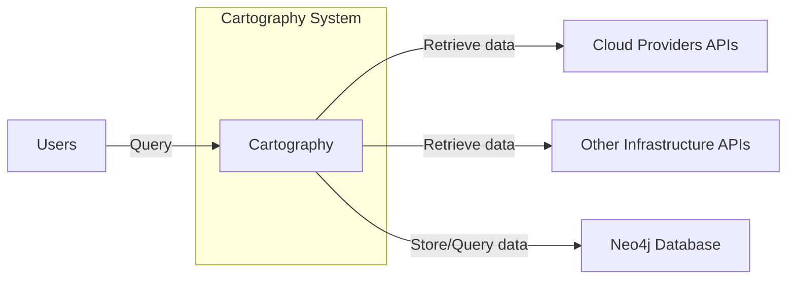
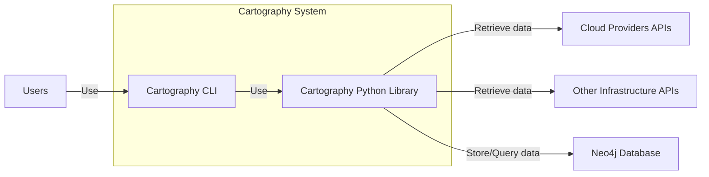
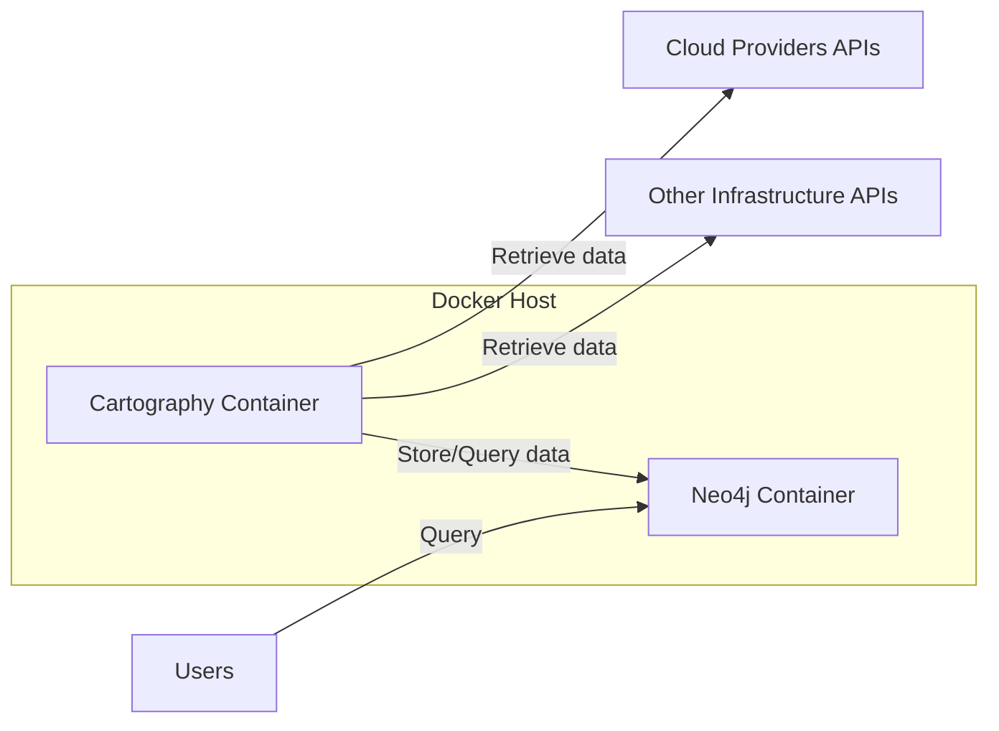

Okay, let's create a design document for the Cartography project.

# BUSINESS POSTURE

Cartography is a Python tool that consolidates infrastructure assets and the relationships between them in an intuitive graph view powered by Neo4j. It's used internally at Lyft. Given its purpose and the nature of the information it handles, the business posture can be characterized as follows:

Priorities and Goals:

*   Provide a clear and comprehensive view of infrastructure assets and their relationships.
*   Enable efficient querying and analysis of infrastructure data.
*   Support security and compliance efforts by providing visibility into the infrastructure landscape.
*   Facilitate infrastructure management and troubleshooting.
*   Automate the process of infrastructure discovery and mapping.

Business Risks:

*   Data Breach: Unauthorized access to the Neo4j database could expose sensitive information about the organization's infrastructure.
*   Data Integrity: Inaccurate or incomplete data in Cartography could lead to incorrect decisions and potential security vulnerabilities.
*   System Availability: Downtime of Cartography could disrupt infrastructure management and security operations.
*   Misconfiguration: Incorrect configuration of Cartography or Neo4j could expose the system to attacks.
*   Dependency Risks: Vulnerabilities in third-party libraries used by Cartography could be exploited.
*   Compliance Violations: Failure to properly secure Cartography and the data it handles could lead to violations of regulatory requirements.

# SECURITY POSTURE

Existing Security Controls (as inferred from the repository and common practices):

*   security control: Authentication to Neo4j: The project likely uses Neo4j's built-in authentication mechanisms (username/password, potentially with TLS). Described in Neo4j documentation.
*   security control: Authorization within Neo4j: Neo4j offers role-based access control (RBAC) to manage user permissions. Described in Neo4j documentation.
*   security control: Python Code Security: The project is written in Python, and secure coding practices should be followed to prevent common vulnerabilities (e.g., injection, cross-site scripting). Implemented in code.
*   security control: Dependency Management: The project uses `setup.py` and `requirements.txt` to manage dependencies, which should be regularly reviewed and updated. Described in `setup.py` and `requirements.txt`.
*   security control: Docker image: Project is distributed as docker image. Described in `Dockerfile`.

Accepted Risks:

*   accepted risk: Limited Input Validation: While Cartography itself primarily consumes data from other infrastructure APIs, any user-provided input (e.g., configuration files) may have limited validation, relying on the underlying APIs to handle invalid data.
*   accepted risk: Single Point of Failure: Depending on the deployment architecture, Cartography and its Neo4j database might represent a single point of failure.

Recommended Security Controls:

*   security control: Network Segmentation: Isolate the Cartography instance and Neo4j database on a separate network segment to limit exposure.
*   security control: Regular Security Audits: Conduct periodic security audits of the Cartography codebase and deployment environment.
*   security control: Intrusion Detection System (IDS): Implement an IDS to monitor network traffic and system activity for suspicious behavior.
*   security control: Secrets Management: Securely store and manage sensitive credentials (e.g., API keys, database passwords) using a dedicated secrets management solution (e.g., HashiCorp Vault, AWS Secrets Manager).
*   security control: Input validation for configuration files.

Security Requirements:

*   Authentication:
    *   Strong authentication mechanisms must be used for accessing the Neo4j database.
    *   Multi-factor authentication (MFA) should be considered for administrative access.
*   Authorization:
    *   RBAC should be implemented within Neo4j to restrict user access based on their roles and responsibilities.
    *   Principle of least privilege should be applied to all user accounts and service accounts.
*   Input Validation:
    *   All user-provided input (e.g., configuration files) must be validated to prevent injection attacks and other vulnerabilities.
    *   Data from external APIs should be treated with caution and validated where possible.
*   Cryptography:
    *   TLS should be used for all communication between Cartography and Neo4j, and any other external services.
    *   Sensitive data stored in Neo4j should be encrypted at rest.
*   Auditing:
    *   All security-relevant events should be logged and monitored.
    *   Audit logs should be protected from unauthorized access and modification.

# DESIGN

## C4 CONTEXT



Element Descriptions:

*   Element:
    *   Name: Cartography
    *   Type: Software System
    *   Description: A Python tool for consolidating infrastructure assets and relationships.
    *   Responsibilities:
        *   Collect data from various cloud providers and infrastructure APIs.
        *   Transform and load data into a Neo4j database.
        *   Provide an interface for querying and visualizing infrastructure data.
    *   Security controls:
        *   Input validation (limited).
        *   Secure coding practices.
        *   Dependency management.

*   Element:
    *   Name: Cloud Providers APIs
    *   Type: External System
    *   Description: APIs provided by cloud providers (e.g., AWS, GCP, Azure).
    *   Responsibilities:
        *   Provide access to infrastructure data.
    *   Security controls:
        *   Managed by the cloud providers.

*   Element:
    *   Name: Other Infrastructure APIs
    *   Type: External System
    *   Description: APIs provided by other infrastructure services (e.g., Kubernetes, LDAP).
    *   Responsibilities:
        *   Provide access to infrastructure data.
    *   Security controls:
        *   Managed by the respective service providers.

*   Element:
    *   Name: Users
    *   Type: User
    *   Description: Individuals or systems that interact with Cartography.
    *   Responsibilities:
        *   Query and analyze infrastructure data.
    *   Security controls:
        *   Authentication and authorization (through Neo4j).

*   Element:
    *   Name: Neo4j Database
    *   Type: External System
    *   Description: A graph database used to store infrastructure data.
    *   Responsibilities:
        *   Store and manage infrastructure data.
        *   Provide a query interface.
    *   Security controls:
        *   Authentication.
        *   Authorization (RBAC).
        *   Encryption at rest (optional).
        *   TLS for network communication.

## C4 CONTAINER



Element Descriptions:

*   Element:
    *   Name: Cartography CLI
    *   Type: Command Line Interface
    *   Description: Command-line interface for interacting with Cartography.
    *   Responsibilities:
        *   Provide user-friendly commands for running Cartography jobs.
        *   Handle user input and output.
    *   Security controls:
        *   Relies on the security controls of the Cartography Python Library.

*   Element:
    *   Name: Cartography Python Library
    *   Type: Python Library
    *   Description: Core logic for collecting, transforming, and loading data.
    *   Responsibilities:
        *   Connect to cloud providers and infrastructure APIs.
        *   Retrieve and process data.
        *   Interact with the Neo4j database.
    *   Security controls:
        *   Secure coding practices.
        *   Dependency management.
        *   Secure handling of credentials (ideally through a secrets management solution).

*   Element:
    *   Name: Cloud Providers APIs
    *   Type: External System
    *   Description: APIs provided by cloud providers (e.g., AWS, GCP, Azure).
    *   Responsibilities:
        *   Provide access to infrastructure data.
    *   Security controls:
        *   Managed by the cloud providers.

*   Element:
    *   Name: Other Infrastructure APIs
    *   Type: External System
    *   Description: APIs provided by other infrastructure services (e.g., Kubernetes, LDAP).
    *   Responsibilities:
        *   Provide access to infrastructure data.
    *   Security controls:
        *   Managed by the respective service providers.

*   Element:
    *   Name: Users
    *   Type: User
    *   Description: Individuals or systems that interact with Cartography.
    *   Responsibilities:
        *   Query and analyze infrastructure data.
    *   Security controls:
        *   Authentication and authorization (through Neo4j).

*   Element:
    *   Name: Neo4j Database
    *   Type: Database
    *   Description: A graph database used to store infrastructure data.
    *   Responsibilities:
        *   Store and manage infrastructure data.
        *   Provide a query interface.
    *   Security controls:
        *   Authentication.
        *   Authorization (RBAC).
        *   Encryption at rest (optional).
        *   TLS for network communication.

## DEPLOYMENT

Possible Deployment Solutions:

1.  Standalone Server: Cartography and Neo4j are deployed on a single server (physical or virtual).
2.  Separate Servers: Cartography and Neo4j are deployed on separate servers.
3.  Containerized Deployment (Docker): Cartography and Neo4j are deployed as Docker containers, potentially orchestrated with Kubernetes.
4.  Cloud-Based Deployment: Neo4j is deployed using a cloud-based service (e.g., Neo4j AuraDB), and Cartography is deployed on a cloud-based compute instance (e.g., AWS EC2, GCP Compute Engine).

Chosen Solution (Containerized Deployment with Docker Compose):

This solution provides a good balance of simplicity, portability, and scalability.



Element Descriptions:

*   Element:
    *   Name: Cartography Container
    *   Type: Docker Container
    *   Description: A container running the Cartography application.
    *   Responsibilities:
        *   Execute Cartography jobs.
        *   Connect to external APIs and the Neo4j database.
    *   Security controls:
        *   Container isolation.
        *   Minimal base image.
        *   Regular image updates.

*   Element:
    *   Name: Neo4j Container
    *   Type: Docker Container
    *   Description: A container running the Neo4j database.
    *   Responsibilities:
        *   Store and manage infrastructure data.
    *   Security controls:
        *   Container isolation.
        *   Minimal base image.
        *   Regular image updates.
        *   Data volume persistence (outside the container).
        *   Network configuration to restrict access.

*   Element:
    *   Name: Cloud Providers APIs
    *   Type: External System
    *   Description: APIs provided by cloud providers.
    *   Responsibilities: Provide infrastructure data.
    *   Security controls: Managed by cloud providers.

*   Element:
    *   Name: Other Infrastructure APIs
    *   Type: External System
    *   Description: APIs provided by other infrastructure services.
    *   Responsibilities: Provide infrastructure data.
    *   Security controls: Managed by service providers.

*   Element:
    *   Name: Users
    *   Type: User
    *   Description: Individuals or systems querying the data.
    *   Responsibilities: Query and analyze data.
    *   Security controls: Authentication and authorization (through Neo4j).

*   Element:
    *   Name: Docker Host
    *   Type: Infrastructure
    *   Description: Physical or virtual machine running Docker.
    *   Responsibilities: Host and run Docker containers.
    *   Security controls: Operating system security, network security, Docker daemon security.

## BUILD

The Cartography project appears to use a combination of manual and automated build processes.

Build Process:

1.  Developer: Writes code and tests locally.
2.  Version Control: Code is committed to a Git repository (GitHub).
3.  Dependency Management: `setup.py` and `requirements.txt` define project dependencies.
4.  Testing: Unit tests are run locally using `tox`.
5.  Docker Image Build: A Dockerfile is provided to build a container image. This can be done manually or automated.
6.  Artifact: The primary artifact is a Docker image.

```mermaid
graph LR
    A[Developer] --> B[GitHub Repository]
    B --> C[Dependency Management (setup.py, requirements.txt)]
    B --> D[Testing (tox)]
    B --> E[Dockerfile]
    E --> F[Docker Image Build]
    F --> G[Docker Image (Artifact)]
```

Security Controls in Build Process:

*   security control: Version Control (Git): Tracks code changes and enables collaboration.
*   security control: Dependency Management: `setup.py` and `requirements.txt` allow for tracking and updating dependencies.  Regularly auditing and updating these is crucial for supply chain security.
*   security control: Testing (tox):  Automated unit tests help ensure code quality and prevent regressions.
*   security control: Dockerfile: Using a well-defined Dockerfile helps ensure consistent and reproducible builds. Using minimal base images and avoiding unnecessary packages reduces the attack surface.

Recommended Improvements:

*   security control: Integrate SAST (Static Application Security Testing) tools into the build process to automatically scan for vulnerabilities in the code.
*   security control: Implement SCA (Software Composition Analysis) to identify and manage vulnerabilities in third-party libraries.
*   security control: Use a CI/CD pipeline (e.g., GitHub Actions, Jenkins) to automate the build, test, and deployment process.
*   security control: Sign Docker images to ensure their integrity and authenticity.

# RISK ASSESSMENT

Critical Business Processes:

*   Infrastructure Monitoring and Management: Cartography provides a consolidated view of infrastructure, which is critical for monitoring, troubleshooting, and managing the infrastructure effectively.
*   Security and Compliance: Cartography helps identify potential security vulnerabilities and compliance gaps by providing visibility into the infrastructure landscape.

Data Sensitivity:

*   Infrastructure Metadata: Cartography stores metadata about infrastructure assets, including their configurations, relationships, and potentially sensitive information like IP addresses, hostnames, and security group rules. This data is considered sensitive and requires protection.
*   Credentials (Potentially): Depending on the configuration and the data sources used, Cartography might handle credentials (e.g., API keys) for accessing external APIs. These credentials must be protected with utmost care.

# QUESTIONS & ASSUMPTIONS

Questions:

*   What specific cloud providers and infrastructure APIs are being used with Cartography?
*   What is the expected scale of the deployment (number of assets, users, query frequency)?
*   Are there any existing security policies or compliance requirements that need to be considered?
*   What is the process for managing secrets (e.g., API keys, database passwords)?
*   Is there a monitoring and alerting system in place for Cartography and Neo4j?
*   What level of access do different users require?
*   How often data should be updated?

Assumptions:

*   BUSINESS POSTURE: The organization has a moderate to high risk aversion, given the sensitivity of infrastructure data.
*   SECURITY POSTURE: Basic security controls are in place (authentication, authorization), but there is room for improvement.
*   DESIGN: The deployment will be relatively small to medium-sized initially, with the potential for scaling up in the future. Docker Compose deployment is sufficient.
*   DESIGN: Cartography is used internally and not exposed directly to the public internet.
*   DESIGN: Neo4j database is secured with build in authentication and authorization.