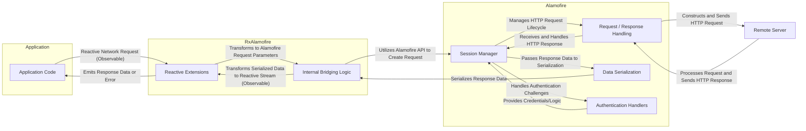

# Project Design Document: RxAlamofire

**Version:** 1.1
**Date:** October 26, 2023
**Prepared By:** Gemini (AI Language Model)

## 1. Introduction

This document provides an enhanced and detailed design overview of the RxAlamofire project. RxAlamofire serves as a crucial bridge, offering reactive extensions built upon the foundation of the Alamofire networking library, seamlessly integrating it with the RxSwift reactive programming framework. This document meticulously outlines the project's architecture, the roles and responsibilities of its components, and the flow of data within the system. Its primary purpose is to serve as a comprehensive resource for threat modeling and security analysis.

## 2. Project Overview

RxAlamofire empowers developers to perform network operations within RxSwift-based applications in a reactive and declarative manner. By providing reactive wrappers around Alamofire's robust networking functionalities, it allows developers to treat network responses, errors, and progress updates as observable streams. This approach significantly improves code clarity, enhances maintainability by decoupling asynchronous operations, and facilitates the composition of complex network workflows using RxSwift's powerful operators.

## 3. Goals and Objectives

*   To offer a first-class reactive interface that mirrors and extends Alamofire's core networking capabilities.
*   To provide a comprehensive suite of reactive extensions covering a wide range of Alamofire features, including request creation, response handling, data serialization, and authentication.
*   To maintain close alignment and compatibility with the evolution of the underlying Alamofire library, ensuring timely adoption of new features and bug fixes.
*   To guarantee type safety throughout the reactive pipeline, leveraging RxSwift's strong typing system to minimize runtime errors.
*   To present a clear, intuitive, and well-documented API that is easily accessible to developers familiar with both Alamofire's networking concepts and RxSwift's reactive paradigms.

## 4. Target Audience

This document is specifically intended for:

*   Security engineers tasked with conducting thorough threat modeling exercises and security vulnerability assessments of systems utilizing RxAlamofire.
*   Software developers actively contributing to the development and maintenance of the RxAlamofire library.
*   Software architects responsible for designing and overseeing the integration of RxAlamofire within larger application architectures.

## 5. System Architecture

RxAlamofire's architecture is centered around providing reactive wrappers for Alamofire's core components, primarily the `Session`. It achieves this by exposing methods that return RxSwift `Observable` sequences, effectively representing the asynchronous nature of network requests and their outcomes.

**Explanation of Components:**

*   **Application Code:** The portion of the application that initiates network requests and consumes the reactive streams provided by RxAlamofire.
*   **Reactive Extensions:** This layer comprises extension methods added to Alamofire's classes (like `Session`) to provide reactive interfaces. Key examples include:
    *   `rx.request(...)`: Returns an `Observable<Data>` representing the raw data of the response.
    *   `rx.json(...)`: Returns an `Observable<Any>` representing the JSON response.
    *   `rx.string(...)`: Returns an `Observable<String>` representing the response body as a string.
    *   `rx.response(...)`: Returns an `Observable<HTTPURLResponse>` providing the HTTP response metadata.
    *   These extensions handle the initial setup and trigger the internal bridging logic.
*   **Internal Bridging Logic:** This crucial component acts as the intermediary between the reactive world of RxSwift and the imperative nature of Alamofire. It performs the following key tasks:
    *   Receives parameters from the reactive extension methods.
    *   Utilizes Alamofire's API (specifically the `Session` object) to construct and execute the corresponding network request.
    *   Implements logic to capture the results (success or failure) from Alamofire's completion handlers.
    *   Transforms these results into signals that are emitted by the RxSwift `Observable` sequences (e.g., using `PublishSubject` or similar mechanisms).
*   **Session Manager (Alamofire):**  Responsible for managing the underlying `URLSession` and its configuration, including timeouts, caching policies, and security settings.
*   **Request / Response Handling (Alamofire):**  Handles the low-level details of constructing HTTP requests, sending them over the network, and receiving the raw HTTP responses.
*   **Data Serialization (Alamofire):** Provides mechanisms for converting raw response data into more usable formats, such as JSON, property lists, or custom objects. RxAlamofire leverages these serializers.
*   **Authentication Handlers (Alamofire):**  Allows for the implementation of custom authentication logic to handle challenges from the server (e.g., OAuth, basic authentication).
*   **Remote Server:** The external server that the application communicates with via network requests.

## 6. Data Flow

The journey of a typical network request initiated using RxAlamofire follows these steps:

1. The **Application Code** initiates a network request by invoking a reactive extension method on an `Session` instance (e.g., `session.rx.request(.get, "https://api.example.com/items")`). This returns a cold `Observable`.
2. The corresponding **Reactive Extension** method in RxAlamofire is invoked, capturing the request parameters (HTTP method, URL, headers, etc.).
3. The **Internal Bridging Logic** takes these parameters and uses Alamofire's `Session` API to create and initiate the underlying network request. This typically involves calling methods like `request(_:method:parameters:encoding:headers:)`.
4. **Alamofire's Session Manager** manages the lifecycle of the `URLSessionTask` associated with the request.
5. **Alamofire's Request/Response Handling** constructs the raw HTTP request and sends it to the **Remote Server**.
6. The **Remote Server** processes the request and sends back an HTTP response, including headers and a response body (potentially containing data).
7. **Alamofire's Request/Response Handling** receives the raw HTTP response.
8. **Alamofire's Data Serialization** component (if configured) processes the raw response data based on the specified `ResponseSerializer`.
9. The **Internal Bridging Logic** intercepts the result of the Alamofire request (either a successful response with serialized data or an error) through Alamofire's completion handler mechanism.
10. This logic then transforms the Alamofire result into a signal that is emitted by the RxSwift `Observable`. This typically involves using methods like `onNext` for successful data and `onError` for failures.
11. The **Application Code**, having subscribed to the `Observable`, receives either the emitted data or an error event, allowing it to react accordingly.

## 7. Key Components and Their Responsibilities

*   **`Reactive` Extension (`Reactive` extension on `Session` and related types):**
    *   Serves as the primary interface for interacting with RxAlamofire.
    *   Provides a set of extension methods that mirror common Alamofire functionalities but return RxSwift `Observable` sequences.
    *   Abstracts away the complexities of Alamofire's delegate-based and completion handler-based asynchronous operations.
    *   Ensures type safety for the emitted values in the `Observable` streams.

*   **Internal Bridging Mechanisms (Utilizing Subjects or Signals):**
    *   Responsible for adapting Alamofire's completion handlers (which are typically closures) into RxSwift signals.
    *   Often employs `PublishSubject` or similar RxSwift primitives to act as bridges, receiving values from Alamofire's callbacks and emitting them into the reactive stream.
    *   Handles error propagation from Alamofire to the `Observable` error stream.

*   **Integration with Alamofire Features (Adapters, Retriers, Validators):**
    *   RxAlamofire seamlessly integrates with Alamofire's request and response processing pipeline.
    *   Request adapters and retriers configured within the Alamofire `Session` will be applied to requests made through RxAlamofire.
    *   Response validators configured in Alamofire will also be respected, and validation failures will be propagated as errors in the RxSwift stream.

*   **Error Handling Strategy:**
    *   Propagates errors originating from Alamofire directly into the RxSwift `Observable` error stream.
    *   May introduce specific error types within RxAlamofire to represent errors unique to the reactive bridging process.
    *   Allows developers to leverage RxSwift's error handling operators (e.g., `catch`, `retry`) for robust error management.

## 8. Security Considerations (Pre-Threat Modeling)

While RxAlamofire acts as a wrapper, several security considerations are crucial:

*   **Reliance on Alamofire's Security:** RxAlamofire's security is fundamentally dependent on the security of the underlying Alamofire library. Any vulnerabilities in Alamofire (e.g., related to TLS implementation, certificate validation) will directly impact applications using RxAlamofire. **Example Threat:** A vulnerability in Alamofire's handling of server certificates could allow man-in-the-middle attacks even when using RxAlamofire over HTTPS.
*   **Secure Configuration of Alamofire `Session`:**  Applications must ensure that the underlying Alamofire `Session` is configured securely. This includes:
    *   **Enforcing HTTPS:**  Ensuring that requests are made over secure connections to protect data in transit. **Example Threat:** If the `Session` allows insecure HTTP connections, sensitive data could be intercepted.
    *   **Proper Certificate Pinning:** Implementing certificate pinning to prevent attacks involving compromised or rogue Certificate Authorities. **Example Threat:** Without certificate pinning, an attacker with a fraudulently obtained certificate could impersonate the server.
    *   **Setting Appropriate Timeouts:** Configuring reasonable timeouts to prevent denial-of-service attacks. **Example Threat:** Extremely long timeouts could tie up resources and make the application vulnerable to resource exhaustion.
*   **Data Serialization and Deserialization:** Improper handling of data serialization and deserialization can introduce vulnerabilities. **Example Threat:** If the application uses insecure deserialization techniques, an attacker could inject malicious code through the response data.
*   **Error Handling and Information Disclosure:**  Careless error handling can inadvertently expose sensitive information. **Example Threat:**  Including detailed error messages containing server-side details in the response or logs could aid attackers.
*   **Dependency Management:**  Maintaining up-to-date versions of both RxAlamofire and its dependencies (Alamofire and RxSwift) is crucial to patch known security vulnerabilities. **Example Threat:** Using an outdated version with known vulnerabilities exposes the application to those risks.
*   **Reactive Stream Security:** While less direct, the way the application processes and transforms the reactive streams can introduce vulnerabilities if not handled carefully. **Example Threat:**  Uncontrolled merging or flatMapping of streams from untrusted sources could lead to unexpected behavior or resource consumption.
*   **Authentication and Authorization:**  While RxAlamofire facilitates making authenticated requests, the security of the authentication mechanisms (e.g., token storage, secure transmission of credentials) is the responsibility of the application. **Example Threat:**  Storing authentication tokens insecurely could allow attackers to impersonate users.

## 9. Assumptions and Constraints

*   Developers utilizing RxAlamofire possess a solid understanding of both Alamofire's networking principles and RxSwift's reactive programming concepts.
*   RxAlamofire's capabilities are inherently bounded by the functionalities provided by the underlying Alamofire library.
*   The project's stability and security are contingent upon the reliability and security of its core dependencies, namely Alamofire and RxSwift.
*   This design document primarily focuses on the architectural aspects relevant to security considerations and threat modeling and does not delve into the intricate implementation details of every individual function or method.

## 10. Future Considerations

*   Exploring opportunities for more granular reactive control over the request lifecycle, potentially exposing events like request progress updates as separate observable streams.
*   Investigating the integration of more advanced reactive patterns for handling complex network scenarios, such as backpressure management and cancellation.
*   Maintaining continuous alignment with the latest features, updates, and security best practices in both Alamofire and RxSwift to ensure the library remains current and secure.
*   Potentially providing more specialized reactive extensions for specific Alamofire features like background downloads/uploads.