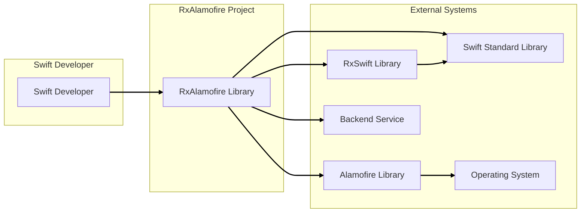
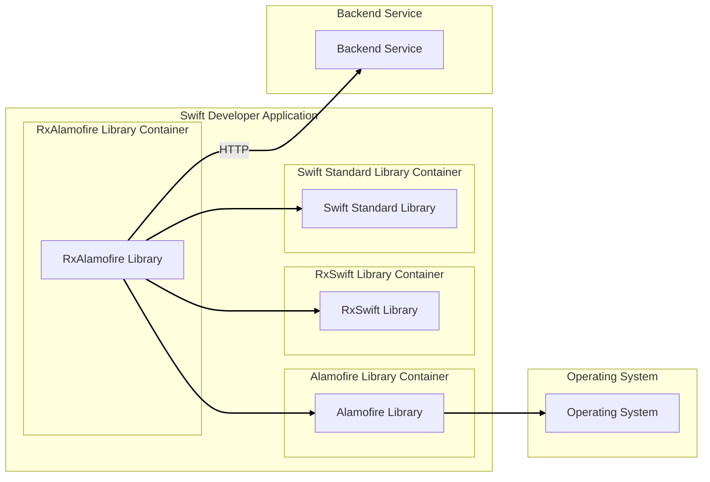
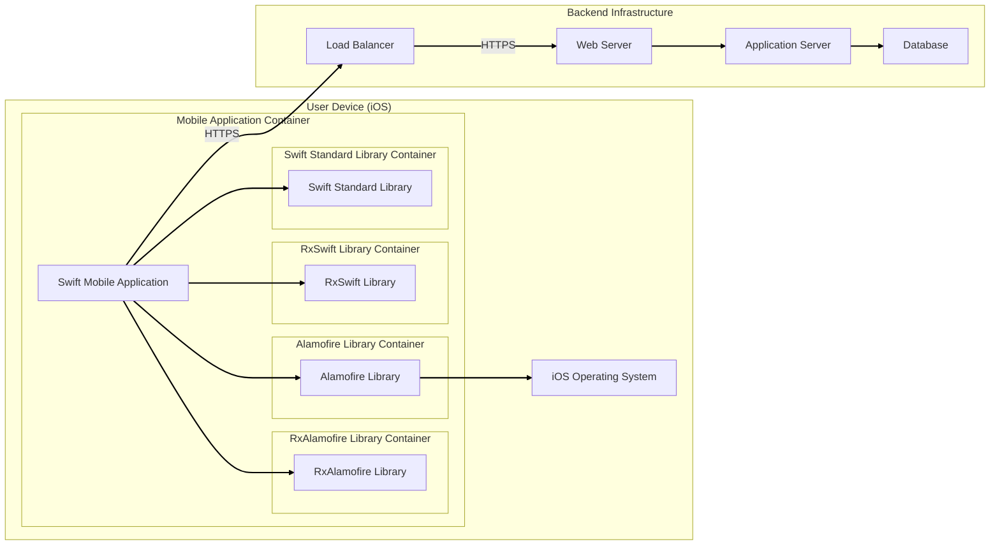
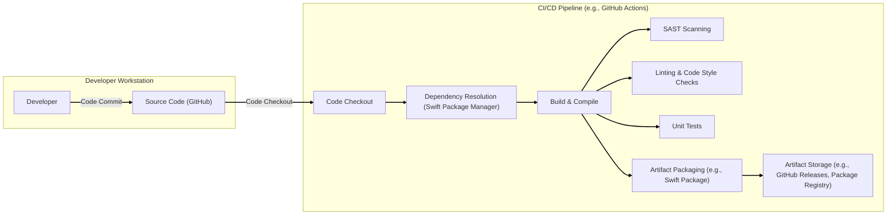

# BUSINESS POSTURE

- Business Priorities and Goals:
  - Provide a reactive programming interface for Alamofire, a popular HTTP networking library for Swift.
  - Simplify asynchronous network operations in Swift applications using RxSwift.
  - Enhance developer productivity by offering a more declarative and composable way to handle network requests and responses.
  - Maintain compatibility and feature parity with Alamofire.
  - Ensure the library is performant and reliable for use in production applications.
- Business Risks:
  - Security vulnerabilities in RxAlamofire could be inherited by applications that depend on it, leading to potential data breaches or service disruptions.
  - Poor performance or instability of the library could negatively impact the user experience of applications using it.
  - Lack of ongoing maintenance and updates could result in the library becoming outdated, insecure, or incompatible with newer versions of Swift, Alamofire, or RxSwift.
  - Incorrect or incomplete implementation of reactive wrappers could introduce unexpected behavior or errors in network handling.
  - Adoption risk if developers find the library too complex or not beneficial compared to using Alamofire directly or other alternatives.

# SECURITY POSTURE

- Existing Security Controls:
  - security control: Open Source Code - The library is publicly available on GitHub, allowing for community review and scrutiny, which can help identify potential security vulnerabilities. Implemented in: GitHub Repository.
  - security control: Dependency on Alamofire - RxAlamofire relies on Alamofire, inheriting its security features and practices. Described in: Alamofire documentation and project.
  - security control: Dependency on RxSwift - RxAlamofire relies on RxSwift, inheriting its security considerations. Described in: RxSwift documentation and project.
- Accepted Risks:
  - accepted risk: Vulnerabilities in Dependencies - RxAlamofire depends on external libraries (Alamofire, RxSwift, Swift standard library), and vulnerabilities in these dependencies could indirectly affect RxAlamofire and applications using it.
  - accepted risk: Misuse by Developers - Developers using RxAlamofire might misuse the library or integrate it insecurely into their applications, leading to security issues.
  - accepted risk: Lack of Formal Security Audits - As an open-source community project, RxAlamofire may not undergo regular, formal security audits by dedicated security firms.
- Recommended Security Controls:
  - security control: Dependency Scanning - Implement automated dependency scanning to identify known vulnerabilities in Alamofire, RxSwift, and other dependencies.
  - security control: Static Application Security Testing (SAST) - Integrate SAST tools into the development process to automatically analyze the RxAlamofire codebase for potential security flaws.
  - security control: Regular Security Review - Conduct periodic security reviews of the RxAlamofire codebase, focusing on areas that handle network requests and data processing.
  - security control: Secure Development Practices - Follow secure coding practices during development, including input validation, secure error handling, and avoiding common vulnerabilities.
  - security control: Documentation on Secure Usage - Provide clear documentation and examples on how to use RxAlamofire securely, including best practices for handling sensitive data and authentication.
- Security Requirements:
  - Authentication:
    - Requirement: RxAlamofire itself does not handle authentication, but it must facilitate the secure implementation of authentication mechanisms by client applications using it.
    - Requirement: Support for passing authentication tokens and credentials securely within HTTP requests (e.g., using headers, secure storage).
  - Authorization:
    - Requirement: RxAlamofire itself does not handle authorization, but it must not hinder the implementation of authorization logic in client applications.
    - Requirement: Ensure that responses from the server, including authorization decisions, are handled correctly and securely by client applications.
  - Input Validation:
    - Requirement: While primarily the responsibility of applications using RxAlamofire, the library itself should avoid introducing vulnerabilities through improper handling of inputs.
    - Requirement: Ensure that any input processing within RxAlamofire (e.g., handling request parameters, response data) is done securely and does not lead to injection vulnerabilities.
  - Cryptography:
    - Requirement: RxAlamofire relies on Alamofire and the underlying operating system for cryptographic operations (e.g., TLS/SSL).
    - Requirement: Ensure that RxAlamofire does not weaken or bypass any cryptographic protections provided by Alamofire or the underlying platform.
    - Requirement: Support for secure communication protocols (HTTPS) and proper certificate validation should be maintained.

# DESIGN

## C4 CONTEXT

- Context Diagram Elements:
  - Element:
    - Name: Swift Developer
    - Type: User
    - Description: Software developers who use the RxAlamofire library to build Swift applications.
    - Responsibilities: Integrate RxAlamofire into their Swift projects to handle network requests reactively. Configure and use RxAlamofire APIs to interact with backend services.
    - Security controls: Responsible for securely using RxAlamofire in their applications, including proper handling of authentication, authorization, and data validation.
  - Element:
    - Name: RxAlamofire Library
    - Type: Software System
    - Description: A Swift library that provides a reactive interface to Alamofire for handling HTTP networking using RxSwift.
    - Responsibilities: Wrap Alamofire's functionalities with RxSwift Observables to enable reactive network programming. Provide APIs for making HTTP requests, handling responses, and managing network tasks reactively.
    - Security controls: Inherits security controls from Alamofire and RxSwift. Should be developed following secure coding practices. Dependency scanning and security reviews are recommended.
  - Element:
    - Name: Alamofire Library
    - Type: Software System
    - Description: A popular HTTP networking library for Swift, providing a foundation for RxAlamofire.
    - Responsibilities: Handle low-level HTTP networking operations, including request construction, execution, response processing, and connection management.
    - Security controls: Implements security features for network communication, such as TLS/SSL support, certificate validation, and handling of secure headers.
  - Element:
    - Name: RxSwift Library
    - Type: Software System
    - Description: A library for reactive programming in Swift, used by RxAlamofire to provide reactive streams for network operations.
    - Responsibilities: Provide reactive programming primitives and operators for composing asynchronous operations.
    - Security controls: Security considerations are primarily related to the correct and secure usage of reactive programming patterns.
  - Element:
    - Name: Swift Standard Library
    - Type: Software System
    - Description: The standard library for the Swift programming language, providing fundamental functionalities.
    - Responsibilities: Provides core functionalities for Swift programming, including data structures, algorithms, and basic input/output operations.
    - Security controls: Security is generally handled by the Swift compiler and runtime environment.
  - Element:
    - Name: Operating System
    - Type: Infrastructure
    - Description: The operating system on which Swift applications using RxAlamofire are run (e.g., iOS, macOS, Linux).
    - Responsibilities: Provide the underlying networking stack and security features for applications.
    - Security controls: Provides system-level security controls, including network security policies, firewalls, and cryptographic libraries.
  - Element:
    - Name: Backend Service
    - Type: Software System
    - Description: External web services or APIs that Swift applications using RxAlamofire interact with over the network.
    - Responsibilities: Provide data and functionalities to Swift applications via HTTP APIs. Implement backend security measures, including authentication, authorization, and input validation.
    - Security controls: Implements backend security controls to protect data and services, such as API authentication, authorization, rate limiting, and input validation.

## C4 CONTAINER

- Container Diagram Elements:
  - Element:
    - Name: RxAlamofire Library
    - Type: Library
    - Description: Swift library providing reactive extensions for Alamofire. Encapsulates reactive wrappers around Alamofire's networking functionalities.
    - Responsibilities: Expose reactive APIs for making HTTP requests, handling responses as RxSwift Observables, and managing network tasks reactively.
    - Security controls: Inherits security controls from Alamofire and RxSwift. Follows secure coding practices. Dependency scanning and security reviews are recommended.
  - Element:
    - Name: Alamofire Library
    - Type: Library
    - Description: Core HTTP networking library for Swift. Handles the underlying HTTP communication.
    - Responsibilities: Manage HTTP connections, construct and send requests, process responses, handle authentication challenges, and manage network sessions.
    - Security controls: Implements TLS/SSL for secure communication, certificate validation, and secure header handling. Regularly updated to address security vulnerabilities.
  - Element:
    - Name: RxSwift Library
    - Type: Library
    - Description: Reactive programming library for Swift. Provides the reactive framework for RxAlamofire.
    - Responsibilities: Offer reactive streams (Observables), operators for stream manipulation, and schedulers for asynchronous operations.
    - Security controls: Security considerations are primarily related to the correct and secure usage of reactive programming patterns.
  - Element:
    - Name: Swift Standard Library
    - Type: Library
    - Description: Standard library for Swift, providing fundamental data types and utilities.
    - Responsibilities: Provides core functionalities for Swift programming.
    - Security controls: Security is generally handled by the Swift compiler and runtime environment.
  - Element:
    - Name: Operating System
    - Type: Operating System
    - Description: The OS on which the Swift application runs. Provides network stack and system-level security features.
    - Responsibilities: Manage network connections, provide system-level security features, and execute application code.
    - Security controls: System-level firewalls, network security policies, and OS-level security updates.
  - Element:
    - Name: Backend Service
    - Type: External System
    - Description: External web service that the Swift application communicates with via HTTP.
    - Responsibilities: Provide data and functionalities to the Swift application through APIs. Enforce backend security measures.
    - Security controls: API authentication, authorization, input validation, rate limiting, and secure data storage.

## DEPLOYMENT

- Deployment Architecture Options:
  - Option 1: Mobile Application Deployment (iOS, Android via Swift/Kotlin Multiplatform - if applicable, macOS) - RxAlamofire is integrated into a mobile application and deployed to app stores or directly to devices.
  - Option 2: Desktop Application Deployment (macOS, Windows, Linux via Swift) - RxAlamofire is part of a desktop application distributed through package managers or direct downloads.
  - Option 3: Server-Side Swift Application Deployment (Linux, macOS) - RxAlamofire is used in a server-side Swift application deployed to cloud platforms or on-premise servers.

- Detailed Deployment Architecture (Option 1: Mobile Application Deployment - iOS):

- Deployment Diagram Elements:
  - Element:
    - Name: Swift Mobile Application
    - Type: Application
    - Description: The iOS mobile application that integrates and uses the RxAlamofire library.
    - Responsibilities: Provide user interface, application logic, and utilize RxAlamofire for network communication with backend services.
    - Security controls: Application-level security controls, such as secure data storage, input validation, and secure handling of user credentials.
  - Element:
    - Name: RxAlamofire Library
    - Type: Library
    - Description: Deployed as part of the mobile application package. Provides reactive networking capabilities.
    - Responsibilities: Handle reactive network requests and responses within the mobile application.
    - Security controls: Inherits security controls from Alamofire and RxSwift. Secure coding practices during development.
  - Element:
    - Name: Alamofire Library
    - Type: Library
    - Description: Deployed as part of the mobile application package. Core networking library.
    - Responsibilities: Manage HTTP communication for the mobile application.
    - Security controls: TLS/SSL, certificate validation, secure header handling.
  - Element:
    - Name: RxSwift Library
    - Type: Library
    - Description: Deployed as part of the mobile application package. Reactive programming framework.
    - Responsibilities: Provide reactive programming functionalities within the mobile application.
    - Security controls: Secure usage of reactive programming patterns.
  - Element:
    - Name: Swift Standard Library
    - Type: Library
    - Description: Deployed as part of the mobile application package. Core Swift functionalities.
    - Responsibilities: Provide fundamental Swift functionalities.
    - Security controls: Security handled by Swift runtime and compiler.
  - Element:
    - Name: iOS Operating System
    - Type: Operating System
    - Description: iOS operating system on the user's mobile device.
    - Responsibilities: Provide the runtime environment for the mobile application and handle system-level security.
    - Security controls: OS-level security features, sandboxing, and permissions.
  - Element:
    - Name: Load Balancer
    - Type: Infrastructure
    - Description: Distributes incoming HTTPS traffic to multiple web servers in the backend infrastructure.
    - Responsibilities: Load balancing, traffic distribution, and potentially TLS termination.
    - Security controls: TLS/SSL termination, DDoS protection, and access control.
  - Element:
    - Name: Web Server
    - Type: Server
    - Description: Handles HTTPS requests from the load balancer and forwards them to application servers.
    - Responsibilities: Web request handling, static content serving, and reverse proxy functionalities.
    - Security controls: Web server security configurations, HTTPS enforcement, and access control.
  - Element:
    - Name: Application Server
    - Type: Server
    - Description: Runs the backend application logic and processes requests from the web server.
    - Responsibilities: Business logic execution, data processing, and interaction with the database.
    - Security controls: Application-level security controls, input validation, authorization, and secure coding practices.
  - Element:
    - Name: Database
    - Type: Data Store
    - Description: Stores persistent data for the backend application.
    - Responsibilities: Data storage, retrieval, and persistence.
    - Security controls: Database access control, encryption at rest and in transit, and regular backups.

## BUILD

- Build Process Description:
  - Developer commits code changes to the GitHub repository (Source Code).
  - CI/CD pipeline (e.g., GitHub Actions) is triggered upon code changes.
  - Code Checkout step retrieves the latest source code from the repository.
  - Dependency Resolution step uses Swift Package Manager (or similar) to download and resolve project dependencies (Alamofire, RxSwift, etc.).
  - Build & Compile step compiles the Swift code into a library artifact.
  - SAST Scanning step performs Static Application Security Testing to identify potential security vulnerabilities in the codebase.
  - Linting & Code Style Checks step enforces code quality and style guidelines.
  - Unit Tests step executes automated unit tests to ensure code functionality and stability.
  - Artifact Packaging step packages the compiled library and related files into a distributable artifact (e.g., Swift Package).
  - Artifact Storage step publishes the build artifact to a storage location (e.g., GitHub Releases, Swift Package Registry) for distribution and consumption by developers.

- Build Process Security Controls:
  - security control: Source Code Management (GitHub) - Securely store and manage source code with access controls and version history. Implemented in: GitHub.
  - security control: CI/CD Pipeline (GitHub Actions) - Automate the build, test, and release process, ensuring consistency and repeatability. Implemented in: GitHub Actions.
  - security control: Dependency Management (Swift Package Manager) - Manage and track project dependencies, ensuring known and trusted versions are used. Implemented in: Swift Package Manager.
  - security control: SAST Scanning - Automatically analyze code for potential security vulnerabilities during the build process. Implemented in: CI/CD Pipeline (SAST step).
  - security control: Linting & Code Style Checks - Enforce code quality and style guidelines to reduce potential errors and improve code maintainability. Implemented in: CI/CD Pipeline (Linting step).
  - security control: Unit Tests - Verify code functionality and stability through automated tests, reducing the risk of introducing bugs. Implemented in: CI/CD Pipeline (Unit Tests step).
  - security control: Artifact Signing (Optional) - Digitally sign build artifacts to ensure integrity and authenticity. Can be implemented in: CI/CD Pipeline (Artifact Packaging step).
  - security control: Access Control to Artifact Storage - Restrict access to artifact storage locations to authorized personnel and systems. Implemented in: GitHub Releases/Package Registry access controls.

# RISK ASSESSMENT

- Critical Business Processes:
  - Secure and reliable network communication for Swift applications using RxAlamofire.
  - Maintaining the integrity and availability of the RxAlamofire library for the Swift developer community.
  - Protecting applications that depend on RxAlamofire from inheriting vulnerabilities.
- Data Sensitivity:
  - RxAlamofire itself does not directly handle or store sensitive data.
  - Data sensitivity depends entirely on the applications that use RxAlamofire and the backend services they interact with.
  - RxAlamofire is a conduit for data transmission; the sensitivity of data transmitted through RxAlamofire is determined by the applications and backend services involved.
  - Potential data types handled by applications using RxAlamofire could include: User credentials, personal information, financial data, application-specific data, API keys, and other sensitive information depending on the application's purpose.

# QUESTIONS & ASSUMPTIONS

- Questions:
  - What are the primary use cases and application types for RxAlamofire? (e.g., mobile apps, desktop apps, server-side Swift).
  - What are the typical security requirements of applications that are expected to use RxAlamofire? (e.g., handling of PII, financial transactions, healthcare data).
  - Are there specific compliance requirements that applications using RxAlamofire might need to adhere to (e.g., GDPR, HIPAA, PCI DSS)?
  - What is the expected level of security expertise among developers who will use RxAlamofire?
  - Are there any specific threat models or attack vectors that are particularly relevant to applications using RxAlamofire?

- Assumptions:
  - RxAlamofire is intended to be used in applications where secure network communication is important.
  - Developers using RxAlamofire are expected to have a basic understanding of security best practices.
  - The security of applications using RxAlamofire is a shared responsibility between the RxAlamofire library developers and the application developers.
  - RxAlamofire will be maintained and updated to address security vulnerabilities and keep up with evolving security best practices.
  - The primary deployment environment for applications using RxAlamofire includes mobile platforms (iOS, macOS) and potentially server-side environments.