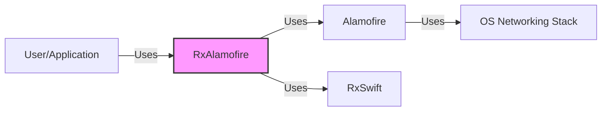
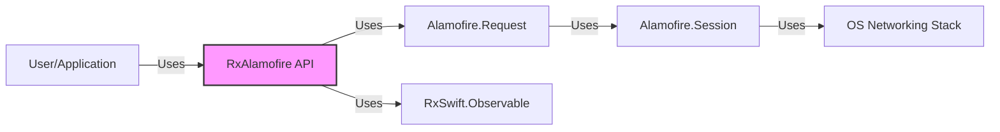
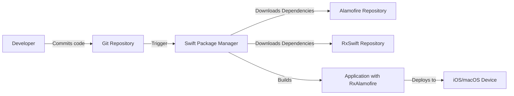
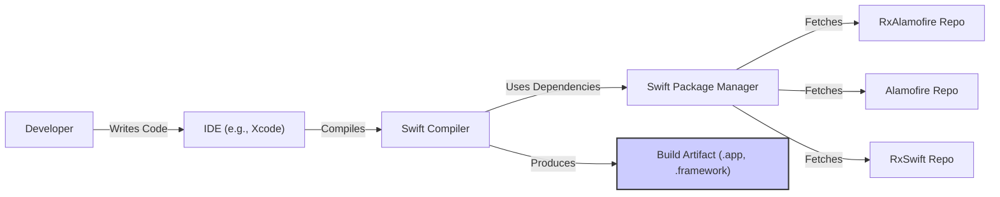

# BUSINESS POSTURE

Business Priorities and Goals:

The RxAlamofire project aims to provide a convenient and efficient way to interact with network requests using Alamofire, wrapped in RxSwift's reactive paradigm. This simplifies asynchronous network operations and integrates them seamlessly into RxSwift-based applications. The primary goals are to enhance developer productivity, improve code readability and maintainability, and provide a robust solution for networking in reactive applications.

Business Risks:

-   Dependency Risk: Reliance on two major third-party libraries (Alamofire and RxSwift) introduces a dependency risk. Vulnerabilities or breaking changes in either of these dependencies could impact the functionality and security of applications using RxAlamofire.
-   Maintenance Risk: As an open-source project, the long-term maintenance and updates depend on community contributions. A decline in active maintenance could lead to outdated features, unaddressed bugs, and security vulnerabilities.
-   Compatibility Risk: Compatibility issues with different versions of Swift, Alamofire, or RxSwift could arise, potentially breaking existing implementations or requiring significant refactoring.
-   Incorrect Implementation Risk: Developers might misuse the reactive wrappers, leading to memory leaks, unexpected behavior, or performance issues if not handled correctly.

# SECURITY POSTURE

Existing Security Controls:

-   security control: Relies on Alamofire for underlying network security. Alamofire itself includes features like TLS certificate and public key pinning, and secure handling of cookies and authentication challenges. (Described in Alamofire documentation)
-   security control: Uses Swift, a memory-safe language, reducing risks of buffer overflows and other memory-related vulnerabilities. (Described in Swift documentation)

Accepted Risks:

-   accepted risk: The project does not implement its own cryptographic protocols and relies entirely on Alamofire and the underlying OS for secure communication.
-   accepted risk: The project does not perform explicit input validation beyond what Alamofire provides. It assumes that users will sanitize data appropriately before making network requests.

Recommended Security Controls:

-   security control: Implement automated dependency scanning to identify and address vulnerabilities in Alamofire, RxSwift, and other dependencies.
-   security control: Provide clear documentation and examples on how to securely use RxAlamofire, including best practices for handling sensitive data and avoiding common reactive programming pitfalls.
-   security control: Establish a security policy and vulnerability reporting process for the project.

Security Requirements:

-   Authentication:
    -   RxAlamofire should leverage Alamofire's authentication mechanisms, including support for Basic, Digest, and OAuth authentication.
    -   Secure storage of credentials (e.g., API keys, tokens) should be handled by the application using RxAlamofire, not by the library itself.
-   Authorization:
    -   Authorization logic (e.g., role-based access control) should be implemented at the application level, using the responses received from network requests made via RxAlamofire.
-   Input Validation:
    -   While RxAlamofire itself doesn't perform extensive input validation, it should encourage users to validate and sanitize all data sent in network requests, leveraging Alamofire's capabilities where applicable.
-   Cryptography:
    -   RxAlamofire should rely on Alamofire and the underlying OS for all cryptographic operations, including TLS for secure communication. No custom cryptography should be implemented within RxAlamofire.

# DESIGN

## C4 CONTEXT

Context Diagram Element List:

-   User/Application
    -   Name: User/Application
    -   Type: User/External System
    -   Description: The application or user that utilizes RxAlamofire for networking.
    -   Responsibilities: Initiates network requests, handles responses, and manages application logic.
    -   Security controls: Implements application-level security controls, such as authentication, authorization, and input validation.
-   RxAlamofire
    -   Name: RxAlamofire
    -   Type: Project
    -   Description: RxSwift wrappers for Alamofire, providing a reactive interface for network requests.
    -   Responsibilities: Provides a reactive interface for making network requests, handling responses, and managing network-related events.
    -   Security controls: Relies on Alamofire for underlying network security.
-   Alamofire
    -   Name: Alamofire
    -   Type: External Library
    -   Description: An HTTP networking library written in Swift.
    -   Responsibilities: Handles the low-level details of making HTTP requests, managing connections, and processing responses.
    -   Security controls: Implements TLS, certificate pinning, and other network security features.
-   RxSwift
    -   Name: RxSwift
    -   Type: External Library
    -   Description: Reactive Extensions for Swift.
    -   Responsibilities: Provides the reactive programming framework used by RxAlamofire.
    -   Security controls: N/A (RxSwift is not directly involved in network security).
-   OS Networking Stack
    -   Name: OS Networking Stack
    -   Type: External System
    -   Description: The underlying operating system's networking stack.
    -   Responsibilities: Handles the actual transmission of data over the network.
    -   Security controls: Implements system-level security features, such as firewalls and network isolation.

## C4 CONTAINER

Container Diagram Element List:

-   User/Application
    -   Name: User/Application
    -   Type: User/External System
    -   Description: The application or user that utilizes RxAlamofire for networking.
    -   Responsibilities: Initiates network requests, handles responses, and manages application logic.
    -   Security controls: Implements application-level security controls, such as authentication, authorization, and input validation.
-   RxAlamofire API
    -   Name: RxAlamofire API
    -   Type: Container
    -   Description: The public API of RxAlamofire.
    -   Responsibilities: Provides a set of functions and classes for making network requests using RxSwift.
    -   Security controls: Relies on Alamofire for underlying network security.
-   Alamofire.Request
    -   Name: Alamofire.Request
    -   Type: Container
    -   Description: Represents an Alamofire request object.
    -   Responsibilities: Encapsulates the details of an HTTP request.
    -   Security controls: Inherits security features from Alamofire.Session.
-   RxSwift.Observable
    -   Name: RxSwift.Observable
    -   Type: Container
    -   Description: Represents a sequence of asynchronous events in RxSwift.
    -   Responsibilities: Provides the reactive framework for handling network responses.
    -   Security controls: N/A (RxSwift is not directly involved in network security).
-   Alamofire.Session
    -   Name: Alamofire.Session
    -   Type: Container
    -   Description: Manages a group of network requests in Alamofire.
    -   Responsibilities: Handles connection pooling, request prioritization, and other session-level tasks.
    -   Security controls: Implements TLS, certificate pinning, and other network security features.
-   OS Networking Stack
    -   Name: OS Networking Stack
    -   Type: External System
    -   Description: The underlying operating system's networking stack.
    -   Responsibilities: Handles the actual transmission of data over the network.
    -   Security controls: Implements system-level security features, such as firewalls and network isolation.

## DEPLOYMENT

Deployment Solutions:

-   CocoaPods: RxAlamofire can be integrated into an iOS or macOS project using CocoaPods, a dependency manager for Swift and Objective-C projects.
-   Carthage: RxAlamofire can be integrated using Carthage, a decentralized dependency manager for Cocoa.
-   Swift Package Manager: RxAlamofire supports Swift Package Manager, a tool for managing the distribution of Swift code, integrated with the Swift build system.

Chosen Solution (Swift Package Manager):

Deployment Diagram Element List:

-   Developer
    -   Name: Developer
    -   Type: Person
    -   Description: The developer writing code that uses RxAlamofire.
    -   Responsibilities: Writes code, commits changes to the Git repository.
    -   Security controls: Uses secure coding practices, code reviews.
-   Git Repository
    -   Name: Git Repository
    -   Type: System
    -   Description: The source code repository for the application.
    -   Responsibilities: Stores the application's source code, including the RxAlamofire dependency declaration.
    -   Security controls: Access control, branch protection rules.
-   Swift Package Manager
    -   Name: Swift Package Manager
    -   Type: System
    -   Description: The dependency manager used to integrate RxAlamofire.
    -   Responsibilities: Downloads RxAlamofire, Alamofire, and RxSwift from their respective repositories.
    -   Security controls: Verifies package integrity (if configured).
-   Alamofire Repository
    -   Name: Alamofire Repository
    -   Type: System
    -   Description: The source code repository for Alamofire.
    -   Responsibilities: Stores the Alamofire source code.
    -   Security controls: Access control, branch protection rules.
-   RxSwift Repository
    -   Name: RxSwift Repository
    -   Type: System
    -   Description: The source code repository for RxSwift.
    -   Responsibilities: Stores the RxSwift source code.
    -   Security controls: Access control, branch protection rules.
-   Application with RxAlamofire
    -   Name: Application with RxAlamofire
    -   Type: System
    -   Description: The built application, including RxAlamofire and its dependencies.
    -   Responsibilities: Performs the application's functionality, including network requests.
    -   Security controls: Application-level security controls, secure coding practices.
-   iOS/macOS Device
    -   Name: iOS/macOS Device
    -   Type: System
    -   Description: The device where the application is deployed.
    -   Responsibilities: Runs the application.
    -   Security controls: OS-level security features, device security policies.

## BUILD

Build Process Description:

1.  Developer writes code using an IDE (e.g., Xcode).
2.  The IDE uses the Swift Compiler to compile the code.
3.  Swift Package Manager (SPM) is used to manage dependencies, including RxAlamofire, Alamofire, and RxSwift.
4.  SPM fetches the source code for these dependencies from their respective repositories.
5.  The Swift Compiler compiles the application code along with the dependencies.
6.  The compiler produces a build artifact, which can be an application (.app) or a framework (.framework).

Security Controls in Build Process:

-   Dependency Management: SPM ensures that the correct versions of dependencies are used, reducing the risk of using vulnerable or outdated libraries.
-   Code Signing: Xcode and the Swift compiler support code signing, which helps ensure the integrity and authenticity of the build artifact.
-   Static Analysis: Xcode includes built-in static analysis tools that can identify potential security vulnerabilities in the code.
-   Compiler Warnings and Errors: The Swift compiler provides warnings and errors that can help identify potential security issues, such as memory management problems.

# RISK ASSESSMENT

Critical Business Processes:

-   Making network requests to backend services to retrieve and update data.
-   Handling user authentication and authorization.
-   Ensuring data integrity and confidentiality during network communication.

Data Sensitivity:

-   The sensitivity of the data handled by RxAlamofire depends on the specific application using it. RxAlamofire itself does not handle or store any data persistently. It acts as a conduit for data transfer. The data could range from non-sensitive public information to highly sensitive personal or financial data, depending on the application's purpose.

# QUESTIONS & ASSUMPTIONS

Questions:

-   Are there any specific compliance requirements (e.g., GDPR, HIPAA) that the applications using RxAlamofire must adhere to?
-   What are the expected usage patterns and load on the network requests made using RxAlamofire?
-   Are there any specific security concerns or past incidents related to networking in applications that have used this library or its dependencies?

Assumptions:

-   BUSINESS POSTURE: It is assumed that the primary business goal is to provide a robust and efficient networking solution for RxSwift-based applications, prioritizing developer productivity and code maintainability.
-   SECURITY POSTURE: It is assumed that the security posture relies heavily on the underlying security features of Alamofire and the OS networking stack.
-   DESIGN: It is assumed that the design is straightforward, acting as a wrapper around Alamofire to provide a reactive interface.