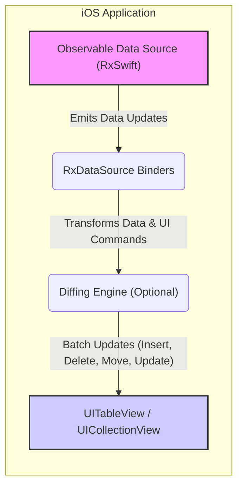

# Project Design Document: RxSwift Data Sources (rxdatasources) - Improved

**Project Name:** RxSwift Data Sources (rxdatasources)

**Project Repository:** [https://github.com/rxswiftcommunity/rxdatasources](https://github.com/rxswiftcommunity/rxdatasources)

**Document Version:** 1.1
**Date:** 2023-10-27
**Author:** AI Software Architect

## 1. Introduction

This document provides an enhanced design overview of the RxSwift Data Sources (`rxdatasources`) project, building upon the previous version. It aims to offer a more detailed and refined understanding of the project's architecture, components, data flow, and security considerations, specifically tailored for effective threat modeling. `rxdatasources` remains a Swift library designed to streamline data source management for `UITableView` and `UICollectionView` in iOS applications using RxSwift. It promotes a reactive and declarative programming style for UI development, simplifying the handling of dynamic data and UI synchronization.

## 2. Project Goals and Objectives

The core goals of `rxdatasources` are reiterated and expanded upon for clarity:

*   **Simplified Reactive Data Source Management:** To significantly reduce the boilerplate and complexity associated with implementing `UITableViewDataSource` and `UICollectionViewDataSource` protocols by providing reactive bindings driven by RxSwift.
*   **Declarative UI Updates via RxSwift:** To enable developers to define UI updates as transformations of RxSwift Observables, ensuring a clear and predictable flow of data from source to UI, enhancing data consistency and application responsiveness.
*   **Declarative Data Handling Paradigm:** To shift data source logic from imperative, stateful code to a declarative, functional style, improving code readability, maintainability, and testability.
*   **Optimized and Animated UI Updates:** To ensure efficient UI rendering through optional diffing algorithms, minimizing UI reloads and providing smooth, animated transitions for data changes.
*   **Extensible and Customizable Architecture:** To offer a flexible and modular design that allows developers to extend and customize data source behavior to precisely match the unique requirements of diverse iOS applications and UI patterns.

## 3. System Architecture

`rxdatasources` is architected around the principles of reactive programming, with RxSwift at its core. The system is designed to react to changes in data streams and propagate these changes efficiently to the UI.

### 3.1. High-Level Architecture Diagram

**Diagram Explanation (Improved):**

*   **"Observable Data Source (RxSwift)"**: Represents the reactive data source, an RxSwift `Observable` sequence. It's responsible for emitting data updates as arrays or sectioned data models. This is the entry point of data into `rxdatasources`.
    *   *Arrow Label: "Emits Data Updates"* - Clarifies the role of the Observable.
*   **"RxDataSource Binders"**: These are the central components of `rxdatasources`. They act as bridges, subscribing to the Observable data source and translating the emitted data into concrete actions and commands for UIKit data sources. They encapsulate the logic for interpreting data changes and driving UI updates.
    *   *Arrow Label: "Transforms Data & UI Commands"* - Highlights the binder's role in data transformation and command generation.
*   **"Diffing Engine (Optional)"**: An optional but highly recommended component. It employs diffing algorithms to compute the minimal set of changes between successive data states. This results in optimized UI updates, especially for large datasets, and enables smooth animations.
    *   *Arrow Label: "Batch Updates (Insert, Delete, Move, Update)"* - Specifies the output of the diffing engine, which are batch update operations.
*   **"UITableView / UICollectionView"**: The standard UIKit components responsible for displaying lists and grids of data. `rxdatasources` manages their underlying data sources, ensuring they are updated reactively and efficiently based on the data stream.

### 3.2. Component Breakdown (Detailed)

*   **Data Source Protocols (Contracts):**
    *   `SectionedViewDataSourceType`: Defines the fundamental contract for data sources managing sectioned data, a common pattern in `UITableView` and `UICollectionView` to organize data into logical groups.
    *   `AnimatableSectionModelType`: Extends `SectionedViewDataSourceType` to specifically support animated UI updates. It mandates conformance to protocols that enable diffing algorithms to function effectively, requiring identifiable and equatable data models.
    *   `IdentifiableType`: A crucial protocol for enabling diffing and efficient updates. It requires data models to provide a unique identifier, allowing the diffing engine to track items across data updates.

*   **RxDataSource Binders (Implementations):**
    *   `RxTableViewDataSource`: A concrete implementation of the `UITableViewDataSource` protocol. It is designed to be reactively driven by RxSwift Observables. It handles all aspects of table view data management, including cell provisioning, section header/footer management, and responding to data updates from the bound Observable.
    *   `RxCollectionViewDataSource`: Analogous to `RxTableViewDataSource`, but specifically for `UICollectionView`. It implements the `UICollectionViewDataSource` protocol and provides reactive bindings for collection views, managing cell provisioning, supplementary views, and data updates.

*   **Diffing Engine (Optimization):**
    *   Leverages algorithms like `Differentiator` (or potentially others) to efficiently calculate the difference between two versions of a data set. This difference is expressed as a set of batch updates (insertions, deletions, moves, updates).
    *   Generates optimized batch update operations specifically tailored for `UITableView` and `UICollectionView`. These batch updates are then applied to the UI components, resulting in animated and performant updates, avoiding full reloads.

*   **Section Models and Item Models (Data Structures):**
    *   `SectionModelType`: A generic, reusable structure for representing sections in sectioned data sources. It typically contains a header, footer, and an array of items within the section.
    *   Custom Item Models: Developers are expected to define their own data models to represent individual items within the lists or grids. These models should conform to `IdentifiableType` (and often `Equatable`) to work seamlessly with `rxdatasources`, especially when using animated updates.

*   **Configuration and Customization (Extensibility):**
    *   Provides closure-based and delegate-based mechanisms for extensive customization. Developers can configure cell appearance, header/footer views, and implement custom data source logic through these mechanisms.
    *   Offers flexibility in choosing diffing strategies or even implementing custom diffing logic if needed for highly specialized use cases.

## 4. Data Flow (Reactive Pipeline)

The data flow in an application using `rxdatasources` follows a reactive pipeline, driven by RxSwift:

1.  **Reactive Data Emission:** The process begins with an RxSwift `Observable` sequence emitting data. This data, representing the state of the UI, is typically sourced from various layers of the application (e.g., network, local database, user input). The data is transformed and formatted into the required model structure (arrays or section models).

2.  **Reactive Binding to RxDataSource:** The Observable sequence is then bound to an instance of `RxTableViewDataSource` or `RxCollectionViewDataSource` using RxSwift's binding operators (e.g., `bind(to:)`). This establishes a reactive subscription, connecting the data stream to the UI data source.

3.  **Data Transformation and Diffing (Conditional Optimization):** When the Observable emits new data, `rxdatasources` receives it through the binding. If animated updates are enabled (using `AnimatableSectionModelType`), the optional diffing engine is invoked. It compares the previous data state with the new state to calculate the minimal set of changes.

4.  **Optimized UI Updates (Batch Operations):** Based on the calculated data differences (or directly from the new data if diffing is not used), `rxdatasources` generates and applies batch update operations to the associated `UITableView` or `UICollectionView`. These operations include:
    *   `insertRows(at:)` / `insertItems(at:)`
    *   `deleteRows(at:)` / `deleteItems(at:)`
    *   `updateRows(at:)` / `reloadItems(at:)`
    *   `moveRow(at:to:)` / `moveItem(at:to:)`
    *   `reloadSections(_:)` / `reloadData()` (less frequent, used for significant changes)

5.  **Reactive Cell Configuration (On-Demand Rendering):** As `UITableView` or `UICollectionView` requests cells for display (during scrolling or initial load), `rxdatasources` utilizes developer-provided configuration closures or delegate methods. These closures are executed for each visible cell, responsible for populating the cell's UI elements with data from the corresponding item model. This ensures efficient, on-demand rendering of cells.

```mermaid
graph LR
    A["Data Source (e.g., API, DB)"] -- "Data Fetch & Transformation" --> B["Observable Sequence (RxSwift)"];
    B -- "Bind Data Stream" --> C["RxDataSource Binder"];
    C -- "Data Comparison (Optional)" --> D["Diffing Engine"];
    D -- "Batch UI Update Commands" --> E["UITableView / UICollectionView"];
    E -- "Request Cell for Display" --> F["Cell Configuration Closure"];
    F -- "Data Binding to Cell UI" --> G["Displayed UI"];
    style A fill:#f9f,stroke:#333,stroke-width:2px
    style G fill:#ccf,stroke:#333,stroke-width:2px
```

## 5. Security Considerations for Threat Modeling (Enhanced)

This section details security considerations relevant to `rxdatasources` for threat modeling, categorized for clarity:

### 5.1. Data Integrity Threats

*   **Threat:** **Compromised Data Source:** If the underlying Observable data source is compromised (e.g., a malicious API response, database injection), `rxdatasources` will faithfully display this corrupted or malicious data in the UI.
    *   **Attack Vector:** Man-in-the-middle attacks on API calls, SQL injection, compromised backend systems.
    *   **Mitigation:**
        *   **Secure Data Sources:** Implement robust security measures for backend systems and APIs. Use HTTPS for all network communication.
        *   **Input Validation & Sanitization:** Validate and sanitize all data received from external sources *before* it is emitted into the RxSwift Observable stream. Implement server-side and client-side validation.
        *   **Data Integrity Checks:** Implement checksums or digital signatures to verify the integrity of data received from external sources.

*   **Threat:** **Data Injection via Observables:** If an attacker gains unauthorized access and can inject data directly into the RxSwift Observable sequence that `rxdatasources` is bound to, they can arbitrarily manipulate the UI.
    *   **Attack Vector:**  Exploiting vulnerabilities in application logic that might allow unauthorized modification of the data stream.
    *   **Mitigation:**
        *   **Access Control:** Restrict access to the data pipeline and ensure only authorized components can modify the data stream.
        *   **Immutable Data Handling:** Favor immutable data structures and reactive patterns that make it harder to inadvertently modify data streams from unexpected sources.

### 5.2. Availability & Performance Threats (DoS)

*   **Threat:** **Performance Bottlenecks & UI Thread Blocking:** Inefficient diffing algorithms or handling extremely large datasets without proper optimization can lead to performance degradation, UI thread blocking, and potentially a denial-of-service (DoS) condition from a user experience perspective.
    *   **Attack Vector:**  Providing extremely large or complex datasets designed to overwhelm the diffing engine or UI rendering process.
    *   **Mitigation:**
        *   **Efficient Diffing:** Utilize efficient diffing algorithms provided by `rxdatasources` or consider custom optimizations if necessary for specific data structures.
        *   **Pagination & Data Virtualization:** Implement pagination or data virtualization techniques for very large datasets to load and render data in chunks, reducing the load on the UI thread.
        *   **Background Data Processing:** Perform data processing and diffing operations on background threads to prevent blocking the main UI thread.
        *   **Performance Monitoring & Optimization:** Continuously monitor application performance and profile data processing and UI rendering to identify and address bottlenecks.

### 5.3. Dependency Management Threats

*   **Threat:** **Vulnerable Dependencies:** `rxdatasources` depends on RxSwift and the iOS SDK. Security vulnerabilities in these dependencies could indirectly impact applications using `rxdatasources`.
    *   **Attack Vector:** Exploiting known vulnerabilities in RxSwift or the iOS SDK that are not patched in the application's dependencies.
    *   **Mitigation:**
        *   **Regular Dependency Updates:** Keep RxSwift and other dependencies updated to their latest stable and secure versions.
        *   **Security Monitoring:** Subscribe to security advisories for RxSwift and the iOS SDK to be informed of any newly discovered vulnerabilities and apply patches promptly.
        *   **Dependency Scanning:** Use dependency scanning tools to automatically identify known vulnerabilities in project dependencies.

### 5.4. Information Disclosure Threats

*   **Threat:** **Unintentional Data Exposure in UI:** Incorrect cell configuration or data binding logic could inadvertently display sensitive or confidential information in `UITableView` or `UICollectionView` cells, leading to information disclosure.
    *   **Attack Vector:**  Programming errors in cell configuration closures or delegate methods that unintentionally expose sensitive data.
    *   **Mitigation:**
        *   **Careful Cell Configuration Review:** Thoroughly review and test cell configuration logic to ensure only intended data is displayed and sensitive information is properly masked or handled.
        *   **Data Masking & Redaction:** Implement data masking or redaction techniques for sensitive data displayed in lists or grids, especially when dealing with potentially untrusted environments.
        *   **Principle of Least Privilege (Data Display):** Only display the minimum necessary data in the UI. Avoid displaying sensitive information unless absolutely required for the user's task.

## 6. Deployment and Integration

Integration methods remain consistent with the previous document:

*   **Swift Package Manager (SPM):**  The preferred method for modern Swift projects. Add the `rxdatasources` repository URL as a dependency in `Package.swift`.
*   **CocoaPods:** A widely adopted dependency manager for iOS. Add `pod 'RxDataSources'` to the `Podfile` and execute `pod install`.
*   **Carthage:** An alternative dependency manager. Add `github "RxSwiftCommunity/RxDataSources"` to the `Cartfile` and run `carthage update`.

After integration, import `RxDataSources` in Swift source files to utilize the library's reactive data source capabilities within ViewControllers or ViewModels.

## 7. Technology Stack

*   **Primary Language:** Swift
*   **Reactive Framework:** RxSwift
*   **UI Framework:** UIKit (`UITableView`, `UICollectionView`)
*   **Dependency Management:** Swift Package Manager (Recommended), CocoaPods, Carthage (Optional)
*   **Development Environment:** Xcode

## 8. Future Enhancements (Evolving Capabilities)

*   **Advanced Diffing Strategies:** Investigate and potentially incorporate more sophisticated diffing algorithms to further optimize performance and animation quality, especially for complex data structures and transformations.
*   **Expanded UI Component Support:** Explore extending `rxdatasources` to support a wider range of UIKit components that display collections of data, such as `UIPickerView`, `UIStackView`-based lists, and potentially custom collection view layouts.
*   **Robust Error Handling & Recovery:** Enhance error handling mechanisms within the data stream and UI update pipeline to provide more graceful error recovery and informative error reporting to developers.
*   **Accessibility Focus:** Prioritize accessibility improvements to ensure `rxdatasources` facilitates the creation of inclusive and accessible UIs, fully compatible with screen readers and other assistive technologies, adhering to WCAG guidelines.

This improved design document provides a more detailed and security-focused overview of the `rxdatasources` project. It is intended to be a valuable and actionable resource for understanding the project's architecture, data flow, and critical security considerations, particularly when conducting comprehensive threat modeling and security assessments.