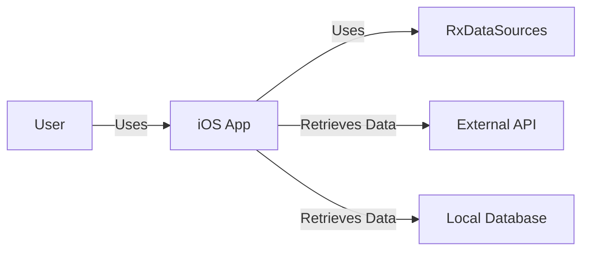
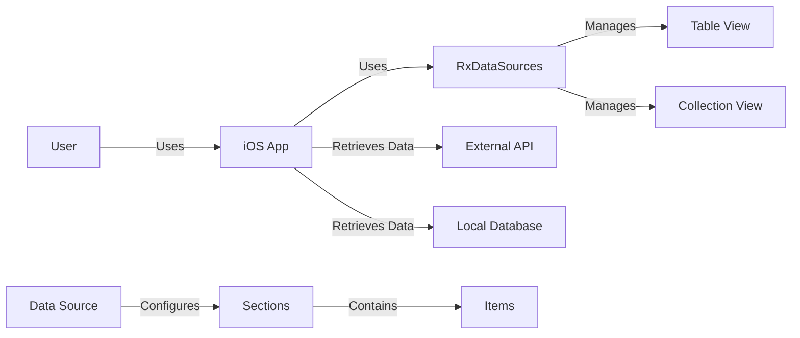
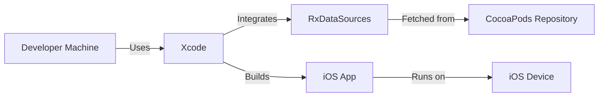
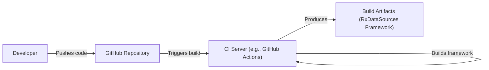

# BUSINESS POSTURE

Business Priorities and Goals:

The RxDataSources project aims to provide a robust and efficient way to bind data to table views and collection views in iOS applications using RxSwift. The primary goal is to simplify and streamline the process of displaying and managing dynamic data in UI components, reducing boilerplate code and improving maintainability. It caters to developers already invested in the RxSwift ecosystem.

Business Risks:

- Data Integrity: Incorrect data display or manipulation due to library bugs could lead to a poor user experience or incorrect application behavior.
- Performance Bottlenecks: Inefficient data handling within the library could lead to UI slowdowns or unresponsiveness, especially with large datasets.
- Security Vulnerabilities: While primarily a UI library, vulnerabilities in data handling could potentially be exploited, especially if the data originates from external sources.
- Dependency Conflicts: Conflicts with other libraries or versions of RxSwift could lead to integration issues and development roadblocks.
- Lack of Maintenance: As an open-source project, the risk of abandonment or lack of updates is present, potentially leading to compatibility issues with future iOS or RxSwift versions.
- Adoption Risk: Developers may be hesitant to adopt a third-party library, preferring to implement their own solutions or use alternative approaches.

# SECURITY POSTURE

Existing Security Controls:

- security control: Code Reviews: The GitHub repository indicates the presence of a pull request system, suggesting that code reviews are part of the development process. (Visible in the GitHub repository's pull request section).
- security control: Community Scrutiny: Being an open-source project, RxDataSources benefits from community scrutiny, where users can identify and report potential issues, including security vulnerabilities. (Visible in the GitHub repository's issues and discussions sections).

Accepted Risks:

- accepted risk: Third-Party Dependency: The project relies on RxSwift, introducing a dependency on an external library and its associated security posture.
- accepted risk: Limited Scope: The library primarily focuses on UI data binding, and security considerations beyond this scope are likely not addressed directly within the project.
- accepted risk: Open Source Maintenance: The project's security relies on the ongoing maintenance and responsiveness of the open-source maintainers and community.

Recommended Security Controls:

- security control: Static Analysis: Integrate static analysis tools into the build process to automatically detect potential security vulnerabilities in the code.
- security control: Dependency Scanning: Regularly scan dependencies for known vulnerabilities and update them promptly.
- security control: Fuzz Testing: Consider implementing fuzz testing to identify potential edge cases and vulnerabilities related to data handling.

Security Requirements:

- Authentication: Not directly applicable, as RxDataSources is a UI data-binding library and does not handle authentication.
- Authorization: Not directly applicable, as RxDataSources does not manage user roles or permissions.
- Input Validation: While RxDataSources itself doesn't directly handle user input, it's crucial that any data provided to the library from external sources (e.g., APIs, user input fields) is properly validated *before* being used with RxDataSources. This responsibility lies with the application using the library.
- Cryptography: Not directly applicable, as RxDataSources is a UI data-binding library and does not handle encryption or decryption. If the application using RxDataSources displays sensitive data, that data should be encrypted/decrypted *before* being passed to RxDataSources.

# DESIGN

## C4 CONTEXT

Element Descriptions:

- User:
  - Name: User
  - Type: Person
  - Description: The end-user interacting with the iOS application.
  - Responsibilities: Interacts with the UI, triggers data updates.
  - Security Controls: N/A (External to the system)

- RxDataSources:
  - Name: RxDataSources
  - Type: Library
  - Description: The RxDataSources library itself.
  - Responsibilities: Provides mechanisms for binding data to table views and collection views.
  - Security Controls: Code Reviews, Community Scrutiny

- iOS App:
  - Name: iOS App
  - Type: Software System
  - Description: The iOS application utilizing RxDataSources.
  - Responsibilities: Handles user interaction, fetches data, displays data using RxDataSources.
  - Security Controls: Input Validation (of data passed to RxDataSources), Secure data handling practices.

- External API:
  - Name: External API
  - Type: External System
  - Description: An external API providing data to the iOS application.
  - Responsibilities: Provides data to the iOS application.
  - Security Controls: API Authentication, Authorization, Input Validation, Transport Layer Security (TLS).

- Local Database:
  - Name: Local Database
  - Type: External System
  - Description: A local database (e.g., Core Data, Realm) storing data used by the iOS application.
  - Responsibilities: Stores and provides data to the iOS application.
  - Security Controls: Data encryption at rest, Access controls.

## C4 CONTAINER

Element Descriptions:

- User, iOS App, External API, Local Database: (Same as in C4 Context)

- RxDataSources:
  - Name: RxDataSources
  - Type: Library
  - Description: The RxDataSources library itself.
  - Responsibilities: Provides mechanisms for binding data to table views and collection views.
  - Security Controls: Code Reviews, Community Scrutiny

- Table View:
  - Name: Table View
  - Type: UI Component
  - Description: A standard iOS `UITableView`.
  - Responsibilities: Displays data in a list format.
  - Security Controls: N/A (Standard iOS component)

- Collection View:
  - Name: Collection View
  - Type: UI Component
  - Description: A standard iOS `UICollectionView`.
  - Responsibilities: Displays data in a grid or custom layout.
  - Security Controls: N/A (Standard iOS component)

- Data Source:
  - Name: Data Source
  - Type: RxDataSources Component
  - Description: An RxDataSources data source object (e.g., `RxTableViewSectionedReloadDataSource`).
  - Responsibilities: Configures the sections and items for the table/collection view.
  - Security Controls: Relies on the security of the data provided to it.

- Sections:
  - Name: Sections
  - Type: Data Structure
  - Description: Represents a section within the table/collection view.
  - Responsibilities: Organizes items into logical groups.
  - Security Controls: Relies on the security of the data provided to it.

- Items:
  - Name: Items
  - Type: Data Structure
  - Description: Represents an individual item within a section.
  - Responsibilities: Holds the data to be displayed in a cell.
  - Security Controls: Relies on the security of the data provided to it.

## DEPLOYMENT

Possible Deployment Solutions:

1.  CocoaPods: A dependency manager for Swift and Objective-C Cocoa projects.
2.  Carthage: A decentralized dependency manager for Cocoa.
3.  Swift Package Manager:  Integrated into the Swift build system.
4.  Manual Integration:  Copying the source code directly into the project.

Chosen Solution: CocoaPods

Element Descriptions:

- Developer Machine:
  - Name: Developer Machine
  - Type: Workstation
  - Description: The developer's computer.
  - Responsibilities: Hosts the development environment.
  - Security Controls: Standard workstation security measures.

- CocoaPods Repository:
  - Name: CocoaPods Repository
  - Type: Package Repository
  - Description: The central repository for CocoaPods packages.
  - Responsibilities: Hosts the RxDataSources package.
  - Security Controls: Repository security measures (e.g., access controls, integrity checks).

- iOS Device:
  - Name: iOS Device
  - Type: Mobile Device
  - Description: The device running the iOS application.
  - Responsibilities: Runs the application.
  - Security Controls: iOS security features.

- Xcode:
    - Name: Xcode
    - Type: IDE
    - Description: Apple integrated development environment
    - Responsibilities: Build and deploy iOS application
    - Security Controls: N/A

## BUILD

Build Process Description:

1.  Developer pushes code changes to the GitHub repository.
2.  A CI server (e.g., GitHub Actions, Travis CI, CircleCI) is triggered by the push.
3.  The CI server checks out the code.
4.  The CI server runs unit and UI tests.
5.  The CI server builds the RxDataSources framework.
6.  (Optional) The CI server runs static analysis tools (e.g., SwiftLint, SonarQube).
7.  (Optional) The CI server runs dependency vulnerability scanners.
8.  The CI server produces build artifacts (the RxDataSources framework).
9.  (Optional) The CI server deploys the artifacts to a package manager (e.g., CocoaPods, Carthage, Swift Package Manager).

Security Controls:

- security control: CI/CD Pipeline: Automated build and testing process ensures consistency and reduces manual errors.
- security control: Test Automation: Unit and UI tests help identify bugs and regressions early.
- security control: Static Analysis (Recommended): Integration of static analysis tools can detect potential security vulnerabilities.
- security control: Dependency Scanning (Recommended): Regular scanning of dependencies for known vulnerabilities.

# RISK ASSESSMENT

Critical Business Processes:

- Displaying dynamic data in table views and collection views within iOS applications.
- Providing a smooth and responsive user experience when interacting with lists and grids of data.

Data Sensitivity:

- RxDataSources itself does not handle sensitive data directly. However, the *applications using RxDataSources* may display sensitive data. The sensitivity of the data depends entirely on the application's purpose and the data it handles.  Examples include:
    - Personally Identifiable Information (PII): Names, addresses, contact details.
    - Financial Data: Account numbers, transaction history.
    - Health Data: Medical records, fitness tracking information.
    - User-Generated Content: Messages, photos, videos.

The sensitivity levels could range from:

- Public: Data intended for public consumption.
- Internal: Data intended for internal use within the organization.
- Confidential: Data that requires protection due to privacy, legal, or regulatory requirements.
- Restricted: Highly sensitive data requiring the highest level of protection.

# QUESTIONS & ASSUMPTIONS

Questions:

- Are there any specific performance requirements or expected data sizes for applications using RxDataSources?
- Are there any plans to support specific data sources or formats beyond the current capabilities?
- What is the long-term maintenance plan for the project?
- Is there a dedicated security contact or process for reporting vulnerabilities?

Assumptions:

- BUSINESS POSTURE: The project prioritizes ease of use and developer convenience within the RxSwift ecosystem.
- SECURITY POSTURE: The project relies on the security practices of the underlying RxSwift library and the iOS platform. The developers using RxDataSource are responsible for validating and sanitizing any data before passing it to the library.
- DESIGN: The provided design reflects the core functionality of RxDataSources and its typical usage within an iOS application. The deployment and build processes are based on common practices for iOS libraries.