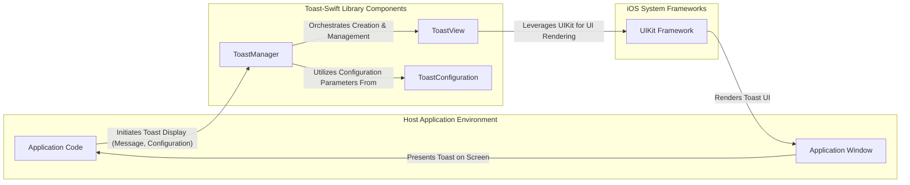
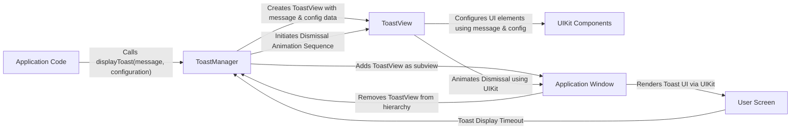

## Project Design Document: Toast-Swift (Improved)

**1. Introduction**

This document provides an enhanced design overview of the Toast-Swift library, a Swift-based solution for displaying transient, non-disruptive messages (toasts) within iOS applications. This iteration aims to provide a more detailed and refined understanding of the library's architecture, component interactions, and data flow, specifically tailored for subsequent threat modeling activities.

**2. Goals**

The primary goals of the Toast-Swift library are:

*   To offer a straightforward and intuitive Application Programming Interface (API) for displaying toast notifications.
*   To provide extensive customization options for the visual appearance and behavioral characteristics of toasts.
*   To ensure seamless and effortless integration into existing iOS application projects.
*   To maintain a minimal and efficient codebase, avoiding unnecessary external dependencies.
*   To operate with high performance, ensuring the main application thread remains unblocked and responsive.

**3. Target Audience**

This document is intended for the following individuals and teams:

*   Security engineers responsible for conducting threat modeling exercises.
*   Software developers actively contributing to the development or utilization of the Toast-Swift library.
*   System architects involved in reviewing the design and integration aspects of the library within larger systems.

**4. System Architecture**

The Toast-Swift library adopts a modular architecture, primarily leveraging the capabilities of the UIKit framework for rendering user interface elements. The library interacts with the host application through a well-defined API.

**5. Data Flow**

The typical sequence of data flow involved in displaying a toast notification is as follows:

*   The application code initiates the process of displaying a toast by invoking a specific method provided by the `ToastManager`. This invocation includes the textual message intended for display and, optionally, a `ToastConfiguration` object to customize the toast's appearance and behavior.
*   The `ToastManager` component receives the message content and the configuration details.
*   The `ToastManager` then instantiates a `ToastView` object, passing the received message and configuration as parameters during the object's creation.
*   The newly created `ToastView` utilizes the provided message string and configuration settings to initialize and set up its internal user interface elements. This typically involves configuring a label to display the message text and a background view to provide visual context.
*   The `ToastManager` proceeds to add the instantiated `ToastView` as a subview to an appropriate view within the application's view hierarchy. This is commonly the application's key window to ensure the toast is displayed prominently.
*   The `ToastView` is then animated onto the screen using the animation capabilities provided by the UIKit framework, creating a smooth visual transition for the user.
*   After a predetermined duration, which is configurable through the `ToastConfiguration`, the `ToastManager` initiates the dismissal animation sequence for the `ToastView`.
*   The `ToastView` is animated off the screen, again using UIKit's animation features, providing a visually consistent experience.
*   Finally, the `ToastView` is removed from the application's view hierarchy, completing the lifecycle of the toast notification.

**6. Components**

*   **`ToastManager`:**
    *   Serves as the primary interface for interacting with the Toast-Swift library, acting as the central point for displaying toast notifications.
    *   Responsible for the creation, management, and lifecycle control of individual `ToastView` instances.
    *   Implements a queuing mechanism to handle scenarios where multiple toast notifications are requested concurrently, ensuring they are displayed in an orderly fashion.
    *   Provides a set of methods offering varying degrees of customization for displaying toasts, catering to different application needs.
    *   Orchestrates the presentation and subsequent dismissal of toast views, managing their appearance and disappearance on the screen.
*   **`ToastView`:**
    *   A subclass of `UIView`, specifically designed to render the visual representation of a toast notification on the screen.
    *   Contains and manages the necessary UI elements, such as a `UILabel` to display the message text and a background `UIView` to provide visual context and styling.
    *   Applies visual styling and properties based on the specifications provided by the associated `ToastConfiguration` object.
    *   Handles the animation sequences for both the presentation (appearing on screen) and dismissal (disappearing from screen) of the toast.
*   **`ToastConfiguration`:**
    *   A struct or class that encapsulates all the customizable properties and behavioral settings for a toast notification.
    *   Includes options and properties such as:
        *   `message`: The textual content to be displayed within the toast.
        *   `duration`: The length of time the toast remains visible on the screen.
        *   `position`: The location on the screen where the toast should be displayed (e.g., top, bottom, center).
        *   `backgroundColor`: The background color of the toast view.
        *   `textColor`: The color of the text displayed within the toast.
        *   `font`: The typeface and size used for rendering the message text.
        *   `cornerRadius`: The radius applied to the corners of the toast view, controlling its rounded appearance.
        *   `padding`: The spacing between the message text and the edges of the toast view.
        *   `animationType`: The style of animation used for presenting and dismissing the toast.

**7. Dependencies**

The Toast-Swift library has the following primary dependencies on standard iOS frameworks:

*   `UIKit`: Essential for all user interface related operations, including view rendering, layout management, and animations.
*   `CoreGraphics`: Potentially utilized for custom drawing operations or advanced styling effects within the toast view.
*   `Foundation`: Provides fundamental data types, collections, and utility classes used throughout the library.

**8. Deployment Considerations**

The Toast-Swift library is typically integrated into iOS projects using the Swift Package Manager (SPM) as a dependency. Alternatively, it can be integrated manually by including the source files directly into the project. Integration involves adding the package dependency within Xcode and then utilizing the `ToastManager` API within the application's Swift code to display toast notifications.

**9. Security Considerations (For Threat Modeling)**

This section outlines potential security considerations that warrant further investigation during the threat modeling process.

*   **Input Validation and Sanitization (Message Content):**
    *   **Threat:** If the message displayed in the toast is derived from untrusted sources (e.g., user input, external APIs) without proper validation and sanitization, it could be susceptible to injection attacks. While the impact might be limited to visual manipulation or unexpected characters, it's crucial to ensure the library doesn't inadvertently render potentially harmful content.
    *   **Mitigation:**  The consuming application is primarily responsible for sanitizing input before passing it to the `ToastManager`. The library itself should avoid interpreting or executing any code within the message string.
*   **Denial of Service (DoS) via Excessive Toast Display:**
    *   **Threat:** A malicious actor or a bug within the application could potentially trigger the rapid and repeated display of toast notifications, potentially overwhelming the UI, impacting performance, and hindering the user experience.
    *   **Mitigation:** The `ToastManager`'s queuing mechanism should be robust and prevent an unbounded number of toasts from being displayed simultaneously. Rate limiting or mechanisms to prevent excessive queuing might be necessary at the application level.
*   **UI Redressing or Spoofing (Limited Scope):**
    *   **Threat:** While the transient nature of toasts limits the risk, a carefully crafted toast message, combined with other UI elements, could potentially be used to mislead users into taking unintended actions.
    *   **Mitigation:** Developers should exercise caution when displaying sensitive information or calls to action within toast notifications. The library itself offers limited control over the broader application UI context.
*   **Information Disclosure through Toast Content:**
    *   **Threat:** Developers might inadvertently display sensitive or confidential information within toast messages, leading to unintended information disclosure to users who might not be authorized to see it.
    *   **Mitigation:** This is primarily a responsibility of the developers using the library. Care should be taken to avoid displaying sensitive data in toasts.
*   **Configuration Tampering (Less Likely):**
    *   **Threat:** If the `ToastConfiguration` object could be manipulated in an unintended way (e.g., through insecure data binding or access), it could potentially lead to unexpected behavior or visual anomalies.
    *   **Mitigation:** The `ToastConfiguration` should be designed as an immutable or carefully controlled object to prevent unauthorized modifications.
*   **Dependency Chain Vulnerabilities:**
    *   **Threat:** Although the direct dependencies are standard Apple frameworks, any potential vulnerabilities within those frameworks could indirectly affect the Toast-Swift library.
    *   **Mitigation:** Regularly update Xcode and the target iOS SDK to benefit from security patches in the underlying frameworks.

**10. Future Considerations**

*   Enhance accessibility features to ensure toast notifications are usable by individuals with disabilities.
*   Explore the possibility of adding support for interactive toast notifications, allowing users to perform actions directly from the toast (e.g., with buttons).
*   Consider offering more advanced and granular customization options for the appearance and behavior of toasts.
*   Investigate potential performance optimizations for scenarios involving a high volume of toast notifications.