# Project Design Document: Toast-Swift

**Project Name:** Toast-Swift

**Project Repository:** https://github.com/scalessec/toast-swift

**Document Version:** 1.1

**Date:** October 26, 2023

**Author:** AI Software Architect

## 1. Introduction

This document provides an enhanced and detailed design overview of the `toast-swift` project. Its primary purpose is to offer a comprehensive understanding of the library's architecture, internal components, and operational flow. This detailed information is crucial for effective threat modeling and security analysis, enabling security engineers and developers to identify potential vulnerabilities within applications integrating this library. This document serves as the definitive reference for security assessments related to `toast-swift`.

## 2. Project Overview

`toast-swift` is a Swift library meticulously crafted to facilitate the seamless integration of customizable toast notifications within iOS applications. Toast notifications are ephemeral, non-intrusive messages, typically displayed near the bottom of the screen, providing users with contextual feedback or information without disrupting their workflow. This library aims to abstract the complexities of implementing such notifications, offering a straightforward and efficient solution for Swift-based iOS projects.

**Key Goals:**

*   Provide a highly intuitive and developer-friendly API for displaying toast notifications.
*   Offer extensive customization options encompassing both the visual appearance and the behavioral aspects of toast notifications.
*   Ensure robust and seamless integration with Apple's UIKit framework, the foundation of iOS user interface development.
*   Maintain a lean, lightweight codebase to minimize the library's footprint and ensure optimal performance.

**Target Audience:**

*   iOS developers leveraging Swift for application development who require a robust and customizable solution for implementing toast notifications.
*   Security engineers and architects tasked with performing thorough threat modeling and security assessments of iOS applications that incorporate the `toast-swift` library.

## 3. Architectural Design

The `toast-swift` library employs a focused architectural design, centered around encapsulating the complete lifecycle of toast notifications – from creation and configuration to presentation and dismissal.

### 3.1. Components

The library is composed of several key components working in concert:

*   **`Toast` Class (Primary Interface):** This class serves as the principal point of interaction for developers. It exposes static methods designed for initiating the presentation of toast notifications, accommodating a variety of configuration parameters.
*   **`ToastView` Class (Visual Representation):** This class is responsible for rendering the visual representation of the toast notification. It manages the layout and display of all elements, including the message text, background styling, and any optional visual elements like icons or interactive actions.
*   **Configuration Options (Customization Parameters):** These are the parameters accepted by the `Toast` class methods, allowing developers to tailor the appearance and behavior of each toast notification instance. Examples include:
    *   `message`: The textual content to be displayed within the toast.
    *   `duration`: The period for which the toast notification remains visible on the screen.
    *   `position`: The location on the screen where the toast notification will be presented (e.g., top, center, bottom).
    *   `backgroundColor`: The background color of the toast notification view.
    *   `textColor`: The color of the text displayed within the toast notification.
    *   `font`: The typeface and size used for rendering the message text.
    *   `cornerRadius`: The degree of rounding applied to the corners of the toast notification.
    *   `image`: An optional image to be displayed alongside the message.
    *   `completion`: An optional closure to be executed after the toast notification is dismissed.
*   **Presentation Logic (Display Management):** This component handles the intricate process of adding the `ToastView` to the appropriate view hierarchy within the application (typically the application's main window or a specific view controller's view). It also manages the animation sequences for the toast's appearance and disappearance, ensuring a smooth user experience.
*   **Dependency (UIKit Framework):** The library relies heavily on Apple's UIKit framework, leveraging its foundational classes for UI element creation, view hierarchy management, animation implementation, and event handling.

### 3.2. Data Flow

The process of displaying a toast notification involves a distinct and sequential flow of data and actions:

```mermaid
graph LR
    A["Application Code"] --> B("Toast.show(message: String, ...)");
    B --> C("Configuration Options\n'message', 'duration',\n'position', etc.");
    C --> D("ToastView Instance\nCreation & Initialization");
    D --> E("Apply Styling & Layout\nBased on Configuration");
    E --> F("Determine Target View\n(e.g., Key Window)");
    F --> G("Add ToastView as\nSubview to Target View");
    G --> H("Animate Toast\nAppearance");
    H --> I("Display Toast\nfor Configured Duration");
    I --> J("Animate Toast\nDisappearance");
    J --> K("Remove ToastView\nfrom Superview");
    K --> L("Execute Optional\nCompletion Handler");
    style A fill:#f9f,stroke:#333,stroke-width:2px
```

**Detailed Description of Data Flow:**

1. The application's code initiates the toast display process by invoking a static method on the `Toast` class, providing the message content and any desired customization options.
2. The `Toast` class receives these configuration options, which dictate the toast's appearance and behavior.
3. A new instance of the `ToastView` class is created and initialized.
4. The `ToastView` instance is then configured with the provided options, determining its visual styling (colors, fonts, etc.) and layout of its subviews.
5. The system determines the appropriate view to which the `ToastView` should be added, often the application's key window to ensure it appears above other content.
6. The `ToastView` is added as a subview to the selected target view, making it part of the active view hierarchy.
7. An animation sequence is initiated to smoothly transition the toast notification into view.
8. The toast notification remains visible on the screen for the duration specified in the configuration.
9. After the specified duration, another animation sequence is triggered to smoothly dismiss the toast notification from view.
10. The `ToastView` is removed from its superview, effectively removing it from the display.
11. If a completion handler was provided in the configuration, it is executed at this stage, allowing the application to perform actions after the toast is dismissed.

### 3.3. Interactions

The `toast-swift` library interacts with the host application through well-defined interfaces and mechanisms:

*   **Direct API Calls:** The primary interaction occurs through the application's code directly invoking the public API methods exposed by the `Toast` class. This is the primary mechanism for triggering and configuring toast notifications.
*   **UIKit Framework Integration:** The library deeply integrates with the UIKit framework for rendering the toast notification's user interface elements (e.g., `UILabel` for text, `UIImageView` for images, `UIView` for the container). It manipulates the application's view hierarchy to present the toast.
*   **Configuration Data Passing:** The application communicates its desired toast appearance and behavior by passing configuration parameters (e.g., message, duration, colors) to the library's API methods.
*   **Optional Completion Callbacks:** The library offers an optional mechanism for the application to receive a callback (closure execution) after the toast notification has been dismissed. This allows the application to perform subsequent actions or cleanup tasks.

## 4. Security Considerations (For Threat Modeling)

This section details potential security considerations relevant for threat modeling applications that integrate the `toast-swift` library.

*   **Message Text Injection Vulnerabilities:** If the application displays untrusted or unsanitized data within the toast message, it could be susceptible to:
    *   **UI Redressing Attacks:** Maliciously crafted text could potentially manipulate the visual presentation of the toast in unexpected ways, though the limited interactivity of toasts reduces the severity of this. For example, excessively long strings without proper handling could overflow boundaries.
    *   **Information Disclosure (Limited):** While less likely due to the transient nature of toasts, displaying sensitive information could lead to accidental exposure if observed by unauthorized individuals.
    *   **Logging of Sensitive Information:** Ensure that toast messages, especially those derived from user input or sensitive data, are not inadvertently logged in a way that violates privacy or security policies.
*   **Denial of Service (DoS) via Excessive Toast Display:** An attacker might attempt to flood the application with a rapid succession of toast notifications, potentially degrading performance and disrupting the user experience. While the library itself doesn't enforce rate limiting, the integrating application should implement appropriate safeguards.
*   **Dependency Chain Vulnerabilities:** As `toast-swift` depends on UIKit, any security vulnerabilities discovered within the UIKit framework could indirectly impact applications using this library. Regularly updating to the latest stable iOS SDK is crucial to mitigate such risks.
*   **Improper Handling of Completion Handlers:** The application-provided completion handler is executed by the library. If this handler contains vulnerabilities or performs insecure operations, it could be exploited. The security of the completion handler logic is the responsibility of the integrating application.
*   **Resource Exhaustion:** While less likely, if the application logic triggers the creation of numerous toasts without proper management, it could potentially lead to resource exhaustion (e.g., excessive view creation and animation).
*   **Clickjacking/Tapjacking (Low Risk):** Due to the non-interactive nature of typical toast notifications, the risk of clickjacking is generally low. However, if custom interactive elements are added to the toast (beyond the scope of the standard library), this risk could increase.
*   **Accessibility Issues as Security Concerns:** While primarily an accessibility concern, improper implementation could inadvertently leak information to users with screen readers if sensitive data is not handled correctly.
*   **Timing Attacks (Theoretical):** In highly specific scenarios, if the display duration of a toast is directly tied to the processing time of sensitive operations, it could theoretically leak timing information, although this is a very narrow and unlikely attack vector in most cases.

## 5. Deployment Considerations

The `toast-swift` library is typically integrated into iOS projects using popular dependency management tools.

**Common Deployment Methods:**

*   **Swift Package Manager (SPM):** Recommended approach for modern Swift projects. Involves adding the library's Git repository URL as a dependency in the project's `Package.swift` file.
*   **CocoaPods:** A widely used dependency manager for Objective-C and Swift projects. Requires adding the library to the project's `Podfile`.
*   **Carthage:** A decentralized dependency manager that builds dependencies as frameworks. Requires adding the library to the project's `Cartfile`.

**Security Best Practices during Deployment:**

*   **Pinning Dependency Versions:** It is strongly recommended to pin the `toast-swift` dependency to a specific, tested version in the dependency manager configuration. This prevents unexpected behavior or the introduction of vulnerabilities from automatic updates to newer versions. Regularly review and update dependencies as needed, testing thoroughly after each update.
*   **Verifying Dependency Integrity:** When adding the dependency, ensure that the source repository URL is correct and trusted to avoid inadvertently including malicious or compromised libraries.
*   **Secure Dependency Resolution:** Ensure that the environment where dependencies are resolved and downloaded (e.g., CI/CD pipeline, developer machines) is secure to prevent man-in-the-middle attacks or tampering with the downloaded library.

## 6. Future Considerations

Potential future enhancements to the `toast-swift` library, some with security implications, include:

*   **Enhanced Interactivity:** Adding support for interactive elements within toast notifications (e.g., buttons). This would introduce new security considerations related to handling user input and preventing malicious actions.
*   **Customizable Dismissal Gestures:** Allowing developers to define custom gestures for dismissing toasts. This would need careful implementation to prevent unintended actions or bypasses.
*   **Queue Management with Prioritization:** Implementing a more sophisticated system for managing and prioritizing multiple toast notifications. This could have implications for preventing DoS attacks at the application level.
*   **Built-in Sanitization Options (Careful Consideration):** While application-level sanitization is generally preferred for context awareness, the library could potentially offer basic sanitization options as a convenience. However, this needs careful consideration to avoid creating a false sense of security and to ensure it doesn't interfere with legitimate use cases.
*   **Improved Accessibility Features:** Continuously improving accessibility support is crucial, and security considerations should be integrated into these enhancements to prevent information leakage.

## 7. Conclusion

This enhanced design document provides a comprehensive and detailed overview of the `toast-swift` library, focusing on aspects relevant to security analysis and threat modeling. By understanding the library's architecture, data flow, and potential security considerations, developers and security engineers can proactively identify and mitigate risks in applications that utilize this library. This document should be considered a living document and updated as the library evolves and new security insights emerge.