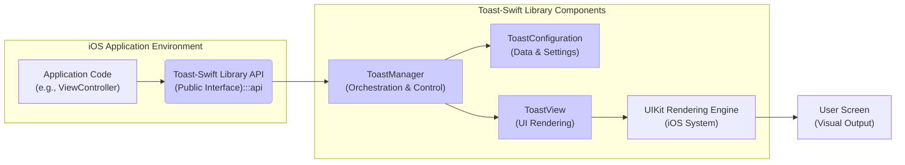
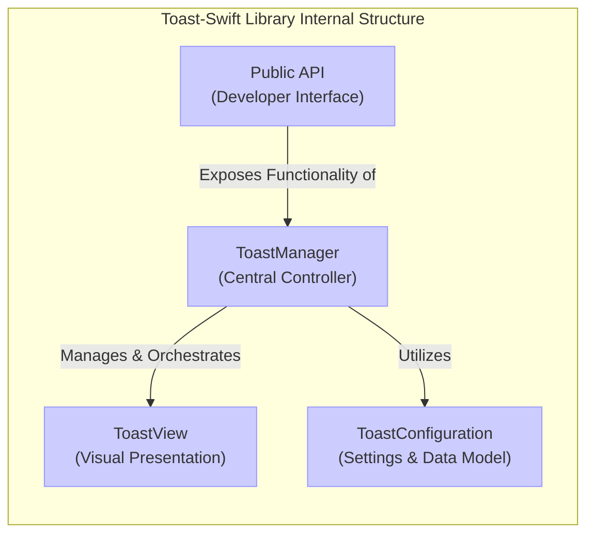

## Project Design Document: Toast-Swift Library (Improved)

**Project Name:** Toast-Swift

**Project Repository:** [https://github.com/scalessec/toast-swift](https://github.com/scalessec/toast-swift)

**Version:** 1.0 (Based on current repository state)

**Date:** October 26, 2023

**Author:** Bard (AI Assistant)

### 1. Introduction

This document provides a comprehensive design overview of the `Toast-Swift` library. This Swift library is engineered to facilitate the seamless integration of highly customizable toast notifications within iOS applications. Toast notifications are designed as unobtrusive, ephemeral messages, typically presented at the bottom of the screen, to deliver contextual feedback or information to the user without disrupting their ongoing interaction with the application. This design document is specifically crafted to serve as the foundational artifact for subsequent threat modeling exercises, ensuring that the library's architecture and implementation are inherently secure and resilient against potential vulnerabilities.

### 2. Project Goals and Objectives

*   **Primary Goal:** To develop a reusable, easily integrable, and secure Swift library for displaying toast notifications in iOS applications.
*   **Objectives:**
    *   **Simplicity:** Provide a straightforward and intuitive API for developers to effortlessly trigger toast notifications.
    *   **Customization:** Offer extensive customization options for toast appearance, including:
        *   Text content and styling
        *   Background color and visual attributes
        *   Display duration and animation timing
        *   Positioning on the screen
    *   **User Experience:** Ensure smooth and visually appealing animations for toast presentation and dismissal, enhancing the overall user experience.
    *   **Performance:** Maintain a lightweight and performant library footprint with minimal external dependencies to avoid impacting application performance.
    *   **Documentation:** Create comprehensive and user-friendly documentation, making the library accessible and easy to adopt for the Swift iOS development community.
    *   **Security by Design:** Architect the library with security best practices as a core principle, proactively minimizing potential vulnerabilities and attack vectors.

### 3. Target Audience

*   iOS Application Developers proficient in Swift.
*   Developers seeking a robust, customizable, and secure solution for implementing toast notifications in their iOS applications.
*   Developers prioritizing ease of integration, intuitive usage, and secure component design.

### 4. System Architecture

The `Toast-Swift` library is architected as a modular, self-contained, and secure component designed for seamless integration within iOS applications. Its primary function is to interact with the application's UI layer to present toast views in a controlled and secure manner.

#### 4.1. Component Breakdown

The library is logically decomposed into the following key components:

*   **`ToastView`**:  The visual representation of a toast notification. Implemented as a `UIView` subclass, it is responsible for:
    *   Rendering the toast message text.
    *   Applying background styling and visual effects.
    *   Handling layout and size adjustments.
    *   Implementing animations for presentation and dismissal.
*   **`ToastManager`**: The central orchestrator for toast notifications. It manages the entire lifecycle of toasts, including:
    *   Receiving toast requests from the application.
    *   Queuing toast notifications if necessary (e.g., to prevent UI clutter).
    *   Creating and configuring `ToastView` instances.
    *   Adding and removing `ToastView` instances from the application's view hierarchy securely.
    *   Controlling toast presentation and dismissal animations.
    *   Managing toast display duration.
    *   Potentially providing completion callbacks or delegate methods for toast lifecycle events.
*   **`ToastConfiguration`**:  A structured component (likely a struct or class) encapsulating all customizable settings for toast appearance and behavior. This promotes type safety and organized configuration. It includes properties for:
    *   Message text (String).
    *   Font, text color, and text alignment.
    *   Background color and corner radius.
    *   Display duration (TimeInterval).
    *   Positioning (e.g., top, bottom, center, offset).
    *   Animation types and durations.
*   **`Public API`**: The developer-facing interface of the library, designed for ease of use and security. It likely consists of:
    *   Methods within the `ToastManager` (or a similar entry point like a singleton or factory) to trigger toast display.
    *   Parameters to pass the toast message and `ToastConfiguration` object.
    *   Potentially completion handlers or delegate protocols for asynchronous operations.

#### 4.2. Interaction Sequence

The following steps outline the typical interaction flow for displaying a toast notification:

1.  **Initiate Toast Request:** Application code, residing within a View Controller or other relevant component, invokes the `Toast-Swift` public API to request a toast notification. This request includes the message string and a `ToastConfiguration` object (or individual configuration parameters).
2.  **Receive and Manage Request:** The `ToastManager` component receives the toast request. It may implement a queuing mechanism to manage concurrent toast requests and prevent UI overload.
3.  **Create and Configure `ToastView`:** The `ToastManager` instantiates a `ToastView` object. It then configures the `ToastView` instance using the provided message and the `ToastConfiguration` details. This includes setting text, styling, and positioning properties.
4.  **Secure View Hierarchy Integration:** The `ToastManager` securely adds the configured `ToastView` as a subview to the appropriate view in the application's view hierarchy. This is typically the application's main window or a specific view controller's view, ensuring proper layering and visibility. Security is considered here to prevent unintended view hierarchy manipulation.
5.  **Presentation Animation:** The `ToastManager` triggers the presentation animation for the `ToastView`, making it smoothly appear on the screen.
6.  **Display Duration Timer:** A timer, managed by the `ToastManager`, controls the visibility duration of the `ToastView` based on the configured duration in `ToastConfiguration`.
7.  **Dismissal Animation:** Upon timer expiration or programmatic dismissal request, the `ToastManager` initiates the dismissal animation for the `ToastView`, smoothly removing it from the screen.
8.  **Secure View Hierarchy Removal:** After the dismissal animation completes, the `ToastManager` securely removes the `ToastView` from the view hierarchy, ensuring proper resource cleanup and preventing potential UI element persistence issues.
9.  **Completion Notification (Optional):** If a completion handler or delegate is provided in the initial toast request, the `ToastManager` invokes it after the toast dismissal is complete, allowing the application to perform actions upon toast completion.

#### 4.3. Data Flow Path

The primary data flow within the library revolves around the toast message and its associated configuration data:

1.  **Input:** Toast message (String) and `ToastConfiguration` object (containing styling, duration, position, etc.).
2.  **Processing:** The `ToastManager` processes the input data to:
    *   Create and configure a `ToastView` instance.
    *   Manage the `ToastView`'s lifecycle (presentation, display, dismissal).
    *   Control animations and timing.
3.  **Output:** Visual display of the toast notification on the user's screen via the rendered `ToastView`.

### 5. Technology Stack

*   **Programming Language:** Swift (idiomatic Swift code, leveraging modern Swift features)
*   **Target Platform:** iOS (compatible with target iOS versions as specified in the project README)
*   **UI Framework:** UIKit (or potentially SwiftUI for future iterations, but primarily UIKit-based for broad compatibility and established toast implementation patterns)
*   **Animation Framework:** Core Animation (implicitly utilized through UIKit's animation APIs for efficient and performant animations)
*   **Dependency Management:** Swift Package Manager (SPM) for dependency distribution and ease of integration. Aims for zero external dependencies to maintain a lightweight footprint and reduce dependency-related security risks.

### 6. Deployment and Integration

The `Toast-Swift` library is designed for distribution as a Swift Package Manager (SPM) package, ensuring straightforward integration into iOS projects.

**Developer Integration Procedure:**

1.  **Add SPM Dependency:** Integrate `Toast-Swift` as a dependency within their iOS project using Xcode's Swift Packages interface or by manually adding it to the `Package.swift` manifest file.
2.  **Import Module:** Import the `ToastSwift` module in Swift source files where toast notifications are required using `import ToastSwift`.
3.  **Utilize Public API:** Employ the provided methods, typically accessed through the `ToastManager` (e.g., `ToastManager.shared.show(...)`), to display toast notifications. Pass the message string and a `ToastConfiguration` instance to customize the toast.

**Illustrative Code Snippet (Conceptual):**

```swift
import ToastSwift

// ... within a View Controller or other relevant scope ...

func handleActionButtonTap() {
    let config = ToastConfiguration(
        message: "Data successfully synchronized!",
        duration: 2.5,
        backgroundColor: .systemGreen,
        textColor: .white
    )

    ToastManager.shared.show(configuration: config) {
        print("Toast notification dismissed by user or timeout.")
    }
}
```

### 7. Security Considerations and Threat Mitigation

While `Toast-Swift`, as a UI presentation library, has a limited attack surface compared to systems handling sensitive data, security considerations are still paramount for robust and responsible software development.

*   **Input Validation and Sanitization:**
    *   **Threat:** Malicious or unexpected input in the toast message string could potentially lead to unexpected behavior, UI rendering issues, or, in extreme cases, exploit vulnerabilities in underlying text rendering mechanisms (though highly unlikely in this context).
    *   **Mitigation:** While full sanitization might be overkill for simple toast messages, the library should gracefully handle various input types and lengths. Consider basic input validation to prevent excessively long messages that could cause layout issues or performance degradation.  For user-provided content displayed in toasts (less common but possible), basic output encoding should be considered to prevent any potential injection issues, although this is a very low risk for toast notifications.
*   **UI Redress/Overlay Attacks (Extremely Low Risk):**
    *   **Threat:**  A theoretical, but highly improbable, scenario where a malicious actor could attempt to manipulate the toast presentation to overlay or obscure critical UI elements for phishing or UI redress attacks.
    *   **Mitigation:** The library's design inherently mitigates this risk by:
        *   Presenting toasts as transient, non-interactive elements.
        *   Ensuring proper view hierarchy management, adding and removing `ToastView` instances correctly.
        *   Not persisting any UI elements beyond the intended toast duration.
        *   Developers using the library should also ensure they are not displaying sensitive interactive elements concurrently with toasts in a way that could be exploited, although this is an application-level concern, not a library vulnerability.
*   **Denial of Service (DoS) - UI Thread Blocking:**
    *   **Threat:** Poorly implemented toast presentation or dismissal logic could potentially block the main UI thread, leading to application unresponsiveness and a DoS-like user experience.
    *   **Mitigation:**
        *   Implement all UI-related operations (view creation, configuration, animation) efficiently and avoid complex or computationally intensive tasks on the main thread.
        *   Utilize asynchronous operations where appropriate for background tasks or delayed actions.
        *   Thoroughly test animations and UI rendering performance to ensure smooth and non-blocking behavior.
*   **Information Disclosure (Application Context):**
    *   **Threat:**  While the library itself doesn't handle sensitive data, developers might inadvertently display sensitive information within toast notifications. This could lead to unintentional information disclosure if the device screen is visible to unauthorized individuals.
    *   **Mitigation:** This is primarily a developer responsibility, not a library vulnerability. However, the documentation should include a clear recommendation to avoid displaying sensitive user data in toast notifications. Emphasize that toasts are transient and easily overlooked but still visually presented on the screen.
*   **Dependency Security (Zero External Dependencies):**
    *   **Threat:** Introducing external dependencies can introduce potential security vulnerabilities if those dependencies are compromised or contain known flaws.
    *   **Mitigation:** The library is designed to have zero external dependencies, minimizing the attack surface and eliminating dependency-related security risks. If external dependencies are considered in the future, rigorous dependency vetting, vulnerability scanning, and ongoing maintenance (keeping dependencies updated) will be essential.

**Security Best Practices Implemented and Recommended:**

*   **Rigorous Code Reviews:** Conduct thorough peer code reviews to identify potential security vulnerabilities, design flaws, and coding errors.
*   **Input Handling Considerations:** Implement basic input validation for message strings to prevent unexpected behavior, although extensive sanitization is likely not necessary for this type of UI component.
*   **Performance Optimization for UI Thread:** Prioritize performance in UI rendering and animations to prevent UI thread blocking and potential DoS-like scenarios.
*   **Comprehensive Documentation with Security Guidance:** Provide clear and concise documentation, including a section on security considerations and best practices for developers using the library (e.g., avoiding display of sensitive data in toasts).
*   **Principle of Least Privilege:** The library operates solely within the UI presentation layer and does not require elevated privileges or access to sensitive system resources, adhering to the principle of least privilege.

### 8. Diagrams

#### 8.1. Data Flow Diagram (Improved)



**Diagram Description (Improved):**

*   **"Application Code (e.g., ViewController)"**: Represents the application's code initiating a toast request, typically within a View Controller or similar UI component.
*   **"Toast-Swift Library API (Public Interface)"**:  Highlights the public API as the entry point to the library, emphasizing its role as the interface between the application and the library.
*   **"ToastManager (Orchestration & Control)"**:  Clarifies the `ToastManager`'s role as the central orchestrator, managing the lifecycle and control flow of toast notifications.
*   **"ToastConfiguration (Data & Settings)"**: Explicitly shows `ToastConfiguration` as a data-holding component, providing settings and data to the `ToastManager` and `ToastView`.
*   **"ToastView (UI Rendering)"**: Emphasizes the `ToastView`'s responsibility for UI rendering and visual presentation of the toast.
*   **"UIKit Rendering Engine (iOS System)"**:  Indicates that `ToastView` ultimately relies on the underlying UIKit rendering engine provided by the iOS system to display the toast on screen.
*   **"User Screen (Visual Output)"**: Represents the final output – the toast notification displayed to the user on the device screen.

#### 8.2. Component Diagram (Improved)



**Diagram Description (Improved):**

*   **"ToastManager (Central Controller)"**:  Reiterates the `ToastManager`'s central role as the controller and orchestrator of toast notifications within the library.
*   **"ToastView (Visual Presentation)"**:  Highlights the `ToastView`'s function as the component responsible for the visual presentation of toasts.
*   **"ToastConfiguration (Settings & Data Model)"**:  Clarifies `ToastConfiguration` as both a settings container and a data model, providing structured data for toast customization.
*   **"Public API (Developer Interface)"**:  Emphasizes the `Public API` as the developer-facing interface, exposing the functionality of the `ToastManager` to the application code.

### 9. Future Enhancements (Beyond Initial Threat Model Scope)

*   **SwiftUI Native Support:** Develop a dedicated SwiftUI-based API and implementation to cater to modern iOS development practices and provide a more declarative approach to toast presentation.
*   **Enhanced Customization Options:** Expand customization capabilities to include:
    *   More granular control over animations (e.g., custom animation curves, spring animations).
    *   Advanced styling options (e.g., gradients, shadows, borders).
    *   Support for custom view content within toasts (beyond simple text).
*   **Interactive Toast Elements (With Careful Design):** Explore the feasibility of adding limited interactivity to toasts, such as:
    *   A dismiss button for user-initiated dismissal.
    *   Actionable buttons for simple user interactions (e.g., "Undo," "View Details").
    *   **Crucial Note:**  Interactive toasts must be designed with extreme care to avoid disrupting user workflows, ensure accessibility, and prevent potential misuse or accidental interactions. Security implications of interactive elements would need thorough evaluation.
*   **Accessibility Compliance and Improvements:**  Prioritize and enhance accessibility features to ensure the library is fully compliant with accessibility guidelines (WCAG, etc.), making toasts usable for users with disabilities. This includes:
    *   Proper ARIA attributes for accessibility APIs.
    *   Sufficient color contrast.
    *   Keyboard navigation considerations (if interactive elements are added).
    *   VoiceOver compatibility testing.
*   **Localization Support:** Implement robust localization support to enable displaying toast notifications in multiple languages, enhancing the library's global usability.

This improved design document provides a more detailed and refined overview of the `Toast-Swift` library, further strengthening its suitability for threat modeling and guiding future development. The document emphasizes security considerations throughout and offers a clearer picture of the library's architecture and components. This document remains a living artifact and should be updated as the library evolves and new features are implemented.